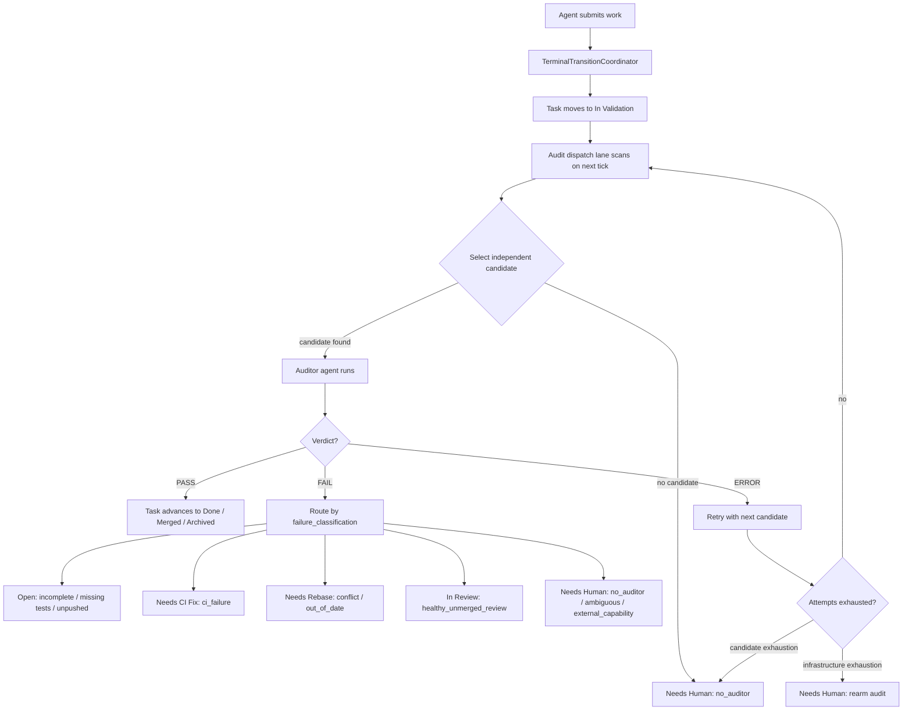

# Independent Auditor Dispatch — Operator Guide

This guide is for operators running Oompah with independent auditor dispatch
enabled. It covers configuration, monitoring, troubleshooting, and recovery
for the audit queue system.

The audit lane is enabled by default. It scans `In Validation` tasks on each
dispatch tick and shares the global worker pool with ordinary implementation
agents.

## What Is the Auditor?

When an agent submits completed work, Oompah moves the task to **In
Validation** and queues a terminal-audit request. An *independent auditor* —
a separate AI agent session using a different provider/model combination than
the original implementer — reads the work, runs the project's configured
checks, and submits one structured verdict via the `submit_audit_result` tool.

The auditor is a *read-only* agent. It receives a restricted tool set:

| Tool | Purpose |
|---|---|
| `read_file` | Read source files |
| `list_files` | Browse directory contents |
| `search_files` | Search across the worktree |
| `run_command` | Run project test/lint commands |
| `submit_audit_result` | Submit the structured audit verdict (write-only result) |

Mutating tools (`write_file`, `edit_file`, project management tools) are
unconditionally blocked regardless of the audit prompt text.

## Lifecycle Overview



## Target-Specific Audit Chains

Each terminal-state request creates one or more audit records in the task's
`oompah.terminal_audit` metadata:

| Request | Audit records created |
|---|---|
| **Done** | One `Done` audit |
| **Merged** | Reuses an existing completed `Done` audit; if none exists, creates `Done` then `Merged` in sequence |
| **Archived** | One `Archived` audit appended after any pending non-archived targets |

The audit chain is committed to tracker metadata *before* the task moves to
`In Validation`. This ensures the queue is durable and fully recoverable after
a process restart.

## Independence Rules

Before dispatching, Oompah enforces that the selected auditor is independent
from every agent that contributed to this task's branch:

- If contributors used `prov-a / model-x`, then `prov-a / model-x` is
  **excluded** from the auditor candidate list.
- If contributors used provider `prov-a` but the model is unknown (ACP
  SDK-managed), then **all** candidates on `prov-a` are excluded (fail-closed).
- Candidates are tried in saved role order. Once all independent candidates
  have been tried or are unavailable, the audit is exhausted and routed to
  `Needs Human` with the `no_auditor` failure classification. Workspace and
  transport failures remain `infrastructure_error`; exhausting those retries
  does not claim that no independent auditor exists.

Auditors run in detached, attempt-scoped worktrees. Oompah prefers a persisted
immutable source or integration SHA. Legacy Merged-to-Archived audits that did
not persist a SHA may use the fetched default-branch tip when their historical
work branch has already been deleted. A named immutable SHA that cannot be
resolved always fails closed; Oompah never substitutes another branch for it.

## Failure Routing

The auditor's `failure_classification` field controls where the task lands
after a FAIL verdict:

| Classification | Resulting status |
|---|---|
| `incomplete` | `Open` |
| `missing_tests` | `Open` |
| `unpushed` | `Open` |
| `missing_evidence` | `Open` |
| `ci_failure` | `Needs CI Fix` |
| `conflict` | `Needs Rebase` |
| `out_of_date` | `Needs Rebase` |
| `healthy_unmerged_review` | `In Review` |
| `ambiguous_requirements` | `Needs Human` |
| `external_capability` | `Needs Human` |
| `no_auditor` | `Needs Human` |
| `malformed_result` | Stays in `In Validation` (retry) |
| `infrastructure_error` | Stays in `In Validation` (retry) |

`Needs Human` comments must end with actionable instructions or a question;
the coordinator rejects vague messages that would leave an operator with no
clear path forward.

## Configuration

### Environment Variables

These `.env` settings control the dispatch lane.

#### Core Auditor Settings

```bash
# Maximum independent auditor candidates to attempt per audit before
# routing to Needs Human. Recommended: 3–5 (allows rotation across several
# independent providers). Must be a positive integer.
OOMPAH_AUDIT_MAX_ATTEMPTS=3

# Time-to-live (seconds) for a running auditor attempt.
# A live auditor session older than this is considered abandoned and eligible
# for retry. An attempt with no live worker is reclaimed immediately.
# Recommended: 3600 (1 hour). Increase for slow CI environments.
OOMPAH_AUDIT_ATTEMPT_TTL=3600

# Relative ordering among In Validation audits without an explicit task
# priority. The audit lane still runs before ordinary Open work when a slot
# is available. Recommended: 100–200.
OOMPAH_AUDIT_PRIORITY=100

# Maximum number of In Validation tasks scanned per scheduler tick.
# Limits the audit lane's CPU time per tick. Set to 0 for no cap.
# Recommended: 32–64.
OOMPAH_AUDIT_LANE_SCAN_LIMIT=32
```

#### Global Settings That Affect Auditors

```bash
# Global agent concurrency limit (affects both workers and auditors).
# Auditors consume from this same pool.
OOMPAH_MAX_CONCURRENT_AGENTS=5

# Budget limit (auditors count against this).
OOMPAH_BUDGET_LIMIT=50.00

# Maximum retry backoff in milliseconds.
OOMPAH_MAX_RETRY_BACKOFF_MS=300000
```

### Auditor Role Configuration

The auditor role defines which providers/models are eligible. Configure it in
`.oompah/roles.json`:

```json
{
  "name": "auditor",
  "strategy": "round_robin",
  "candidates": [
    { "provider_id": "prov-deep", "model": "claude-opus-4" },
    { "provider_id": "prov-standard", "model": "claude-sonnet-4" }
  ],
  "updated_at": "2026-01-01T12:00:00Z"
}
```

**At least two independent candidates are recommended.** With a single
candidate, any task whose sole contributor used that same provider/model
will route immediately to `Needs Human` because no independent auditor is
available. Two or more candidates from different providers provides rotation
and avoids `no_auditor` failures when one provider is temporarily unavailable.

**Adding candidates:**

1. Via dashboard: navigate to the Roles section and edit the auditor role.
2. Via API: `GET /api/v1/roles` to inspect, `PUT /api/v1/roles` to save.
   See `docs/multi-provider-roles.md` for the request shape.

**Project whitelist:** If the project configuration includes a provider
whitelist (`allowed_provider_ids`), only providers on that whitelist may be
used as auditor candidates. Providers not on the whitelist are excluded from
candidate selection even if they appear in `.oompah/roles.json`. Ensure at
least two independently-listed providers are on the whitelist to guarantee
rotation.

## Monitoring

### Dashboard

The Oompah dashboard displays:

- **In Validation tasks**: count and list in the board column.
- **Running audits**: active auditor agents in the "Active Agents" section.

### Logs

```bash
# Tail the service log
make logs

# Example output:
# [INFO] audit dispatch: starting attempt-abc (task OOMPAH-123) on prov-fast/gpt-4, rotation 0
# [INFO] audit dispatch: auditor exit (attempt-abc) — transient failure, rotating to next candidate
# [INFO] audit dispatch: rotation failed — no independent candidates; routing to Needs Human
```

### State Endpoint

```bash
curl -s http://localhost:8080/api/v1/state | jq '.orchestrator_metrics.last_dispatch'
```

## Troubleshooting

### Task Stuck in "Needs Human" — Reason: no_auditor

**Cause:** All auditor candidates share a provider with the task's contributors,
so no independent auditor was available.

**Solutions:**

1. **Add providers to the auditor role.** Edit `.oompah/roles.json` to add
   candidates from different providers than the ones used to implement the task.

   ```json
   {
     "candidates": [
       { "provider_id": "prov-external", "model": "gpt-4o" },
       { "provider_id": "prov-internal", "model": "claude-opus-4" }
     ]
   }
   ```

2. **Owner override.** If a human has reviewed the work and is confident it
   is correct, use the explicit owner override (see below) to bypass the
   audit and advance the task.

### Auditor Rate-Limited (HTTP 429)

Oompah persists the failed attempt, waits for the normal exponential backoff,
then rotates to the next independent candidate.

**If rotations keep failing:**

1. Check provider health in the dashboard (Providers page).
2. Add more independent providers to the auditor role.
3. Increase the provider quota or throttle limit.

### Auditor Timeout or Crash

1. After restart, an in-progress attempt with no live worker is reclaimed
   immediately and the lane retries on the next tick.
2. Check the orchestrator and agent logs for the crash reason.

### Uncommitted Finalization Failures

**Context (OOMPAH-734):** An auditor can reach its turn ceiling after deciding a verdict, or crash/timeout before submitting it. Oompah reserves a finalization turn for the structured result and never treats prose or a task comment as a verdict.

**Symptoms:**

- Dashboard terminal-audit health banner shows "uncommitted audit finalization failures"
- The task remains in `In Validation` and no PASS/FAIL result comment appears

**Root cause:** Either the auditor exited without submitting a structured result, or the coordinator persisted the result but the tracker rejected its status update. In the first case the attempt is retried as a finalization failure. In the second case the completed verdict and an unapplied status intent remain durable. Both cases fail closed, and neither can publish a misleading result comment.

**Recovery:**

1. Restore the provider or tracker operation identified by the alert.
2. For an exit without a submitted result, the scheduler rotates to the next independent candidate after retry backoff.
3. For an unapplied durable result intent, restart oompah with `make restart`. Startup recovery revalidates the task identity, target, and evidence fingerprint before retrying the exact status write.
4. Recovery marks the intent applied after the tracker accepts the status. It does not infer a verdict from existing comments or manufacture a result comment.

If a tracker write remains unavailable after restart, keep the task in `In Validation` and repair the tracker. Do not use comment text to choose a terminal state. A project owner may use the authenticated override flow only after independently verifying the intended target and current evidence fingerprint.

### Audit Exhausted After Workspace or Transport Failures

Fix the reported infrastructure problem, then rearm the audit without moving
the task to `Open`:

```bash
oompah task set-status TASK-123 Archived \
  --project PROJECT_ID \
  --audit-retry \
  --audit-retry-reason "Deleted-branch checkout recovery is deployed"
```

Use the target recorded on the failed audit (`Done`, `Merged`, or `Archived`).
The authenticated actor must be a project owner. The command supersedes the
failed audit record, preserves its history and evidence fingerprint, appends
one fresh pending audit, and restores `In Validation`. Repeating the command
is idempotent. It never reopens or dispatches implementation work.

### Missing Evidence Supplied After Integration

When the audit failed only because required quality-gate evidence was missing,
an owner can rearm that exact integrated head after supplying the evidence. The
rearm is accepted only when the failed attempts are classified
`missing_evidence`, the current canonical evidence fingerprint still matches
the integrated task, and every named check is successful. It creates a fresh
pending audit; it does not apply a terminal status or accept the addendum as
audit evidence.

Use the same authenticated owner command with an explicit JSON addendum:

```bash
oompah task set-status EXOCOMP-145 Done \
  --project PROJECT_ID \
  --audit-retry \
  --audit-retry-reason "Pinned gate tails supplied for the integrated head" \
  --audit-retry-evidence-addendum '{
    "evidence_fingerprint": "<current-canonical-fingerprint>",
    "checks": [
      {"name": "make test", "result": "passed"},
      {"name": "make fmt-check", "result": "passed"},
      {"name": "make lint", "result": "passed"}
    ]
  }'
```

The equivalent PATCH body uses `audit_retry_evidence_addendum` with the same
object. The owner actor is authenticated by the server; arbitrary comments,
non-owner actors, changed heads, failed checks, and previously passed audits
are rejected. Repeating the identical request coalesces with the one pending
audit and does not create another auditor.

Integrated-audit recovery alerts expose a `recovery_action` matching the
coordinator contract. `audit_retry` is used for infrastructure, policy, or
`no_auditor` exhaustion; `audit_retry_evidence_addendum` is reserved for
matching `missing_evidence` records; all other completed records prescribe
`audit_override`. A successful retry or override clears the task-level alert
immediately, and the durable terminal status prevents it from returning after
restart.

## Explicit Owner Override

When an audit is infeasible (e.g., no independent candidates available) or a
human has independently reviewed the work, a project owner can bypass the
audit queue and advance the task directly.

**Eligibility:** The actor must be listed as an authorized status label actor
for the project (`status_label_authorized_logins` in the project configuration
or the forge-level label authorization).

**How to trigger:**

Via API:

```http
POST /api/v1/projects/{project_id}/issues/{task_id}/terminal-override
Content-Type: application/json

{
  "target_state": "Done",
  "reason": "Independently reviewed by @alice — auditor candidates exhausted."
}
```

The coordinator validates the fingerprint, records an immutable
`OverrideRecord` in the task metadata, posts an override comment to the
tracker, and advances the task to the requested terminal state.

**Override rejection codes:**

| Code | Meaning |
|---|---|
| `unauthorized_actor` | The caller is not an authorized status actor |
| `metadata_quarantined` | Audit metadata is corrupted; contact support |
| `fingerprint_mismatch` | Evidence changed while the override was in flight; retry |

An override cannot be undone. If the reason for the override is later found
to be incorrect, reopen the task through normal tracker commands.

## Upgrade Grandfathering and Restart Behavior

### Grandfathering (Upgrade Path)

When the independent auditor dispatch feature is first enabled (or when Oompah
restarts after a feature upgrade), existing terminal tasks are handled as
follows:

1. **First startup:** Oompah scans all terminal tasks (`Done`, `Merged`,
   `Archived`) and records them in a persisted baseline snapshot. Tasks in
   this baseline are *grandfathered* — they are not re-audited unless their
   evidence fingerprint changes.

2. **Subsequent startups:** Oompah compares the current terminal state
   snapshot against the baseline. Tasks whose state or evidence has changed
   since the baseline was recorded are queued for a fresh audit.

3. **Incomplete scan:** If the first startup scan fails (tracker unavailable,
   incomplete enumeration), the baseline is marked quarantined. All observed
   terminal tasks are queued for audit as a conservative fallback. The
   baseline heals on the next successful scan.

**Implication for upgrades:** Upgrading from a version without independent
auditing to one with it will queue every existing terminal task for a one-time
audit. This is intentional: it ensures historical work meets the same bar as
new work. To avoid noise from a large backlog, upgrade during a low-activity
window or use the owner override procedure above for known-good tasks.

### Restart Recovery

When Oompah restarts with pending audits in flight:

1. The service reads `In Validation` tasks from the tracker and rebuilds the
   in-memory audit queue from their persisted `oompah.terminal_audit` metadata.
2. A running attempt with no live worker is reclaimed immediately (no TTL wait).
3. A running attempt whose worker is still live is honored until
   `OOMPAH_AUDIT_ATTEMPT_TTL` expires, at which point it is reclaimed.
4. No duplicate audits are created. Recovery is idempotent.

Do **not** edit `oompah.terminal_audit` metadata or manually move a task out
of `In Validation`. The metadata is the recovery source of truth. A manual
status change leaves the audit chain and tracker state inconsistent. Use the
graceful restart (`make restart`) or force restart (`make force-restart`)
procedure instead.

## Migration from Completion Verifier

The legacy `OOMPAH_VERIFY_COMPLETION` and `OOMPAH_VERIFY_COMPLETION_LLM`
variables are **deprecated**. Oompah emits a startup warning when either is
set. They do not disable the mandatory terminal-audit gate.

**Migration steps:**

1. Remove `OOMPAH_VERIFY_COMPLETION` and `OOMPAH_VERIFY_COMPLETION_LLM` from
   your `.env` file.
2. Configure the auditor role in `.oompah/roles.json` with at least two
   independent candidates (see §Auditor Role Configuration above).
3. Set `OOMPAH_AUDIT_MAX_ATTEMPTS` to match the number of candidates.
4. Restart: `make restart`.

The old completion verifier ran as a post-exit in-process check without
independence guarantees. The independent auditor dispatch runs as a
full agent session using a demonstrably different provider/model pair,
providing stronger assurance with the same fail-open safety net for
infrastructure errors.

## Configuration Examples

### Minimal (Single Provider)

```json
{
  "name": "auditor",
  "strategy": "priority",
  "candidates": [
    { "provider_id": "prov-main", "model": "gpt-4" }
  ]
}
```

```bash
OOMPAH_AUDIT_MAX_ATTEMPTS=1   # Only one candidate; rotate will exhaust immediately
OOMPAH_AUDIT_ATTEMPT_TTL=1800
OOMPAH_AUDIT_PRIORITY=150
```

### Two Independent Providers (Recommended Minimum)

```json
{
  "name": "auditor",
  "strategy": "round_robin",
  "candidates": [
    { "provider_id": "prov-claude", "model": "claude-opus-4" },
    { "provider_id": "prov-openai", "model": "gpt-4o" }
  ]
}
```

```bash
OOMPAH_AUDIT_MAX_ATTEMPTS=2
OOMPAH_AUDIT_ATTEMPT_TTL=3600
OOMPAH_AUDIT_PRIORITY=100
OOMPAH_AUDIT_LANE_SCAN_LIMIT=32
```

### Large Setup (Four Providers)

```json
{
  "name": "auditor",
  "strategy": "round_robin",
  "candidates": [
    { "provider_id": "prov-claude", "model": "claude-opus-4" },
    { "provider_id": "prov-openai", "model": "gpt-4o" },
    { "provider_id": "prov-azure", "model": "gpt-4" },
    { "provider_id": "prov-self-hosted", "model": "llama-3-70b" }
  ]
}
```

```bash
OOMPAH_AUDIT_MAX_ATTEMPTS=4
OOMPAH_AUDIT_ATTEMPT_TTL=3600
OOMPAH_AUDIT_PRIORITY=150
OOMPAH_AUDIT_LANE_SCAN_LIMIT=64
OOMPAH_MAX_CONCURRENT_AGENTS=20
```

## See Also

- `plans/independent-auditor-dispatch.md` — Design and architecture
- `docs/agent-profiles.md` — Configuring agent profiles and roles
- `docs/operator-runbook.md` — General Oompah operations guide
- `docs/task-epic-workflow.md` — Task status lifecycle including In Validation
- `plans/terminal-transition-coordinator.md` — Audit request staging and result coordination
