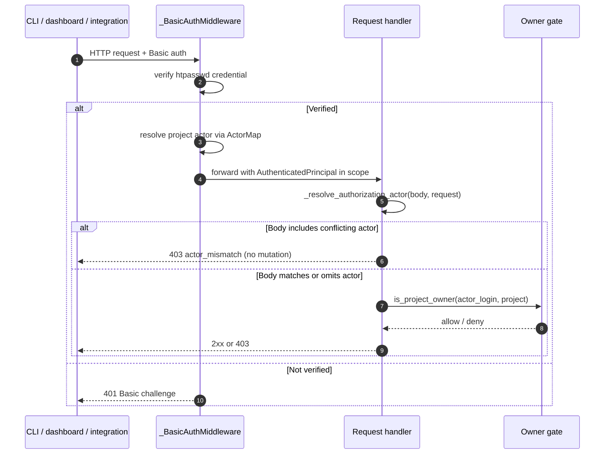

# Authentication identity mapping (OOMPAH-624)

Oompah binds authorization decisions for owner-gated task and administrative
mutations to the **server-trusted authenticated principal**, not to a
client-supplied ``actor`` field.  This page explains the mapping model,
configuration knobs, and the narrow impersonation flow.

See also: [authentication.md](authentication.md) for the underlying HTTP
Basic authentication setup.

## Why?

Before this change, the server accepted an ``actor_login`` value from the
API request body (or the ``x-oompah-actor`` header) and used that string
to decide whether the request could pass owner gates like
``Proposed → Backlog`` or terminal audit overrides.  An authenticated
non-owner could still claim ``actor_login: owner-alice`` and be granted
owner privileges.  The fix binds the authorization actor to the identity
established by HTTP Basic authentication, and rejects any client-supplied
value that disagrees with the authenticated principal.

## Terminology

* **Server principal** — the exact username that presented valid HTTP
  Basic credentials.  Comes from the htpasswd file.
* **Project actor login** — the identity that appears in project
  configuration (``status_actor_login``, ``tracker_owner``,
  ``status_label_authorized_logins``) and in audit comments.

For single-tenant deployments the two are identical.  When they differ,
configure an explicit mapping.

## Configuration

Two mutually-exclusive sources are consulted at startup, in priority
order:

### ``OOMPAH_ACTOR_MAP`` (inline JSON)

```bash
OOMPAH_ACTOR_MAP='{"ci-bot": "alice", "release-bot": "carol"}'
```

Each key is an htpasswd username; each value is the corresponding
project actor login.  Both are non-empty strings.  Comparison is
case-insensitive.

### ``OOMPAH_ACTOR_MAP_FILE`` (JSON file)

```bash
OOMPAH_ACTOR_MAP_FILE=/etc/oompah/actor-map.json
```

Relative paths are resolved against the selected ``.env`` file's
directory.  The file contains the same JSON object.

### ``OOMPAH_ACTOR_MAP_STRICT``

When ``true`` / ``1`` / ``yes``:

* an authenticated htpasswd user without a mapping entry cannot perform
  any actor-bound mutation (the server returns 403 ``actor_unmapped``);
* startup fails if no mapping is configured at all — strict mode without
  a map would deny every mutating request, so the operator is asked to
  either supply a map or turn strict mode off.

When unset or falsy (default), unmapped users use **identity mapping**:
their htpasswd username is used verbatim as the project actor login.

### Validation

At startup the map is validated:

* Keys and values must be non-empty strings.
* Case-folded keys must be unique.
* Case-folded **values** must be unique — two htpasswd users may not
  map to the same project actor.  An ambiguous configuration would
  poison the audit trail, so we fail closed.
* Malformed JSON, missing files, and unreadable files abort startup.

## Authentication → authorization flow



## What clients should do

### CLIs

* Preferred: authenticate with ``OOMPAH_SERVER_USERNAME`` +
  ``OOMPAH_SERVER_PASSWORD_FILE`` and **omit** ``--actor``.  The server
  binds the actor to the authenticated principal.
* ``--actor`` matching the authenticated identity: allowed with a
  deprecation warning printed to stderr; the CLI strips the redundant
  field from the request body.
* ``--actor`` differing from the authenticated identity: the CLI exits
  with code 2 before the network call.  The server would reject it as
  ``actor_mismatch`` anyway.

Set ``OOMPAH_ACTOR_DEPRECATION_SILENCE=1`` to suppress the warning if
you have legacy scripts that pass ``--actor``.

### Programmatic API clients

Send HTTP Basic credentials.  Omit ``actor_login`` / ``actor`` /
``owner_actor`` / ``author`` / ``x-oompah-actor`` from the request
body / headers.  When the authenticated principal is present, any
client-supplied value that disagrees produces a 403 ``actor_mismatch``
response with no state mutation.

## Unauthenticated (backward-compatible) deployments

Deployments that have not enabled HTTP Basic authentication continue to
work as before — the client-supplied actor is used.  This preserves the
read-only compatibility surface listed in
[authentication.md](authentication.md).  Protected mutating writes
without a trusted identity should be avoided in production: enable
htpasswd authentication to remove the client-actor trust dependency.

## Narrowly authorized impersonation

Optional impersonation for privileged operators is opt-in and audited.
Not implemented in the default configuration; see the followup task
for the full impersonation UX.  The interface will require:

* The authenticated principal to be listed in
  ``OOMPAH_ADMIN_IMPERSONATORS`` (comma-separated htpasswd usernames).
* A durable audit comment on the affected task recording who
  impersonated whom and for what action.

Without both, any ``impersonate_actor`` field on a request is ignored.

## Migration guide

1. Enable HTTP Basic auth per [authentication.md](authentication.md).
2. Verify that each operator's htpasswd username matches the project
   actor login they should act as.
3. If not, define ``OOMPAH_ACTOR_MAP`` or ``OOMPAH_ACTOR_MAP_FILE``.
4. Remove ``--actor`` from CI scripts and Makefile recipes; the server
   now binds it from the authenticated principal.
5. Set ``OOMPAH_ACTOR_MAP_STRICT=true`` for multi-tenant deployments to
   guarantee that only explicitly mapped users can mutate state.

## Troubleshooting

| Symptom | Likely cause | Fix |
|---------|--------------|-----|
| 403 ``actor_mismatch`` | ``--actor`` or ``actor_login`` differs from authenticated principal | Omit the flag / body field, or authenticate as the intended actor. |
| 403 ``actor_unmapped`` | Strict mode is on and the user has no map entry | Add a mapping entry or turn strict mode off. |
| Startup failure ``Actor mapping config error: ambiguous mapping`` | Two htpasswd users target the same project actor | Ensure each mapping value (project actor) is unique. |
| CLI prints ``warning: --actor is redundant`` | Old script still passes ``--actor`` that matches authenticated identity | Remove the flag or set ``OOMPAH_ACTOR_DEPRECATION_SILENCE=1``. |
