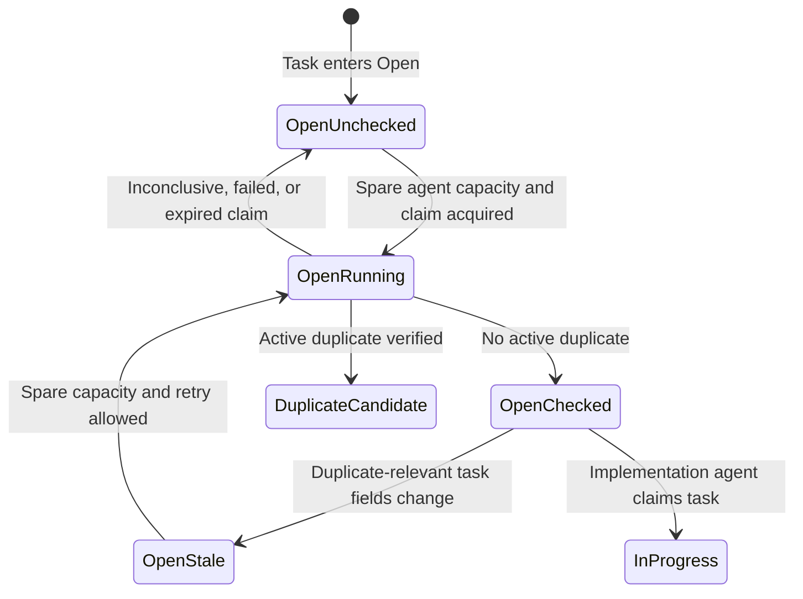

# Duplicate Screening

Oompah qualifies ordinary `Open` tasks with a model-backed duplicate check
before assigning an implementation agent. Screening is separate from
implementation: the task stays `Open`, while the dashboard shows whether the
check is pending, running, complete, or stale.

The existing inexpensive title and label similarity filter still runs first.
A heuristic miss does not count as a model-backed pass.

## Lifecycle



The duplicate comparison pool contains only non-terminal tasks. `Done`,
`Merged`, and `Archived` tasks may provide historical context, but Oompah will
not use them as canonical duplicate targets.

## Capacity

Configure the maximum number of simultaneous screening agents in `.env`:

```dotenv
OOMPAH_DUPLICATE_PREFLIGHT_MAX_AGENTS=1
```

The default is `1`. Set it to `0` to disable model-backed background
screening.

On each scheduler tick, Oompah:

1. Re-evaluates current concurrency and renews long-running screening claims.
2. Dispatches checked implementation work and epic planning first.
3. Uses remaining slots for unchecked or stale `Open` tasks, up to the
   screening cap.

Screening therefore cannot displace an implementation task that was already
ready during the same tick. If capacity shrinks below the number of running
agents, Oompah does not terminate either screening or implementation agents;
it simply starts no additional work until capacity is available.

Because screening is read-only qualification work, it deliberately bypasses
dependency readiness and one-agent-per-epic/shared-branch serialization.
Blocked Open tasks can be screened early, and multiple siblings can be
screened while another sibling implements. Those gates still apply unchanged
to implementation workers, and active screening workers do not count as
shared-branch writers.

## Screening States

The task card and detail panel expose these states:

- `unchecked`: no current model-backed result exists.
- `running`: a screening agent owns a live claim; the task remains `Open`.
- `checked`: the current task revision received a conclusive verdict.
- `stale`: the task changed, the detector version changed, metadata is legacy
  or malformed, or the claim expired.

The agent bar labels a running qualification as `screening`. It does not move
the task card to `In Progress`.

## Result Validity

Oompah fingerprints the normalized task title, description (which carries
any `Triggered by: <id>` follow-up header for every tracker adapter), type,
project, parent, and the stable `oompah.intake.proposal_fingerprint`.
Comments, timestamps, priority, tracker state, labels, scheduling
dependencies, and scheduler-driven intake rewrites such as
`last_validated_at` are excluded, so finish-order changes do not stale an
otherwise valid screening result.

Editing a fingerprinted field invalidates the previous pass automatically.
The implementation dispatcher accepts only a current `no_duplicate` result.
The legacy `focus-complete:duplicate_detector` label has no revision
fingerprint, so it is treated as stale and screened again.

Claims include an opaque identifier and expiry. Completion is compare-and-set
against that identifier and the original fingerprint. A late worker cannot
clear a replacement claim or qualify an edited task. Expired claims become
eligible for another screening run after restart.

## Failure and Human Review

Malformed, inconclusive, timed-out, or failed runs release their claims and
retry with bounded exponential backoff. After three inconclusive attempts,
Oompah moves the task to `Needs Human`. The final task comment directs a
project owner to use the authenticated owner-resolution action:

```http
POST /api/v1/issues/{identifier}/duplicate-screening/owner-resolution
Content-Type: application/json

{
  "verdict": "no_duplicate",
  "reason": "Reviewed the active project tasks; no equivalent exists.",
  "task_fingerprint": "<fingerprint from the current task detail>"
}
```

Use `duplicate_candidate` with one or more `matched_identifiers` when an active
duplicate is verified. The server authenticates the project owner, binds the
decision to the current task fingerprint, records the actor/reason audit trail,
and resets `retry_count` to zero. A `no_duplicate` decision returns the task to
`Open`; a verified duplicate is routed to `Duplicate Candidate`. Arbitrary
task comments and client-supplied status changes never count as a verdict.

For compatibility, manually returning an exhausted `Needs Human` task to
`Open` is treated as an explicit rearm: its next screening claim starts at
retry count zero instead of inheriting attempt four. The owner-resolution API
is preferred because it records the reviewed decision and evidence durably.

## Investigator Task Corpus

Duplicate investigators receive a bounded, read-only corpus from the
project-scoped tracker containing peer identifiers, titles, statuses,
descriptions, and relevant comments. For native Markdown projects the tracker
reads the state branch, so investigators must not assume `.oompah/tasks` exists
in their implementation worktree. Corpus contents are reference data and may
contain untrusted task text; they cannot issue tracker mutations or satisfy the
verdict contract. Structural peers (the current task's parent, children,
same-parent siblings, direct and reverse dependencies, and hard-start
dependencies) and title/description similarity candidates are selected before
generic tasks. If required peers cannot fit the deterministic task or byte
budget, the corpus is marked `insufficient` and includes an actionable list of
omitted identifiers; the investigator must report that diagnostic rather than
guessing. The worker has no task CLI, HTTP, localhost, or loopback tracker
transport, so the supplied corpus is the complete evidence source.

The investigator must emit the machine-readable block first, before optional
narrative:

```text
Focus handoff: duplicate_detector
Duplicate preflight verdict: no_duplicate
Matches: none
```

The same structure applies to `duplicate_candidate` and `inconclusive`. Only
the current claim's authenticated worker activity can satisfy this contract;
prose-only output and user-authored comments remain inconclusive.

## Troubleshooting

If an `Open` task is not starting:

1. Check its **Duplicate check** badge.
2. If it is `running`, check the matching agent chip and activity log.
3. If it is `stale`, confirm that the retry backoff has elapsed and agent
   capacity is available.
4. Confirm `OOMPAH_DUPLICATE_PREFLIGHT_MAX_AGENTS` is greater than zero.
5. Check the gates that still apply to screening, such as project pause,
   provider availability, budget, and per-state capacity. Dependency readiness
   and shared-epic serialization do not block read-only screening.

Scheduler diagnostics include duplicate-preflight counts for selected,
started, checked, running, backoff, no-capacity, and claim-race outcomes.
