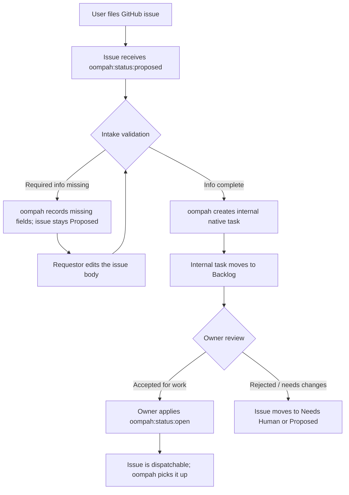

# GitHub Issue Intake Workflow

This document describes how new GitHub issues enter an oompah-managed project
and advance from `Proposed` through intake validation to a dispatchable `Open`
state.

## Overview

oompah uses **GitHub Issues** as customer-facing intake for managed projects.
The canonical internal task record lives in oompah's native Markdown tracker.
Anyone with access to the managed repository can file a GitHub issue. However,
a freshly filed issue does not immediately become eligible for agent dispatch:
it must pass through intake validation before oompah creates or updates the
corresponding internal task.



---

## Filing a GitHub Issue

### Where to file

File issues directly in the managed repository's GitHub Issues tab **or** in
the central oompah task hub repository (e.g. `lesserevil/oompah-tasks`),
depending on how the operator has configured the project.

### Required information

Every issue should include:

| Field | Required | Notes |
|-------|----------|-------|
| **Title** | Yes | Short, specific description of the work |
| **Description** | Recommended | Context, acceptance criteria, reproduction steps (bugs), or design rationale |
| **Issue type** | Recommended | `task`, `bug`, `feature`, `chore`, or `epic` — applied as a `type:*` label |
| **Priority** | Optional | `p0`–`p3` label, or set by oompah according to project defaults |
| **Target branch** | Optional | Ordinary work lands on the default branch. Operators select supported release lines later, after the task is merged. |

Issues filed without enough detail stay in `Proposed` until the requestor
edits the issue body with the missing information. Once the issue validates,
oompah advances it to `Backlog`.

### Issue templates

If the repository includes GitHub issue templates (`.github/ISSUE_TEMPLATE/`),
use the appropriate template to pre-fill the required fields.  oompah looks for
the `<!-- oompah:metadata ... -->` block in the issue body for structured
metadata — do not remove it if present.

---

## The Intake Workflow

### Step 1 — Proposed

When a new issue is opened, oompah's webhook handler receives the
`issues.opened` event and applies the `oompah:status:proposed` label.  The
issue is **not** yet visible to the dispatch queue.

`Proposed` signals that this issue has been seen but has not yet passed intake
validation.

### Step 2 — Intake validation

oompah validates the new issue and records the result in the hidden
`<!-- oompah:metadata ... -->` block.

If required information is missing, the issue remains in `Proposed` with a
dashboard-visible intake summary explaining what is needed.  The requestor
should update the original issue body.  oompah re-validates on the next
webhook or polling refresh.

### Step 3 — Internal task creation and Backlog promotion

Once intake validation passes, oompah creates or updates the corresponding
internal native Markdown task and moves that task into the `Backlog` queue.
Validation metadata updates do not rewrite the requestor-authored issue
content, so no separate requestor approval is required for ordinary
well-formed issues.

If oompah creates a decomposition proposal for an oversized issue, explicit
approval can still be required before that generated proposal is applied.

**Who can apply status labels?**

Status label changes are restricted to authorized actors:

1. The **oompah bot** (configured via `OOMPAH_BOT_LOGIN`, defaults to `oompah`)
2. The **project's `tracker_owner`** (the GitHub login configured in the project)
3. Any login in **`project.status_label_authorized_logins`** (per-project
   allowlist configured by the operator)

Unauthorized status-label changes are automatically reverted by oompah, and
the issue receives an explanatory comment.

To add yourself to the authorized list, ask the project operator to add your
GitHub login to the project's `status_label_authorized_logins` setting.

### Step 4 — Backlog

Once oompah moves the internal task to `Backlog`, the task appears in the
oompah dashboard but is still **not dispatched** to an agent. `Backlog` is the
holding state for validated work that has not yet been prioritized for active
development.

Project owners can use the oompah dashboard or `oompah task set-status` to
manage the backlog:

```bash
# Move an internal task from Proposed to Backlog (requires validator pass, unless owner override)
oompah task set-status owner/repo#123 Backlog

# View the current state of an issue
oompah task view owner/repo#123
```

### Step 5 — Open (dispatchable)

When the project owner is ready for oompah to work on the task, they advance
it to `Open`:

```bash
oompah task set-status owner/repo#123 Open
```

Once `Open`, the issue enters the dispatch queue.  oompah will claim it during
the next orchestrator tick, assign it to an agent based on the issue's focus
labels and type, and begin work in an isolated git worktree.

---

## Status Reference

| Status | `oompah:status:*` label | Dispatchable | Description |
|--------|-------------------------|:------------:|-------------|
| Proposed | `oompah:status:proposed` | No | Newly filed; awaiting intake review |
| Backlog | `oompah:status:backlog` | No | Reviewed; not yet prioritized |
| Open | `oompah:status:open` | **Yes** | Ready for agent dispatch |
| In Progress | `oompah:status:in-progress` | — | Agent is actively working |
| In Review | `oompah:status:in-review` | — | PR is open; under review |
| Needs CI Fix | `oompah:status:needs-ci-fix` | **Yes** | Agent re-dispatched to fix CI |
| Needs Rebase | `oompah:status:needs-rebase` | **Yes** | Agent re-dispatched to rebase |
| Needs Answer | `oompah:status:needs-answer` | — | Agent is blocked, waiting for human input |
| Needs Human | `oompah:status:needs-human` | — | Requires human intervention; not dispatched |
| Done | `oompah:status:done` | — | Work complete; PR merged or closed |
| Merged | `oompah:status:merged` | — | PR merged into the target branch |
| Archived | `oompah:status:archived` | — | Permanently closed; not to be re-opened |

---

## Authorization Model

oompah guards all `oompah:status:*` label changes.  Any label change fired
through the GitHub webhook is checked against the project's authorized-actor
list.  Unauthorized changes are reverted within seconds of the webhook
delivery.

**Authorized actors** for status label changes:

1. **oompah bot** — identified by `OOMPAH_BOT_LOGIN` (default: `oompah`).
   This covers all lifecycle transitions performed by oompah itself (claim,
   merge, archive, reopen, etc.).

2. **Tracker owner** — the GitHub login stored in `project.tracker_owner`.
   In most deployments this is the organization or user that owns the task hub
   repository.

3. **Per-project allowlist** — `project.status_label_authorized_logins`.
   Project operators can add individual GitHub logins here to grant them the
   ability to advance issues through the intake flow and into the backlog.

To configure the allowlist, update the project via the oompah UI or API:

```bash
curl -X PATCH http://localhost:8000/api/v1/projects/<project-id> \
  -H 'Content-Type: application/json' \
  -d '{"status_label_authorized_logins": ["alice", "bob"]}'
```

---

## Operator Notes

### Configuring the initial status for new issues

When oompah creates an issue on behalf of an agent (e.g. `oompah task create`),
the initial status defaults to the first configured `active_state` (`Open`
unless otherwise configured).  Issues filed directly by users through GitHub's
interface will start without any `oompah:status:*` label until the webhook
handler applies `oompah:status:proposed`.

To enable automatic `Proposed` labeling for externally filed issues, ensure
the GitHub webhook for `issues` events is configured and the `OOMPAH_BOT_LOGIN`
credential has write access to apply labels on the task hub repository.

### Disabling the Proposed stage

Some projects prefer that authorized users file issues directly at `Backlog`
or `Open` without a `Proposed` review step.  This is supported — authorized
actors can apply any status label directly, bypassing `Proposed` entirely.
The `Proposed` stage is a convention enforced only when the project operator
uses it as part of their intake process.
