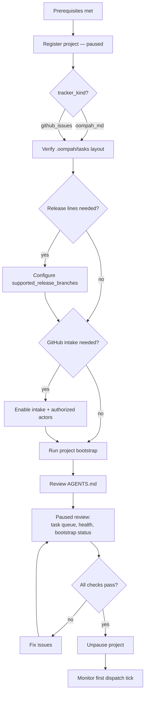

# Managed-Project Onboarding Checklist

Use this checklist when adding a new managed project to a running oompah 1.0
service. Work through each section in order. The project starts in the paused
state so you can review everything before agents begin dispatching.

---

## 1. Prerequisites

Before registering the project, confirm the following:

- [ ] **Service is running.** `make status` shows a PID and a healthy response
  from `GET /api/v1/state`. If not, see the
  [Operator Runbook](operator-runbook.md).
- [ ] **GitHub access.** `gh auth status` passes on the machine running oompah.
      A fine-grained PAT must include the target repository and **Webhooks: Read
      and write** whenever webhook forwarding is enabled. Add only the other
      feature-specific permissions oompah needs (such as Contents, Pull
      requests, and Issues intake); classic PATs need the equivalent repository
      scopes.

      **CI observation** requires **Actions: Read** on the target repository.
      Without it, oompah cannot detect failed GitHub Actions workflow runs and
      will surface a `check_runs_forbidden` capability warning in the UI. Grant
      `Actions: Read` to your fine-grained PAT to restore full CI monitoring
      and automatic CI-fix task dispatch.
- [ ] **Repository is accessible.** oompah can clone or access the target repo
      from its network perspective.
- [ ] **Webhook extension is installed.** `make install-gh-extensions` has been
      run. Verify with:
      ```bash
      gh extension list | grep webhook
      ```

---

## 2. Register the Project (Paused)

Add the project to oompah through the dashboard **Projects** page or via the
API. **Always start paused** so you can verify configuration before any agents
are dispatched.

### Via the dashboard

1. Open the oompah dashboard (default: `http://localhost:8080`).
2. Go to **Projects → New Project**.
3. Fill in:
   - **Repository URL** — the GitHub repo URL (e.g.
     `https://github.com/my-org/my-repo`).
   - **Tracker kind** — select **Native Markdown** (`oompah_md`) unless the
     project must use GitHub Issues as its task source.
   - **Tracker owner / repo** — set these to the GitHub org and repo that
     receives external issues (required only if you will enable GitHub Issues
     intake; see §5).
4. Check **Start paused**.
5. Save the project.

### Via the API

```bash
curl -X POST http://localhost:8080/api/v1/projects \
  -H 'Content-Type: application/json' \
  -d '{
    "repo_url": "https://github.com/my-org/my-repo",
    "tracker_kind": "oompah_md",
    "paused": true
  }'
```

Note the returned `id` — you will need it for subsequent API calls.

---

## 3. Native Tracker Expectations

When `tracker_kind` is `oompah_md`, oompah stores all task state in
`.oompah/tasks/` on the project's default branch.

### Repository layout

```
.oompah/tasks/
  proposed/
  backlog/
  open/
  in-progress/
  needs-human/
  in-review/
  done/
  merged/
  archived/
```

Each task is a Markdown file with YAML front matter. Task IDs default to the
repository directory name as a prefix (e.g. `MYREPO-1`). To override the
prefix, create `.oompah/tasks/config.yml`:

```yaml
task_prefix: PROJ
```

### Write behavior

Oompah writes task changes only from its managed source checkout, on the
project's default branch. Before each write it pulls; after each write it
commits `.oompah/tasks` and pushes to `origin`.

> **Agents and contributors should never edit `.oompah/tasks` files directly.**
> Always use `oompah task` CLI commands or the dashboard.

### Verify the tracker is initialised

After saving the project, oompah's next maintenance tick will create the
`.oompah/tasks` directory tree on the default branch if it does not already
exist. Check the repository on GitHub or run:

```bash
git -C /path/to/managed/checkout pull
ls /path/to/managed/checkout/.oompah/tasks/
```

Expected output: the nine status subdirectories listed above.

---

## 4. Optional: Configure Supported Release Lines

If you maintain release branches and want oompah to deliver already-merged work
to them, configure the supported release lines while the project is still paused
and before unpausing.

### Why configure early

Release lines control which branches appear in the **Release delivery** commit
inventory and are available as delivery targets in the task detail panel.
Configuring them before unpausing means agents and operators see the correct
target list from the first dispatch tick.

### Configure via the dashboard

1. Open the oompah dashboard and go to **Projects → [your project] → Settings**.
2. Under **Supported Release Lines**, enter a comma-separated ordered list of
   exact branch names, for example `release/1.1, release/1.0`.
   - Each entry must match one of the patterns in **Branches** and must not be
     the project's default branch.
   - Removing a line stops new approvals but does not delete the branch or
     cancel existing addendums.
3. Save. The list is available immediately for the next addendum approval.

### Configure via the API

```bash
curl -X PATCH http://localhost:8080/api/v1/projects/<project-id> \
  -H 'Content-Type: application/json' \
  -d '{"supported_release_branches": ["release/1.1", "release/1.0"]}'
```

### Skip this section

If this project has no release branches, skip to §5.

For the complete release delivery workflow — configuring release lines, selecting
commits from the inventory, checking delivery status, retrying a blocked
delivery, and queuing from a task or epic detail panel —
see [Release Delivery](release-addendums.md).

---

## 5. Optional: GitHub Issues Intake

If the project accepts external issue reports through GitHub Issues, enable
intake after the native tracker is verified.

> **Skip this section** if the project uses GitHub Issues as its sole task
> tracker (`tracker_kind: github_issues`). Intake is only relevant for native
> tracker projects that also want a GitHub-facing intake surface.

### Enable intake

Via the dashboard: go to **Projects → [your project] → Settings** and turn on
**GitHub Issue Intake**, then set **Tracker owner** and **Tracker repo** to the
GitHub org and repository where customers file issues.

Via the API:

```bash
curl -X PATCH http://localhost:8080/api/v1/projects/<project-id> \
  -H 'Content-Type: application/json' \
  -d '{
    "github_issue_intake_enabled": true,
    "tracker_owner": "my-org",
    "tracker_repo": "my-repo"
  }'
```

### Configure authorized actors

By default, only the oompah bot and the `tracker_owner` login can advance
`oompah:status:*` labels. Add any additional reviewers to the allowlist:

```bash
curl -X PATCH http://localhost:8080/api/v1/projects/<project-id> \
  -H 'Content-Type: application/json' \
  -d '{"status_label_authorized_logins": ["alice", "bob"]}'
```

### Verify intake

1. Open a test issue in the GitHub repository.
2. Within 30–60 seconds, the issue should receive an `oompah:status:proposed`
   label and oompah should create a corresponding internal native task under
   `.oompah/tasks/proposed/`.
3. Check the oompah dashboard to confirm the task appears in **Proposed**.

If the label does not appear, check:

- Webhook forwarding: `ps -ef | grep "gh webhook" | grep -v grep` — expect one
  `gh webhook forward` line per managed project.
- Service logs: `make logs | grep -i webhook`.
- GitHub token scopes: the token must have `write:org` or `repo` scope to
  apply labels.

See [GitHub Issue Intake Workflow](github-issue-intake.md) for the full
intake flow.

---

## 6. Project Bootstrap and AGENTS.md Update

Run the bootstrap to create or refresh the baseline project files that oompah
manages, including `AGENTS.md`, `docs/README.md`, `plans/README.md`, a
baseline `Makefile`, `.gitignore`, and the pre-commit hook.

### Run bootstrap

```bash
# Preview what will change (no writes):
oompah project-bootstrap preview /path/to/repo

# Apply the changes:
oompah project-bootstrap apply /path/to/repo

# Apply, commit, and push in one step:
oompah project-bootstrap apply /path/to/repo --push --branch main
```

Or trigger apply through the service API:

```bash
curl -X POST http://localhost:8080/api/v1/projects/<project-id>/bootstrap/apply
```

The API apply commits and pushes automatically using the managed project's
configured git identity.

### AGENTS.md: what to expect

Bootstrap generates or updates only the **oompah-managed section** of
`AGENTS.md` (the block between `<!-- BEGIN OOMPAH TASK INTEGRATION -->` and
`<!-- END OOMPAH TASK INTEGRATION -->`). All project-specific instructions
outside that block are left unchanged.

After apply, verify the generated section matches the project's tracker kind:

- **`oompah_md` projects** — the section instructs agents to use `oompah task`
  CLI commands against the native tracker, not GitHub Issues.
- **`github_issues` projects** — the section instructs agents on both the CLI
  path and the GitHub-label fallback path.

### Dirty worktree safety

If the managed checkout has uncommitted changes, bootstrap will refuse to
overwrite managed paths. Commit or stash those changes first, then rerun.

### Protected files

Files that exist in the repo but lack an oompah bootstrap marker are reported
as **protected** and are not modified. Check the `status` output for a list:

```bash
oompah project-bootstrap status /path/to/repo
```

---

## 7. Initial Paused-Project Review

Before unpausing the project, walk through these checks while agents are still
blocked from dispatching.

### 7.1 Verify task tracker state

```bash
# Native tracker: check the task directories exist and are readable
ls /path/to/repo/.oompah/tasks/

# Confirm no task files have mismatched status in their YAML front matter
for d in proposed backlog open in-progress needs-human in-review done merged archived; do
  echo "--- $d ---"
  ls /path/to/repo/.oompah/tasks/$d/ 2>/dev/null || echo "(empty)"
done
```

### 7.2 Verify bootstrap output

```bash
oompah project-bootstrap status /path/to/repo
```

All bootstrap-managed files should show **current** (no drifted entries).
Resolve any drift before unpausing.

### 7.3 Check service health

```bash
make status
curl -s http://localhost:8080/api/v1/state | python3 -m json.tool
```

Confirm:

| Field | Expected |
|---|---|
| `paused` | `true` (global pause may be off, but project pause should be on) |
| `alerts` | empty `[]` |
| `budget.exceeded` | `false` |

### 7.4 Verify GitHub intake (if enabled)

- Confirm at least one test issue reached `Proposed` status (§5 verify step).
- Confirm the webhook forwarder processes are running.

### 7.5 Review initial task queue

If the project has pre-existing open tasks, review them now:

```bash
oompah task view <task-id>   # for each open task
```

Check that:
- Each dispatchable task has a clear, non-empty description. (Oompah will not
  dispatch a task with an empty description.)
- Dependencies (`blocked_by`) reference the correct task IDs.
- Priority values are set intentionally.

### 7.6 Unpause the project

When all checks pass, unpause:

```bash
# Via API:
curl -X POST http://localhost:8080/api/v1/projects/<project-id>/resume

# Via dashboard:
# Projects → [your project] → Resume
```

Confirm by watching the log for the first dispatch tick:

```bash
make logs | grep -i "<your-project>"
```

Within one poll interval (`OOMPAH_POLL_INTERVAL_MS`, default 2 minutes), oompah
should claim the highest-priority dispatchable task and log a dispatch event.

---

## Onboarding Flow Summary



---

## Troubleshooting

| Symptom | Check | Fix |
|---|---|---|
| No `oompah:status:proposed` label after filing GitHub issue | Webhook forwarder running? | `make install-gh-extensions && make restart` |
| Bootstrap refuses to apply | Uncommitted changes in managed checkout | `git stash` then rerun bootstrap |
| Task not dispatched after unpause | Empty task description | Add a description via dashboard or `oompah task` CLI |
| Task not dispatched after unpause | Project still paused globally | `POST /api/v1/orchestrator/resume` |
| Checkout not on default branch | Managed checkout drifted | See Operator Runbook §5.2 |
| `.oompah/tasks` directories missing | Maintenance tick not run yet | Wait one tick or `make restart` to trigger immediate tick |

For service-level issues, see the [Operator Runbook](operator-runbook.md).
For GitHub intake issues, see the [GitHub Issue Intake Workflow](github-issue-intake.md).
For CLI install issues, see [Installing the oompah Task CLI](cli-install.md).
