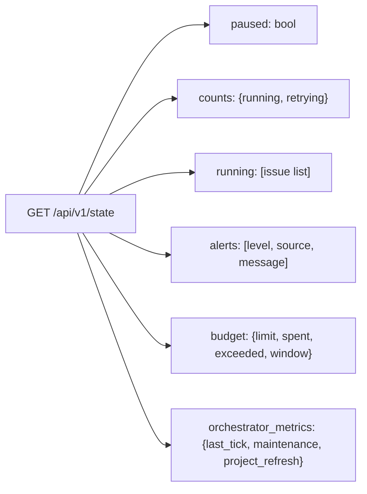

# Oompah 1.0 Service Operator Runbook

This runbook covers everything a service operator needs to run and verify the
oompah 1.0 service: initial configuration, starting and restarting, verifying
the service is healthy, checking managed repository soundness, and diagnosing
common stuck states — all without reading implementation code.

## Prerequisites

- A clone of the oompah repository checked out on the release branch
  (`release/1.0`) or a tagged commit (`v1.0.0`).
- Python 3.11+, `uv`, and `git` available on the machine.
- A GitHub account with `gh auth login` completed, plus the `cli/gh-webhook`
  extension installed (`make install-gh-extensions`).
- Network access to GitHub from the machine running oompah.

---

## 1. Configuration

### 1.1 The `.env` file

All tunable values are controlled by environment variables in a `.env` file at
the root of the oompah repository. The file is loaded automatically when the
service starts; you can also specify a different path with `--env-file`.

Start from the example:

```bash
cp .env.example .env
$EDITOR .env
```

**Required settings** before first start:

| Variable | Description |
|---|---|
| `GITHUB_TOKEN` | GitHub token used by `gh`. For fine-grained PATs, grant each forwarded repository **Webhooks: Read and write**; also grant only the feature-specific permissions oompah uses (for example Contents, Pull requests, and Issues intake). Classic tokens need the applicable repository scopes. You may instead use `gh auth login` and leave this blank. |
| `OOMPAH_GITHUB_TRACKER_OWNER` | GitHub org/user that owns the task hub repo (default tracker hub). |
| `OOMPAH_GITHUB_TRACKER_REPO` | GitHub repo used as the default task hub. |
| `OOMPAH_WORKSPACE_ROOT` | Directory where agent workspaces and git worktrees are created. Defaults to a temp directory if unset. |

**Commonly tuned settings:**

| Variable | Default | Description |
|---|---|---|
| `OOMPAH_SERVER_PORT` | `8080` | HTTP server port. Change this before starting if `8080` is in use. |
| `OOMPAH_MAX_CONCURRENT_AGENTS` | `10` | Maximum parallel agents. Reduce if the machine is resource-constrained. |
| `OOMPAH_BUDGET_LIMIT` | `0` (unlimited) | Spending cap in USD. Set to a non-zero value to stop dispatch when exceeded. |
| `OOMPAH_BUDGET_WINDOW` | `day` | Rolling window for the budget cap: `hour`, `day`, or `week`. |
| `OOMPAH_POLL_INTERVAL_MS` | `120000` | Orchestrator tick interval in milliseconds (2 minutes). |
| `OOMPAH_WEBHOOK_FORWARD_URL` | `http://localhost:8080/api/v1/webhooks/github` | URL where `gh webhook forward` sends GitHub events. Update if you change the port. |
| `OOMPAH_STALL_TURNS` | `10` | Consecutive unproductive agent turns before marking the agent stalled. |
| `OOMPAH_ESCALATE_AFTER_ATTEMPTS` | `1` | Failed attempts before escalating to a deeper agent profile. |

Provider configuration (API keys, base URLs, model selection) is stored in
`.oompah/providers.json` and is managed via the dashboard or the API — not via
the `.env` file.

Agent profiles are stored in `.oompah/agent_profiles.json` and are managed via
the dashboard. See `docs/agent-profiles.md`.

### 1.2 The `WORKFLOW.md` file

`WORKFLOW.md` defines the per-project workflow structure: tracker kind
(`github_issues` or `oompah_md`), active and terminal states, and the agent
prompt template. It is **not** the place for tunable values — use `.env` for
those.

The service watches `WORKFLOW.md` for changes and hot-reloads it without a
restart. The reload is validated before it takes effect; invalid YAML is
rejected with a log error and the previous config is kept.

### 1.3 Per-project configuration

Managed project settings (tracker owner/repo, paused state, etc.) are stored in
`.oompah/projects.json` and are managed exclusively via the dashboard or
`/api/v1/projects` API. Do not edit that file directly.

For maintained release lines, configure the project's **Supported Release
Lines** with exact branch names. This controls which branches appear in the
**Release delivery** commit inventory and are available as delivery targets;
it does not make release branches normal task targets. See
[Release Delivery](release-addendums.md) for configuration, commit selection,
status evidence, retry, and migration procedures.

---

## 2. Installation

From the oompah repository root:

```bash
make setup
```

`make setup` creates a `.venv` virtual environment and installs the full server
runtime with `uv pip install -e '.[server]'`. It is safe to run multiple times
(idempotent).

Install the GitHub webhook extension if not already present:

```bash
make install-gh-extensions
```

---

## 3. Starting and Stopping

### Start the service

```bash
make start
```

This starts oompah in the background, writes the PID to `.oompah.pid`, and
appends logs to `oompah.log`. The command waits up to 10 seconds for the server
to start listening on the configured port, then exits. If oompah is already
running, `make start` is a no-op.

To start in the foreground instead:

```bash
.venv/bin/python -m oompah server
```

To start paused (no agents dispatched until you resume):

```bash
.venv/bin/python -m oompah server --paused
```

### Stop the service

```bash
make stop
```

Sends `SIGTERM` to the process group, then waits up to 30 seconds for the
process to exit and the port to be released.

### Hard restart (after code or dependency changes)

```bash
make restart
```

Equivalent to `make stop && make start`. Use this after pulling new commits,
changing Python dependencies, or modifying `oompah/*.py` files.

### Graceful restart (after template or configuration changes)

```bash
make graceful
```

Calls `POST /api/v1/orchestrator/restart` with a 60-second drain timeout.
Running agents finish their current turn, then the orchestrator reloads
in-place without dropping the HTTP server. Use this for minor config changes
where you want to minimize disruption to running agents.

---

## 4. Verifying the Service Is Running

### Quick check

```bash
make status
```

Prints the PID and a JSON snapshot from `GET /api/v1/state` if the service is
running. If the PID file is present but the process is gone, it removes the
stale PID file and prints "oompah is not running."

### Manual process check

```bash
cat .oompah.pid
kill -0 $(cat .oompah.pid)   # exit 0 if process is alive
```

### Port check

```bash
# With ss (preferred):
ss -ltn 'sport = :8080'

# With lsof (fallback):
lsof -i :8080 -sTCP:LISTEN
```

### HTTP health check

```bash
curl -s http://localhost:8080/api/v1/state | python3 -m json.tool
```

A healthy response includes:

```json
{
  "paused": false,
  "counts": { "running": 2, "retrying": 0 },
  "running": [...],
  "alerts": [],
  "budget": { "limit": 50.0, "spent": 3.21, "exceeded": false, ... }
}
```

Key fields to inspect:

| Field | Healthy value | Action if unhealthy |
|---|---|---|
| `paused` | `false` | Call `POST /api/v1/orchestrator/resume` or `make graceful` |
| `alerts` | empty list `[]` | Read each alert's `level` and `message` |
| `budget.exceeded` | `false` | Raise `OOMPAH_BUDGET_LIMIT`, wait for the window to roll, or call `/resume` |
| `counts.running` | ≥ 0 | If 0 and tasks are open, check `paused`, alerts, and budget |

### Log tail

```bash
make logs
```

Or directly:

```bash
tail -f oompah.log
```

Normal startup output looks like:

```
2026-06-22T01:00:00 INFO    oompah.bootstrap Startup complete (port=8080)
2026-06-22T01:00:00 INFO    oompah.webhooks  WebhookForwarder: gh-webhook extension OK; forwarding events=push,pull_request,issues,issue_comment,label
2026-06-22T01:00:00 INFO    oompah.webhooks  WebhookForwarder: started gh webhook forward for project <name> (pid=<N>, ...)
```

### Provider health check

Verify that configured LLM providers can accept requests:

```bash
# List providers and their IDs:
curl -s http://localhost:8080/api/v1/providers | python3 -m json.tool

# Test a specific provider:
curl -s -X POST http://localhost:8080/api/v1/providers/<provider_id>/test | python3 -m json.tool
```

A passing test returns `"ok": true` with the response to the test prompt `"What
is 2 + 2?"`. Failures include an `error_reason` field with a normalized category
such as `auth_failed`, `rate_limited`, `budget_blocked`, `timeout`, or
`invalid_model`.

---

## 5. Managed Repository Soundness Checks

Oompah automatically runs a periodic managed-checkout repair pass (`repo_heal`)
at each maintenance tick. For manual inspection, the following checks verify the
soundness of the managed repository(ies) that oompah writes to.

### 5.1 Automatic repair (what oompah does)

On every maintenance tick, `ensure_repo_sound()` runs against each managed
checkout. It:

1. Aborts any in-progress merge (`git merge --abort`) or rebase
   (`git rebase --abort`).
2. Runs `git fetch origin`.
3. Checks out the default branch if the checkout is on a different branch.
4. Attempts `git pull --ff-only --autostash origin <default-branch>`.
5. If the checkout is still unsound (unmerged paths, diverged from origin)
   **and** the working tree is clean with no unpushed commits, runs
   `git reset --hard origin/<default-branch>`.

The outcome is logged at `INFO` level and surfaced in the `maintenance.repo_heal`
block of `GET /api/v1/state`:

```json
"maintenance": {
  "repo_heal": {
    "last_run_at": "2026-06-22T01:00:00Z",
    "duration_ms": 1200
  }
}
```

If `repo_heal` shows an error, it will appear under the `orchestrator_metrics`
section of the state snapshot.

### 5.2 Manual checks

**Check that the managed checkout is on the default branch and up to date:**

```bash
REPO=/path/to/managed/checkout
git -C "$REPO" status
git -C "$REPO" log --oneline -5
git -C "$REPO" log --oneline HEAD..origin/main   # should print nothing
```

**Check for in-progress merge or rebase:**

```bash
ls "$REPO/.git/MERGE_HEAD" 2>/dev/null && echo "MERGE IN PROGRESS"
ls "$REPO/.git/rebase-merge" 2>/dev/null && echo "REBASE IN PROGRESS"
ls "$REPO/.git/rebase-apply" 2>/dev/null && echo "REBASE APPLY IN PROGRESS"
```

If either is present, abort:

```bash
git -C "$REPO" merge --abort
git -C "$REPO" rebase --abort
```

**Check `.oompah/tasks` integrity (native tracker):**

```bash
ls "$REPO/.oompah/tasks/"
# Should show: proposed/ backlog/ open/ in-progress/ needs-human/
# in-review/ done/ merged/ archived/

# Check for files in the wrong directory:
for d in proposed backlog open in-progress needs-human in-review done merged archived; do
  echo "--- $d ---"
  ls "$REPO/.oompah/tasks/$d/" 2>/dev/null || echo "(empty)"
done
```

**Check for stale worktrees:**

```bash
git -C "$REPO" worktree list
```

Stale worktrees from completed or abandoned agent runs accumulate under
`OOMPAH_WORKSPACE_ROOT`. Oompah's `worktree_cleanup` maintenance job removes
them automatically. To inspect:

```bash
ls "$OOMPAH_WORKSPACE_ROOT"
```

### 5.3 Task state file checks

For the native Markdown tracker, each task file lives in a directory named
after its status. A task whose file is in `in-progress/` but whose YAML
front matter says `status: Done` is out of sync — this indicates a partial
write. Oompah corrects these on the next write to that task, or they can be
corrected manually with `oompah task set-status <id> Done`.

---

## 6. Troubleshooting Common Stuck States

### 6.1 No tasks are being dispatched

Check these conditions in order:

1. **Service paused (global):**
   ```bash
   curl -s http://localhost:8080/api/v1/state | python3 -c "import sys,json; d=json.load(sys.stdin); print('paused:', d['paused'])"
   ```
   Resume: `curl -X POST http://localhost:8080/api/v1/orchestrator/resume`
   or `make graceful`.

2. **Budget exceeded:**
   ```bash
   curl -s http://localhost:8080/api/v1/budget | python3 -m json.tool
   ```
   If `exceeded: true`, either raise `OOMPAH_BUDGET_LIMIT` in `.env` and
   restart, or wait for the budget window (`window`) to roll over. If
   `OOMPAH_BUDGET_LIMIT=0` the budget is unlimited and this will never trigger.

3. **No providers configured or all providers failing:**
   Check `GET /api/v1/providers` and run the test for each one (see §4).

4. **All open tasks have empty descriptions:**
   Oompah refuses to dispatch a task with no description body. Add a description
   via the dashboard or `oompah task` CLI.

5. **Tasks are blocked by unfinished dependencies:**
   Each task must have all `blocked_by` entries resolved before dispatch. Check
   `oompah task view <id>` for dependency status.

### 6.2 A specific task is stuck in a dispatch loop (reject streak)

When the same issue is rejected 10+ consecutive ticks, oompah logs:

```
WARNING oompah.orchestrator Stuck issue PROJ-12: rejected 10 consecutive ticks (budget_exceeded)
```

Common reject reasons and fixes:

| Reject reason | Meaning | Fix |
|---|---|---|
| `paused` | Global pause is active | `POST /api/v1/orchestrator/resume` |
| `project_paused` | Per-project pause is active | `POST /api/v1/projects/<id>/resume` |
| `budget_exceeded_paid` | Spending limit hit | Raise `OOMPAH_BUDGET_LIMIT` or wait for window reset |
| `no_providers` | No providers configured | Add a provider via dashboard |
| `all_providers_rejected` | All providers failed or mismatched | Check provider health; verify model assignments |
| `empty_description` | Task has no description body | Add a description to the task |
| `epic_rollup_parent` | Epic with children (use child tasks) | Expected; work happens on child tasks |
| `dependencies_unresolved` | `blocked_by` tasks are incomplete | Resolve the blocking tasks first |

To force-dispatch a specific task for debugging:

```bash
curl -X POST http://localhost:8080/api/v1/orchestrator/dispatch/PROJ-12
```

### 6.3 Agent stalled or hit max turns

When an agent exits with `stalled` or `max_turns`, oompah logs:

```
INFO oompah.orchestrator Agent stalled on PROJ-12: no productive actions (writes/commands) for 10 turns
```

The task is retried (up to `OOMPAH_ESCALATE_AFTER_ATTEMPTS` times before
escalating to a deeper profile, then up to `OOMPAH_DECOMPOSE_AFTER_ATTEMPTS`
times before auto-decomposing into sub-tasks).

To see current retry counts, check `GET /api/v1/state` → `retrying` list.

To reset a task's retry history and re-open it:

```bash
oompah task set-status PROJ-12 Open
```

### 6.4 Webhook forwarding degraded

**Symptom:** Dashboard shows a warning banner: "Webhooks degraded: unknown
command 'webhook'." or events stop arriving.

**Fix:**

```bash
# Install/reinstall the extension:
make install-gh-extensions

# Verify gh is authenticated:
gh auth status

# Restart oompah:
make restart
```

After restart, verify the subprocesses are running:

```bash
ps -ef | grep "gh webhook" | grep -v grep
```

Expect one `gh webhook forward` line per managed project. An empty result
while oompah is running means the extension is still missing or auth has
expired.

See `docs/webhook-forwarding.md` for full troubleshooting guidance.

### 6.5 Stuck epic (open PR with no progress)

When an epic's work branch has an open PR that is neither being merged nor
progressing, oompah emits a `stuck_epic` alert visible in
`GET /api/v1/state` → `alerts`:

```json
{
  "level": "warning",
  "source": "stuck_epic:PROJ-7",
  "message": "Epic PROJ-7 has an open PR #42 with no recent activity."
}
```

**Common causes and fixes:**

- **Failing CI:** Click through to the PR and fix the failing check, or create
  a `Needs CI Fix` task.
- **Merge conflicts:** Rebase the epic branch against main.
- **PR never opened:** Check that the SCM integration is working (`gh auth
  status`); an agent may be running on the epic to create the PR.

### 6.6 Managed repo checkout in a bad state

**Symptoms in logs:**

```
WARNING oompah.projects Checkout /path/to/repo not sound; preserving uncommitted/unpushed work. actions=ff-pull
```

**Manual recovery:**

```bash
REPO=/path/to/managed/checkout

# Abort any in-flight operations:
git -C "$REPO" merge --abort 2>/dev/null
git -C "$REPO" rebase --abort 2>/dev/null

# Reset to the remote default branch (only safe if you have no local work):
git -C "$REPO" fetch origin
git -C "$REPO" checkout main
git -C "$REPO" reset --hard origin/main
```

If there is uncommitted local work you want to preserve, stash it first:

```bash
git -C "$REPO" stash
git -C "$REPO" reset --hard origin/main
git -C "$REPO" stash pop
```

After recovery, trigger a new maintenance pass by restarting:

```bash
make restart
```

### 6.7 Service exits unexpectedly

Check the tail of the log:

```bash
tail -100 oompah.log
```

Common causes:

- **`ERROR: oompah server dependencies are not installed.`** — Run `make setup`.
- **`Workflow file not found`** — The `WORKFLOW.md` path does not exist. Check
  `--workflow` or run from the correct directory.
- **`Port <N> is already in use`** — Another process is using the port. Change
  `OOMPAH_SERVER_PORT` in `.env` or stop the conflicting process.
- **`granian workers must be 1, got N`** — Remove `OOMPAH_SERVER_WORKERS` from
  `.env` or set it to `1` when using the Granian backend.
- **Out-of-memory kill** — Reduce `OOMPAH_MAX_CONCURRENT_AGENTS` or add
  swap space.

After fixing the root cause, start again:

```bash
make start
```

---

## 7. Makefile Quick Reference

| Target | Purpose |
|---|---|
| `make setup` | Install server runtime into `.venv` (idempotent) |
| `make start` | Start oompah in the background |
| `make stop` | Stop the background process |
| `make restart` | Hard stop + start (for code or dependency changes) |
| `make graceful` | In-place orchestrator reload (drain agents, then reload) |
| `make status` | Print PID, dashboard URL, and state JSON |
| `make logs` | Tail `oompah.log` |
| `make test` | Run the full pytest suite |
| `make install-gh-extensions` | Install the `gh-webhook` CLI extension |
| `make check-secrets` | Run the paranoid secret scan before pushing |
| `make clean` | Stop, remove `.venv`, logs, PID file, and pycache dirs |

---

## 8. Key Files and Paths

| Path | Purpose |
|---|---|
| `.env` | All operator configuration (copy from `.env.example`) |
| `WORKFLOW.md` | Workflow structure and agent prompt template |
| `.oompah/projects.json` | Managed project registry (managed by oompah — do not edit directly) |
| `.oompah/providers.json` | LLM provider config (managed by oompah — do not edit directly) |
| `.oompah/agent_profiles.json` | Agent profiles (managed by oompah — do not edit directly) |
| `.oompah/tasks/` | Native Markdown task store for the self-hosted project |
| `.oompah.pid` | PID of the background oompah process |
| `oompah.log` | Service log (append-only; survives restarts) |
| `$OOMPAH_WORKSPACE_ROOT` | Root for agent workspaces and git worktrees |

---

## 9. State Snapshot Reference

The state snapshot returned by `GET /api/v1/state` is the primary
operator-facing health surface. Key top-level keys:



| Key | Description |
|---|---|
| `paused` | `true` if the global orchestrator pause is active |
| `counts.running` | Number of agents currently executing |
| `counts.retrying` | Number of tasks in retry backoff |
| `alerts` | Service-level warnings (webhook degraded, stuck epics, snapshot unavailable) |
| `budget.exceeded` | `true` if spending cap has been hit this window |
| `orchestrator_metrics.last_tick` | Timing breakdown for the most recent tick |
| `orchestrator_metrics.maintenance` | Last run times for `repo_heal`, `worktree_cleanup`, `auto_archive` |
| `orchestrator_metrics.project_refresh` | Per-project tracker fetch latency and error counts |

For detailed tick latency diagnostics, see `docs/tick-latency-diagnostics.md`.
