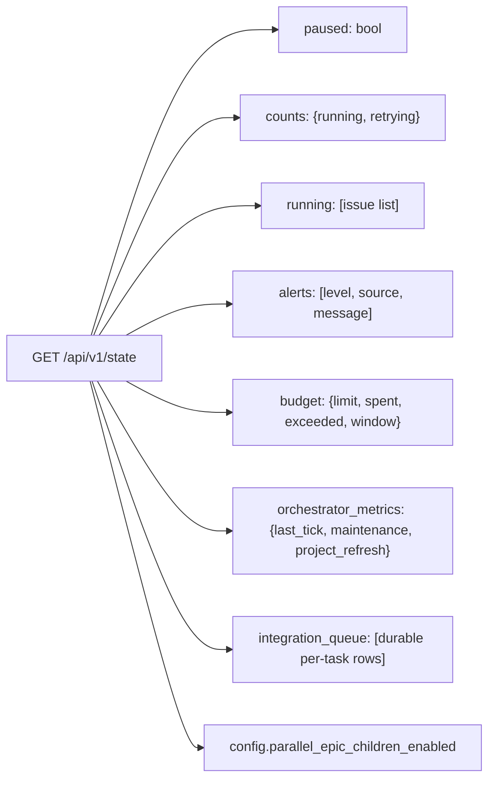

# Oompah 1.0 Service Operator Runbook

This runbook covers everything a service operator needs to run and verify the
oompah 1.0 service: initial configuration, starting and restarting, verifying
the service is healthy, checking managed repository soundness, and diagnosing
common stuck states — all without reading implementation code.

## Prerequisites

### Pushing workflow files with the project PAT

When an operator needs to push a commit that changes `.github/workflows/`, use
the project's configured PAT with `x-access-token` as the HTTPS username. Do
not rely on a remote URL that embeds a GitHub account name: Git credential
selection can then choose a different cached token.

The PAT must have repository `Contents: Read and write` and `Workflows: Read
and write` permissions.

- A clone of the oompah repository checked out on the release branch
  (`release/1.0`) or a tagged commit (`v1.0.0`).
- Python 3.11+, `uv`, and `git` available on the machine.
- A GitHub account with `gh auth login` completed, plus the `cli/gh-webhook`
  extension installed (`make install-gh-extensions`).
- Network access to GitHub from the machine running oompah.

---

## 1. Configuration

### 1.1 The `.env` file

All tunable values are controlled by environment variables in a `.env` file at
the root of the oompah repository. The file is loaded automatically when the
service starts; you can also specify a different path with `--env-file`.

Start from the example:

```bash
cp .env.example .env
$EDITOR .env
```

**Required settings** before first start:

| Variable | Description |
|---|---|
| `GITHUB_TOKEN` | GitHub token used by `gh`. For fine-grained PATs, grant each forwarded repository **Webhooks: Read and write**; also grant only the feature-specific permissions oompah uses (for example Contents, Pull requests, Issues intake, and **Actions: Read** for CI observation). Classic tokens need the applicable repository scopes. You may instead use `gh auth login` and leave this blank. Without `Actions: Read`, oompah falls back to the workflow-runs API and emits a `check_runs_forbidden` capability warning when CI results cannot be read. |
| `OOMPAH_GITHUB_TRACKER_OWNER` | GitHub org/user that owns the task hub repo (default tracker hub). |
| `OOMPAH_GITHUB_TRACKER_REPO` | GitHub repo used as the default task hub. |
| `OOMPAH_WORKSPACE_ROOT` | Directory where agent workspaces and git worktrees are created. Defaults to a temp directory if unset. |

**GitLab project settings** (required only when managing GitLab projects):

| Variable | Description |
|---|---|
| `GITLAB_TOKEN` | Default GitLab personal access token with **`api`** scope. Used when a project does not have a per-project `access_token` configured. Also accepted as `GITLAB_API_TOKEN`. |
| `OOMPAH_GITLAB_WEBHOOK_PUBLIC_URL` | Optional public HTTPS base URL override where Oompah receives GitLab webhook events. When omitted, Oompah uses the local IP selected by the OS route to each GitLab server plus `OOMPAH_SERVER_PORT`. Set this override for TLS, reverse proxies, NAT, public GitLab, or when GitLab cannot reach the selected private address. |

Per-project `access_token`, `forge_kind`, `forge_base_url`, and `webhook_secret` are stored in `.oompah/projects.json` and configured through the dashboard or API rather than `.env`. See `docs/project-bootstrap.md` § GitLab Projects for token scope requirements and webhook setup.

**HTTP Basic authentication** (optional):

Oompah supports optional HTTP Basic authentication to protect the dashboard, API, and WebSocket endpoints. When enabled, all requests (except webhook deliveries and health checks) require credentials.

The exact unauthenticated boundary is `GET /healthz` and the two webhook
receivers `POST /api/v1/webhooks/github` and `POST /api/v1/webhooks/gitlab`.
Webhook status, dashboards, REST/OpenAPI, WebSocket, and MCP remain protected.
See [HTTP Basic Authentication](authentication.md) for setup, user management,
rotation, recovery, HTTPS proxying, and client configuration guidance.

`OOMPAH_GITLAB_WEBHOOK_PUBLIC_URL` is the public HTTPS **Oompah** URL that
GitLab calls; it is not the GitLab forge/API URL and is independent of
`OOMPAH_HTPASSWD_FILE`. TLS is terminated by the reverse proxy, not by Oompah.

**Commonly tuned settings:**

| Variable | Default | Description |
|---|---|---|
| `OOMPAH_SERVER_PORT` | `8080` | HTTP server port. Change this before starting if `8080` is in use. |
| `OOMPAH_MAX_CONCURRENT_AGENTS` | `10` | Maximum parallel agents. Reduce if the machine is resource-constrained. |
| `OOMPAH_BUDGET_LIMIT` | `0` (unlimited) | Spending cap in USD. Set to a non-zero value to stop dispatch when exceeded. |
| `OOMPAH_BUDGET_WINDOW` | `day` | Rolling window for the budget cap: `hour`, `day`, or `week`. |
| `OOMPAH_POLL_INTERVAL_MS` | `120000` | Orchestrator tick interval in milliseconds (2 minutes). |
| `OOMPAH_WEBHOOK_FORWARD_URL` | `http://localhost:8080/api/v1/webhooks/github` | URL where `gh webhook forward` sends GitHub events. Update if you change the port. |
| `OOMPAH_STALL_TURNS` | `10` | Consecutive unproductive agent turns before marking the agent stalled. |
| `OOMPAH_ESCALATE_AFTER_ATTEMPTS` | `1` | Failed attempts before escalating to a deeper agent profile. |

Provider configuration (API keys, base URLs, model selection) is stored in
`.oompah/providers.json` and is managed via the dashboard or the API — not via
the `.env` file.

Agent profiles are stored in `.oompah/agent_profiles.json` and are managed via
the dashboard. See `docs/agent-profiles.md`.

### 1.2 The `WORKFLOW.md` file

`WORKFLOW.md` defines the per-project workflow structure: tracker kind
(`github_issues` or `oompah_md`), active and terminal states, and the agent
prompt template. It is **not** the place for tunable values — use `.env` for
those.

The service watches `WORKFLOW.md` for changes and hot-reloads it without a
restart. The reload is validated before it takes effect; invalid YAML is
rejected with a log error and the previous config is kept.

### 1.3 Per-project configuration

Managed project settings (tracker owner/repo, paused state, etc.) are stored in
`.oompah/projects.json` and are managed exclusively via the dashboard or
`/api/v1/projects` API. Do not edit that file directly.

For maintained release lines, configure the project's **Supported Release
Lines** with exact branch names. This controls which branches appear in the
**Release delivery** commit inventory and are available as delivery targets;
it does not make release branches normal task targets. See
[Release Delivery](release-addendums.md) for configuration, commit selection,
status evidence, retry, and migration procedures.

---

## 2. Installation

From the oompah repository root:

```bash
make setup
```

`make setup` creates a `.venv` virtual environment and installs the full server
runtime with `uv pip install -e '.[server]'`. It is safe to run multiple times
(idempotent).

Install the GitHub webhook extension if not already present:

```bash
make install-gh-extensions
```

---

## 3. Starting and Stopping

### Start the service

```bash
make start
```

This starts oompah in the background, writes the PID to `.oompah.pid`, and
appends logs to `oompah.log`. The command waits up to 10 seconds for the server
to start listening on the configured port, then exits. If oompah is already
running, `make start` is a no-op.

To start in the foreground instead:

```bash
.venv/bin/python -m oompah server
```

To start paused (no agents dispatched until you resume):

```bash
.venv/bin/python -m oompah server --paused
```

### Stop the service

```bash
make stop
```

Sends `SIGTERM` to the process group, then waits up to 30 seconds for the
process to exit and the port to be released.

### Normal draining restart (after code, dependency, or config changes)

```bash
make restart
```

Requests a graceful process restart, pauses new dispatch, waits for active
agents to finish, loads the updated code in-place, and verifies that a new
healthy service instance is answering before returning. The default one-hour
drain deadline is configurable with
`OOMPAH_RESTART_DRAIN_TIMEOUT_SECONDS` in `.env`. If the deadline expires,
undrained task identities are persisted once and reopened after restart.

### Graceful alias

```bash
make graceful
```

This is an alias for `make restart`.

### Emergency force restart

```bash
make force-restart
```

This explicitly performs a hard stop/start and may interrupt active agents.
Use it only when the running process is unhealthy and cannot accept the normal
restart API request. A normal restart never silently falls back to this path.

---

## 4. Verifying the Service Is Running

### Quick check

```bash
make status
```

Prints the PID and a JSON snapshot from `GET /api/v1/state` if the service is
running. If the PID file is present but the process is gone, it removes the
stale PID file and prints "oompah is not running."

### Manual process check

```bash
cat .oompah.pid
kill -0 $(cat .oompah.pid)   # exit 0 if process is alive
```

### Port check

```bash
# With ss (preferred):
ss -ltn 'sport = :8080'

# With lsof (fallback):
lsof -i :8080 -sTCP:LISTEN
```

### HTTP health check

```bash
curl -s http://localhost:8080/api/v1/state | python3 -m json.tool
```

A healthy response includes:

```json
{
  "paused": false,
  "counts": { "running": 2, "retrying": 0 },
  "running": [...],
  "alerts": [],
  "budget": { "limit": 50.0, "spent": 3.21, "exceeded": false, ... }
}
```

Key fields to inspect:

| Field | Healthy value | Action if unhealthy |
|---|---|---|
| `paused` | `false` | Call `POST /api/v1/orchestrator/resume` or `make graceful` |
| `alerts` | empty list `[]` | Read each alert's `level` and `message` |
| `budget.exceeded` | `false` | Raise `OOMPAH_BUDGET_LIMIT`, wait for the window to roll, or call `/resume` |
| `counts.running` | ≥ 0 | If 0 and tasks are open, check `paused`, alerts, and budget |

### Dashboard alert center

The dashboard shows generic actionable alerts once in the compact **Oompah
alerts** disclosure below the agent bar. It is collapsed by default so the
Kanban board remains usable; select the disclosure to review each alert and
its remediation. Diagnostic transcripts are available only from the alert's
**Diagnostic details** disclosure and remain internally scrollable.

Audit, quality-gate, repository-hygiene, and authentication health retain
their own status panels. Informational or healthy status is not added to the
actionable-alert list. A WebSocket full resynchronization replaces stale
warnings with the current state without requiring a page reload.

### Log tail

```bash
make logs
```

Or directly:

```bash
tail -f oompah.log
```

Normal startup output looks like:

```
2026-06-22T01:00:00 INFO    oompah.bootstrap Startup complete (port=8080)
2026-06-22T01:00:00 INFO    oompah.webhooks  WebhookForwarder: gh-webhook extension OK; forwarding events=push,pull_request,issues,issue_comment,label
2026-06-22T01:00:00 INFO    oompah.webhooks  WebhookForwarder: started gh webhook forward for project <name> (pid=<N>, ...)
```

### Provider health check

Verify that configured LLM providers can accept requests:

```bash
# List providers and their IDs:
curl -s http://localhost:8080/api/v1/providers | python3 -m json.tool

# Test a specific provider:
curl -s -X POST http://localhost:8080/api/v1/providers/<provider_id>/test | python3 -m json.tool
```

A passing test returns `"ok": true` with the response to the test prompt `"What
is 2 + 2?"`. Failures include an `error_reason` field with a normalized category
such as `auth_failed`, `rate_limited`, `budget_blocked`, `timeout`, or
`invalid_model`.

### Storage cleanup

The `storage_cleanup` maintenance job scans Oompah's configured private temp
root and `*.jsonl` agent logs once per day. It runs additional bounded batches
when free bytes or free percentage falls below the configured pressure
threshold. Registered worktrees are removed only through the tracker-aware
Merged/Archived cleanup; active, Done/conflict, valid unregistered, and unknown
paths are preserved. Symlinks and VM image formats are never cleanup targets.

Inspect the latest trigger, reclaimed bytes, skipped entries, pressure samples,
and errors:

```bash
curl -s http://localhost:8080/api/v1/state |
  jq '.orchestrator_metrics.maintenance.storage_cleanup,
      .maintenance.jobs.storage_cleanup'
```

Tune the cadence, pressure thresholds, minimum age, batch/byte caps, and log
retention with the `OOMPAH_STORAGE_CLEANUP_*` variables in `.env.example`.
Cleanup failures are recorded in maintenance state and do not stop scheduling.
If an atomic deletion is interrupted, a `.oompah-cleanup-*` entry may remain
inside the same owned root; a later scan retries it after the minimum age.

---

## 5. Managed Repository Soundness Checks

Oompah automatically runs a periodic managed-checkout repair pass (`repo_heal`)
at each maintenance tick. For manual inspection, the following checks verify the
soundness of the managed repository(ies) that oompah writes to.

### 5.1 Automatic repair (what oompah does)

On every maintenance tick, `ensure_repo_sound()` runs against each managed
checkout. It:

1. Aborts any in-progress merge (`git merge --abort`) or rebase
   (`git rebase --abort`).
2. Runs `git fetch origin`.
3. Checks out the default branch if the checkout is on a different branch.
4. Attempts `git pull --ff-only --autostash origin <default-branch>`.
5. If the checkout is still unsound (unmerged paths, diverged from origin)
   **and** the working tree is clean with no unpushed commits, runs
   `git reset --hard origin/<default-branch>`.

The outcome is logged at `INFO` level and surfaced in the `maintenance.repo_heal`
block of `GET /api/v1/state`:

```json
"maintenance": {
  "repo_heal": {
    "last_run_at": "2026-06-22T01:00:00Z",
    "duration_ms": 1200
  }
}
```

If `repo_heal` shows an error, it will appear under the `orchestrator_metrics`
section of the state snapshot.

### 5.2 Manual checks

**Check that the managed checkout is on the default branch and up to date:**

```bash
REPO=/path/to/managed/checkout
git -C "$REPO" status
git -C "$REPO" log --oneline -5
git -C "$REPO" log --oneline HEAD..origin/main   # should print nothing
```

**Check for in-progress merge or rebase:**

```bash
ls "$REPO/.git/MERGE_HEAD" 2>/dev/null && echo "MERGE IN PROGRESS"
ls "$REPO/.git/rebase-merge" 2>/dev/null && echo "REBASE IN PROGRESS"
ls "$REPO/.git/rebase-apply" 2>/dev/null && echo "REBASE APPLY IN PROGRESS"
```

If either is present, abort:

```bash
git -C "$REPO" merge --abort
git -C "$REPO" rebase --abort
```

**Check `.oompah/tasks` integrity (native tracker):**

```bash
ls "$REPO/.oompah/tasks/"
# Should show: proposed/ backlog/ open/ in-progress/ needs-human/
# in-review/ done/ merged/ archived/

# Check for files in the wrong directory:
for d in proposed backlog open in-progress needs-human in-review done merged archived; do
  echo "--- $d ---"
  ls "$REPO/.oompah/tasks/$d/" 2>/dev/null || echo "(empty)"
done
```

**Check for stale worktrees:**

```bash
git -C "$REPO" worktree list
```

Stale worktrees from completed or abandoned agent runs accumulate under
`OOMPAH_WORKSPACE_ROOT`. Oompah's `worktree_cleanup` maintenance job removes
them automatically. To inspect:

```bash
ls "$OOMPAH_WORKSPACE_ROOT"
```

### 5.3 Task state file checks

For the native Markdown tracker, each task file lives in a directory named
after its status. A task whose file is in `in-progress/` but whose YAML
front matter says `status: Done` is out of sync — this indicates a partial
write. Oompah corrects these on the next write to that task, or they can be
corrected manually with `oompah task set-status <id> Done`.

---

## 6. Troubleshooting Common Stuck States

### 6.1 No tasks are being dispatched

Check these conditions in order:

1. **Service paused (global):**
   ```bash
   curl -s http://localhost:8080/api/v1/state | python3 -c "import sys,json; d=json.load(sys.stdin); print('paused:', d['paused'])"
   ```
   Resume: `curl -X POST http://localhost:8080/api/v1/orchestrator/resume`
   or `make graceful`.

2. **Budget exceeded:**
   ```bash
   curl -s http://localhost:8080/api/v1/budget | python3 -m json.tool
   ```
   If `exceeded: true`, either raise `OOMPAH_BUDGET_LIMIT` in `.env` and
   restart, or wait for the budget window (`window`) to roll over. If
   `OOMPAH_BUDGET_LIMIT=0` the budget is unlimited and this will never trigger.

3. **No providers configured or all providers failing:**
   Check `GET /api/v1/providers` and run the test for each one (see §4).

4. **All open tasks have empty descriptions:**
   Oompah refuses to dispatch a task with no description body. Add a description
   via the dashboard or `oompah task` CLI.

5. **Tasks have unfinished dependencies:**
   Normal dependencies constrain finish/integration order and do not block
   dispatch. Only explicit hard-start dependencies delay a worker. Check the
   task detail for `start_dependencies`.

6. **Tasks are already waiting for integration:**
   `Ready to Integrate` tasks have released their worker slot. Inspect
   `GET /api/v1/state` → `integration_queue`. A `ready` item may be waiting for
   a normal dependency to integrate before it; an `integrating` item is in the
   rebase/test/fast-forward critical section. See
   [Parallel Epic Integration](parallel-epic-integration.md).

### 6.2 A specific task is stuck in a dispatch loop (reject streak)

When the same issue is rejected 10+ consecutive ticks, oompah logs:

```
WARNING oompah.orchestrator Stuck issue PROJ-12: rejected 10 consecutive ticks (budget_exceeded)
```

Common reject reasons and fixes:

| Reject reason | Meaning | Fix |
|---|---|---|
| `paused` | Global pause is active | `POST /api/v1/orchestrator/resume` |
| `project_paused` | Per-project pause is active | `POST /api/v1/projects/<id>/resume` |
| `budget_exceeded_paid` | Spending limit hit | Raise `OOMPAH_BUDGET_LIMIT` or wait for window reset |
| `no_providers` | No providers configured | Add a provider via dashboard |
| `all_providers_rejected` | All providers failed or mismatched | Check provider health; verify model assignments |
| `empty_description` | Task has no description body | Add a description to the task |
| `epic_rollup_parent` | Epic with children (use child tasks) | Expected; work happens on child tasks |
| `start_blocker=<id>` | An explicit hard-start dependency is incomplete | Finish it, or replace the edge with a normal finish-order dependency |

To force-dispatch a specific task for debugging:

```bash
curl -X POST http://localhost:8080/api/v1/orchestrator/dispatch/PROJ-12
```

### 6.3 Agent stalled or hit max turns

When an agent exits with `stalled` or `max_turns`, oompah logs:

```
INFO oompah.orchestrator Agent stalled on PROJ-12: no productive actions (writes/commands) for 10 turns
```

The task is retried (up to `OOMPAH_ESCALATE_AFTER_ATTEMPTS` times before
escalating to a deeper profile, then up to `OOMPAH_DECOMPOSE_AFTER_ATTEMPTS`
times before auto-decomposing into sub-tasks).

To see current retry counts, check `GET /api/v1/state` → `retrying` list.

To reset a task's retry history and re-open it:

```bash
oompah task set-status PROJ-12 Open
```

### 6.4 Parallel epic integration is not progressing

First confirm the mode and queue state:

```bash
curl -s http://localhost:8080/api/v1/state | python3 -m json.tool
```

Check `config.parallel_epic_children_enabled` and `integration_queue`.

- `ready`: check whether its finish dependencies have integrated. These
  dependencies do not prevent an agent from starting; they only order queue
  completion.
- `integrating`: the row has an expiring lease. A normal restart recovers an
  expired lease; do not delete its private branch.
- `blocked`: open the task and follow its final repair comment. Conflicts route
  to `Needs Rebase`, gate failures to `Needs CI Fix`, and unverifiable pushed
  heads back to `Open`.
- `integrated`: confirm terminal-audit providers are healthy if the task has
  not advanced to `Done`.

The task detail panel also shows its queue row and separate coordination
timeline. Full enablement, recovery, and rollback instructions are in
[Parallel Epic Integration](parallel-epic-integration.md).

### 6.4.1 The control-plane fix is blocked behind the broken control plane

This is a self-hosting deadlock. Treat it as a bug, not as an expected idle
state. It occurs when all of the following are true:

- review-ready work exists, but no agent, integration lease, or audit is
  running;
- the blocking transition is owned by oompah itself, such as terminal-audit
  dispatch, integration recovery, or status coordination;
- the reviewed fix for that transition is on an epic or task branch whose
  delivery depends on the same broken transition.

Do not break the deadlock by editing `.oompah/tasks`, deleting queue records,
or skipping the quality gate. Create a standalone high-priority recovery task
and use a recovery branch based on the current default branch:

1. Record the exact reviewed commits and the live blocking evidence on the
   recovery task.
2. Apply only those reviewed commits to the standalone recovery branch.
3. Run the focused tests and the configured complete `make test` gate on the
   exact recovery head.
4. Push the branch and deliver it directly to the default branch through the
   normal pull-request path.
5. Restart with `make restart`, then verify the previously blocked lane makes
   a durable transition.
6. Leave the original epic branches intact. Once the service is healthy, let
   their remaining work and terminal audits resume normally.

The recovery task is the audit trail for why delivery order changed. The
original implementation tasks retain their normal evidence and terminal
audits; the recovery path changes only how already-reviewed control-plane code
reaches the running service.

After recovery, file or update a product bug for the missing automatic
recovery. A backlog with runnable or review-ready work and no legal transition
must produce an actionable alert or an automatic bounded recovery; silent
stable idleness is never a healthy terminal state.

### 6.5 Webhook forwarding degraded

**Symptom:** Dashboard shows a warning banner: "Webhooks degraded: unknown
command 'webhook'." or events stop arriving.

**Fix:**

```bash
# Install/reinstall the extension:
make install-gh-extensions

# Verify gh is authenticated:
gh auth status

# Restart oompah:
make restart
```

After restart, verify the subprocesses are running:

```bash
ps -ef | grep "gh webhook" | grep -v grep
```

Expect one `gh webhook forward` line per managed project. An empty result
while oompah is running means the extension is still missing or auth has
expired.

See `docs/webhook-forwarding.md` for full troubleshooting guidance.

### 6.6 Stuck epic (open PR with no progress)

When an epic's work branch has an open PR that is neither being merged nor
progressing, oompah emits a `stuck_epic` alert visible in
`GET /api/v1/state` → `alerts`:

```json
{
  "level": "warning",
  "source": "stuck_epic:PROJ-7",
  "message": "Epic PROJ-7 has an open PR #42 with no recent activity."
}
```

**Common causes and fixes:**

- **Failing CI:** Click through to the PR and fix the failing check, or create
  a `Needs CI Fix` task.
- **Merge conflicts:** Rebase the epic branch against main.
- **PR never opened:** Check that the SCM integration is working (`gh auth
  status`); an agent may be running on the epic to create the PR.

### 6.7 Concurrent git write errors after graceful reload

**Symptoms in logs:**

```
Add comment API error: git commit -m ... failed: fatal: cannot lock ref 'HEAD': is at <sha> but expected <sha>
```

or

```
git add .oompah/tasks failed: fatal: Unable to create '.git/index.lock': File exists.
```

**Cause:**

During a graceful reload (`make graceful` or `POST /api/v1/orchestrator/restart`),
the orchestrator clears its tracker instance cache
(`_project_trackers.clear()`). Any write that was already in flight holds a
reference to the old tracker instance; the next write creates a new tracker
instance. For a brief window, two tracker instances for the same git repository
can both try to commit simultaneously. Each has its own in-process lock, so
they don't block each other, and the two `git commit` subprocesses race.

**Immediate fix (if the service is otherwise healthy):**

This error is transient. The losing write raises an error that is logged and
reported back to the caller; the winning write succeeds. No data is lost —
re-issuing the failed operation (e.g., re-posting the comment via the API)
will succeed once the graceful reload completes.

**If errors persist after reload is complete:**

Check whether two oompah processes are running against the same repository:

```bash
ps -ef | grep "oompah server" | grep -v grep
cat .oompah.pid
```

If a stale process is found, stop it and do a hard restart:

```bash
kill <stale-pid>
make force-restart
```

**Permanent fix:**

See `plans/concurrent-git-tracker-writes.md` for the root cause analysis and
the recommended implementation (module-level per-repo lock in
`oompah/oompah_md_tracker.py`). This is tracked as OOMPAH-267.

### 6.7 Managed repo checkout in a bad state

**Symptoms in logs:**

```
WARNING oompah.projects Checkout /path/to/repo not sound; preserving uncommitted/unpushed work. actions=ff-pull
```

**Manual recovery:**

```bash
REPO=/path/to/managed/checkout

# Abort any in-flight operations:
git -C "$REPO" merge --abort 2>/dev/null
git -C "$REPO" rebase --abort 2>/dev/null

# Reset to the remote default branch (only safe if you have no local work):
git -C "$REPO" fetch origin
git -C "$REPO" checkout main
git -C "$REPO" reset --hard origin/main
```

If there is uncommitted local work you want to preserve, stash it first:

```bash
git -C "$REPO" stash
git -C "$REPO" reset --hard origin/main
git -C "$REPO" stash pop
```

After recovery, trigger a new maintenance pass by restarting:

```bash
make restart
```

### 6.8 Direct owner work reset to Open by the watchdog

**Symptom:** A task you placed In Progress and started working on yourself
(without an oompah agent) was reset back to Open — sometimes twice in quick
succession. The log contains entries like:

```
INFO oompah.orchestrator Reset orphaned In Progress issue PROJ-42 to Open
(no agent attached, count=1)
```

**Cause:** The orphan-watchdog runs on every maintenance tick. It resets any In
Progress task that has no scheduler agent (`state.running`), no pending retry
(`state.retry_attempts`), and no pending dispatch claim (`state.claimed`). A
task you move to In Progress manually has none of these, so the watchdog treats
it as abandoned.

**Short-term workaround:** Add the `human-only` label to the task _before_
placing it In Progress.

```bash
oompah task add-label PROJ-42 human-only
# Then set it to In Progress via the dashboard or tracker
```

> **Note:** As of OOMPAH-707, the `human-only` label blocks the scheduler
> from dispatching the task but does NOT prevent the orphan-watchdog from
> resetting it. The permanent fix — a durable owner-claim mechanism — is
> implemented in the same release. Once the fix ships, you can register an
> owner claim on the task instead (see below).

**Permanent fix (OOMPAH-707 and later):** Register an owner claim to tell the
watchdog that the task is under intentional direct-owner work:

```bash
# Grant yourself a 48-hour claim (default TTL):
curl -X POST http://localhost:8080/api/v1/projects/<project_id>/tasks/PROJ-42/owner-claim \
     -H "Content-Type: application/json" \
     -d '{"actor_login": "<your-login>", "ttl_hours": 48}'
```

The response includes the claim ID, owner login, claimed-at timestamp, and
expiry time:

```json
{
  "claim_id": "a1b2c3d4e5f6...",
  "owner_login": "alice",
  "claimed_at": "2026-08-02T22:30:00Z",
  "expires_at": "2026-08-04T22:30:00Z"
}
```

This request atomically marks the task `In Progress` and grants the claim.
While the claim is active the watchdog skips the task; it will not be reset to
Open regardless of how many maintenance ticks pass.

**Check claim status:**

```bash
curl -s http://localhost:8080/api/v1/projects/<project_id>/tasks/PROJ-42/owner-claim \
  | python3 -m json.tool
```

**Release the claim when work is done:**

Release the claim explicitly so the task can re-enter the normal dispatch
lifecycle. If you don't release it, the claim expires automatically after the
configured TTL (default 48 hours) and the watchdog resets the task on the next
tick.

```bash
curl -X DELETE http://localhost:8080/api/v1/projects/<project_id>/tasks/PROJ-42/owner-claim \
  -H "Content-Type: application/json" \
  -d '{"actor_login": "<your-login>"}'
```

**Claim expiry and abandoned-work recovery:**

An owner claim that is never released expires after `OOMPAH_OWNER_CLAIM_TTL_HOURS`
(default 48 hours). Once expired, the next watchdog tick removes the claim
automatically and resets the task to Open for normal scheduling. This bounds
the maximum time a directly-owned task can remain In Progress after the owner
stops responding.

**Dashboard visibility:**

The state snapshot (`GET /api/v1/state` → `owner_claims`) lists all active
owner claims with their owner login, claim age, and expiry time. In Progress
tasks covered by an owner claim display the owner's name and a staleness
indicator in the dashboard.

### 6.9 Service exits unexpectedly

Check the tail of the log:

```bash
tail -100 oompah.log
```

Common causes:

- **`ERROR: oompah server dependencies are not installed.`** — Run `make setup`.
- **`Workflow file not found`** — The `WORKFLOW.md` path does not exist. Check
  `--workflow` or run from the correct directory.
- **`Port <N> is already in use`** — Another process is using the port. Change
  `OOMPAH_SERVER_PORT` in `.env` or stop the conflicting process.
- **`granian workers must be 1, got N`** — Remove `OOMPAH_SERVER_WORKERS` from
  `.env` or set it to `1` when using the Granian backend.
- **Out-of-memory kill** — Reduce `OOMPAH_MAX_CONCURRENT_AGENTS` or add
  swap space.

After fixing the root cause, start again:

```bash
make start
```

---

## 7. Makefile Quick Reference

| Target | Purpose |
|---|---|
| `make setup` | Install server runtime into `.venv` (idempotent) |
| `make start` | Start oompah in the background |
| `make stop` | Stop the background process |
| `make restart` | Drain agents, restart in-place, verify new instance health |
| `make graceful` | Alias for the normal draining restart |
| `make force-restart` | Emergency hard stop + start; interrupts active agents |
| `make status` | Print PID, dashboard URL, and state JSON |
| `make logs` | Tail `oompah.log` |
| `make test` | Run the full pytest suite |
| `make install-gh-extensions` | Install the `gh-webhook` CLI extension |
| `make check-secrets` | Run the paranoid secret scan before pushing |
| `make clean` | Stop, remove `.venv`, logs, PID file, and pycache dirs |

---

## 8. Key Files and Paths

| Path | Purpose |
|---|---|
| `.env` | All operator configuration (copy from `.env.example`) |
| `WORKFLOW.md` | Workflow structure and agent prompt template |
| `.oompah/projects.json` | Managed project registry (managed by oompah — do not edit directly) |
| `.oompah/providers.json` | LLM provider config (managed by oompah — do not edit directly) |
| `.oompah/agent_profiles.json` | Agent profiles (managed by oompah — do not edit directly) |
| `.oompah/tasks/` | Native Markdown task store for the self-hosted project |
| `.oompah.pid` | PID of the background oompah process |
| `oompah.log` | Service log (append-only; survives restarts) |
| `.oompah/roles.json` | Auditor and other agent role configuration |
| `$OOMPAH_WORKSPACE_ROOT` | Root for agent workspaces and git worktrees |
| `$OOMPAH_TEMP_ROOT` | Private temporary root inherited by Oompah, Git, and agent tools; defaults to `~/.oompah/tmp` |

### Temporary files

Oompah deliberately does not use the shared system `/tmp` by default. On
startup it creates `OOMPAH_TEMP_ROOT` with owner-only permissions and exports
it as `TMPDIR`, `TMP`, and `TEMP` to the service and every child process. This
prevents a shared tmpfs quota from stopping an agent during a Git commit or
finalization step. Set `OOMPAH_TEMP_ROOT` in `.env` to move it; it must be an
absolute path (or begin with `~`) and must be writable by the service user.

---

## 9. State Snapshot Reference

The state snapshot returned by `GET /api/v1/state` is the primary
operator-facing health surface. Key top-level keys:


```mermaid
flowchart LR
    S[GET /api/v1/state] --> P["paused: bool"]
    S --> C["counts: {running, retrying}"]
    S --> R["running: [issue list]"]
    S --> A["alerts: [level, source, message]"]
    S --> B["budget: {limit, spent, exceeded, window}"]
    S --> M["orchestrator_metrics: {last_tick, maintenance, project_refresh}"]
    S --> I["integration_queue: [durable per-task rows]"]
    S --> F["config.parallel_epic_children_enabled"]
```

| Key | Description |
|---|---|
| `paused` | `true` if the global orchestrator pause is active |
| `counts.running` | Number of agents currently executing |
| `counts.retrying` | Number of tasks in retry backoff |
| `alerts` | Service-level warnings (webhook degraded, stuck epics, snapshot unavailable) |
| `budget.exceeded` | `true` if spending cap has been hit this window |
| `orchestrator_metrics.last_tick` | Timing breakdown for the most recent tick |
| `orchestrator_metrics.maintenance` | Last run times for `repo_heal`, `worktree_cleanup`, `auto_archive` |
| `orchestrator_metrics.project_refresh` | Per-project tracker fetch latency and error counts |

For detailed tick latency diagnostics, see `docs/tick-latency-diagnostics.md`.

---

## 10. Migration Notes

### 10.1 Independent Auditor Dispatch (OOMPAH-460)

The `OOMPAH_VERIFY_COMPLETION` and `OOMPAH_VERIFY_COMPLETION_LLM` environment
variables are **deprecated**. Oompah emits a startup warning when either is
set. They are retained for one compatibility release but do **not** disable the
mandatory terminal-audit gate introduced in the OOMPAH-460 epic.

**Action required:** remove both variables from your `.env` file and configure
the auditor role:

1. Open `.oompah/roles.json` (or the dashboard Roles section).
2. Add at least two independent candidates to the `auditor` role.
3. Set `OOMPAH_AUDIT_MAX_ATTEMPTS` in `.env` to the number of candidates.
4. Restart: `make restart`.

See [`docs/auditor-dispatch-operations.md`](auditor-dispatch-operations.md)
for the full configuration guide, including role setup, monitoring,
troubleshooting, and the owner override procedure.
