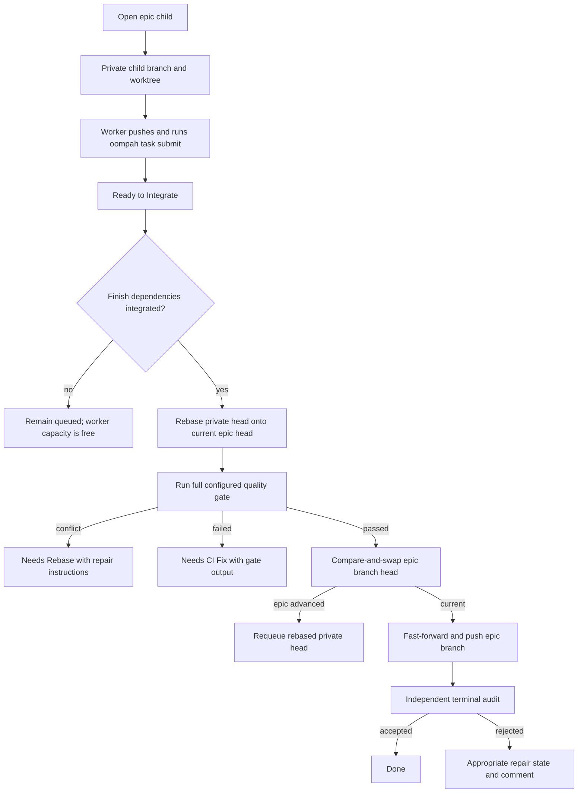

# Parallel Epic Integration

Oompah can run multiple children of the same epic concurrently while
preserving dependency order at integration time. Each child works on a private
branch and submits an immutable pushed commit. A durable per-epic queue rebases,
tests, and fast-forwards those commits into the epic branch one at a time.

This mode is controlled by:

```dotenv
OOMPAH_PARALLEL_EPIC_CHILDREN_ENABLED=true
```

The default is `false`. Change the setting in `.env`, not `WORKFLOW.md`.

## Safe Enablement

Do not switch branch strategies underneath running workers. To enable the
feature:

1. Confirm which agents are running with `make status`.
2. Allow existing agents to finish, or use the normal draining restart.
3. Set `OOMPAH_PARALLEL_EPIC_CHILDREN_ENABLED=true` in `.env`.
4. Run `make restart`.
5. Confirm `config.parallel_epic_children_enabled` is `true` in
   `GET /api/v1/state`.

`make restart` drains active agents before replacing the process. Do not use
`make force-restart` for routine activation because it interrupts workers.

To roll back, drain agents again, set the flag to `false`, and run
`make restart`. Ready and integrated queue records are durable; preserve their
private branches until every affected task has been reconciled.

## Lifecycle



Normal dependencies mean “this task must be integrated after that task.” They
do not delay worker start. Dependencies inherited from parent epics participate
in the same finish-order calculation. Use a hard-start dependency only when a
task genuinely cannot begin before its prerequisite completes:

```bash
oompah task set-dependency TASK-2 \
  --project <project-id> \
  --depends-on TASK-1 \
  --hard-start
```

The server rejects dependency changes that would create a cycle and returns
the cycle path. Existing finish and hard-start edges are checked together.

## Worker Submission

A worker submits only after its branch is committed, clean, and pushed:

```bash
oompah task submit TASK-2 \
  --project <project-id> \
  --summary "Implemented the parser and added regression coverage"
```

Submission records the private branch, local and remote head evidence, base
commit, changed paths, and summary. It moves the task to
`Ready to Integrate`; it does not mark the task `Done`. A spawned worker cannot
bypass this evidence check by setting a terminal status directly.

The queue is idempotent. A repeated submission of the same task updates its
ready head instead of creating a second queue entry. Expired integration
leases are recovered after restart, and tracker tasks already in
`Ready to Integrate` are restored to the SQLite queue.

## Agent Coordination

Coordination is advisory and durable. Oompah suggests peers based on finish or
hard-start dependencies, parent/child relationships, epic siblings, and
overlapping changed paths. Suggested peers can exchange messages while both
agents continue working:

```bash
oompah coordinate peers TASK-2 --project <project-id>
oompah coordinate send TASK-2 --project <project-id> \
  --to TASK-1 \
  --kind interface-change \
  --message "The parser now returns normalized paths."
oompah coordinate inbox TASK-2 --project <project-id> --unread
oompah coordinate checkpoint TASK-2 --project <project-id> \
  --summary "Parser interface is stable" \
  --path oompah/parser.py \
  --path tests/test_parser.py
```

`oompah task coordinate ...` is equivalent. Messages are stored separately
from tracker comments. Live workers receive best-effort message injection;
otherwise the message remains in the durable inbox and is included in the
next startup prompt. Reading the inbox marks returned messages read. Read
messages are retained for 30 days by default and pruned in bounded batches by
the normal storage-cleanup job. Operators can change that environment-only
retention with `OOMPAH_COORDINATION_RETENTION_SECONDS`.

Workers may message only server-suggested peers. Their short-lived task
capability cannot access another project's coordination surface or the general
operator API.

## Observability And Recovery

`GET /api/v1/state` exposes:

- `config.parallel_epic_children_enabled`;
- every durable `integration_queue` row, including state, attempts, lease, and
  `last_error`;
- running and retrying agents.

The task board and detail panel expose the task's integration record, queue
record and exact wait reason, unread coordination count, and coordination
timeline.

Queue states are:

| State | Meaning | Operator action |
|---|---|---|
| `ready` | Waiting for finish dependencies or the per-epic executor | Usually none; inspect dependency states if it persists |
| `integrating` | Leased for rebase, quality gate, and branch update | Wait unless the lease remains after a service failure; restart recovery requeues it |
| `integrated` | Commit landed on the epic branch; audit is staged or complete | Check audit/provider health if the task does not progress |
| `blocked` | Integration failed and the task was routed to repair | Follow the final task comment; preserve and repair the private branch |

Expected automatic recovery:

- An epic-head race requeues the already rebased private head.
- A task-branch push race reopens the task for explicit resubmission rather
  than choosing an unverified head.
- Rebase conflicts move the task to `Needs Rebase`.
- Combined-tree gate failures move the task to `Needs CI Fix`.
- Missing or stale branch evidence reopens the task with recovery
  instructions.
- An integrated row is re-presented to terminal audit after restart.

Private child worktrees and branches are removed only after their work is
integrated and the parent landing is confirmed. Never delete a blocked private
branch before its task is recovered.
