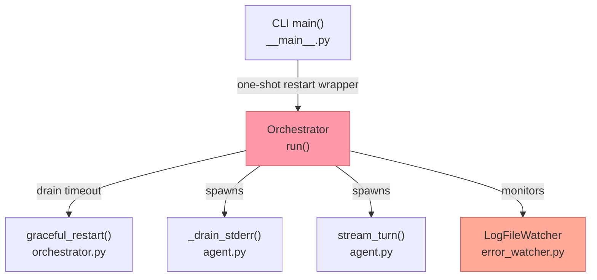
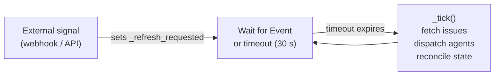
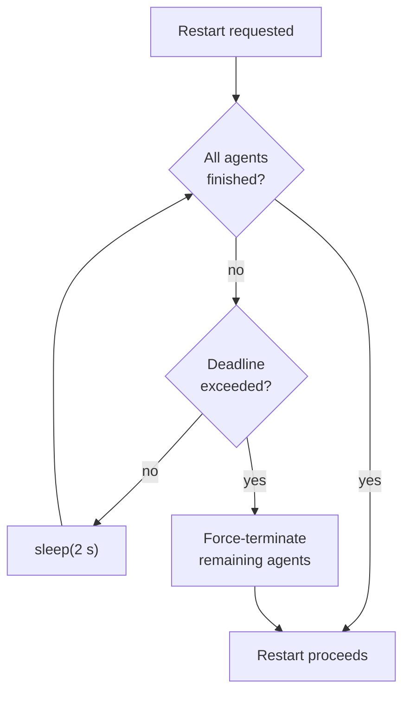
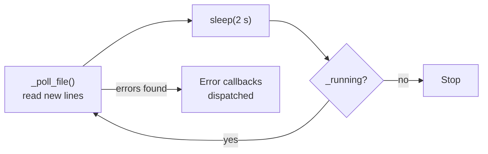

# Polling Mechanisms Inventory

This document identifies all places in the codebase where polling is currently
used. It was created as part of issue **oompah-8r5**, a subtask of the
event-driven architecture epic **oompah-ky3** ("All actions must be event
driven").

## Overview

The diagram below shows all six polling/loop mechanisms and their relationship
to the main orchestrator event loop.



Items shaded in orange (`Orchestrator.run()` and `LogFileWatcher`) are the
highest-priority candidates for replacement with an event-driven approach.

---

## 1. Orchestrator main poll loop

**File:** `oompah/orchestrator.py`, lines 321–328  
**Method:** `Orchestrator.run()`

```python
while not self._stopping:
    await self._tick()
    try:
        await asyncio.wait_for(
            self._refresh_requested.wait(),
            timeout=self.state.poll_interval_ms / 1000.0,
        )
        self._refresh_requested.clear()
    except asyncio.TimeoutError:
        pass
```

**Interval:** Configured via `poll_interval_ms` (default 30 000 ms / 30 s).  
**What it does:** The main heartbeat of the orchestrator. Every tick it fetches
open issues from the tracker, dispatches new agents, and reconciles running
state. The `asyncio.Event` (`_refresh_requested`) lets an external signal
(e.g., a webhook) trigger an early tick, but if no signal arrives the loop
falls back to the fixed timeout — pure polling.

The flow within each tick is:



---

## 2. Graceful-restart drain loop

**File:** `oompah/orchestrator.py`, lines 190–194  
**Method:** `Orchestrator.graceful_restart()`

```python
deadline = time.monotonic() + drain_timeout_s
while self.state.running and time.monotonic() < deadline:
    ...
    await asyncio.sleep(2)
```

**Interval:** 2 seconds (hard-coded).  
**What it does:** After a restart is requested, polls every 2 seconds to check
whether all running agents have finished, up to `drain_timeout_s` (default
60 s).



---

## 3. LogFileWatcher poll loop

**File:** `oompah/error_watcher.py`, lines 292–297  
**Method:** `LogFileWatcher.start()`

```python
while self._running:
    try:
        self._poll_file()
    except Exception as exc:
        ...
    await asyncio.sleep(self._poll_interval)
```

**Interval:** `poll_interval` parameter, default 2.0 seconds.  
**What it does:** Periodically reads new lines appended to a log file and
dispatches error events to registered callbacks.



---

## 4. `_drain_stderr` read loop (agent process)

**File:** `oompah/agent.py`, lines 109–113  
**Method:** `AgentSession._drain_stderr()`

```python
while True:
    line = await self._process.stderr.readline()
    if not line:
        break
    ...
```

**Interval:** N/A — blocks on `readline()` (effectively event-driven via the
OS pipe), but structured as an infinite loop. Not a time-based poll; exits
naturally when the subprocess closes stderr.

---

## 5. `stream_turn` read loop (agent process stdout)

**File:** `oompah/agent.py`, lines 262–281  
**Method:** `AgentSession.stream_turn()`

```python
while True:
    remaining = deadline - time.monotonic()
    ...
    line = await asyncio.wait_for(
        self._process.stdout.readline(), timeout=remaining
    )
    ...
```

**Interval:** N/A — blocks on `readline()` with a deadline timeout. Not a
periodic time poll; exits when the subprocess writes a completion line or the
turn timeout is exceeded.

---

## 6. CLI main restart loop

**File:** `oompah/__main__.py`, line 66  
**Method:** `main()` (CLI entry point)

```python
while True:
    restart = False
    try:
        restart = asyncio.run(_run(workflow_path, args.port))
    ...
    if restart:
        os.execv(sys.executable, ...)
    break
```

**Interval:** N/A — not a time-based poll. The loop only iterates when a
graceful restart is requested, at which point `os.execv` replaces the process
immediately. In practice it is a one-shot wrapper, not ongoing polling.

---

## Configuration

| Setting | File | Default | Description |
|---------|------|---------|-------------|
| `poll_interval_ms` | `oompah/config.py:231` | `30000` | Orchestrator main loop interval |
| `polling.interval_ms` (YAML) | `oompah/config.py:319` | — | Override via config file |
| `poll_interval` | `oompah/error_watcher.py:264` | `2.0` | `LogFileWatcher` file-check interval |

---

## Summary

| # | Location | Mechanism | Interval | Priority for Replacement |
|---|----------|-----------|----------|--------------------------|
| 1 | `orchestrator.py` `run()` | `asyncio.wait_for` on Event + timeout | 30 s (configurable) | High — core scheduling |
| 2 | `orchestrator.py` `graceful_restart()` | `asyncio.sleep` loop | 2 s | Medium — only during restarts |
| 3 | `error_watcher.py` `LogFileWatcher.start()` | `asyncio.sleep` loop | 2 s (configurable) | High — continuous polling |
| 4 | `agent.py` `_drain_stderr()` | `readline()` loop | Event-driven | Low — already pipe-driven |
| 5 | `agent.py` `stream_turn()` | `readline()` + deadline | Event-driven | Low — already pipe-driven |
| 6 | `__main__.py` `main()` | One-shot restart loop | One-shot | Low — not ongoing polling |

Items **1** and **3** are the highest-priority candidates for replacement with
an event-driven approach as part of oompah-ky3.
