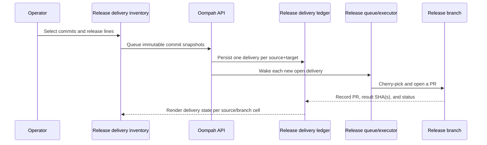

# Release Delivery

Release delivery carries already-merged work from the default branch (usually
`main`) to one or more maintained release lines. Oompah tracks every delivery
as an immutable source-commit snapshot applied to exactly one release branch;
it does not create GitHub issues, ordinary tracker tasks, or new product work
for each delivery.

**Proof of delivery** requires a ledger record or direct ancestry evidence —
not merely the presence of a commit on a release branch. A commit that appears
on a release branch through a direct push, rebase, or an untracked cherry-pick
is not automatically recognized as delivered unless it is reachable from the
default branch and matched by ancestry. Never assume a raw commit on a release
branch proves that tracked work was released.

## Configure supported release lines

In the dashboard, open the project definition and set **Supported Release
Lines** to an ordered, comma-separated list of exact branch names, for example
`release/1.1, release/1.0`. A line must match the project's tracked-branch
patterns and cannot be the default branch. The ordering controls the order
shown to operators.

You can also use the project API:

```http
PATCH /api/v1/projects/proj-123
Content-Type: application/json

{"supported_release_branches": ["release/1.1", "release/1.0"]}
```

Adding a line makes it eligible immediately once it exists on the remote.
Removing a line prevents new approvals but never deletes existing delivery
records or hides their history. The release catalog reports only configured
remote branches as selectable; a historical branch that was deleted remains
visible as unavailable.

## Release delivery commit inventory

The dashboard toolbar **Release delivery** button opens the commit inventory
overlay. It shows every non-merge commit reachable from the project's default
branch, newest first, with a status cell for each configured release line.

### Status cells

| Cell state | Meaning | Evidence shown |
|---|---|---|
| `Not selected` | No delivery has been queued for this commit on this branch. | — |
| `Open` | A delivery is queued and waiting for a worker. | Delivery ID |
| `In progress` | A worker holds a lease and is building the release PR. | Delivery ID |
| `In review` | A release-branch PR is open. | Delivery ID, PR link |
| `Blocked` | Cherry-pick or execution failed. | Delivery ID, error |
| `Delivered` | The release PR merged **or** the commit is reachable from the release branch by ancestry. | Delivery ID and result SHA(s) **or** `Present by ancestry` |
| `Archived` | The delivery was cancelled. | Delivery ID |

**Delivered by cherry-pick** means the ledger recorded a merged release PR
whose result commit SHA(s) can be mapped from the original source commit.
**Delivered by ancestry** means the source commit is reachable from
`origin/<release-branch>` via `git merge-base --is-ancestor` — no ledger
record needed.

Merge commits are shown in the table for informational context only and are
not selectable as delivery targets.

### Select commits and queue delivery

1. Open **Release delivery** from the dashboard toolbar.
2. Choose the project (required if no project filter is active).
3. Use the **Needs delivery** filter (default) to see only commits that have
   at least one undelivered release line.
4. Select one or more source commits using the checkboxes.
5. In the sticky action bar, select the target release line(s) and choose
   **Queue selected commits**.
6. Each eligible source+target pair creates one delivery record immediately.
   Already-delivered pairs are reported as `already_delivered` and skipped.
   Already-active pairs are reported as `already_active` and skipped.

If the source HEAD changes between loading the page and confirming the
selection, the server returns `409 source_changed` with the current HEAD. The
UI prompts you to refresh before retrying.

The API equivalent:

```http
POST /api/v1/projects/proj-123/release-delivery/commits
Idempotency-Key: <client-generated-UUID>
Content-Type: application/json

{
  "source_head": "9d1abc...",
  "commits": ["3c8c1d5...", "a4f0e8c..."],
  "target_branches": ["release/1.1", "release/1.0"]
}
```

Response:

```json
{
  "created": [{"commit": "3c8c1d5...", "target": "release/1.1", "delivery_id": "rd_..."}],
  "already_active": [],
  "already_delivered": [{"commit": "a4f0e8c...", "target": "release/1.0"}],
  "invalid": []
}
```

Repeating the same request with the same `Idempotency-Key` replays the
original response without creating duplicate records.

### Direct-to-main commits (no task)

Source commits that are not linked to any tracker task appear in the inventory
without a task association. An operator can select them and queue delivery just
like any other commit. The system does not require a tracker task to exist; the
delivery record is keyed by the source commit SHA, not by a task identifier.

## Queue a merged task or epic for release

From the task or epic detail panel, choose **Add release branches**. This is a
shortcut to the same delivery mechanism: it resolves the merged item's immutable
commit snapshot and queues one delivery per selected release line, exactly as if
you had selected those commits from the inventory.

The task immediately shows per-branch status cells reflecting the new delivery
records. The API equivalent:

```http
POST /api/v1/issues/FOO-10/release-addendums
Content-Type: application/json

{
  "project_id": "proj-123",
  "target_branches": ["release/1.1", "release/1.0"],
  "idempotency_key": "a-client-generated-uuid"
}
```

Approval is all-or-nothing per call: all targets must be currently available
supported lines, and oompah must be able to resolve the merged source commits.
Repeating the request is safe and returns existing active rows instead of
duplicating queue work.



## Read progress and recover failures

Each delivery row shows the branch, status, queue/lease state, PR link, and
any blocked error. The source task or epic `Merged` status does not change
while its deliveries progress.

| Delivery status | Meaning | Operator action |
|---|---|---|
| `open` | Queued and ready for a worker. | Wait for the queue, or inspect service health. |
| `in_progress` | A worker holds a lease and is building the release PR. | Wait; an expired lease returns to `open`. |
| `in_review` | A release-branch PR is open. | Review and merge the PR on the release branch. |
| `blocked` | Cherry-pick or execution failed. | Resolve the cause, then retry. |
| `merged` / `Delivered` | The release PR merged. | No action. |
| `archived` | The delivery was cancelled. | No action; queue a new delivery if needed. |

### Cherry-pick SHA behavior

When a worker cherry-picks the source commit onto the release branch, the
resulting commit has a different SHA from the original. The ledger records both
the source commit SHAs and the result (cherry-picked) commit SHAs. The **Release
delivery** inventory resolves status by checking whether a known delivery
contains the source commit, so callers should not compare raw result SHAs
against the original source SHA to determine delivery status.

### Protected-branch PR behavior

Release branches are typically protected. The executor never pushes source
commits directly to a protected branch. Instead, it opens a pull request from
a temporary cherry-pick branch into the release branch. The delivery moves to
`in_review` when the PR exists and to `merged`/`Delivered` after the PR merges.
Review and merge the PR as normal — oompah polls and updates the delivery state.

### Stale cursor and force-push remediation

The inventory paginates by an opaque cursor that encodes the source HEAD SHA.
If the default branch is force-pushed between page requests, the server returns
`409 source_changed` with the current HEAD so the UI can refresh the first
page from a consistent history. Delivery records are immutable: they retain
their original source SHAs even if those commits are later unreachable from
the default branch. Such records transition to `blocked` with an actionable
error indicating the source object is missing; use retry or archive to resolve.

Retry a blocked delivery:

```http
POST /api/v1/issues/FOO-10/release-addendums/FOO-10%2Frelease%2F1.0/retry
Content-Type: application/json

{"project_id": "proj-123"}
```

Archive an `open` or `blocked` delivery:

```http
POST /api/v1/issues/FOO-10/release-addendums/FOO-10%2Frelease%2F1.0/archive
Content-Type: application/json

{"project_id": "proj-123"}
```

Both operations return `409` for an invalid lifecycle transition.

## Epic snapshots

An epic delivery is one record per target release line, not one record per
child. At approval time oompah snapshots the ordered, deduplicated commits of
descendants already merged to the default branch and records the included child
IDs and SHAs. Later child merges are not silently added; approve a new epic
delivery or an individual task delivery when appropriate.

## Browse the delivery inventory via API

List configured release lines for a project:

```http
GET /api/v1/projects/proj-123/release-branches
```

Read the commit inventory with per-branch delivery status:

```http
GET /api/v1/projects/proj-123/release-delivery/commits
  ?branches=release/1.1,release/1.0
  &filter=needs_delivery
  &query=FOO-10
  &cursor=<opaque>
  &limit=100
```

The response includes `source_head`, `release_branches`, paginated `rows` each
with `sha`, `selectable`, `association`, and `release_status` cells, a
`next_cursor` for the next page, and a `stale` flag set when the last remote
fetch failed.

## Deprecated: release-branch inspection endpoint

The former branch-inspection endpoint has been superseded by the Release
delivery commit inventory. It is deprecated and returns a compatibility
response indicating the replacement:

```http
GET /api/v1/projects/{project_id}/release-branches/{branch}/addendums
```

**Deprecated** — returns HTTP `410 Gone` after the v1.0-to-v1.1 upgrade
window. Use the Release delivery API instead:

```http
GET /api/v1/projects/{project_id}/release-delivery/commits
  ?branches={branch}&filter=all
```

For per-branch drill-down via status cell evidence, use:

```http
GET /api/v1/projects/{project_id}/release-delivery/commits
  ?branches={branch}
```

## Migration from release picks (historical)

Earlier versions used `oompah.backports`, `oompah.backport_of`, and child
backport tasks. This is historical compatibility behavior only; do not create
or work new child backport tasks.

During migration, existing records become source-owned delivery records:

| Legacy state | Delivery status |
|---|---|
| `waiting`, `task_created`, `cherry_picking` | `open` |
| `pr_open` | `in_review` |
| `conflict`, `needs_human` | `blocked` |
| `merged`, `archived`, `skipped` | `merged`, `archived`, `archived` respectively |

Oompah preserves useful commit, PR, and timestamp evidence when it can and
archives historical child tasks with a redirect comment to the source item.
The migration is safe to rerun. Readers and migration are deployed before the
old reconciler is retired.
