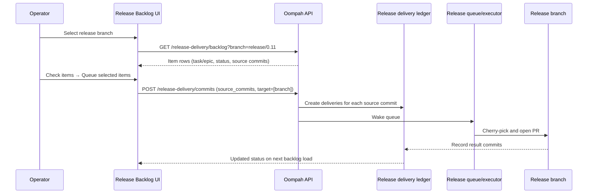

# Release Delivery

Release delivery carries already-merged work from the default branch (usually
`main`) to one or more maintained release lines. Oompah tracks every delivery
as an immutable source-commit snapshot applied to exactly one release branch;
it does not create GitHub issues, ordinary tracker tasks, or new product work
for each delivery.

**Proof of delivery** requires a ledger record or direct ancestry evidence —
not merely the presence of a commit on a release branch. A commit that appears
on a release branch through a direct push, rebase, or an untracked cherry-pick
is not automatically recognized as delivered unless it is reachable from the
default branch and matched by ancestry. Never assume a raw commit on a release
branch proves that tracked work was released.

## Configure supported release lines

In the dashboard, open the project definition and set **Supported Release
Lines** to an ordered, comma-separated list of exact branch names, for example
`release/1.1, release/1.0`. A line must match the project's tracked-branch
patterns and cannot be the default branch. The ordering controls the order
shown to operators.

You can also use the project API:

```http
PATCH /api/v1/projects/proj-123
Content-Type: application/json

{"supported_release_branches": ["release/1.1", "release/1.0"]}
```

Adding a line makes it eligible immediately once it exists on the remote.
Removing a line prevents new approvals but never deletes existing delivery
records or hides their history.

## Release delivery backlog (primary workflow)

The dashboard toolbar **Release delivery** button opens the item-centric
release delivery backlog overlay. This is the primary operator workflow for
choosing which completed tasks and epics to deliver to a release branch.

### Overview

The backlog displays **one row per task or epic** that has individually merged
to the project default branch and is not already delivered to the selected
release branch. Each row shows the identifier, title, commit count, merged
date, and current delivery state for the selected branch.



### Branch selection (required first)

Before the backlog loads, select a release branch from the **Branch** dropdown.
If the project has exactly one configured release branch, it is auto-selected.
The backlog shows only items relative to the selected branch.

### Status cells

| Cell state | Meaning | Evidence shown |
|---|---|---|
| `Not selected` | No delivery has been queued for this item on this branch. | — |
| `Open` | A delivery is queued and waiting for a worker. | Delivery ID |
| `In progress` | A worker holds a lease and is building the release PR. | Delivery ID |
| `In review` | A release-branch PR is open. | Delivery ID, PR link |
| `Blocked` | Cherry-pick or execution failed. | Delivery ID, error, Retry button |
| `Delivered` | The release PR merged **or** the commit is reachable by ancestry. | Delivery ID and result SHA(s) **or** `Delivered by ancestry` |
| `Archived` | The delivery was cancelled. | — |

An item's status is the **highest-priority** status across all of its source
commits for the selected branch. Priority order (highest first):
`blocked > in_progress > in_review > open > delivered > archived > not_selected`.

**Delivered by cherry-pick** means the ledger recorded a merged release PR
whose result commit SHA(s) can be mapped from the original source commit.
**Delivered by ancestry** means the source commit is reachable from
`origin/<release-branch>` via `git merge-base --is-ancestor`.

### Filters and search

- **Needs delivery** (default): show only items that are not yet delivered or
  archived for the selected branch. Active deliveries (open, in_progress,
  in_review, blocked) are included — they are not delivered yet.
- **All**: show all items including delivered history.
- **Search**: text filter over identifier, title, and commit subject.

The backlog loads as a **complete bounded list**. There is no "Load next page"
control. If the project has more than the implementation limit (500 items),
a count note is shown with guidance to use search to narrow results.

### Select items and queue delivery

1. Open **Release delivery** from the dashboard toolbar.
2. Choose the project (required if no project filter is active).
3. Choose the **release branch** from the Branch dropdown (required).
4. Use the **Needs delivery** filter (default) to see only items that need
   delivery to the selected branch.
5. Select one or more item rows using the checkboxes. Items already delivered
   or archived have their checkbox disabled to prevent duplicate queueing.
6. Click **Queue selected items** in the action bar. A confirmation dialog
   shows the item count, commit count, and selected branch.
7. All source commits from the selected items are queued to the selected branch.
   Each eligible source commit creates one delivery record.

### Item details drawer

Click an item's identifier or its status cell to open the **Item details**
drawer. The drawer shows:

- Item identifier, kind (task or epic), and a link to the task detail panel.
- Source commits as subordinate detail: SHA, subject, author, date.
- Per-commit delivery status with delivery ID, PR link, result SHAs, and
  delivery evidence (ancestry or cherry-pick).
- For blocked commits: the error message and a **Retry delivery** button.

### Unassociated direct-to-main commits

Source commits that cannot be associated with any task or epic (no matching
delivery ledger entry with a `source_identifier`) are shown in a collapsed
**Unassociated commits** section below the primary item table. These are
shown for diagnostics only; they are not primary delivery candidates.

To queue an unassociated commit for release, use the API directly (see
§ "Queue commits via API" below).

### API: Read the item-centric backlog

```http
GET /api/v1/projects/proj-123/release-delivery/backlog
  ?branch=release/1.1          (required; must be in supported_release_branches)
  &filter=needs_delivery        (default; or 'all')
  &query=OOMPAH-123            (optional text search)
```

Response (abridged):

```json
{
  "project_id": "proj-123",
  "source_branch": "main",
  "source_head": "9d1abc...",
  "selected_branch": "release/1.1",
  "branch_available": true,
  "items": [
    {
      "identifier": "OOMPAH-10",
      "kind": "task",
      "title": "Add invoice export",
      "commit_count": 2,
      "most_recent_commit_at": "2026-07-13T12:00:00Z",
      "delivery_status": {"state": "not_selected"},
      "source_commits": [
        {"sha": "3c8c1d5f...", "short_sha": "3c8c1d5", "subject": "feat: ...",
         "author_name": "A. Dev", "authored_at": "2026-07-13T12:00:00Z",
         "delivery_status": {"state": "not_selected"}}
      ]
    }
  ],
  "unassociated_commits": [],
  "total_commit_count": 2,
  "stale": false,
  "refreshed_at": "2026-07-13T13:00:00Z"
}
```

The response does **not** include a `next_cursor`; the backlog is always a
complete bounded list.

### API: Queue commits

```http
POST /api/v1/projects/proj-123/release-delivery/commits
Idempotency-Key: <client-generated-UUID>
Content-Type: application/json

{
  "source_head": "9d1abc...",
  "commits": ["3c8c1d5...", "a4f0e8c..."],
  "target_branches": ["release/1.1"]
}
```

The `commits` array should contain **all** `source_commits` SHAs from the
selected item rows, in order. The `target_branches` array should contain the
single branch selected in the overlay.

Response:

```json
{
  "created": [{"commit": "3c8c1d5...", "target": "release/1.1", "delivery_id": "rd_..."}],
  "already_active": [],
  "already_delivered": [{"commit": "a4f0e8c...", "target": "release/1.1"}],
  "invalid": []
}
```

Repeating the same request with the same `Idempotency-Key` replays the
original response without creating duplicate records.

## Queue a merged task or epic for release

From the task or epic detail panel, choose **Add release branches**. This is a
shortcut to the same delivery mechanism: it resolves the merged item's immutable
commit snapshot and queues one delivery per selected release line, exactly as if
you had selected those commits from the backlog.

The task immediately shows per-branch status cells reflecting the new delivery
records. The API equivalent:

```http
POST /api/v1/issues/FOO-10/release-addendums
Content-Type: application/json

{
  "project_id": "proj-123",
  "target_branches": ["release/1.1", "release/1.0"],
  "idempotency_key": "a-client-generated-uuid"
}
```

Approval is all-or-nothing per call: all targets must be currently available
supported lines, and oompah must be able to resolve the merged source commits.
Repeating the request is safe and returns existing active rows instead of
duplicating queue work.

## Read progress and recover failures

Each delivery row in the task/epic detail panel shows the branch, status,
queue/lease state, PR link, and any blocked error. The source task or epic
`Merged` status does not change while its deliveries progress.

| Delivery status | Meaning | Operator action |
|---|---|---|
| `open` | Queued and ready for a worker. | Wait for the queue, or inspect service health. |
| `in_progress` | A worker holds a lease and is building the release PR. | Wait; an expired lease returns to `open`. |
| `in_review` | A release-branch PR is open. | Review and merge the PR on the release branch. |
| `blocked` | Cherry-pick or execution failed. | Resolve the cause, then use the Retry button in the item details drawer or retry via API. |
| `merged` / `Delivered` | The release PR merged. | No action. |
| `archived` | The delivery was cancelled. | No action; queue a new delivery if needed. |

### Cherry-pick SHA behavior

When a worker cherry-picks the source commit onto the release branch, the
resulting commit has a different SHA from the original. The ledger records both
the source commit SHAs and the result (cherry-picked) commit SHAs. The Release
delivery backlog resolves status by checking whether a known delivery contains
the source commit, so callers should not compare raw result SHAs against the
original source SHA to determine delivery status.

### Protected-branch PR behavior

Release branches are typically protected. The executor never pushes source
commits directly to a protected branch. Instead, it opens a pull request from
a temporary cherry-pick branch into the release branch. The delivery moves to
`in_review` when the PR exists and to `merged`/`Delivered` after the PR merges.
Review and merge the PR as normal — oompah polls and updates the delivery state.

### Retry a blocked delivery

Blocked deliveries can be retried using the **Retry delivery** button in the
item details drawer, or via the API:

```http
POST /api/v1/issues/FOO-10/release-addendums/FOO-10%2Frelease%2F1.0/retry
Content-Type: application/json

{"project_id": "proj-123"}
```

Archive an `open` or `blocked` delivery:

```http
POST /api/v1/issues/FOO-10/release-addendums/FOO-10%2Frelease%2F1.0/archive
Content-Type: application/json

{"project_id": "proj-123"}
```

Both operations return `409` for an invalid lifecycle transition.

## Epic snapshots

An epic delivery is one record per target release line, not one record per
child. At approval time oompah snapshots the ordered, deduplicated commits of
descendants already merged to the default branch and records the included child
IDs and SHAs. Later child merges are not silently added; approve a new epic
delivery or an individual task delivery when appropriate.

## Commit inventory API (advanced)

For programmatic access or diagnostics, the full commit-level inventory API
is available. Unlike the item-centric backlog, this endpoint returns one row
per commit (not per task/epic) and supports cursor-based pagination.

```http
GET /api/v1/projects/proj-123/release-delivery/commits
  ?branches=release/1.1,release/1.0
  &filter=needs_delivery
  &query=FOO-10
  &cursor=<opaque>
  &limit=100
```

The response includes `source_head`, `release_branches`, paginated `rows` each
with `sha`, `selectable`, `association`, and `release_status` cells, a
`next_cursor` for the next page (if any), and a `stale` flag set when the last
remote fetch failed.

If the source HEAD changes between page requests, the server returns
`409 source_changed` with the current HEAD. Restart from page one with the
new HEAD.

For most workflows, use the item-centric backlog endpoint instead:

```http
GET /api/v1/projects/proj-123/release-delivery/backlog?branch=release/1.1
```

## Migration from release picks (historical)

Earlier versions used `oompah.backports`, `oompah.backport_of`, and child
backport tasks. This is historical compatibility behavior only; do not create
or work new child backport tasks.

During migration, existing records become source-owned delivery records:

| Legacy state | Delivery status |
|---|---|
| `waiting`, `task_created`, `cherry_picking` | `open` |
| `pr_open` | `in_review` |
| `conflict`, `needs_human` | `blocked` |
| `merged`, `archived`, `skipped` | `merged`, `archived`, `archived` respectively |

Oompah preserves useful commit, PR, and timestamp evidence when it can and
archives historical child tasks with a redirect comment to the source item.
The migration is safe to rerun. Readers and migration are deployed before the
old reconciler is retired.
