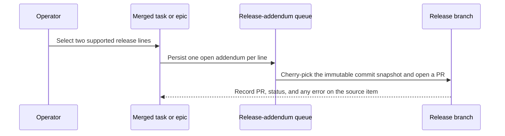

# Release Addendums

Release addendums deliver an already-merged task or epic from the default
branch (usually `main`) to one or more maintained release branches. They keep
release delivery attached to the original work item; they do not create child
backport tasks, GitHub issues, or new product work.

## Configure supported release lines

In the dashboard, open the project definition and set **Supported Release
Lines** to an ordered, comma-separated list of exact branch names, for example
`release/1.1, release/1.0`. A line must match the project's tracked-branch
patterns and cannot be the default branch. The ordering controls the order
shown to operators.

You can also use the project API:

```http
PATCH /api/v1/projects/proj-123
Content-Type: application/json

{"supported_release_branches": ["release/1.1", "release/1.0"]}
```

Adding a line makes it eligible immediately once it exists on the remote.
Removing a line prevents new approvals but never deletes existing addendums or
hides their history. The release catalog reports only configured remote
branches as selectable; a historical branch that was deleted remains visible
as unavailable.

## Queue a merged task for two release branches

1. Confirm the task or epic is `Merged` on the default branch. Do ordinary
   development and review there first.
2. Open the task detail and choose **Add release branches**.
3. Select `release/1.1` and `release/1.0`, then choose **Queue release
   merges**. The selection dialog shows only available supported lines.
4. The task immediately receives one `open` addendum per selected branch. The
   worker is woken immediately; no second approval and no child task are
   required.

The API equivalent is:

```http
POST /api/v1/issues/FOO-10/release-addendums
Content-Type: application/json

{
  "project_id": "proj-123",
  "target_branches": ["release/1.1", "release/1.0"],
  "idempotency_key": "a-client-generated-uuid"
}
```

Approval is all-or-nothing: all targets must be currently available supported
lines, and Oompah must be able to resolve the merged source commits. Repeating
the request is safe and returns existing active rows instead of duplicating
queue work. If the wake-up event is temporarily unavailable after persistence,
the addendum remains `open` and the periodic queue scan recovers it.



## Read progress and recover failures

Each source task or epic shows a row for each target branch. A row includes the
branch, addendum status, queue/lease state, PR link, and any blocked error.
The source item's `Merged` status does not change while its addendums progress.

| Addendum status | Meaning | Operator action |
|---|---|---|
| `open` | Approved and ready for a worker. | Wait for the queue, or inspect service health. |
| `in_progress` | A worker holds a lease and is preparing the release PR. | Wait; an expired lease returns to `open`. |
| `in_review` | A release-branch PR exists. | Review and merge the PR, or retry after a closed-unmerged PR. |
| `blocked` | Cherry-pick or execution failed. | Resolve the cause, then retry. |
| `merged` | The release PR merged. | No action. |
| `archived` | The addendum was cancelled. | No action; make a deliberate new approval if needed. |

Retry a blocked or closed-unmerged review row without changing its immutable
commit snapshot:

```http
POST /api/v1/issues/FOO-10/release-addendums/FOO-10%2Frelease%2F1.0/retry
Content-Type: application/json

{"project_id": "proj-123"}
```

Archive an `open` or `blocked` row with the matching `/archive` endpoint.
Both operations return `409` for an invalid lifecycle transition.

## Inspect a release line

Use the dashboard's **Release branches** view to select a configured line. It
groups every attached addendum as Open, In progress, In review, Blocked,
Merged, or Archived and links each row back to its original task or epic.

For automation, first retrieve the current catalog:

```text
GET /api/v1/projects/proj-123/release-branches
```

Then inspect a line (percent-encode slashes when your client requires it):

```text
GET /api/v1/projects/proj-123/release-branches/release%2F1.0/addendums
```

The inspection response includes an informational `untracked_commits` warning
when commits on the release branch cannot be attributed to an addendum. Treat
it as a prompt to investigate direct branch changes, not as proof that a raw
commit is a feature or as a request to create a task.

## Epic snapshots

An epic addendum is one row per target release line, not one row per child. At
approval time Oompah snapshots the ordered, deduplicated commits of descendants
already merged to the default branch and returns the included child IDs and
SHAs. Later child merges are not silently added; approve a new epic addendum
or an individual task addendum when appropriate.

## Migration from release picks (historical)

Earlier versions used `oompah.backports`, `oompah.backport_of`, and child
backport tasks. This is historical compatibility behavior only; do not create
or work new child backport tasks.

During migration, existing records become source-owned release addendums:

| Legacy state | Addendum state |
|---|---|
| `waiting`, `task_created`, `cherry_picking` | `open` |
| `pr_open` | `in_review` |
| `conflict`, `needs_human` | `blocked` |
| `merged`, `archived`, `skipped` | `merged`, `archived`, `archived` respectively |

Oompah preserves useful commit, PR, and timestamp evidence when it can and
archives historical child tasks with a redirect comment to the source item.
The migration is safe to rerun. Readers and migration are deployed before the
old reconciler is retired; old release-pick routes provide a temporary `410`
response naming the replacement endpoint before removal.
