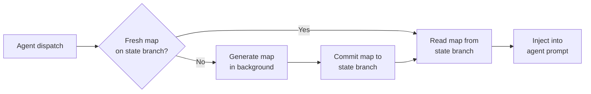

# Repository Map

The repository-map feature generates a compact structural index of each
managed project and injects it into agent prompts so agents arrive with
codebase context rather than discovering it by grepping at the start of every
run. Maps are stored on the project's Git-backed state branch
(`oompah/state/<project-id>`) — no daemon, database, or externally hosted
service is required.

## How It Works



The orchestrator calls `RepoMapGenerator.get_or_generate()` before each agent
dispatch. If a map for the current commit SHA already exists on the state branch
it is reused immediately. Otherwise a background thread runs Tree-sitter
extraction, symbol ranking, and rendering within the configured timeout. The
result is committed to the state branch and returned to the caller.

Concurrent requests for the same SHA coalesce: a second call blocks on the
same background future instead of starting a parallel indexing run.

## Prerequisites

1. **State branch enabled.** Maps are written to the project's state branch
   (`oompah/state/<project-id>`). New projects bootstrapped with oompah 1.2.0+
   receive a state branch automatically. For existing projects, run:

   ```bash
   oompah project-bootstrap apply /path/to/repo
   ```

   Verify the state branch exists:

   ```bash
   git -C /path/to/repo branch --list 'oompah/state/*'
   ```

2. **Feature enabled via environment variable.** The feature is off by default.

## Activation

Add the following to your `.env` file:

```ini
OOMPAH_REPO_MAP_ENABLED=true
```

Restart oompah to apply:

```bash
make restart
```

Confirm it is active by checking the logs at startup:

```
INFO  oompah.repo_map_generator - repository-map generation enabled
```

## Configuration Reference

All settings are environment-variable-only and must be placed in `.env`.
Do **not** add these to `WORKFLOW.md`.

| Variable | Default | Description |
|---|---|---|
| `OOMPAH_REPO_MAP_ENABLED` | `false` | Master enable switch. Set `true` to activate. |
| `OOMPAH_REPO_MAP_TOKEN_BUDGET` | `2000` | Maximum tokens in the rendered map injected into each prompt. |
| `OOMPAH_REPO_MAP_LANGUAGES` | all supported | Comma-separated list of languages to index. Supported: `javascript`, `markdown`, `python`, `rust`, `typescript`, `yaml`. |
| `OOMPAH_REPO_MAP_MAX_FILE_SIZE` | `1000000` | Maximum file size in bytes. Files larger than this are skipped. |
| `OOMPAH_REPO_MAP_GENERATION_TIMEOUT` | `120` | Seconds before a generation run is cancelled and a timeout result returned. |
| `OOMPAH_REPO_MAP_RETAINED_ARTIFACTS` | `5` | Maximum map artifacts kept per project on the state branch. Older artifacts are pruned automatically. |

All numeric settings must be positive integers (≥ 1). Invalid values (zero,
negative, non-numeric) are logged as warnings and fall back to the defaults.

If `OOMPAH_REPO_MAP_LANGUAGES` contains any unsupported language the entire
value is rejected and the full default set is used.

## Freshness

A map is considered fresh when its `commit_sha` matches the HEAD SHA of the
project's default branch at dispatch time. Stale maps (older SHA) trigger a
background regeneration. The previous map is still injected if available, so
agents are never blocked waiting for a fresh map.

Map freshness can be checked by inspecting the state branch directly:

```bash
git -C /path/to/repo show 'oompah/state/<project-id>:.oompah/repo-maps/<slug>/'
```

## Diagnostics

### Check whether a map exists

```bash
git -C /path/to/repo ls-tree -r 'oompah/state/<project-id>' | grep repo-maps
```

### Inspect a map file

```bash
git -C /path/to/repo show 'oompah/state/<project-id>:.oompah/repo-maps/<slug>/<sha>.json' | python3 -m json.tool | head -60
```

### Log verbosity

Enable DEBUG logging to see generation timing and skip reasons:

```bash
OOMPAH_LOG_LEVEL=DEBUG make start
```

Look for log lines from `oompah.repo_map_generator`.

### Generation timeout

If agents consistently receive stale maps the timeout may be too short for a
large repository. Increase it:

```ini
OOMPAH_REPO_MAP_GENERATION_TIMEOUT=300
```

### Token budget too large

If the injected map overwhelms the agent's context window, reduce the budget:

```ini
OOMPAH_REPO_MAP_TOKEN_BUDGET=1000
```

### Unsupported language warning

If you see a warning like:

```
OOMPAH_REPO_MAP_LANGUAGES contains unsupported language(s): ['fortran']
```

Remove the unsupported entry from `OOMPAH_REPO_MAP_LANGUAGES`. Supported
languages are: `javascript`, `markdown`, `python`, `rust`, `typescript`, `yaml`.

## Privacy and Trust Boundaries

**All content extracted from the repository is treated as untrusted.** Symbol
names, file paths, and docstrings are passed to the Tree-sitter parser as opaque
byte sequences and are written verbatim into the JSON artifact on the state
branch. They are never sent to an external service during generation.

The rendered map **is** injected into agent prompts and therefore reaches
whatever AI provider is configured. Operators who have repositories with
sensitive identifiers in symbol names or file paths should review what the
rendered map contains before enabling the feature in production:

```bash
# Preview a rendered map without dispatching an agent:
python3 -c "
import json, sys
from pathlib import Path
from oompah.repo_map import read_repo_map
from oompah.repo_map_ranker import render_repo_map

# Replace these with real values:
state_dir = Path('/path/to/repo')
repo_identity = 'https://github.com/org/repo'
commit_sha = 'HEAD_SHA_HERE'

rm = read_repo_map(state_dir, repo_identity, commit_sha, require_fresh=False)
if rm:
    print(render_repo_map(rm, max_tokens=2000, task_mentions=[], seed_files=[]))
else:
    print('No map found for this commit SHA.')
"
```

The state branch (`oompah/state/<project-id>`) should be treated as internal
infrastructure. Apply appropriate branch protection rules to prevent accidental
deletion or force-pushes.

## Disabling the Feature

Set the master switch to `false` in `.env` and restart:

```ini
OOMPAH_REPO_MAP_ENABLED=false
```

No cleanup is required — existing map artifacts on the state branch remain but
are never read unless the feature is re-enabled.

## Rebuilding a Map

To force a fresh map for a project (e.g., after a large refactor or when
diagnosing a stale map issue):

1. Delete the existing map files from the state branch:

   ```bash
   git -C /path/to/repo fetch origin
   git -C /path/to/repo checkout oompah/state/<project-id>
   git -C /path/to/repo rm -r .oompah/repo-maps/<slug>/
   git -C /path/to/repo commit -m "chore: clear stale repo-map artifacts for rebuild"
   git -C /path/to/repo push origin oompah/state/<project-id>
   git -C /path/to/repo checkout main
   ```

2. The next agent dispatch will trigger a fresh generation automatically.

Alternatively, reduce `OOMPAH_REPO_MAP_RETAINED_ARTIFACTS` to `1` and wait
for the next generation cycle to naturally prune old artifacts.
