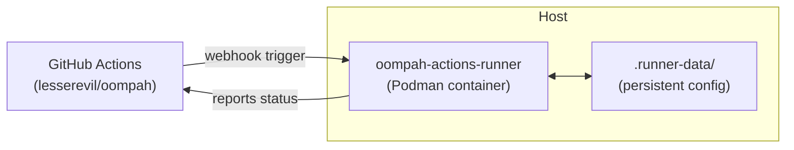

# Self-Hosted GitHub Actions Runner

Oompah CI runs on a containerized self-hosted GitHub Actions runner registered
to `lesserevil/oompah`. This eliminates dependency on GitHub-hosted runner
capacity (which is shared and occasionally unavailable).

## Architecture



The runner uses the official `ghcr.io/actions/actions-runner` image (pinned to
a specific version) managed via Podman. Runner configuration is persisted in
`.runner-data/` on the host and mounted into the container.

## Labels

The runner is registered with these labels:

| Label | Purpose |
|-------|---------|
| `self-hosted` | Required by GitHub to route to any self-hosted runner |
| `linux` | Declares the OS family |
| `x64` | Declares the CPU architecture |
| `oompah` | Project-specific label used by CI workflows |

**Important:** GitHub Actions does **not** support an OR expression between
GitHub-hosted and self-hosted runner labels. A workflow that specifies
`runs-on: [self-hosted, oompah]` will **only** run on self-hosted runners
with all four labels — GitHub-hosted runners (`ubuntu-latest`) are completely
bypassed. This host is therefore the sole required CI capacity; keep the runner
running.

## Required PAT Permission

`GITHUB_TOKEN` (set in `.env`) must include:

- **Self-hosted runners: Read and write** — required to fetch registration
  tokens via the GitHub REST API (`POST /repos/{owner}/{repo}/actions/runners/registration-token`)
- **Webhooks: Read and write** — already needed for webhook forwarding
- **Contents: Read and write** — already needed for PR/commit operations

## Setup

### 1. Set the GitHub token

Ensure `.env` contains a valid token:

```bash
GITHUB_TOKEN=ghp_your_token_here
```

### 2. Register the runner

```bash
make runner-setup
```

This fetches a short-lived registration token from the GitHub API, runs a
one-shot configure step inside the container, and saves the configuration to
`.runner-data/`. The registration token is deleted immediately after use.

### 3. Start the runner

```bash
make runner-start
```

The runner container starts in detached mode with `--restart unless-stopped`,
so it restarts automatically if the host reboots (when the Podman daemon starts
with it).

### 4. Verify

```bash
make runner-status
```

This prints:
- Container name, image, and status
- GitHub API view of registered runners and their online/offline state

You can also verify via the GitHub web UI:  
`https://github.com/lesserevil/oompah/settings/actions/runners`

## Lifecycle Commands

| Command | Description |
|---------|-------------|
| `make runner-setup` | Register runner with GitHub (one-time, re-run to re-register) |
| `make runner-start` | Start the runner container |
| `make runner-stop` | Stop the runner container |
| `make runner-status` | Show container state + GitHub registration state |

The underlying script is `scripts/runner.sh`. All `OOMPAH_RUNNER_*` variables
can be overridden in `.env` or as shell environment variables.

## Configuration Reference

| Variable | Default | Description |
|----------|---------|-------------|
| `OOMPAH_RUNNER_REPO` | `lesserevil/oompah` | Repository to register against |
| `OOMPAH_RUNNER_NAME` | `oompah-runner` | Runner name in GitHub UI |
| `OOMPAH_RUNNER_LABELS` | `self-hosted,linux,x64,oompah` | Comma-separated runner labels |
| `OOMPAH_RUNNER_IMAGE` | `ghcr.io/actions/actions-runner:2.323.0` | Pinned container image |
| `OOMPAH_RUNNER_WORKDIR` | `.runner-data` | Host path for persistent runner data |
| `OOMPAH_RUNNER_CONTAINER` | `oompah-actions-runner` | Container name |
| `CONTAINER_CMD` | auto-detect | Override to `podman` or `docker` |

## Upgrading the Runner

To upgrade to a new runner version:

1. Update `OOMPAH_RUNNER_IMAGE` in `.env` to the new pinned version tag.
2. Stop the runner: `make runner-stop`
3. Re-register: `make runner-setup` (re-registers with the new image)
4. Start: `make runner-start`

Find available runner versions at:
`https://github.com/actions/runner/releases`

Runner image tags at:
`https://github.com/actions/actions-runner/pkgs/container/actions%2Factions-runner`

## Troubleshooting

### Runner shows as offline in GitHub

```bash
make runner-stop
make runner-setup   # fetches a fresh registration token
make runner-start
```

### Container fails to start

Check if `.runner-data/` was created by `runner-setup`:

```bash
ls .runner-data/
```

If empty or missing, run `make runner-setup` first.

### Permission denied on `.runner-data/`

The configure step runs as the container's default user. If the mounted
directory has wrong ownership, fix it:

```bash
chown -R $(id -u):$(id -g) .runner-data/
```

### Viewing runner logs

```bash
podman logs oompah-actions-runner
# or, if using Docker:
docker logs oompah-actions-runner
```

### Podman socket / rootless mode

The runner runs as a rootless Podman container. If CI jobs inside the runner
need to run containers themselves (Docker-in-Docker), mount the Podman socket:

```bash
# Example: add to cmd_start() in scripts/runner.sh
-v /run/user/$(id -u)/podman/podman.sock:/var/run/docker.sock:z
```

This is not enabled by default — most Oompah CI jobs do not need it.
