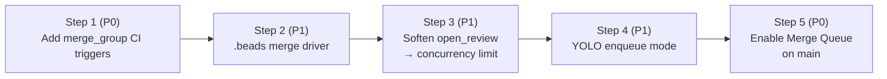

# Submit Queue: Replacing the Strict `open_review` Gate

**Status:** design / in-flight rollout
**Epic:** `oompah-zlz_2-btf`
**Owner:** DevOps

## 1. Problem

`Orchestrator._project_has_open_review` (oompah/orchestrator.py:881) gates
per-project dispatch. Today it refuses any non-P0 dispatch while a project
has at least one non-draft PR open:

```python
def _project_has_open_review(self, project_id: str | None) -> bool:
    ...
    return any(not r.draft for r in project_reviews)
```

That predicate is consulted at dispatch time:

```python
if not is_p0 and self._project_has_open_review(issue.project_id):
    return _reject("open_review")
```

The intent was trunk safety: only one PR may be merging at a time so that
the merge of PR *N* always sees a green CI from PR *N-1*. In practice the
constant is now binding throughput:

| Project | CI wall time | Effective per-project throughput |
| --- | --- | --- |
| trickle | ~60 min (Linux × Windows × macOS matrix + e2e) | ≤ 1 PR / hour |
| oompah  | ~3 min  | ≤ 20 PR / hour |

A representative session this week sat idle for 30+ minute stretches with
**41 ready beads and 5 free agent slots** simply waiting on the trickle
PR queue to drain. The bottleneck is not capacity — it is artificial
serialization.

## 2. Why the gate exists, and why we can drop it

The gate was the cheapest available approximation of *trunk safety*:
**main is never broken**. With a single in-flight PR at a time, the PR
that is about to merge has been tested against *exactly* the SHA on
which it will land.

GitHub Merge Queue (GA September 2023) replaces that property with a
stronger one. Once a PR is *enqueued*:

1. The platform constructs a `merge_group` — a sequence of
   speculatively-stacked branches (`gh-readonly-queue/main/pr-N-…`)
   for every PR currently in the queue.
2. CI runs on the *merge_group* ref, i.e. on the candidate post-merge
   tree, not on the branch HEAD.
3. PRs merge only when their merge_group ref is green; if a PR ahead
   in the queue fails, the queue rebuilds without it and re-tests.

This makes parallel in-flight PRs **provably safe** with respect to
main's tip — strictly better than the single-PR convention we have
today.

## 3. Goals and non-goals

**Goals**

- Allow N concurrent in-flight PRs per project (configurable, defaults
  proportional to CI wall time).
- Eliminate the "1 PR / hour" trickle ceiling by amortizing CI across
  parallel PRs.
- Keep main green at the same SLO as today.
- Make the change rollback-able at every step; no irreversible config
  changes until the prior steps are validated in production.

**Non-goals**

- We are *not* changing the YOLO project model itself, only how YOLO
  performs the final merge action.
- We are *not* sequencing or ordering PRs by bead priority — the merge
  queue's FIFO is good enough for the throughput we need.
- We are *not* introducing per-bead "stacked PR" workflows; each agent
  still produces one PR.

## 4. Rollout plan

The cutover is split into five steps so each stage can be validated and
reverted independently. Steps 1 and 5 are P0; the middle three are P1
quality-of-life work that materially reduces the failure rate of
parallel PRs but is not strictly required for the gate change.



Children of this epic:

| Child issue | Title |
| --- | --- |
| `oompah-zlz_2-7fp` | Step 1: add `merge_group` CI triggers to oompah and trickle |
| `oompah-zlz_2-win` | Step 2: reduce `.beads/issues.jsonl` merge contention via custom git merge driver |
| `oompah-zlz_2-pt4` | Step 3: soften `_project_has_open_review` to a configurable concurrency limit |
| `oompah-zlz_2-d7o` | Step 4: update YOLO auto-merge to support enqueue mode for merge-queue-enabled projects |
| `oompah-zlz_2-0c3` | Step 5: enable GitHub Merge Queue on `main` branches in oompah and trickle |

### Step 1 — `merge_group` CI triggers (P0, prerequisite)

Every workflow whose status is required for merge must declare a
`merge_group` trigger, otherwise enqueued PRs hang forever waiting for
a check that will never run.

```yaml
on:
  push:
    branches: [main]
  pull_request:
    branches: [main]
  merge_group:           # NEW: fires for every queued candidate
    branches: [main]
```

Validation: open a draft PR, queue it via `gh pr merge --auto --squash`
(works without merge-queue enabled — exercises the trigger surface),
and confirm CI ran on a `gh-readonly-queue/...` ref. Rollback is a
single-line revert of the workflow file.

### Step 2 — `.beads/issues.jsonl` merge contention (P1)

`bd` writes a deterministic JSONL file but every agent appends to it.
With parallel PRs, two PRs almost always touch the same file and a
naïve `git merge` produces conflicts on every queue entry.

Two complementary fixes:

1. **Custom git merge driver.** `.beads/issues.jsonl` is a stream of
   self-describing JSON records keyed by `id`; a 30-line Python merge
   driver can union the two sides, dedupe by `id`, prefer the record
   with the newer `updated` timestamp, and re-sort. Configured via
   `.gitattributes`:
   ```
   .beads/issues.jsonl merge=beads-jsonl
   .beads/interactions.jsonl merge=beads-jsonl
   ```
   plus a one-time `git config merge.beads-jsonl.driver` install that
   the orchestrator runs at sync time (so contributors and CI runners
   get it automatically).

2. **Don't commit backups.** `.beads/backup/` is gitignored but
   already-tracked files leak in via `git add -f` from earlier agents.
   Step 2 also untracks them so they stop showing up in rebases. (See
   memory `beads-backup-rebase-gotcha`.)

Validation: synthesize two branches that each add a different bead,
merge them, expect zero conflict markers.

### Step 3 — Soften `_project_has_open_review` (P1)

Replace the binary "any open PR ⇒ reject" with a per-project
configurable ceiling.

```python
def _project_inflight_limit(self, project_id: str | None) -> int:
    project = self.project_store.get(project_id)
    return (project and project.max_inflight_reviews) \
           or self.config.default_max_inflight_reviews \
           or 1   # backwards-compatible default
```

```python
def _project_has_open_review(self, project_id: str | None) -> bool:
    inflight = sum(1 for r in self._reviews_cache.get(project_id, []) if not r.draft)
    return inflight >= self._project_inflight_limit(project_id)
```

Configuration surface:

- New `.env` knob: `OOMPAH_DEFAULT_MAX_INFLIGHT_REVIEWS=1` (default
  preserves current behaviour).
- Per-project override exposed via the dashboard / project model
  (`Project.max_inflight_reviews: int | None`).

Recommended values once the rest of the rollout is in place:

| Project | Recommended `max_inflight_reviews` | Rationale |
| --- | --- | --- |
| oompah | 3 | CI is fast; pure throughput win. |
| trickle | 4–6 | 60-min CI; queue absorbs the variance. |

The function name `_project_has_open_review` is preserved for caller
compatibility — only its semantics change ("is the project at the
inflight ceiling").

Validation: unit-test the predicate with synthetic review caches at
0/1/2/3 PRs against limits 1 and 3.

### Step 4 — YOLO auto-merge → enqueue (P1)

YOLO projects today call `provider.merge_review` which posts
`PUT /repos/{repo}/pulls/{N}/merge` with `merge_method=squash`. On a
merge-queue-enabled repo that endpoint will fail with `405 Method Not
Allowed` — the only legal way to land a PR is to enqueue it.

Two changes:

1. Extend `SCMProvider` with `enqueue_review(repo, review_id) ->
   tuple[bool, str]`. For GitHub this is `gh pr merge --auto --squash`
   (or the GraphQL `enqueuePullRequest` mutation when we have a token
   with `repo` scope). For GitLab it remains the existing merge call —
   GitLab merge trains are a separate feature we are not adopting.

2. The orchestrator chooses between merge and enqueue based on a
   per-project flag `Project.merge_queue_enabled: bool` (default
   `False`). When `True`, `_yolo_review_actions_sync` calls
   `enqueue_review` instead of `merge_review`.

The fallback path (PR fails out of the queue) is already handled by
the existing `_watchdog_yolo_limbo` — a kicked-out PR shows up as
"open, mergeable=false", which is exactly the conflict state the
watchdog notifies on today.

Validation: unit-test the orchestrator's branch with a fake provider;
end-to-end test against a scratch repo with merge queue enabled.

### Step 5 — Enable Merge Queue on `main` (P0)

Final, production-visible step. For each repo:

1. Settings → Branches → Branch protection rule for `main` →
   "Require merge queue".
2. Set "Maximum pull requests to build" = `5`,
   "Minimum pull requests to merge" = `1`,
   "Wait time to meet minimum" = `5 min`,
   "Maximum pull requests to merge" = `5`.
3. Set the merge method to `squash` to match today's behaviour.
4. Verify required status checks include the `merge_group`-triggered
   jobs from Step 1.

Rollback: untick "Require merge queue" — branch protection still works
without it. Any PRs in flight at toggle time complete normally because
the rule applies on the next merge attempt.

## 5. Risk and rollback summary

| Step | Failure mode | Detection | Rollback |
| --- | --- | --- | --- |
| 1 | Workflow doesn't run on merge_group ref | First queued PR hangs in "Pending" | Revert workflow change (single commit) |
| 2 | Merge driver mis-merges JSONL | `bd validate` flags duplicate ids in CI | Remove `.gitattributes` line; resolve manually |
| 3 | Concurrency raised too high; conflict storm | Spike in YOLO conflict notifications | Lower `OOMPAH_DEFAULT_MAX_INFLIGHT_REVIEWS` to `1` (live; no deploy) |
| 4 | Enqueue path broken on a provider | YOLO PRs sit open without merging | Flip per-project `merge_queue_enabled=False`; reverts to direct merge |
| 5 | Merge queue itself broken (GH outage) | All PRs stall in queue | Disable "Require merge queue" in branch protection |

Each step is independently reversible and can ship behind its own
review without cascading rollback.

## 6. Success criteria

- **Throughput:** trickle sustains ≥ 3 merged PRs / hour over a 4-hour
  window with the agent pool fully loaded (vs. ≤ 1 today).
- **Trunk safety:** zero `main`-broken incidents in the 30 days
  following Step 5 (matches the current baseline).
- **Idle slots:** orchestrator reports `_available_slots() > 0` *and*
  `open_review` rejections simultaneously for ≤ 5 % of dispatch ticks
  (today: ≥ 40 %).

## 7. References

- GitHub Merge Queue documentation:
  <https://docs.github.com/en/repositories/configuring-branches-and-merges-in-your-repository/configuring-pull-request-merges/managing-a-merge-queue>
- `merge_group` event:
  <https://docs.github.com/en/actions/using-workflows/events-that-trigger-workflows#merge_group>
- Existing gate: `oompah/orchestrator.py:881` (`_project_has_open_review`)
- Existing YOLO merge: `oompah/scm.py:400` (`GitHubProvider.merge_review`)
