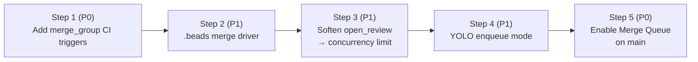

# Submit Queue: Replacing the Strict `open_review` Gate

**Status:** rollout complete (oompah: branch protection only; trickle: full merge queue)
**Epic:** `oompah-zlz_2-btf`
**Owner:** DevOps

## 1. Problem

`Orchestrator._project_has_open_review` (oompah/orchestrator.py:881) gates
per-project dispatch. Today it refuses any non-P0 dispatch while a project
has at least one non-draft PR open:

```python
def _project_has_open_review(self, project_id: str | None) -> bool:
    ...
    return any(not r.draft for r in project_reviews)
```

That predicate is consulted at dispatch time:

```python
if not is_p0 and self._project_has_open_review(issue.project_id):
    return _reject("open_review")
```

The intent was trunk safety: only one PR may be merging at a time so that
the merge of PR *N* always sees a green CI from PR *N-1*. In practice the
constant is now binding throughput:

| Project | CI wall time | Effective per-project throughput |
| --- | --- | --- |
| trickle | ~60 min (Linux × Windows × macOS matrix + e2e) | ≤ 1 PR / hour |
| oompah  | ~3 min  | ≤ 20 PR / hour |

A representative session this week sat idle for 30+ minute stretches with
**41 ready beads and 5 free agent slots** simply waiting on the trickle
PR queue to drain. The bottleneck is not capacity — it is artificial
serialization.

## 2. Why the gate exists, and why we can drop it

The gate was the cheapest available approximation of *trunk safety*:
**main is never broken**. With a single in-flight PR at a time, the PR
that is about to merge has been tested against *exactly* the SHA on
which it will land.

GitHub Merge Queue (GA September 2023) replaces that property with a
stronger one. Once a PR is *enqueued*:

1. The platform constructs a `merge_group` — a sequence of
   speculatively-stacked branches (`gh-readonly-queue/main/pr-N-…`)
   for every PR currently in the queue.
2. CI runs on the *merge_group* ref, i.e. on the candidate post-merge
   tree, not on the branch HEAD.
3. PRs merge only when their merge_group ref is green; if a PR ahead
   in the queue fails, the queue rebuilds without it and re-tests.

This makes parallel in-flight PRs **provably safe** with respect to
main's tip — strictly better than the single-PR convention we have
today.

## 3. Goals and non-goals

**Goals**

- Allow N concurrent in-flight PRs per project (configurable, defaults
  proportional to CI wall time).
- Eliminate the "1 PR / hour" trickle ceiling by amortizing CI across
  parallel PRs.
- Keep main green at the same SLO as today.
- Make the change rollback-able at every step; no irreversible config
  changes until the prior steps are validated in production.

**Non-goals**

- We are *not* changing the YOLO project model itself, only how YOLO
  performs the final merge action.
- We are *not* sequencing or ordering PRs by bead priority — the merge
  queue's FIFO is good enough for the throughput we need.
- We are *not* introducing per-bead "stacked PR" workflows; each agent
  still produces one PR.

## 4. Rollout plan

The cutover is split into five steps so each stage can be validated and
reverted independently. Steps 1 and 5 are P0; the middle three are P1
quality-of-life work that materially reduces the failure rate of
parallel PRs but is not strictly required for the gate change.



Children of this epic:

| Child issue | Title |
| --- | --- |
| `oompah-zlz_2-7fp` | Step 1: add `merge_group` CI triggers to oompah and trickle | ✅ Done |
| `oompah-zlz_2-win` | Step 2: reduce `.beads/issues.jsonl` merge contention via custom git merge driver | ✅ Done |
| `oompah-zlz_2-pt4` | Step 3: soften `_project_has_open_review` to a configurable concurrency limit | ✅ Done |
| `oompah-zlz_2-d7o` | Step 4: update YOLO auto-merge to support enqueue mode for merge-queue-enabled projects | ✅ Done |
| `oompah-zlz_2-0c3` | Step 5: enable GitHub Merge Queue on `main` branches in oompah and trickle | ✅ Done (asymmetric — see below) |

### Step 1 — `merge_group` CI triggers (P0, prerequisite)

Every workflow whose status is required for merge must declare a
`merge_group` trigger, otherwise enqueued PRs hang forever waiting for
a check that will never run.

```yaml
on:
  push:
    branches: [main]
  pull_request:
    branches: [main]
  merge_group:           # NEW: fires for every queued candidate
    branches: [main]
```

Validation: open a draft PR, queue it via `gh pr merge --auto --squash`
(works without merge-queue enabled — exercises the trigger surface),
and confirm CI ran on a `gh-readonly-queue/...` ref. Rollback is a
single-line revert of the workflow file.

### Step 2 — `.beads/issues.jsonl` merge contention (P1)

`bd` writes a deterministic JSONL file but every agent appends to it.
With parallel PRs, two PRs almost always touch the same file and a
naïve `git merge` produces conflicts on every queue entry.

Two complementary fixes:

1. **Custom git merge driver.** `.beads/issues.jsonl` is a stream of
   self-describing JSON records keyed by `id`; a 30-line Python merge
   driver can union the two sides, dedupe by `id`, prefer the record
   with the newer `updated` timestamp, and re-sort. Configured via
   `.gitattributes`:
   ```
   .beads/issues.jsonl merge=beads-jsonl
   .beads/interactions.jsonl merge=beads-jsonl
   ```
   plus a one-time `git config merge.beads-jsonl.driver` install that
   the orchestrator runs at sync time (so contributors and CI runners
   get it automatically).

2. **Don't commit backups.** `.beads/backup/` is gitignored but
   already-tracked files leak in via `git add -f` from earlier agents.
   Step 2 also untracks them so they stop showing up in rebases. (See
   memory `beads-backup-rebase-gotcha`.)

Validation: synthesize two branches that each add a different bead,
merge them, expect zero conflict markers.

### Step 3 — Soften `_project_has_open_review` (P1) ✅ Done

Replace the binary "any open PR ⇒ reject" with a per-project
configurable ceiling.

**Implementation** (shipped in `oompah-zlz_2-pt4`):

```python
def _count_open_reviews(self, project_id: str | None) -> int:
    """Return number of non-draft open MRs/PRs for a project."""
    if not project_id:
        return 0
    reviews_cache = getattr(self, "_reviews_cache", {})
    return sum(1 for r in reviews_cache.get(project_id, []) if not r.draft)

def _project_max_in_flight(self, project_id: str | None) -> int:
    """Return the configured in-flight PR limit (default 1)."""
    project = self.project_store.get(project_id)
    if project is None:
        return 1
    return max(1, project.max_in_flight_prs)
```

Dispatch check (in `_should_dispatch`):

```python
n_open = self._count_open_reviews(issue.project_id)
limit = self._project_max_in_flight(issue.project_id)
if not is_p0 and n_open >= limit:
    return _reject(f"open_reviews_at_cap={n_open}/{limit}")
```

The old `_project_has_open_review` is retained as a thin compat
wrapper: `return self._count_open_reviews(pid) >= self._project_max_in_flight(pid)`.

Configuration surface:

- Per-project field `Project.max_in_flight_prs: int = 1` (default
  preserves current single-in-flight behavior).
- Editable via the Projects management UI (`/projects-manage`) and
  the `PATCH /api/v1/projects/{project_id}` endpoint.
- The `/api/v1/state` response includes `max_in_flight_prs` per project
  (in the `projects` array) and a `open_reviews_by_project` map with
  current counts, so the dashboard can surface capacity vs. usage.

Recommended values once the rest of the rollout is in place:

| Project | Recommended `max_in_flight_prs` | Rationale |
| --- | --- | --- |
| oompah | 3 | CI is fast; pure throughput win. |
| trickle | 4–6 | 60-min CI; queue absorbs the variance. |

**Important:** Only raise `max_in_flight_prs` above 1 *after* Step 5
(Merge Queue enabled). With a plain branch protection rule, concurrent
PRs will race at merge time and the second one will fail CI or produce a
conflict. The UI shows a warning to reinforce this.

Validation: unit-tests cover default=1, cap=3 at 0/1/2/3 open reviews,
P0 bypass, and per-project independence.

### Step 4 — YOLO auto-merge → enqueue (P1)

YOLO projects today call `provider.merge_review` which posts
`PUT /repos/{repo}/pulls/{N}/merge` with `merge_method=squash`. On a
merge-queue-enabled repo that endpoint will fail with `405 Method Not
Allowed` — the only legal way to land a PR is to enqueue it.

Two changes:

1. Extend `SCMProvider` with `enqueue_review(repo, review_id) ->
   tuple[bool, str]`. For GitHub this is `gh pr merge --auto --squash`
   (or the GraphQL `enqueuePullRequest` mutation when we have a token
   with `repo` scope). For GitLab it remains the existing merge call —
   GitLab merge trains are a separate feature we are not adopting.

2. The orchestrator chooses between merge and enqueue based on a
   per-project flag `Project.merge_queue_enabled: bool` (default
   `False`). When `True`, `_yolo_review_actions_sync` calls
   `enqueue_review` instead of `merge_review`.

The fallback path (PR fails out of the queue) is already handled by
the existing `_watchdog_yolo_limbo` — a kicked-out PR shows up as
"open, mergeable=false", which is exactly the conflict state the
watchdog notifies on today.

Validation: unit-test the orchestrator's branch with a fake provider;
end-to-end test against a scratch repo with merge queue enabled.

### Step 5 — Enable Merge Queue on `main` (P0) ✅ Done (asymmetric)

Final, production-visible step. Bead: `oompah-zlz_2-0c3`. The
operational details live in `docs/merge-queue-runbook.md`; this
section captures the design decisions and what actually shipped.

#### Platform constraint discovered during rollout

**GitHub Merge Queue is only available on organization-owned
repositories.** User-owned repos — even public ones on the free
tier — return `422 Validation Failed: Invalid rule 'merge_queue':`
when you POST a ruleset with a `merge_queue` rule. (The error
message has an empty body after the colon — it's not a payload
issue, it's a feature-gate.)

Per <https://docs.github.com/.../managing-a-merge-queue> :
"This feature is available for organization-owned public
repositories on GitHub Free, GitHub Team, and GitHub Enterprise
Cloud. Private repositories require GitHub Team or higher."

The two repos in scope diverge:

| Repo | Owner | Tier | Merge queue |
| --- | --- | --- | --- |
| `lesserevil/oompah` | user | free | ❌ unsupported |
| `NVIDIA-Omniverse/trickle` | org | enterprise | ✅ supported |

So the cutover is **asymmetric** by necessity:
- **trickle** uses the **Rulesets API**
  (`POST /repos/{owner}/{repo}/rulesets`) with a `merge_queue` rule
  plus a `required_status_checks` rule, in active enforcement.
- **oompah** falls back to the **legacy branch-protection API**
  (`PUT /repos/{owner}/{repo}/branches/{branch}/protection`) which
  exposes `required_status_checks` but not the `merge_queue` rule
  type. Direct YOLO `merge_review` continues to be the merge path,
  gated by branch protection on the merge attempt.

This is operationally fine because trickle has the 60-min CI
bottleneck the queue is designed to solve (≤ 1 PR / hour ceiling
without it). Oompah's CI is ~3 min and direct serial merges are
already fast enough that queue parallelism is not the binding
constraint.

The script `scripts/merge-queue-cutover.sh` dispatches between the
two backends per repo via `repo_api_kind`, and is idempotent on
both: re-running `apply` does a ruleset UPDATE for trickle (matching
on the canonical name `submit-queue-main`) and a re-PUT of branch
protection for oompah. To enable merge queue on oompah in the
future, transfer the repo to an organization and the script's
mapping flips to `ruleset` (the trickle-shaped payload would apply,
re-tuned to oompah's CI).

#### Per-repo settings

CI wall time drives the values. Faster CI tolerates batching; slower CI
must avoid it (a single flake ejects every PR sharing the batch, and
the cost of re-running 60 min of trickle CI is high).

| Setting | oompah (branch protection) | trickle (ruleset) |
| --- | --- | --- |
| Backend API | `PUT /branches/main/protection` | `POST /rulesets` |
| `merge_method` | n/a — direct YOLO merge | `SQUASH` |
| `max_entries_to_build` (build concurrency) | n/a | 3 |
| `max_entries_to_merge` (batch size) | n/a | **1 — no batching** |
| `min_entries_to_merge` | n/a | 1 |
| `min_entries_to_merge_wait_minutes` | n/a | 5 |
| `check_response_timeout_minutes` | n/a | 60 (≈ CI wall time) |
| `grouping_strategy` | n/a | `ALLGREEN` |
| Required status checks | `test (3.11)`, `test (3.12)`, `test (3.13)` | `lint`, `test-linux`, `smoke-deb`, `test-macos`, `test-windows`, `tier-a-unit`, `build-matrix`, `tier-b-linux`, `tier-b-windows`, `tier-b-macos` |
| `enforce_admins` | `false` | n/a (rulesets bypass-actors instead) |
| `allow_force_pushes` / `allow_deletions` | both `false` | enforced via `non_fast_forward`/`deletion` rules at the org-enterprise level |

Tier-C trickle jobs are `schedule`/`workflow_dispatch` only and are
**not** included; requiring them would stall every queued PR forever.

`enforce_admins=false` on oompah is intentional: admin pushes (the
orchestrator account, `lesserevil`) bypass the rule, which is required
for post-merge `bd` sync commits and the orchestrator's
emergency-rollback path. Non-admins still get gated.

#### Cutover sequencing (for trickle)

Two flips need to land within a short window of each other:

1. **Orchestrator side** — set `Project.merge_queue_enabled = True`
   on the trickle project (`/projects-manage` UI or
   `PATCH /api/v1/projects/{project_id}`). This switches YOLO from
   `merge_review` (direct `PUT /merge`) to `enqueue_review`
   (`gh pr merge --auto --squash`). **For oompah, leave this
   `False`** — direct merge is the only viable path on a user-owned
   repo.
2. **GitHub side** — apply the policy:
   ```bash
   gh auth switch --user lesserevil
   scripts/merge-queue-cutover.sh apply --repo lesserevil/oompah
   gh auth switch --user NVShawn
   scripts/merge-queue-cutover.sh apply --repo NVIDIA-Omniverse/trickle
   ```

Either order is recoverable. If the ruleset goes first, in-flight YOLO
direct-merge calls on trickle return HTTP 405 and
`_watchdog_yolo_limbo` notifies. If the orchestrator flag goes first,
`enqueue_review` simply enables auto-merge until the ruleset is
applied. The oompah path doesn't have this asymmetry — branch
protection only blocks the merge if status checks fail, which is the
existing behavior YOLO already retries on.

#### Status (rollout)

- **trickle**: ruleset `submit-queue-main` (id `15997351`,
  `enforcement: active`) applied with the per-repo settings table
  above. Operator must flip `Project.merge_queue_enabled = True` on
  trickle before the next YOLO PR opens to avoid a 405-then-watchdog
  cycle.
- **oompah**: branch protection PUT applied with required status checks
  `test (3.11/3.12/3.13)` and `enforce_admins=false`. No merge queue —
  see platform constraint above. Direct YOLO `merge_review` is the
  merge path; do **not** flip `Project.merge_queue_enabled = True` on
  oompah unless the repo is transferred to an org first.

#### Rollback

```bash
scripts/merge-queue-cutover.sh rollback --repo OWNER/NAME
```

Trickle: deletes the ruleset; direct merge is restored. The
orchestrator's `Project.merge_queue_enabled` flag is independent —
flip that separately if you also want YOLO to go back to direct
merges.

Oompah: deletes the legacy branch protection on `main`. Direct merge
remains the only path; CI gating is removed (so be sure you actually
want this — usually the answer is no).

#### Validation (acceptance criteria)

These are tracked as separate beads because they require human
oversight in real time:

1. Open a benign test PR; confirm `gh pr merge --auto --squash` enqueues
   it; confirm a `gh-readonly-queue/main/pr-N-…` ref appears with CI
   running; confirm atomic squash-merge to `main`; confirm the linked
   bead is labelled `merged` by `_label_bead_merged_from_merge_group`.
2. Open a PR with intentionally broken code; confirm the queue ejects
   the PR after speculative-CI failure with no merge; confirm the bead
   is **not** labelled `merged`; confirm `_yolo_retry_ci` re-enqueues
   on retryable failure modes.
3. After ≥ 1 day stable, raise `Project.max_in_flight_prs` on trickle
   from 1 to 3 to realize the parallel-throughput win.

## 5. Risk and rollback summary

| Step | Failure mode | Detection | Rollback |
| --- | --- | --- | --- |
| 1 | Workflow doesn't run on merge_group ref | First queued PR hangs in "Pending" | Revert workflow change (single commit) |
| 2 | Merge driver mis-merges JSONL | `bd validate` flags duplicate ids in CI | Remove `.gitattributes` line; resolve manually |
| 3 | Concurrency raised too high; conflict storm | Spike in YOLO conflict notifications | Lower `OOMPAH_DEFAULT_MAX_INFLIGHT_REVIEWS` to `1` (live; no deploy) |
| 4 | Enqueue path broken on a provider | YOLO PRs sit open without merging | Flip per-project `merge_queue_enabled=False`; reverts to direct merge |
| 5 | Merge queue itself broken (GH outage) | All PRs stall in queue | Disable "Require merge queue" in branch protection |

Each step is independently reversible and can ship behind its own
review without cascading rollback.

## 6. Success criteria

- **Throughput:** trickle sustains ≥ 3 merged PRs / hour over a 4-hour
  window with the agent pool fully loaded (vs. ≤ 1 today).
- **Trunk safety:** zero `main`-broken incidents in the 30 days
  following Step 5 (matches the current baseline).
- **Idle slots:** orchestrator reports `_available_slots() > 0` *and*
  `open_review` rejections simultaneously for ≤ 5 % of dispatch ticks
  (today: ≥ 40 %).

## 7. References

- GitHub Merge Queue documentation:
  <https://docs.github.com/en/repositories/configuring-branches-and-merges-in-your-repository/configuring-pull-request-merges/managing-a-merge-queue>
- `merge_group` event:
  <https://docs.github.com/en/actions/using-workflows/events-that-trigger-workflows#merge_group>
- Existing gate: `oompah/orchestrator.py:881` (`_project_has_open_review`)
- Existing YOLO merge: `oompah/scm.py:400` (`GitHubProvider.merge_review`)
- Step 5 operator runbook: `docs/merge-queue-runbook.md`
- Step 5 cutover script: `scripts/merge-queue-cutover.sh`
