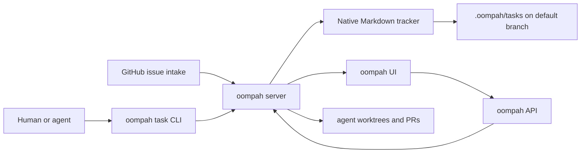
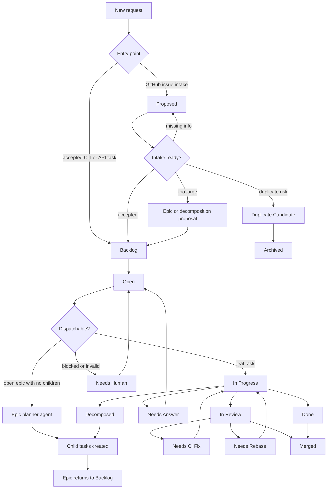
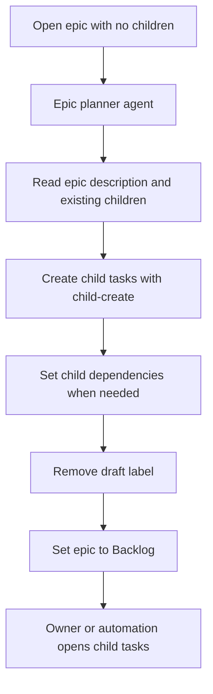
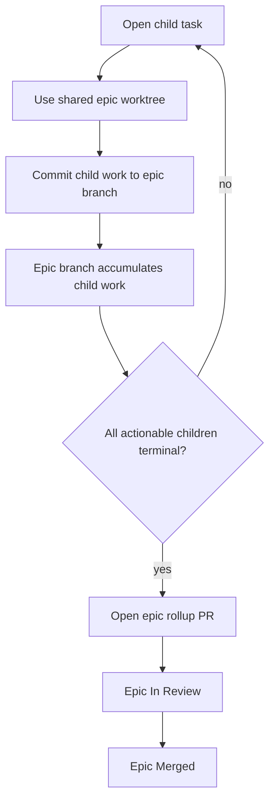
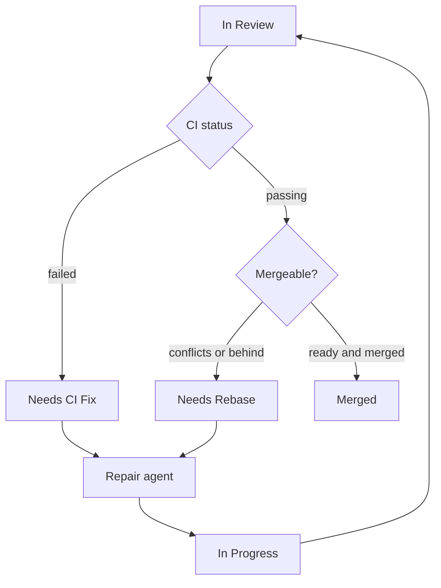

# Task and Epic Workflow

This document explains the current oompah workflow for native Markdown tasks
and epics. It covers how work enters the tracker, when agents are dispatched,
how epics are decomposed, and how branch-based epic integration lands.

## Source Of Truth

oompah stores internal task state in the managed project repository under
`.oompah/tasks`. The oompah server is the intended writer. The CLI, UI, API,
agents, and GitHub issue intake should all go through the server so status,
comments, dependencies, parent/child links, review metadata, and git-backed
Markdown files stay consistent.



Humans may inspect `.oompah/tasks` on the default branch, but normal task
updates should use `oompah task ...`. Direct file edits are reserved for tracker
repair.

## Entry Points

Work can enter the system in three common ways:

- GitHub issue intake: customer-facing issues are validated externally, then
  copied into an internal native Markdown task in `Proposed`.
- Direct task creation: accepted internal work is filed with
  `oompah task create`.
- Epic decomposition: child work is filed under an epic with
  `oompah task child-create`.

Design notes in `plans/` do not create work by themselves. Create an oompah task
when implementation has been accepted or needs status, ownership, blockers, or
agent orchestration.

## Release Delivery

Ordinary work lands on the default branch first. If a merged task or epic must
also reach a maintained release line, an operator queues a delivery on the
original source item or selects the commit directly from the **Release
delivery** inventory. This creates a per-branch, per-commit delivery record,
not a child backport task. The task or epic detail panel's **Add release
branches** shortcut queues the same underlying delivery records as the
inventory screen. See [Release Delivery](release-addendums.md) for the
operator procedure, API contract, status evidence, and legacy migration
details.

## Status Lifecycle

Only `Open`, `Needs CI Fix`, and `Needs Rebase` are dispatchable agent states.
`Proposed` and `Backlog` are intake and prioritization states. `Needs Answer`
and `Needs Human` are waiting states. `Done`, `Merged`, and `Archived` are
terminal states.



The main dispatch gates are:

| Status | Agent dispatch | Typical meaning |
|---|:---:|---|
| `Proposed` | No | Intake has not accepted the work yet |
| `Backlog` | No | Accepted but not prioritized for active work |
| `Open` | Yes | Ready for a normal implementation or planning agent |
| `In Progress` | No | Already claimed by an agent |
| `Needs CI Fix` | Yes | Reuse the existing branch or PR to repair failed CI |
| `Needs Rebase` | Yes | Reuse the existing branch or PR to rebase or resolve conflicts |
| `Needs Answer` | No | Waiting for requested information |
| `Needs Human` | No | Requires operator or maintainer action |
| `Done` | No | Work is complete, but may still be awaiting an epic rollup |
| `Merged` | No | Review branch has landed |
| `Archived` | No | Permanently closed |

Dispatch also requires clear task content, no unresolved dependencies, available
agent capacity, project/global pause gates to be open, and valid branch
metadata. Non-epic tasks with empty descriptions are rejected because agents
need enough context to act.

## Epic Planning

An epic begins as an issue of type `epic`. A draft epic is visible in the UI,
but the `draft` label is not a lifecycle status. It means the epic still needs
planning.



The planner does not implement code. It creates concrete child tasks, gives each
child enough context to work independently, records dependencies with
`oompah task set-dependency`, removes the `draft` label, and sets the epic to
`Backlog`.

Once an epic has children, normal implementation work happens on the children.
The parent epic acts as a rollup. In `shared` projects, a parent with children
is rejected from ordinary dispatch with `epic_rollup_parent` unless the epic
branch itself needs CI or rebase repair during final review.

## Shared Epic Branch

All managed projects use the shared epic workflow:

| Aspect | Shared behavior |
|---|---|
| Child worktrees | Shared epic worktree and branch |
| Child PR target | Epic branch only; child PRs are suppressed |
| Epic rollup PR | Yes, from epic branch to project default branch |

The generated epic branch name (`epic-<epic-id>`) is owned by oompah. If a
child task has `target_branch: epic-<parent-id>`, dispatch treats that as an
internal epic target and allows it even when the project's public branch
patterns only list branches such as `main` or `release/*`.



Oompah serializes normal child dispatch within the same epic so two agents do
not write to the same shared worktree at the same time. High priority repair
work may still be selected according to the orchestrator's repair rules.

For nested epics, a child epic rollup PR targets the parent epic branch. The
top-level epic targets the project default branch.

## Review And Repair

When a task or epic has an open PR, oompah records review metadata on the task
and moves it to `In Review`. Review monitoring can move the task back into a
dispatchable repair state:



For normal task PRs, the repair agent works on that task's branch. For mature
shared epics, the epic itself can become the repair unit so the agent fixes the
epic branch and returns it to review.

## Closing And Rollup

Child task completion is not always the same as project integration:

- `Done` means the agent finished the task. For shared epics, a child can be
  `Done` while its work still waits on the epic rollup PR.
- `In Review` means a PR exists and review metadata is recorded.
- `Merged` means the review branch landed on its expected target.
- `Archived` means the task is intentionally closed and should not reopen.

For shared epics, oompah opens the final epic rollup PR only after all
actionable children are terminal and required epic dependencies have landed.
The epic auto-close gate verifies child reviews and the epic branch landing
before closing the parent. If children are closed but their branches are not
merged to the expected target, the UI surfaces a `stuck_epic` alert.

## CLI Reference

Common task operations:

```bash
oompah task view <task-id> --project <project-id>
oompah task create --project <project-id> --title "Title" --description "Details"
oompah task create --project <project-id> --title "Follow-up" --source <originating-task-id>
oompah task child-create <epic-id> --project <project-id> --title "Child title" --description "Details"
oompah task set-dependency <task-id> --project <project-id> --depends-on <other-task-id>
oompah task set-status <task-id> Open --project <project-id>
oompah task set-status <task-id> Done --project <project-id> --summary "Completed"
oompah task comment <task-id> --project <project-id> --message "Progress update" --author oompah
```

### Source References

A source reference records which task originated a follow-up.  It is stored as
a `Triggered by: <id>` header in the task description and is visible in
`oompah task view`.

```bash
# Set or replace the source reference on an existing task:
oompah task set-source <task-id> <source-id> --project <project-id>

# Remove the source reference from a task:
oompah task remove-source <task-id> --project <project-id>
```

`set-source` and `remove-source` go through the same server/tracker update
path as all other field changes, so native Markdown tasks and supported
tracker backends both persist the canonical metadata.

Use the CLI rather than editing `.oompah/tasks` by hand. It keeps the Markdown
files, parent/child graph, dependencies, comments, review metadata, and git
history aligned.
