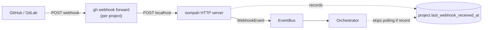

# Webhook forwarding

Oompah listens for forge events (PR opened, PR merged, push to a tracked
branch) so it can react in seconds instead of waiting for the next
periodic full-sync. This page explains how that works, how to set it up,
and how to verify it's actually working.

## Why webhooks matter

Without webhooks, oompah only learns about new PRs and merges every
~2 minutes when its periodic safety-net sync runs. With webhooks, the
following flows are near-realtime instead:

- **Auto-merge label updates** when a PR's CI finishes.
- **Source sync** after an operator pushes directly to a tracked branch.
- **PR-closed handling** that frees an agent's worktree.

## Architecture



`WebhookForwarder` (in `oompah/webhooks.py`) supervises one
`gh webhook forward` subprocess per project. Each subprocess opens a
WebSocket to GitHub, receives the project's webhook events, and POSTs
them to oompah's local `/api/v1/webhooks/github` endpoint. The
forwarder polls each subprocess every 5 seconds and restarts dead ones
with exponential backoff capped at 60 seconds.

## Prerequisites

The forwarder relies on the [`cli/gh-webhook`][gh-webhook] **gh CLI
extension** — a third-party extension that is **not installed by
default** with `gh`. Without it, `gh webhook forward` exits immediately
with `unknown command "webhook"` and no events are forwarded.

[gh-webhook]: https://github.com/cli/gh-webhook

## Setup

Install the extension once per machine:

```bash
make install-gh-extensions
```

That target is idempotent: it checks for `gh webhook --help` first and
only installs if missing. Under the hood it runs:

```bash
gh extension install cli/gh-webhook
```

You also need to be authenticated with `gh`:

```bash
gh auth login
```

Restart oompah after installing:

```bash
make restart
```

## Verifying it works

After restart, three things should be true.

**1. The startup log shows the extension was found.**

```text
WebhookForwarder: gh-webhook extension OK; forwarding events=push,pull_request
WebhookForwarder: started gh webhook forward for project <name> (pid=<N>, events=push,pull_request)
```

If instead you see this ERROR line, the extension is missing or `gh` is
not authenticated:

```text
WebhookForwarder: gh-webhook extension unavailable (unknown command "webhook"). Install with `gh extension install cli/gh-webhook` (or run `make install-gh-extensions`).
```

The ERROR is emitted **once per startup** — the polling loop will not
spam your logs every restart cycle.

**2. The dashboard does not show the "Webhooks degraded" banner.**

If the extension is missing, the dashboard shows a warning banner:

> ⚠ Webhooks degraded: unknown command "webhook". Install with
> `make install-gh-extensions`. Falling back to periodic full-sync (slower).

When the banner is gone, webhooks are running normally.

**3. The subprocesses are actually running.**

```bash
ps -ef | grep "gh webhook" | grep -v grep
```

You should see one `gh webhook forward --events push,pull_request --url ...`
line per registered project. An empty result while oompah claims it is
running is the original bug from issue `oompah-zlz_2-2g1`.

## Configuration

| Setting | Env var | Default | Description |
|---|---|---|---|
| Forward URL | `OOMPAH_WEBHOOK_FORWARD_URL` | `http://localhost:8080/api/v1/webhooks/github` | Where the forwarder POSTs received events. |
| Subscribed events | `OOMPAH_WEBHOOK_EVENTS` | `push,pull_request` | Comma-separated event list passed to `gh webhook forward --events`. |

The default event set is the minimum required for source-sync after
direct pushes (`push`) and for PR-closed / auto-merge label updates
(`pull_request`). If you add features that depend on other events
(e.g. `issues`, `release`), extend this list.

## Troubleshooting

**The extension is installed but webhooks still aren't firing.**

Check the captured stderr in `oompah.log`:

```bash
grep "gh webhook forward stderr" oompah.log | tail -5
```

The forwarder drains each subprocess's stderr and logs the tail at
WARNING when the subprocess exits non-zero. Common causes:

- **Auth expired** — run `gh auth refresh` and restart oompah.
- **Repo not accessible** — the gh user must have webhook permission on
  the repo. Check `gh auth status` and the repo's settings.
- **Rate-limited** — GitHub limits webhook forwarders; wait and retry.

**The forwarder is restarting in a tight loop.**

Restart backoff doubles on each failure (1s, 2s, 4s, …, capped at 60s).
If you see repeated "exited for project X" lines in the log, the
subprocess is failing to start — check the stderr WARNING for the
reason.

**I want to disable webhook forwarding entirely.**

There is no first-class disable flag. The simplest workaround is to
uninstall the extension (`gh extension remove cli/gh-webhook`) and
restart; the forwarder will detect this at startup, log a single ERROR,
show the degraded banner, and skip launching subprocesses. Oompah will
fall back to its periodic safety-net sync.
