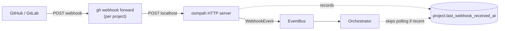

# Webhook forwarding

Oompah listens for forge events (PR opened, PR merged, push to a tracked
branch, task created/updated in GitHub Issues) so it can react in seconds
instead of waiting for the next periodic full-sync. This page explains how
that works, how to set it up, and how to verify it is actually working.

## Why webhooks matter

Without webhooks, oompah only learns about changes every ~5 minutes when its
periodic safety-net sync runs. With webhooks, the following flows are
near-realtime instead:

- **Auto-merge label updates** when a PR's CI finishes.
- **Source sync** after an operator pushes directly to a tracked branch.
- **PR-closed handling** that frees an agent's worktree.
- **Task state updates** when issues are opened, edited, commented on, or
  field-changed in GitHub Issues.

## Two webhook channels

Oompah uses **two distinct webhook mechanisms** with different scopes.
It is important not to confuse them:

| Channel | Endpoint | Transport | Purpose |
|---|---|---|---|
| **GitHub forge events** | `POST /api/v1/webhooks/github` | `gh webhook forward` CLI → localhost | Receive GitHub events for SCM (push, PR) and GitHub-backed task tracking (issues, comments, labels, project items). |
| **Backlog task-change hooks** | `POST /api/v1/webhooks/backlog` | `post-commit` git hook in managed repo | Notify oompah when a Backlog.md task file changes in a managed repo (legacy Backlog-backed projects only). |

**GitHub-backed projects** use the first channel exclusively. The
`post-commit` Backlog hook is a legacy mechanism for Backlog.md-backed
projects and does not apply once a project is migrated to GitHub Issues.
See [`plans/backlog-task-change-webhooks.md`](../plans/backlog-task-change-webhooks.md)
for details on the Backlog hook.

## Architecture



`WebhookForwarder` (in `oompah/webhooks.py`) supervises one
`gh webhook forward` subprocess per project. Each subprocess opens a
WebSocket to GitHub, receives the project's webhook events, and POSTs
them to oompah's local `/api/v1/webhooks/github` endpoint. The
forwarder polls each subprocess every 5 seconds and restarts dead ones
with exponential backoff capped at 60 seconds.

## Required GitHub events

The following events must be forwarded to oompah. This is the full default
event list set by `_WEBHOOK_DEFAULT_EVENTS` in `oompah/webhooks.py`:

| Event | Purpose |
|---|---|
| `push` | Source-sync after operators commit directly to a tracked branch. |
| `pull_request` | Auto-merge label updates and PR-closed handling (frees worktrees). |
| `issues` | Task open/edit/close/assign when using GitHub-backed task tracking. |
| `issue_comment` | New comments on tasks (agent handoffs, acceptance-criteria responses). |
| `label` | Label create/edit/delete (agent routing hints such as `needs:frontend`). |

The `push` and `pull_request` events are sufficient for pure SCM projects
(no GitHub Issues task tracking). The full default set above is required for
repo-scoped GitHub-backed task tracking.

Oompah can parse `projects_v2_item` payloads when they are delivered by a
separately configured organization- or user-level webhook. Do not add
`projects_v2_item` to `OOMPAH_WEBHOOK_EVENTS` for repo-scoped
`gh webhook forward` processes; GitHub rejects that event on repository hooks.

## Prerequisites

The forwarder relies on the [`cli/gh-webhook`][gh-webhook] **gh CLI
extension** — a third-party extension that is **not installed by
default** with `gh`. Without it, `gh webhook forward` exits immediately
with `unknown command "webhook"` and no events are forwarded.

[gh-webhook]: https://github.com/cli/gh-webhook

## Setup

Install the extension once per machine:

```bash
make install-gh-extensions
```

That target is idempotent: it checks for `gh webhook --help` first and
only installs if missing. Under the hood it runs:

```bash
gh extension install cli/gh-webhook
```

You also need to be authenticated with `gh`:

```bash
gh auth login
```

Restart oompah after installing:

```bash
make restart
```

## Verifying it works

After restart, three things should be true.

**1. The startup log shows the extension was found.**

```text
WebhookForwarder: gh-webhook extension OK; forwarding events=push,pull_request,issues,issue_comment,label
WebhookForwarder: started gh webhook forward for project <name> (pid=<N>, events=push,pull_request,issues,issue_comment,label)
```

If instead you see this ERROR line, the extension is missing or `gh` is
not authenticated:

```text
WebhookForwarder: gh-webhook extension unavailable (unknown command "webhook"). Install with `gh extension install cli/gh-webhook` (or run `make install-gh-extensions`).
```

The ERROR is emitted **once per startup** — the polling loop will not
spam your logs every restart cycle.

**2. The dashboard does not show the "Webhooks degraded" banner.**

If the extension is missing, the dashboard shows a warning banner:

> ⚠ Webhooks degraded: unknown command "webhook". Install with
> `make install-gh-extensions`. Falling back to periodic full-sync (slower).

When the banner is gone, webhooks are running normally.

**3. The subprocesses are actually running.**

```bash
ps -ef | grep "gh webhook" | grep -v grep
```

You should see one `gh webhook forward --events push,pull_request,... --url ...`
line per registered project. An empty result while oompah claims it is
running is the original bug from issue `oompah-zlz_2-2g1`.

**4. Verify individual events are reaching oompah.**

For GitHub-backed task tracking, confirm issue events arrive by triggering
one manually (e.g. editing an issue title) and checking the log:

```bash
grep "WebhookEvent.*issues\|WebhookEvent.*issue_comment" oompah.log | tail -5
```

Or check the server access log for 200 responses to the webhook endpoint:

```bash
grep "POST /api/v1/webhooks/github" oompah.log | tail -10
```

**5. Confirm project-field updates are covered.**

The `gh webhook forward --repo` tool creates repository webhooks. GitHub does
not allow the `projects_v2_item` event on repository hooks, so it is not part
of the default forwarder event list. If you need real-time project-field
updates such as `Oompah Status`, configure a separate organization- or
user-level webhook that sends `projects_v2_item` payloads to
`/api/v1/webhooks/github`. Oompah's parser and server path can handle those
payloads when delivered that way.

## Configuration

| Setting | Env var | Default | Description |
|---|---|---|---|
| Forward URL | `OOMPAH_WEBHOOK_FORWARD_URL` | `http://localhost:8080/api/v1/webhooks/github` | Where the forwarder POSTs received events. |
| Subscribed events | `OOMPAH_WEBHOOK_EVENTS` | `push,pull_request,issues,issue_comment,label` | Comma-separated event list passed to `gh webhook forward --events`. |

The default event set covers both SCM events and GitHub Issues task tracking.
To subscribe to additional GitHub events (e.g. `release`, `milestone`), extend
`OOMPAH_WEBHOOK_EVENTS` in your `.env` file. See `.env.example` for the full
list and descriptions.

Projects can also opt out of `gh webhook forward` individually by setting
`webhook_forwarding_enabled` to `false` in the project configuration. Use this
when the project token can manage issues and pull requests but does not have
repository webhook administration permission. Oompah will then rely on its
polling backup for that project without surfacing the missing hook permission
as a forwarder failure.

## Troubleshooting

**The extension is installed but webhooks still aren't firing.**

Check the captured stderr in `oompah.log`:

```bash
grep "gh webhook forward stderr" oompah.log | tail -5
```

The forwarder drains each subprocess's stderr and logs the tail at
WARNING when the subprocess exits non-zero. Common causes:

- **Auth expired** — run `gh auth refresh` and restart oompah.
- **Repo not accessible** — the gh user must have webhook permission on
  the repo. Check `gh auth status` and the repo's settings.
- **Repo hooks not permitted** — GitHub may allow issue/PR API access while
  returning `HTTP 404` for `repos/<owner>/<repo>/hooks` if the credential lacks
  repository admin permission. Either grant hook administration permission or
  set `webhook_forwarding_enabled` to `false` for that project so oompah uses
  polling intentionally.
- **Rate-limited** — GitHub limits webhook forwarders; wait and retry.

**I see `push` and `pull_request` events but no `issues` or `issue_comment` events.**

The `issues`, `issue_comment`, and `label` events require the GitHub
repository to have Issues enabled. Confirm that the task hub repository
has GitHub Issues turned on in its settings, and that the `gh` CLI user
has at least read access to that repository.

Also confirm that `OOMPAH_WEBHOOK_EVENTS` is not overriding the default to
an older value (e.g. `push,pull_request` only).

**No `projects_v2_item` events are arriving.**

`projects_v2_item` is an organization- or user-level event. GitHub delivers
it at the organization/user webhook level, not through repository hooks. Do
not add it to `OOMPAH_WEBHOOK_EVENTS`; repo-scoped `gh webhook forward` will
exit with a GitHub validation error. For local development, simulate project
field changes by editing issue fields directly in GitHub; oompah's periodic
poll will catch them within 5 minutes as a fallback.

**The forwarder is restarting in a tight loop.**

Restart backoff doubles on each failure (1s, 2s, 4s, …, capped at 60s).
If you see repeated "exited for project X" lines in the log, the
subprocess is failing to start — check the stderr WARNING for the
reason.

**I want to disable webhook forwarding entirely.**

There is no first-class disable flag. The simplest workaround is to
uninstall the extension (`gh extension remove cli/gh-webhook`) and
restart; the forwarder will detect this at startup, log a single ERROR,
show the degraded banner, and skip launching subprocesses. Oompah will
fall back to its periodic safety-net sync.

**I only need SCM events (no GitHub Issues task tracking).**

Set `OOMPAH_WEBHOOK_EVENTS=push,pull_request` in your `.env` file and
restart. The forwarder will only subscribe to those two events. Note that
issue, comment, and label changes will not arrive in real time — oompah will
rely on its 5-minute periodic sync for task state.

## Relation to Backlog task-change webhooks

The `gh webhook forward` mechanism is **separate** from the legacy Backlog.md
`post-commit` hook. They serve different purposes:

- `gh webhook forward` → receives GitHub-level events (issues, PRs, pushes,
  label changes) from GitHub's WebSocket API and forwards them to oompah's
  `/api/v1/webhooks/github` endpoint.
- `post-commit` hook → fires a local HTTP POST to `/api/v1/webhooks/backlog`
  when a git commit in a managed repo touches `backlog/tasks/*.md` or
  `backlog/completed/*.md` files.

For **GitHub-backed projects** (tracker kind `github_issues`), task state
lives in GitHub Issues and the Backlog `post-commit` hook is not installed
or consulted. For **Backlog.md-backed projects** (legacy), the reverse is
true — the `gh webhook forward` event list still handles SCM events but
task-state changes arrive via the `post-commit` hook.

See [`plans/backlog-task-change-webhooks.md`](../plans/backlog-task-change-webhooks.md)
for the full design of the Backlog hook mechanism.
