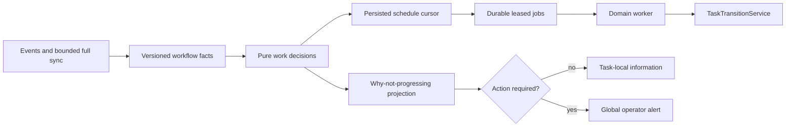

# Durable Workflow Rollout and Recovery

This guide is for operators moving an existing Oompah service from legacy
lifecycle scheduling to the durable workflow runtime. The rollout is
restart-safe, uses only `OOMPAH_*` settings in `.env`, and never requires an
operator to move a recoverable task between tracker states.

## What changes

The durable runtime evaluates four independently observable domains:
implementation, review, integration, and epic rollup. Each domain has one
setting with the values `off`, `shadow`, or `enforce`:

```dotenv
OOMPAH_WORKFLOW_IMPLEMENTATION_MODE=shadow
OOMPAH_WORKFLOW_REVIEW_MODE=shadow
OOMPAH_WORKFLOW_INTEGRATION_MODE=shadow
OOMPAH_WORKFLOW_EPIC_MODE=shadow
OOMPAH_WORKFLOW_ROLLOUT_MIN_SHADOW_SWEEPS=3
OOMPAH_WORKFLOW_ROLLOUT_MIN_SHADOW_SECONDS=300
```

`off` omits that domain from the read-only canary. `shadow` evaluates it and
records restart-persistent qualification evidence without performing effects.
`enforce` marks a domain qualified for cutover. A mixed domain map remains
process-wide read-only; durable mutations begin only when all four domains are
`enforce`. This coordinated final boundary prevents a durable writer from
racing the legacy writer of another domain.

Terminal audit is not a fifth toggle. Its durable ledger and independent
auditor gate are mandatory in every mode, so permitting an operator to turn it
off during this rollout would weaken terminal-state safety.

`OOMPAH_WORKFLOW_ENGINE_MODE` is accepted only as an upgrade compatibility
input when none of the four domain settings is present. It is intentionally
absent from `.env.example`; remove it after writing the domain settings.

## Canary and cutover

1. Copy the six settings above into `.env` and keep all domain modes at
   `shadow`.
2. Apply them with `make graceful`. A live reload cannot transfer workflow
   ownership and is rejected without partially changing the process.
3. Watch at least the configured number of successful sweeps for at least the
   configured soak duration. A failed sweep must be followed by a successful
   one.
4. Run the production state gate:

   ```bash
   make workflow-rollout-check
   ```

   The command samples for
   `OOMPAH_WORKFLOW_CANARY_DURATION_SECONDS` (default 300 seconds) at
   `OOMPAH_WORKFLOW_CANARY_SAMPLE_INTERVAL_SECONDS` (default 10 seconds). It
   fails on an unhealthy service, actionable alert, stale binding topology,
   unresolved divergence, expired lease, exhausted durable job, or incomplete
   persisted rollout evidence.
5. Promote one domain setting to `enforce`, run `make graceful`, and repeat for
   each domain. Until the last promotion the aggregate runtime remains
   read-only. Startup rejects a promotion that lacks its persisted shadow
   sample count, soak age, or a latest successful sample.
6. After all four settings are `enforce`, run the canary again for the normal
   production soak window. Keep the four explicit settings as the supported
   rollback controls; remove the obsolete aggregate input.

The state endpoint exposes the exact configured map and persisted evidence at
`workflow_runtime.domain_modes` and `workflow_runtime.rollout`. The workflow
database stores the same additive rows. A restart does not reset the sample
count or soak clock.

## Why a task is not progressing

Use the task detail panel or:

```text
GET /api/v1/projects/{project_id}/tasks/{identifier}/work-decision
```

The `work_decision` response is the authority for the current owner,
disposition, stable reason code, evidence revision, next reassessment,
recovery action, and permitted actions. A queue, capacity wait, active lease,
dependency wait, or scheduled retry is normal and remains task-local. Do not
move the task to `Open` or `Needs Human` to wake it; the bounded full sync and
durable recovery job own that progress.

Only `action_required: true` means automatic recovery is unavailable or
exhausted. The matching global alert must name a responsible party and a
concrete remedy. Apply that remedy, then let the next event or full sync
re-evaluate the task. Do not perform a manual status workaround unless the
decision explicitly permits that transition.

Reassessment deadlines are configured with
`OOMPAH_WORKFLOW_LIVENESS_SLO_<SLO_KEY>_SECONDS`. Missing a deadline is itself
actionable; waiting within the deadline is not. The effective SLO map and
policy epoch appear under `workflow_liveness` in the state endpoint.

## Upgrade, restart, and rollback

Stop at the first failed gate. Restore the last working `.env` values and run
`make graceful`; never use `make force-restart` for a normal rollout.

The workflow-job database migrates automatically at startup. Its legacy spec
rewrites are idempotent even if a process stops after an `ALTER TABLE` but
before the data rewrite. Rollout evidence uses an additive table without
raising the workflow-job schema version, so the immediately previous binary
can ignore it during rollback. Back up the workflow SQLite database and its
`-wal`/`-shm` files as one SQLite unit before upgrading. Do not copy only the
main file while the service is running.

Rollback boundaries:

| Point | Safe action | Evidence retained |
|---|---|---|
| Any domain in `off`/`shadow` | Restore prior modes; `make graceful` | Jobs, transitions, and shadow samples |
| Mixed map including `enforce` | Return affected domains to `shadow`; `make graceful` | No durable effects were enabled |
| All domains `enforce` | Return all four to `shadow`; `make graceful` | Durable jobs remain fenced and restart-recoverable |
| Newer workflow-job schema than the old binary supports | Restore the pre-upgrade SQLite backup with the old binary | Backup snapshot only |

If startup rejects a future schema, do not delete or edit `schema_meta`. Use a
binary that supports the database or restore the matched pre-upgrade backup.
If a durable job is exhausted, follow its `action_required` remedy; changing a
task status does not repair the failed external effect or lease evidence.

## Supported architecture



The job ledger owns retries and leases; `TaskTransitionService` owns status
changes; the liveness controller owns bounded recovery and escalation. Tracker
state, dashboard caches, watchdog timers, and log messages are projections or
wakeup hints, not competing workflow authorities.
