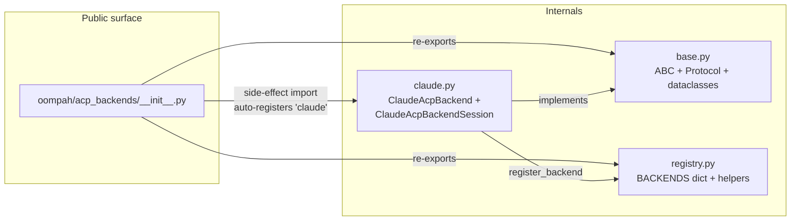

# ACP Backends — pluggable session abstraction

Child A of the multi-backend ACP epic. Introduces the registry +
abstraction that lets oompah run ACP-mode sessions against more than
one provider SDK (today: Claude Agent SDK; near-term: Codex).

See task `oompah-zlz_2-0hzh` for the original spec.

## Why a registry?

Before this work, `oompah/acp_agent.py:AcpAgentSession.run_task`
hardcoded `from claude_agent_sdk import ClaudeSDKClient,
ClaudeAgentOptions`. Adding a second ACP backend would have required
either forking the file or sprinkling `if backend == "claude": ...
elif backend == "codex": ...` throughout. Neither scales as the
operator adds Codex etc.

The registry pattern decouples:

* **Dispatch** (in `_run_acp_worker`): pick a session-shaped backend
  by name, hand it a typed options dataclass, drain its event stream.
* **Backend implementation** (in `oompah/acp_backends/<name>.py`):
  knows about a single SDK / subprocess, yields backend-typed events.

## File layout



## Adding a new backend

1. Create `oompah/acp_backends/<name>.py`.
2. Subclass `AcpBackend`:

   ```python
   class MyBackend(AcpBackend):
       @classmethod
       def name(cls) -> str:
           return "my-backend"

       def start_session(self, options: AcpBackendOptions) -> AcpBackendSession:
           return MyBackendSession(options)

       def validate_provider(self, provider: ModelProvider) -> list[str]:
           # Per-backend provider validation (api_key required, etc.)
           return []
   ```

3. Implement an `AcpBackendSession`-conforming class that yields
   `BackendEvent` objects from `run_turn`.

4. Register at import time:

   ```python
   from oompah.acp_backends.registry import register_backend
   register_backend(MyBackend.name(), MyBackend)
   ```

5. Add an import line to `oompah/acp_backends/__init__.py` so the
   registry populates automatically when the package is imported.

## Provider configuration

`ModelProvider` carries an optional `backend: str | None = None`
field. When an agent profile with `mode=acp` uses a provider, the
orchestrator reads `provider.backend` (defaulting to `"claude"` if
unset) and threads it through to `AcpAgentSession(backend_name=...)`.

The provider edit dialog in `/providers` exposes the backend choice
as a dropdown populated from `GET /api/v1/acp-backends`. The dropdown
is read-only when only one backend is registered.

## Why session-shaped only

Today's only proven ACP backend (Claude SDK) is session-shaped, and
the operator's stated near-term need (Codex) is also session-shaped.
A single-shot adapter would be a future refinement — out of scope for
Child A.

## Per-token billing (Child C, oompah-zlz_2-ag7h)

The orchestrator now distinguishes subscription-billed ACP providers
from per-token-billed ones via the `ModelProvider.billing_model`
field:

* **`"subscription"`** (default) — calls bill against the operator's
  flat-rate subscription. `_would_dispatch_via_acp` bypasses the
  budget gate, and `_estimate_cost` / `_compute_run_cost_record`
  return $0 even when `model_costs` is populated. Mirrors the
  pre-`ag7h` ACP behaviour as the back-compat default.
* **`"per_token"`** — calls are metered per-token. The provider
  participates in the budget gate via `_check_budget`, and each
  completed turn accumulates cost in the rolling-window spend
  tracker.

### Cost resolution order (per-token)

1. **SDK-reported `total_cost_usd`**: when the backend's session
   exposes a non-None `total_cost_usd` at end-of-turn, that wins —
   the SDK knows tier discounts (volume / preview / pro) the
   orchestrator doesn't.
2. **Local `model_costs` lookup**: `input_tokens × cost_per_1k_input
   + output_tokens × cost_per_1k_output`, with rates from
   `provider.model_costs[model]`.
3. **Neither**: cost recorded as `$0.00` and a WARNING is logged. The
   dispatch is NOT aborted — the operator can backfill `model_costs`
   entries via `/providers` for accurate budget tracking on the next
   run.

### Backend author notes

A backend that wants to participate in per-token billing only needs
to expose `total_cost_usd` on its `AcpBackendSession` (the protocol
already requires this). When the wrapping `ModelProvider` is
configured `billing_model="per_token"`, the orchestrator picks up
the SDK number automatically; otherwise it falls back to local
`model_costs`.

If a backend has no concept of per-turn cost (the SDK doesn't report
one), leave `total_cost_usd = None` and let the operator populate
`model_costs` on the provider record.

### UI

The Add/Edit Provider dialog exposes the billing model as a two-
option radio group (Subscription / Per-token). The `model_costs`
field is left visible in both modes but a small inline note clarifies
that the rates are ignored at billing time when subscription is
selected.

## Out of scope (still deferred)

* **Child B**: a concrete Codex backend (per-token customer; the
  billing scaffolding above is what unblocks it).
