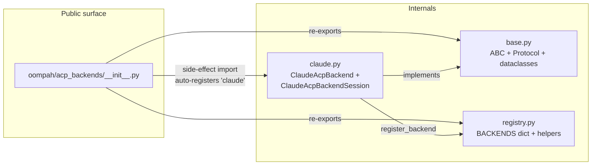

# ACP Backends — pluggable session abstraction

Child A of the multi-backend ACP epic. Introduces the registry +
abstraction that lets oompah run ACP-mode sessions against more than
one provider SDK (today: Claude Agent SDK; near-term: Codex).

See bead `oompah-zlz_2-0hzh` for the original spec.

## Why a registry?

Before this work, `oompah/acp_agent.py:AcpAgentSession.run_task`
hardcoded `from claude_agent_sdk import ClaudeSDKClient,
ClaudeAgentOptions`. Adding a second ACP backend would have required
either forking the file or sprinkling `if backend == "claude": ...
elif backend == "codex": ...` throughout. Neither scales as the
operator adds Codex etc.

The registry pattern decouples:

* **Dispatch** (in `_run_acp_worker`): pick a session-shaped backend
  by name, hand it a typed options dataclass, drain its event stream.
* **Backend implementation** (in `oompah/acp_backends/<name>.py`):
  knows about a single SDK / subprocess, yields backend-typed events.

## File layout



## Adding a new backend

1. Create `oompah/acp_backends/<name>.py`.
2. Subclass `AcpBackend`:

   ```python
   class MyBackend(AcpBackend):
       @classmethod
       def name(cls) -> str:
           return "my-backend"

       def start_session(self, options: AcpBackendOptions) -> AcpBackendSession:
           return MyBackendSession(options)

       def validate_provider(self, provider: ModelProvider) -> list[str]:
           # Per-backend provider validation (api_key required, etc.)
           return []
   ```

3. Implement an `AcpBackendSession`-conforming class that yields
   `BackendEvent` objects from `run_turn`.

4. Register at import time:

   ```python
   from oompah.acp_backends.registry import register_backend
   register_backend(MyBackend.name(), MyBackend)
   ```

5. Add an import line to `oompah/acp_backends/__init__.py` so the
   registry populates automatically when the package is imported.

## Provider configuration

`ModelProvider` carries an optional `backend: str | None = None`
field. When an agent profile with `mode=acp` uses a provider, the
orchestrator reads `provider.backend` (defaulting to `"claude"` if
unset) and threads it through to `AcpAgentSession(backend_name=...)`.

The provider edit dialog in `/providers` exposes the backend choice
as a dropdown populated from `GET /api/v1/acp-backends`. The dropdown
is read-only when only one backend is registered.

## Why session-shaped only

Today's only proven ACP backend (Claude SDK) is session-shaped, and
the operator's stated near-term need (Codex) is also session-shaped.
A single-shot adapter would be a future refinement — out of scope for
Child A.

## Out of scope (deferred children)

* **Child B**: a concrete Codex backend.
* **Child C**: per-token billing logic specific to non-Claude
  backends (today's flat subscription-billing assumption baked into
  `_run_acp_worker` may need to change for backends that DO meter).
