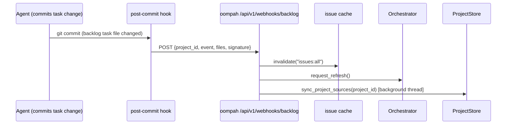

# Backlog Task-Change Webhooks

This document describes the Backlog.md task-change webhook mechanism implemented
as part of TASK-423.

## Problem

oompah previously relied on periodic full-sync polling to detect when backlog
task files changed in managed repos. This introduced latency between an agent
committing a task update and the orchestrator/dashboard reflecting that change.

## Solution

A `post-commit` git hook is installed into each managed project repo
(`<repo_path>/.git/hooks/post-commit`). When any commit touches
`backlog/tasks/*.md` or `backlog/completed/*.md`, the hook fires a best-effort
HTTP POST to oompah's `/api/v1/webhooks/backlog` endpoint.

## Architecture

## Key Files

- `oompah/git_hooks/post-commit` — self-contained Python script installed as the git hook
- `oompah/backlog_webhooks.py` — module: `install_backlog_webhook_hook()`, `ensure_backlog_webhooks()`, `validate_backlog_webhook_signature()`
- `oompah/server.py` — endpoint `POST /api/v1/webhooks/backlog`
- `oompah/__main__.py` — `ensure_backlog_webhooks()` called at startup after source sync

## Hook Configuration (per managed repo)

The hook reads these git config keys from the repo's local config:

| Key | Default | Purpose |
|-----|---------|---------|
| `oompah.backlog-webhook-url` | `http://localhost:8080/api/v1/webhooks/backlog` | POST target |
| `oompah.project-id` | `""` | Project identifier sent to oompah |
| `oompah.backlog-webhook-secret` | `""` | HMAC-SHA256 secret (if set) |

## Security

When a project has `webhook_secret` configured in `projects.json`, the
hook signs the POST body with HMAC-SHA256 and sends the signature in
`X-Oompah-Signature: sha256=<hex>`. The server validates this signature.

If the request carries a signature but validation fails, the server returns
`401 Unauthorized`. If no signature is sent (even for projects with a secret),
the request is accepted to support initial setup before the hook is configured.

## Installation / Lifecycle

- **Startup**: `ensure_backlog_webhooks(project_store, server_base_url)` is called
  after `sync_all_sources()` in `__main__.py`.
- **Project create/update**: `_install_backlog_hook_for_project(project)` is called
  from the server endpoints `POST /api/v1/projects` and `PATCH /api/v1/projects/{id}`.
- **Idempotency**: `install_backlog_webhook_hook()` checks for the `# oompah-backlog-webhook-hook`
  marker in any existing hook file and only updates git config when values differ.

## Webhook Receipt Flow

1. Server validates HMAC signature (if applicable).
2. Server invalidates `issues:all` cache and any `detail:{project_id}:*` entries.
3. Server calls `orch.request_refresh()` so the dashboard updates.
4. Server spawns a background thread calling `sync_project_sources(project_id)`
   (git pull + Backlog config compatibility check).

## Best-Effort Design

The hook never fails a git commit:
- Network errors, server-down states, and all exceptions are silently swallowed.
- A 3-second timeout on the HTTP request prevents blocking commits.
- The full-sync safety net (`full_sync_interval_ms`) continues running as a fallback.

## Scope: Backlog.md-backed projects only

The `post-commit` Backlog hook is a **legacy mechanism** that applies only to
projects where `tracker_kind` is `backlog_md` (or unset, defaulting to legacy
mode in older deployments).

For **GitHub-backed projects** (`tracker_kind: github_issues`), task state
lives in GitHub Issues. Those projects do not install or consult the Backlog
`post-commit` hook. Task-state changes reach oompah via the GitHub webhook
channel (`gh webhook forward`) instead — specifically the `issues`,
`issue_comment`, `label`, and `projects_v2_item` events. See
[`docs/webhook-forwarding.md`](../docs/webhook-forwarding.md) for the full
GitHub event set and setup instructions.

When a project is migrated to `github_issues`, `ensure_backlog_webhooks()`
skips that project and `sync_project_sources()` skips Backlog compatibility
checks and hook installation. Existing `post-commit` hook files in that
project's clone are left in place but become no-ops because no new
`backlog/tasks/*.md` files are created.
