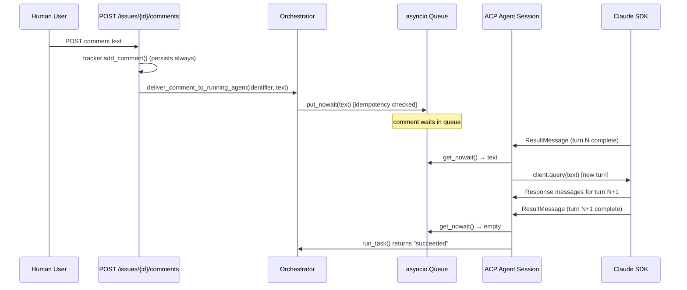

# Mid-Run Comment Delivery

> Implemented in OOMPAH-211.

## Overview

When a new comment is posted on a task that has an active running agent,
the comment is delivered into the agent's live context as a new turn in the
same SDK session, rather than waiting for the next dispatch.

## Architecture

## Key Components

### `Orchestrator.deliver_comment_to_running_agent(identifier, text, *, comment_id=None)`

The primary entry point. Resolves the issue_id from the string identifier,
looks up the registered comment queue, performs idempotency checking, and
enqueues the comment. Returns `True` on successful queue, `False` as graceful
fallback when no queue exists (non-ACP workers or no running agent).

**Ordering:** FIFO queue — comments arrive in the order they were posted.

**Idempotency:** When `comment_id` is supplied, the same ID is only enqueued
once per agent run. The idempotency set is cleared when the worker exits.

**Audit logging:** Every call (queued or fallback) appends to
`self._agent_comment_delivery_log[issue_id]` with timestamp, comment_id,
text preview (100 chars), and status (`"queued"` or `"fallback"`).

### `ClaudeAcpBackendSession` — multi-turn injection loop

`run_turn()` was restructured from a single `async for msg in
client.receive_response()` loop to a `while True` outer loop. At each
`ResultMessage` boundary, the backend checks the `comment_queue` (from
`AcpBackendOptions`):
- If a comment is waiting: emit `acp_injected_comment` event, call
  `client.query(comment_text)`, reset status to `"pending"`, and `break`
  the inner loop to start a new `receive_response()` cycle.
- If the queue is empty: return normally (`"succeeded"`).

Error `ResultMessage`s skip injection — we do not send comments to a failing
session.

### Graceful Fallback

Workers that do not support injection (CLI, api_agent) have no comment queue
registered. `deliver_comment_to_running_agent()` returns `False` and logs the
fallback. The comment is always persisted in the tracker and will appear as
context on the next dispatch.

### `AcpAgentSession.inject_message(text) -> bool`

Facade method that delegates to the backend session's `inject_message()` if
available. Returns `True` on success, `False` for unsupported backends.

## Entry Points

1. **Native tasks via API** (`server.py` → `api_add_comment`): Every non-oompah
   comment POSTed to `/api/v1/issues/{id}/comments` triggers delivery.

2. **GitHub-synced comments** (`github_intake_bridge.py` →
   `handle_github_issue_intake_webhook`): When a GitHub comment is newly
   imported into a native task, `_deliver_github_comment_to_agent()` is called.

## Retry Behavior

Retry is implicit: comments that fail to deliver (e.g., the agent finishes
before dequeuing) remain visible in the tracker and are included in the next
dispatch's context via `tracker.fetch_comments()`.

## Provider Support

| Worker type | Injection supported | Fallback behavior |
|---|---|---|
| ACP (Claude SDK) | ✅ Yes (between turns) | N/A |
| ACP (Codex, OpenCode) | ❌ No (no `inject_message`) | logged, next dispatch |
| API agent | ❌ No (no queue) | logged, next dispatch |
| CLI agent | ❌ No (no queue) | logged, next dispatch |

## Tests

`tests/test_comment_delivery.py` covers:
- `deliver_comment_to_running_agent()` routing, idempotency, fallback, audit log
- `ClaudeAcpBackendSession` multi-turn injection (no injection, single comment,
  multiple comments, empty queue, error result, stop during injection)
- `AcpAgentSession.inject_message()` facade
- Integration: exactly-once delivery end-to-end with mocked SDK
- GitHub intake bridge delivery hook
- Server delivery hook (human vs oompah author)
