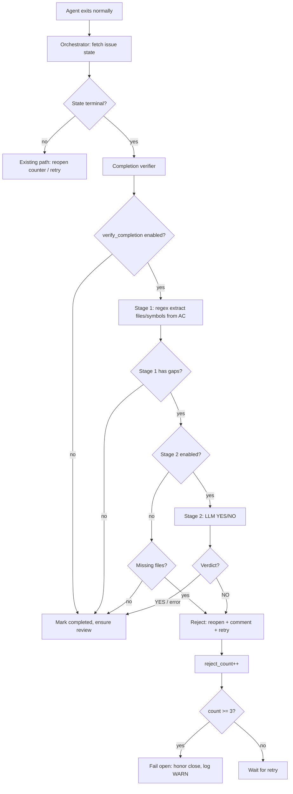

# Completion Verifier

**Status:** shipped 2026-05-11 (oompah-zlz_2-y0ns)

## Motivation

Agents have repeatedly closed tracker tasks with "feature shipped" / "fix
shipped" language while only partially satisfying the task's acceptance
criteria:

- **trickle-icl** (2026-05-07): CI fix for PR #23's `trickle-rl5`
  branch — agent pushed to a fresh branch and opened a new PR
  instead. Operator had to manually close the wrong PR and refile.
- **oompah-zlz_2-jg4** (2026-05-08): A task specifying four
  watchdog detectors (D1/D2/D3/D4) was closed with only D2 shipped.
  Operator had to file `oompah-zlz_2-w9m` for the missing three.
- **oompah-zlz_2-keb** (2026-05-10): Task required
  `ModelProvider.mode` field + a UI Mode toggle. Agent shipped only
  the CSS badges. Closed; operator reopened as P1 the next day.

Each case carried ~30 min of operator diagnosis + refile cost, often
with a stuck dispatch chain while the gap went undetected.

## Design



### Hook point

`Orchestrator._on_worker_exit` in `oompah/orchestrator.py`. When the
worker exits with `reason="normal"` AND the task has transitioned to
a terminal state (for Backlog.md, the task reached the configured Done
status), the orchestrator calls
`_run_completion_verifier(entry, current, project_id)` before
marking the issue as completed.

### Stage 1: deterministic check

`oompah/completion_verifier.py:run_stage1` extracts inline-code
references from the `# Acceptance criteria` markdown section:

- **Files** — tokens that contain a `/` or end in a known file
  extension (`.py`, `.md`, `.yml`, `.html`, etc.).
- **Symbols** — Python-style identifiers with a dot (`Class.attr`)
  or underscore (`_helper`). Plain English nouns in code style are
  skipped.

For each extracted file, the verifier runs `git diff --name-only`
against `origin/<project.branch>` (with a fallback to local
`<branch>` and finally `HEAD~1`) and checks the file appears in
the change set.

For each extracted symbol, it scans the cap-bounded `git diff`
content for an added (`+`) line containing the symbol or its bare
attribute name.

If 100 % of references hit, verification passes. Otherwise stage 1
returns its gap list and stage 2 takes over.

### Stage 2: LLM semantic check

`run_stage2_sync` constructs a one-shot prompt and POSTs to
`/chat/completions` on the provider's "fast" role (or
`default_model`). The expected response is a single line:

```
VERDICT: YES — <one-sentence reason>
VERDICT: NO — <one-sentence reason>
```

`_parse_stage2_response` is forgiving (accepts bare `YES`/`NO` too).
Anything not parseable as `NO` → fail open → close allowed.

### Fail-open principle

The verifier is intentionally permissive at every boundary:

- Missing AC section → skip
- Epic / `ci-fix` / `merge-conflict` label → skip
- Agent already on escalation tier
  (`attempt >= escalate_after_attempts`) → skip
- Workspace lookup fails → skip
- Stage 1 raises → skip
- Stage 2 HTTP error / timeout / malformed response → allow close
- Stage 2 YES → allow close
- After 3 consecutive rejections on the same issue → allow close,
  log a WARNING for the operator

Only stage 1 missing-files (with stage 2 disabled) OR stage 2 NO
verdict reject. Everything else honors the agent's close.

## Configuration

Two `OOMPAH_*` env vars (also surface in `agent.*` YAML blocks):

| Variable                       | Default | Effect                                                                                                         |
| ------------------------------ | ------- | -------------------------------------------------------------------------------------------------------------- |
| `OOMPAH_VERIFY_COMPLETION`     | `false` | Master switch. When false the verifier is skipped entirely and the close goes through (today's behavior).      |
| `OOMPAH_VERIFY_COMPLETION_LLM` | `true`  | Stage 2 toggle. When false, stage 1 still runs but only rejects on **file** misses (symbols need LLM nuance).  |

After a soak window with `OOMPAH_VERIFY_COMPLETION=false`, flip to
`true` to start enforcing.

## Bounded retries

`Orchestrator._verifier_reject_counts[issue_id]` counts consecutive
verifier rejections per issue. After 3 rejections the verifier fails
open and the close stands. This bound prevents a verifier that
disagrees indefinitely with the agent (because the AC was
ambiguously worded, or the LLM is being inconsistent) from pinning
the task forever.

## Out of scope

- Verifying tests pass (CI handles that).
- Verifying the deliverable matches the task's `description` (too
  loose — only `acceptance_criteria` is the contract).
- Reopening already-merged PRs whose work turned out to be
  incomplete (operator handles those manually).
- Cross-project pattern correlation.
- LLM fine-tuning. Zero-shot stage 2 is enough for v1.

## Tests

`tests/test_completion_verifier.py` covers:

- `extract_acceptance_section` (no AC, simple section, case-insensitive header, end-of-doc).
- `extract_references` (files, symbols, URL skip, plain-word skip, short extensions).
- `_file_present` (exact match, glob, suffix match for subroots).
- `_symbol_present` (added-line wins, context-line loses).
- `compute_diff` against a real `tmp_path` git repo (no changes, one file, multiple files, non-git dir).
- `run_stage1` end-to-end (full match, missing file, symbol present/missing, no AC).
- `_parse_stage2_response` (YES, NO, fallbacks, empty).
- `run_stage2_sync` with mocked `_http_post` (YES → pass, NO → reject, error → fail open, malformed → fail open, no provider, no base_url).
- `should_skip_verification` (epic, ci-fix, merge-conflict, escalating attempt, no AC, normal feature).
- `verify_completion` integration (no AC skip, full match allow, partial match reject without LLM, stage 2 YES allow, stage 2 NO reject, stage 2 timeout fail-open, meaningful symbol change allow).
- **trickle-icl regression fixture**: task AC mentions
  `trickle-rl5-fix.rs`, agent diff touches `new_branch_work.rs`,
  verifier rejects, comment lists the missing reference.
- `render_rejection_comment` (file-only, with LLM reasoning).

Backlog.md support reuses this verifier through the tracker abstraction.
Beans is not a planned verifier backend.
