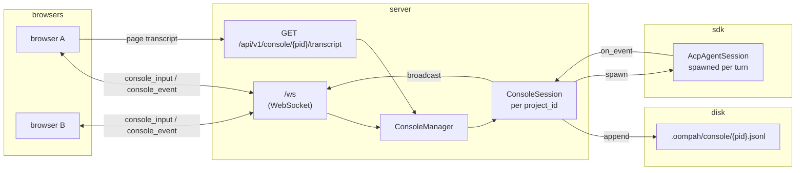
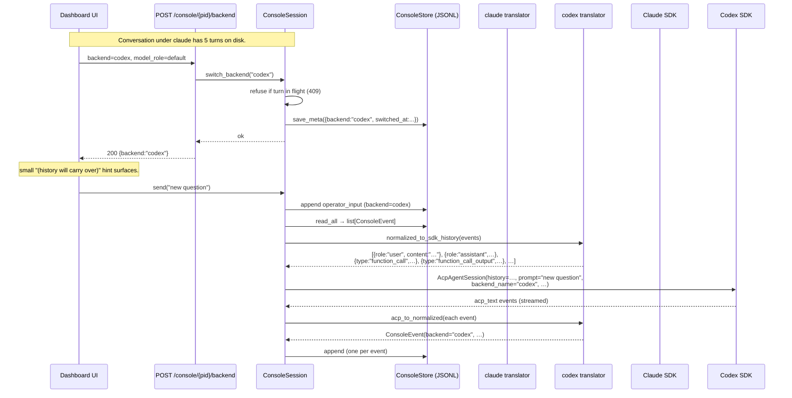

# Per-project ACP console

**Status:** shipped via oompah-zlz_2-ebwe.

**Why:** Operators kept a shell open next to the dashboard for planning,
asking the model for help, closing beads by hand. oompah already drives
ACP sessions via `acp_agent.py` for worker dispatch — the console gives
the operator the same SDK + tool catalog, no context-switching.

## Shape



One project, one session, many viewers. The JSONL on disk IS the
canonical state of the conversation; service restarts simply read it
back on the next operator message.

## Files

* `oompah/console.py` — `ConsoleStore`, `ConsoleSession`,
  `ConsoleManager`, `render_transcript_as_prompt`.
* `oompah/server.py` — `_console_manager` global, wired in
  `set_orchestrator()`. WS handler routes `console_input` messages and
  fans `console_event` outputs over the existing `_ws_clients` pool.
  `GET /api/v1/console/{project_id}/transcript` paginates over disk.
* `oompah/templates/dashboard.html` — `console-overlay` panel + JS
  glue (`openConsolePanel`, `sendConsoleMessage`, `handleConsoleEvent`).

## Lifecycle

1. **Open the Console panel.** UI calls
   `GET /api/v1/console/{pid}/transcript?limit=200`. Server reads from
   `ConsoleStore` directly (no session needed); UI renders existing
   chat history.
2. **Operator types a message and hits Send.** UI emits
   `{type:"console_input", project_id, text, attachments?}` over WS.
3. **Server enqueues.** `_handle_console_input` calls
   `ConsoleManager.get_or_create(project_id)`, then
   `session.ensure_runner(loop)`, then `session.submit(text, ...)`.
   The session's asyncio.Queue serializes concurrent operator inputs.
4. **Background runner pulls one item at a time.** For each turn:
   * Append `operator_input` event to JSONL + broadcast to WS.
   * Call `resolve_backend(project_id)` — looks up project's
     `default` role → provider → provider.backend (default
     `"claude"`). Returns `{backend_name, model, permission_mode,
     beads_dir}`.
   * Build tool catalog: `build_tool_catalog(workspace_path,
     beads_dir=...)` for Claude, `build_codex_tool_catalog(...)` for
     Codex. The catalogs share the same `_exec_*` helpers as the worker
     dispatch path, so `cd`-out-of-worktree guard, `BEADS_DIR` routing,
     and per-command timeouts apply.
   * Build the prompt via `render_transcript_as_prompt(transcript,
     new_input=...)`. Replays Operator:/Assistant:/tool-use lines so
     the SDK has full conversational context. Caps history at 200
     events to keep prompts bounded (UI still shows all history).
   * Spawn a fresh `AcpAgentSession`. Each `acp_*` event the SDK
     emits is forwarded through `_on_event` into both
     `ConsoleStore.append(...)` and the WS broadcast.
5. **Turn ends.** `console_status` / `acp_result` events flow to
   clients; the runner pulls the next item.

## Design decisions

* **Per-input serialization, no concurrency.** Two operators typing
  at once → the second message queues server-side until the first
  turn completes. v1 just queues; v2 could surface "X is typing".

* **Replay-on-every-turn rather than in-memory ClaudeSDKClient
  reuse.** The Claude Agent SDK / openai-agents SDKs are
  session-shaped, but oompah's `AcpAgentSession` is single-turn
  (prompt-in, response-out). Reusing the worker path's machinery is
  vastly simpler than holding a long-lived SDK session open per
  project. Slightly more tokens per turn; the transcript JSONL is
  canonical, in-memory is just a cache for fast renders.

* **Permission mode `acceptEdits`.** The operator is the human gate
  sitting at the browser. The console is interactive by design.

* **No worker-bead coupling.** The console session does NOT claim or
  close beads on the operator's behalf via the dispatch loop — it
  just gives the operator a chat interface with tool access. The
  operator can still ask "close oompah-zlz_2-foo with reason X" and
  the model will use `run_command("bd close oompah-zlz_2-foo ...")`,
  but that's an explicit tool call, not orchestrator dispatch.

* **Cost accounting.** Per-token billing meters against the
  project's chosen provider via the same `_estimate_cost` path
  workers use. ACP-subscription providers bypass the budget gate.
  The console does NOT roll its tokens into the global per-tick
  budget pool — it's a separate interactive surface, billing flows
  through the SDK's terminal `total_cost_usd` on each turn's
  `acp_result` event.

* **Storage.** `.oompah/console/<project_id>.jsonl` is gitignored
  (transitively via `.oompah/` and explicitly via `.oompah/console/`
  in the root `.gitignore`). Manual `cp` is the v1 export path.

## What's out of scope (deliberately deferred)

* Multi-project conversations from one input. (Operator switches
  projects via the dropdown.)
* Sharing transcripts across projects.
* Transcript search / export to git.
* Branching conversations (single linear thread per project).
* Real attachment upload from the console panel. v1 just stashes
  filenames in the input payload so the operator can see what's
  queued; the bead-detail dropzone is the canonical attachment path.
* Hot model swap mid-turn.

## Testing

* `tests/test_console.py` — 24 cases covering ConsoleStore (append,
  read, pagination, malformed-line resilience, oversize event
  truncation, project_id sanitization), `render_transcript_as_prompt`
  (history cap, role formatting, tool inlining), ConsoleSession
  (submit persistence, broadcast fan-out, concurrent serialization,
  restart replay), and ConsoleManager (lazy construction, unknown
  project handling).
* `tests/test_server_console.py` — 6 cases covering the
  `GET /api/v1/console/{pid}/transcript` endpoint (empty / persisted /
  unknown project / not-initialized / limit cap / pagination).
* `tests/test_console_translator_claude.py` — 81 cases covering the
  Claude-dialect translator (every acp_* kind mapping, history
  builder with strict role alternation, attachment surfacing, tool-
  block dropping when id link missing).
* `tests/test_console_translator_codex.py` — 49 cases covering the
  Codex-dialect translator (every acp_* kind mapping, openai-agents
  input-item history shape, function_call / function_call_output
  pairing, JSON-encoded arguments string).
* `tests/test_console_crossagent.py` — 5 cases verifying end-to-end
  cross-agent continuity (see § "Backend switching" below).

## Backend switching

The console session belongs to a project, not to a backend. Operators
can flip backends mid-conversation via the dashboard's
`console-backend-select` dropdown — the prior transcript is replayed
into the new SDK on the next turn, preserving full context.

### Detailed walkthrough



The mid-conversation switch is **atomic from the JSONL's point of
view**: the meta sidecar update happens before the next `send()`, and
the next operator_input is the first event stamped with the new
backend.

### How a switch renders in the transcript

The UI emits a single `session_meta` line ("--- Switched to Codex
---") on the operator's screen at the moment of the swap. The
underlying JSONL doesn't carry a separate "switch" event — the
backend stamp on subsequent rows is the canonical signal. The UI's
event-render path (`renderConsoleEvent` in `dashboard.html`) groups
adjacent rows by backend and inserts the divider on transitions.

Example transcript fragment (excerpts; one event per line):

```jsonl
{"ts":"2026-05-13T19:00:00Z","kind":"operator_input","backend":"claude","text":"what's in README?"}
{"ts":"2026-05-13T19:00:01Z","kind":"agent_text","backend":"claude","text":"I'll read it."}
{"ts":"2026-05-13T19:00:02Z","kind":"tool_call","backend":"claude","tool":"read_file","args":{"path":"README.md","_tool_use_id":"tu_1"}}
{"ts":"2026-05-13T19:00:03Z","kind":"tool_result","backend":"claude","result":{"tool_use_id":"tu_1","content":"# Project"}}
{"ts":"2026-05-13T19:00:04Z","kind":"agent_text","backend":"claude","text":"It says \"# Project\"."}
{"ts":"2026-05-13T19:01:00Z","kind":"operator_input","backend":"codex","text":"summarize"}
{"ts":"2026-05-13T19:01:01Z","kind":"agent_text","backend":"codex","text":"The README has a single heading."}
```

Rendered as:

```
[19:00:00] operator: what's in README?
[19:00:01] claude:   I'll read it.
[19:00:02] claude:   $ read_file(path=README.md)
[19:00:03] tool:     # Project
[19:00:04] claude:   It says "# Project".
─── Switched to Codex ───
[19:01:00] operator: summarize
[19:01:01] codex:    The README has a single heading.
```

### Replay into a new backend

The "replay" is mechanically simple but the **format adaptation** is
where the backends differ. Both translators read the same normalized
`ConsoleEvent` stream from disk and emit the SDK-native history
shape.

| Normalized kind   | Claude translator emits (role, content[]) | Codex translator emits (input item) |
| ----------------- | ----------------------------------------- | ----------------------------------- |
| `operator_input`  | `{role:"user", content:[{type:"text",text:…},…]}` | `{role:"user", content:str}` |
| `agent_text`      | `{role:"assistant", content:[{type:"text",text:…}]}` (coalesced) | `{role:"assistant", content:str}` |
| `tool_call`       | assistant `{type:"tool_use", id, name, input}` block | `{type:"function_call", name, arguments:JSON-string, call_id}` |
| `tool_result`     | user `{type:"tool_result", tool_use_id, content}` block | `{type:"function_call_output", call_id, output:str}` |
| `agent_thinking`  | skipped (not model input) | skipped |
| `permission`      | skipped | skipped |
| `session_meta`    | skipped | skipped |
| `error`           | skipped | skipped |

Both translators **drop tool blocks missing their id link** — the
SDKs reject unanchored tool turns and a partial-tool block in the
history would prevent the agent from doing anything else that turn.

Claude requires **strict role alternation** (the Anthropic Messages
API rejects two adjacent same-role messages), so the Claude
translator coalesces adjacent `agent_text` + `tool_call` events into
one assistant message and merges `tool_result` blocks into the next
user message. Codex's openai-agents SDK has no such constraint — two
consecutive `agent_text` events become two `assistant` items.

The `arguments` field on a codex `function_call` is a
**JSON-encoded string**, not a dict — this matches the OpenAI
Responses API spec the openai-agents SDK forwards to. Translators
encode at the boundary so the SDK accepts the input verbatim.

### Cross-agent continuity

Once the meta sidecar records the new backend, every subsequent turn:

1. Reads the on-disk transcript (every prior event, regardless of
   which backend produced it).
2. Runs it through the **new** backend's translator.
3. Hands the SDK-shaped history to a fresh `AcpAgentSession` along
   with the new operator prompt.

The agent therefore receives turn N+1 with the full prior context.
Switching back to a previously-used backend works identically — the
JSONL is the source of truth; the in-memory SDK session is
disposable.

End-to-end: `tests/test_console_crossagent.py` drives claude → codex
→ claude across 4 turns and asserts every prior turn is present in
each new backend's `history=` kwarg.

### v1 policy: serial, not concurrent

* **One active backend per session.** A backend swap takes effect on
  the next turn; the in-flight turn (if any) refuses the swap with
  HTTP 409 and runs to completion under the original backend.
* **No per-message backend pinning.** "Send this turn to codex only"
  is out of scope for v1.
* **No concurrent backends.** Two SDK sessions active on the same
  project at once isn't supported — operators serialize manually by
  waiting for the prior turn to complete.
