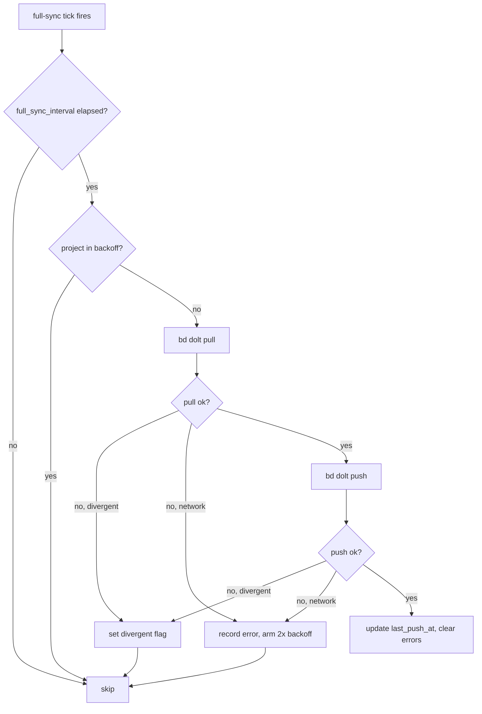

# Dolt sync watchdog

> Internal design note for the per-project `bd dolt push/pull` watchdog
> introduced in oompah-zlz_2-5ms2.

This is beads-only infrastructure. The Backlog.md tracker planned in
`plans/tracker-backends.md` should use ordinary git/file sync semantics, and
there is no planned beans sync path.

## Problem

Before this watchdog, oompah called `bd dolt pull` exactly once per
project at startup (`oompah/projects.py` → `sync_project_sources`) and
never pushed. Local bead changes from agents (close, comment, status,
auto-archive, `bd remember` notes) commit to the per-project local Dolt
database but never reach the upstream — even though `sync.remote` is
configured in `.beads/config.yaml`.

Symptoms operators saw:

- A fresh checkout on another machine pulls stale beads — issues marked
  `closed` here still show `open` there.
- `bd remember` insights collected on one machine never become visible
  on others.
- Remote-side edits made via another machine never reach the running
  orchestrator until it restarts.

## Design

A small background watchdog runs on the orchestrator's existing
full-sync tick (`full_sync_interval_ms`, default 120 s). Per project, on
each fire:

All `bd` invocations are time-bound to a few seconds via
`subprocess.run(timeout=...)` — a slow remote cannot wedge the
orchestrator tick. The watchdog never raises; every failure path
records into the per-project `DoltSyncState`.

### State

`oompah.dolt_sync.DoltSyncState`:

- `last_push_at`, `last_pull_at` — UTC datetimes of the most recent
  successful push/pull. `None` until the first successful sync.
- `last_error`, `last_error_at` — short message + timestamp of the most
  recent failure. Cleared on first success.
- `divergent` — `True` when the local and remote histories have
  diverged. The watchdog will not auto-resolve this; an operator must
  merge by hand. Cleared when a subsequent pull succeeds.
- `consecutive_errors` — incrementing counter; resets to 0 on success.
- `next_attempt_monotonic` — monotonic-clock seconds until which this
  project will be skipped (backoff). Set to `now + 2 * interval` on any
  error.

### Backoff

The backoff multiplier is `2x` the existing full-sync interval. With
the default 120 s interval, a single transient error (rate limit, DNS
hiccup) defers the next attempt by 240 s — enough to spread retries
across multiple ticks while still recovering quickly. The first
successful sync clears `next_attempt_monotonic` back to 0.

### Cadence gating

The watchdog uses a separate `_last_dolt_sync_monotonic` field rather
than the orchestrator's `_last_full_sync` because the latter is updated
on every event-driven tick (not just FULL_SYNC events). The dolt sync
should follow the same cadence as the "safety-net full sync" — checked
against `full_sync_interval_ms` from the most recent successful (or
attempted) sync.

### Surfaces

- **HTTP**: `GET /api/v1/orchestrator/dolt-sync` returns the per-project
  state map. Also exposed in the WebSocket `state` snapshot as
  `dolt_sync: {project_id: {...}}`.
- **Alerts**: divergent projects emit a red `level=error` alert in
  `state.alerts` with `source=dolt_sync`; projects with ≥3 consecutive
  errors emit a yellow `level=warning` alert. These render in the
  dashboard's existing alert strip.
- **Dashboard indicator**: a small `Dolt sync: ok / N min ago` chip in
  the agent bar, color-coded green/yellow/red based on overall health.

### Failure modes

| Scenario | Detection | Behavior |
| --- | --- | --- |
| Network/transient | non-zero exit, no divergence keywords | record error, arm 2x backoff |
| Subprocess timeout | `TimeoutExpired` | record error, arm backoff |
| bd CLI missing | `FileNotFoundError` | record error, arm backoff |
| Diverged history (pull) | stderr contains `non-fast-forward`, `diverged`, `merge conflict`, `unrelated histories` | set `divergent=True`, alert, skip push |
| Diverged history (push) | same | set `divergent=True`, alert |
| No `.beads/` dir | filesystem check | skip silently |
| In backoff window | `next_attempt_monotonic > now` | skip silently |

## Out of scope

- Pushing on every agent close (redundant with periodic sync; noisy on
  push-heavy days).
- Cross-project sync ordering or transactions — each project's Dolt is
  independent.
- Migrating off the `bd` CLI to a direct Dolt-library call — the CLI is
  fine for v1.
- Auto-resolving diverged history. The watchdog flags it; the operator
  decides.
