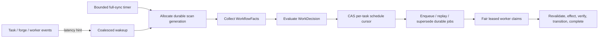

# Durable workflow scheduling

`oompah.workflow_scheduler.WorkflowJobScheduler` is the bridge from total
`WorkDecision` values to the leased workflow-job ledger. It removes events,
futures, cooldown maps, and timer callbacks from the correctness boundary.
Those process-local mechanisms may wake the scheduler sooner, but a bounded
full sync and durable SQLite state determine what work exists and who owns it.

## Scheduling fence

The store allocates scan generations before a caller fetches a snapshot. A
slow earlier scan therefore cannot overwrite a later one. Each project/task
cursor persists the latest scan generation, semantic decision revision, and an
activation-specific job generation.

The activation generation is deliberately distinct from the content revision.
A task can move from decision A to B and later legitimately return to A. Since
superseded job rows are immutable, the later A needs a new activation even
though its semantic content hash matches the historical A. Repeated scans that
remain on A reuse the same activation and idempotency keys.

Cursor activation and job materialization use two durable transactions. A
crash between them is safe: the next event or full sync observes the cursor and
finishes materialization. Job materialization atomically enqueues every current
action and supersedes all active jobs outside the cursor's activation. An empty
`durable_jobs` decision therefore fences obsolete automatic recovery work.

## Ownership and fairness

SQLite `BEGIN IMMEDIATE` transactions serialize claims across processes. A
claim excludes any task that already has a running job, so different actions
for one project/task cannot execute concurrently. Unrelated tasks remain
parallel.

Fair global claims persist a last-claim sequence per project. Projects with no
recent claim sort before projects that just consumed capacity, and the sequence
survives scheduler restart. Priority, availability time, and FIFO order remain
the tie breakers within that project-fair ordering.

Expired leases are recovered during claims. An exclusive replacement process
may additionally recover all abandoned leases immediately at startup; a
rolling deployment should rely on expiry unless it can prove the old scheduler
has stopped. Graceful drain stops new claims and waits for active resumable
workers without cancelling them.

## Events, recovery, and health

Wakeups are coalesced process-locally and never persisted because dropping one
cannot lose work. `serve()` reconciles immediately, after a wakeup, and after
every configured full-sync timeout. Each pass and each worker drain is bounded.
When the decision corpus exceeds one pass, a durable rotating offset advances
the next window so deterministic truncation cannot starve task identities at
the end of the sort order, even across restarts.

`WorkflowJobStore.health_snapshot()` exposes aggregate state counts, active and
expired leases, waiting and due retries, oldest available age, task cursor
generation, durable fairness participation, and bounded per-project counts. It
contains no lease tokens or job payloads. The orchestrator publishes this as
`workflow_jobs` in the normal state/WebSocket snapshot; global dashboard alerts
remain reserved for genuinely operator-actionable decisions.

Domain migrations register idempotent handlers and enable enforcement one
domain at a time. Until a domain is cut over, its legacy consumer remains the
mutating path; shadow decisions can be compared without creating durable work.
