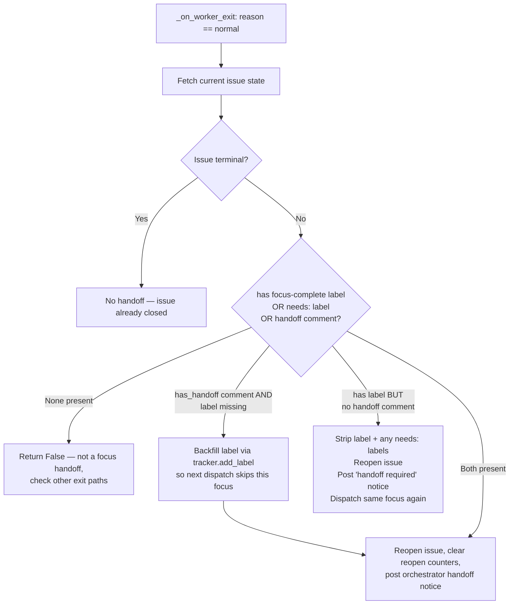

# Focus agent handoff and mutation protocol

> **Status: implemented.** This document describes the shipped mechanism
> that allows focus agents to record their handoff without HTTP self-calls.
> The motivating incident was EXOCOMP-55, where duplicate screening completed
> but could not persist its handoff and was retried repeatedly.

## Problem

Each agent session is scoped to one focus phase. When the phase is done
the agent must atomically record two facts before it exits:

1. A **handoff comment** headed `Focus handoff: <focus-name>` — the
   durable, human-readable evidence of completion.
2. A **completion label** `focus-complete:<focus-name>` — the
   machine-readable signal used by `select_focus` to skip the finished
   phase on the next dispatch.

EXOCOMP-55 revealed two gaps that made this unreliable:

- The agent ran in an environment where project instructions prohibited
  direct HTTP calls to the local oompah server (`http://127.0.0.1:<port>`
  deadlocks the server because the same process services the MCP tool call
  that is trying to call it).
- No alternative mutation path existed: the ACP tool catalog didn't yet
  route `oompah task add-label` in-process.

The result was a completed duplicate_detector focus that couldn't add its
`focus-complete:duplicate_detector` label. On each subsequent tick the
orchestrator saw the issue in `In Progress` with no terminal marker and
re-dispatched a fresh duplicate-screening agent.

## Solution

Two approved mutation paths are available for focus agents inside oompah's
managed agent harness:

### Primary path: ACP `run_command` interceptor

`oompah/acp_tools.py:_exec_oompah_task_command` intercepts `oompah task`
CLI commands before shell execution and routes them directly to the
tracker in-process. This avoids any HTTP round-trip.

Intercepted subcommands and their in-process actions:

| Subcommand | Tracker call | Notes |
|---|---|---|
| `comment` | `tracker.add_comment(id, msg, author=...)` | No policy gate |
| `set-status` | `tracker.update_issue(id, status=...)` + optional comment | Requires `TASK_STATUS_TRANSITION` policy |
| `add-label` | `tracker.add_label(id, label)` | Requires `TASK_STATUS_TRANSITION` policy |
| `remove-label` | `tracker.remove_label(id, label)` | Requires `TASK_STATUS_TRANSITION` policy |
| `view` | `tracker.fetch_issue_detail(id)` | No policy gate |
| `set-dependency` | `tracker.add_dependency(id, dep_id)` | No policy gate |
| `create` | `tracker.create_issue(...)` | Requires `TASK_CREATE_DECOMPOSE` policy |
| `child-create` | `tracker.create_issue(parent=...)` | Requires `TASK_CREATE_DECOMPOSE` policy |

Compound commands (`cmd1 && cmd2`) are rejected with an error to prevent
shell injection through the interceptor.

When the interceptor matches, `_wrap_text(result)` is returned immediately
and the shell is never invoked. When no match, the command falls through
to normal shell execution.

**Integration point:** `build_tool_catalog` wires `_exec_oompah_task_command`
into the `run_command` tool handler for every ACP agent session (see
`oompah/acp_tools.py`). This is also wired into the Codex tool catalog
via `build_codex_tool_catalog`.

### Fallback path: MCP tracker tools

When the ACP interceptor is unavailable (e.g., a non-oompah agent harness),
agents should use the MCP tools provided in the tool catalog:

- `mcp__oompah__get_project` — read current project tracker settings
- `mcp__oompah__update_project` — mutate project tracker settings

For task-level mutations (comments, labels, status) in environments where
the ACP interceptor is unavailable, the operator must ensure that the
appropriate MCP tools are exposed. The OpenAPI-to-MCP gateway (planned in
`plans/mcp-openapi-exposure-policy.md`, tracked as OOMPAH-420) extends
this coverage to TASK_MUTATION routes.

**NEVER** fall back to raw `oompah task` subprocess calls (`curl`,
`subprocess`, `httpx`) — these deadlock the oompah server.

## Required handoff sequence

A focus agent that has completed its phase must perform these steps **in
order** before exiting:

```bash
# 1. Post the handoff comment (primary evidence — required)
oompah task comment <task-id> \
  --message "Focus handoff: <focus-name>

  1. Outcome: ...
  2. Evidence: relevant files, commands, decisions
  3. Remaining work or risks: ...
  4. Recommended next focus: <name>" \
  --author oompah

# 2. Record the completion label (machine-readable signal)
oompah task add-label <task-id> focus-complete:<focus-name>

# 3. (Optional) Request a specific next focus
oompah task add-label <task-id> needs:<next-focus-name>
```

Both commands are intercepted in-process by `_exec_oompah_task_command`
and never touch the HTTP server.

## Recovery behavior in `_handoff_completed_focus`

`Orchestrator._handoff_completed_focus` runs inside `_on_worker_exit`
whenever a worker exits normally. It implements a recovery-first design
because agents sometimes post the handoff comment but then fail before
adding the label (or vice versa).

The logic, in priority order:



**Key invariant:** The comment is the *durable* handoff evidence. A label
without a comment is treated as unreliable (the agent may have added the
label programmatically after a partial run). A comment without a label is
treated as a complete handoff where label creation was lost — the
orchestrator backfills the label.

This means agents must post the comment **first**, then the label. Reversing
the order risks the orchestrator seeing a label without a comment on the
next tick (e.g., between label-add and comment-post) and re-dispatching the
same focus.

## How `select_focus` skips a completed phase

`focus.py:select_focus` calls `_completed_focus_names(issue)` to extract the
set of focus names from all `focus-complete:<name>` labels on the issue. Any
focus whose name is in that set is **skipped entirely** before scoring — it
never enters `score_focus`. This means the completed phase cannot win even
if its keywords dominate the issue description.

Separately, `_apply_duplicate_detection` in `orchestrator.py` skips scanning
any candidate that already carries a `focus-complete:duplicate_detector` label.
This prevents the orchestrator from re-flagging an already-screened task as a
new duplicate.

When an issue has `focus-complete:duplicate_detector` but no `needs:` label,
`select_focus` excludes `duplicate_detector` from consideration entirely and
picks the next best match (typically `feature` for an implementation task, or
`docs` for a documentation task).

## Regression gaps (coverage needed)

Two test gaps remain that were identified during EXOCOMP-55 analysis:

### 1. `test_acp_project_tools.py` — `add-label` via `_exec_oompah_task_command`

`TestExecOompahTaskCommand` covers `comment`, `set-status`, and `view`
but not `add-label`. A test should verify:

- `oompah task add-label <id> focus-complete:duplicate_detector` routes to
  `tracker.add_label(id, "focus-complete:duplicate_detector")` without
  subprocess execution.
- The ACP `run_command` tool handler (via `build_tool_catalog`) similarly
  intercepts `add-label` and returns `"Label added: focus-complete:duplicate_detector"`.
- Compound commands (`oompah task add-label … && echo done`) are rejected.

### 2. `test_orchestrator_duplicate_detection.py` — no-commit focus completion pipeline

A regression test should verify the full pipeline:

> A no-commit `duplicate_detector` run (no code changes, no git commits)
> that posts its handoff comment and adds its completion label advances to a
> `feature` focus on the next dispatch — not another `duplicate_detector` run.

Required steps:
1. Build a minimal `Orchestrator` with a mock tracker.
2. Simulate `_on_worker_exit(issue_id, "normal", None)` for an issue whose
   `RunningEntry.focus_name == "duplicate_detector"`.
3. Have the mock tracker return an issue with label
   `focus-complete:duplicate_detector` and a comment whose text starts with
   `Focus handoff: duplicate_detector`.
4. Assert that `_handoff_completed_focus` returns `True`.
5. Assert that the issue's state is set to `Open`.
6. Assert that `select_focus(reopened_issue)` returns a focus whose name is
   **not** `duplicate_detector` (e.g., `feature`).

This test closes the loop from EXOCOMP-55: a no-commit phase that correctly
records its handoff must not be repeated.
