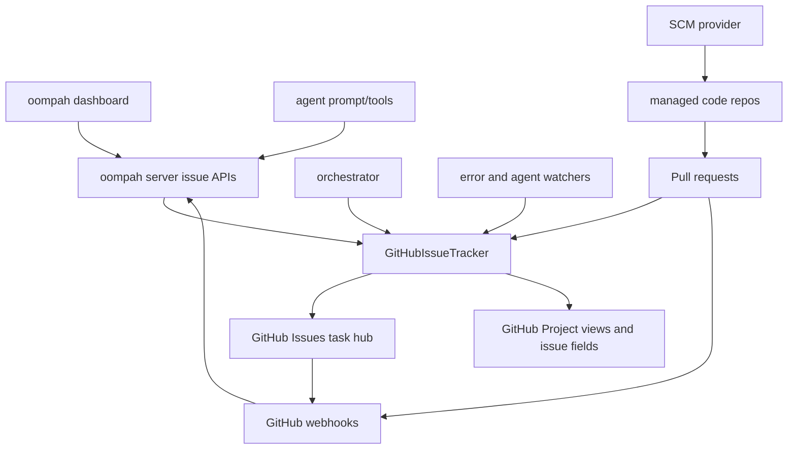

# GitHub Issues Tracker Migration Plan

## Status

Proposed.

## Goal

Move oompah's canonical task tracking for new work from Backlog.md files in
managed git repositories to GitHub Issues, so task identifiers are allocated by
GitHub instead of independently inside branch-local task files.

This plan intentionally does not migrate existing Backlog.md tasks. Existing
Backlog.md task files remain where they are. The migration is a cutover for new
task creation and future task state management.

## Problem

Backlog.md stores tasks as files in git. That makes task text and history easy
to inspect, but it also means task number allocation happens in a working tree.
Two branches can independently create the same next task number, and git only
detects the collision later when branches are reconciled. oompah has already
added self-healing and conflict repair around Backlog.md files, but that is
treating the symptom. The missing primitive is a single serialized allocator
for task identities.

GitHub already has that allocator: issue numbers are assigned server-side per
issue repository. GitHub Issues also provide comments, labels, milestones,
issue types, sub-issues, dependencies, PR links, webhooks, and API access.

## Non-Goals

- Do not migrate existing Backlog.md tasks into GitHub Issues.
- Do not preserve Backlog.md task numbers as GitHub issue numbers.
- Do not make GitHub Wiki the task store. Wiki pages are still git-backed
  documentation files and would recreate the distributed file problem with
  fewer task-management primitives.
- Do not require every managed code repository to enable its own GitHub Issues
  tab.
- Do not rely on GitHub's automatic issue closure as the only source of truth
  for oompah task completion.

## GitHub Capabilities Used

The target design uses these GitHub features:

- GitHub Issues as the canonical task records.
- GitHub issue numbers as server-allocated task identifiers.
- Issue comments as the canonical conversation log.
- Labels and issue types for coarse classification and agent routing.
- Issue fields for structured metadata such as oompah status, priority,
  managed repo, target branch, agent state, and backport targets.
- Sub-issues for epic-child hierarchy.
- Issue dependencies for blocked-by relationships.
- GitHub Projects for board/table/roadmap views, not as the canonical data
  store.
- GitHub webhooks for issues, issue comments, labels, project fields, pull
  requests, and pushes.
- PR links and explicit oompah reconciliation for review state.

Relevant GitHub docs:

- Issues, sub-issues, dependencies, metadata, and PR integration:
  https://docs.github.com/en/issues/tracking-your-work-with-issues/learning-about-issues/about-issues
- Projects, views, and custom fields:
  https://docs.github.com/en/issues/planning-and-tracking-with-projects
- Issue fields public preview:
  https://github.blog/changelog/2026-05-21-issue-fields-are-now-in-public-preview-for-all-organizations/
- PR-to-issue linking caveat: automatic closing keywords are interpreted only
  for PRs targeting the repository default branch:
  https://docs.github.com/en/issues/tracking-your-work-with-issues/using-issues/linking-a-pull-request-to-an-issue

## Recommended Task Topology

Use one central GitHub repository as the oompah task hub, for example:

```text
lesserevil/oompah-tasks
```

Every managed project's oompah task is a GitHub Issue in that hub. A task that
targets trickle would be displayed as something like:

```text
oompah-tasks#1234 - managed repo: lesserevil/trickle
```

This is preferred over per-repository issues because it gives oompah one global
task namespace, one board, one API surface, and no ambiguity between
`trickle#730`, `aethel#730`, and `oompah#730`.

Per-repository GitHub Issues can remain a future option, but if implemented the
identifier must always be fully qualified as `owner/repo#number`. Bare numeric
identifiers must never be accepted by oompah.

## Target Architecture



The repository still remains the source of truth for code. GitHub Issues become
the source of truth for task identity, task state, task metadata, comments, and
agent-facing task context.

## Canonical Data Model

### Identifier

Add an explicit tracker identifier model instead of assuming a Backlog-style
string:

```text
tracker_kind: github_issues
tracker_owner: lesserevil
tracker_repo: oompah-tasks
issue_number: 1234
identifier: lesserevil/oompah-tasks#1234
display_identifier: tasks#1234
```

Rules:

- `Issue.id` should store the stable GitHub node ID or REST database ID.
- `Issue.identifier` should be globally unique and parseable.
- UI can display a short form, but APIs, branch metadata, logs, and comments
  should retain the fully qualified identifier.
- Existing Backlog.md identifiers keep their current string shape while legacy
  mode exists.

### Branch Names

Branch names must not be derived from bare issue numbers. Use a stable,
sanitized form:

```text
oompah/<project-slug>/gh-1234
```

For epics:

```text
oompah/<project-slug>/epic-gh-1234
```

For release picks:

```text
oompah/<project-slug>/gh-1234-to-release-1.2
```

Store the actual branch name in GitHub issue metadata so review reconciliation
does not need to guess by task ID.

### Status

Create a single-select GitHub issue field named `Oompah Status` with the
current lifecycle values:

- Backlog
- Open
- In Progress
- Needs Answer
- Needs Human
- Needs CI Fix
- Needs Rebase
- In Review
- Decomposed
- Duplicate Candidate
- Done
- Merged
- Archived

This field is the canonical status for GitHub-backed tasks. Labels can mirror
some states for GitHub-native filtering, but labels must not become a second
status source.

### Structured Fields

Create these issue fields in the task hub repository or organization:

| Field | Type | Purpose |
| --- | --- | --- |
| `Oompah Status` | single select | Canonical task state |
| `Managed Repo` | text or single select | Target code repo, for example `lesserevil/trickle` |
| `Project ID` | text | oompah's internal project ID |
| `Target Branch` | text | Task base branch, for example `main` or `release/1.2` |
| `Work Branch` | text | Branch created for the agent |
| `Priority` | single select or number | Dispatch priority |
| `Focus` | text or single select | Agent focus routing hint |
| `Agent State` | single select | None, running, retrying, stalled, question, etc. |
| `Agent Run ID` | text | Current or most recent oompah run ID |
| `Review URL` | text | Linked PR URL when in review |
| `Review Number` | number | PR number when available |
| `Backport Targets` | text | JSON or compact list of release-pick targets |
| `Legacy Backlog ID` | text | Optional reference only, never canonical |

If issue fields are unavailable in a deployment, use labels for low-cardinality
values and a hidden metadata block in the issue body for structured values:

```text
<!-- oompah:metadata
{"project_id":"proj-123","target_branch":"main","work_branch":"oompah/trickle/gh-1234"}
-->
```

The adapter should hide that fallback from the rest of oompah.

### Issue Types and Labels

Use GitHub issue types for:

- task
- bug
- feature
- epic
- chore

Use labels for:

- agent focus routing, for example `needs:frontend`
- domain tags, for example `area:api`
- operational hints, for example `p0`, `merge-conflict`, `asking_question`

Do not encode status as labels except as a non-canonical mirror for humans.

### Hierarchy and Dependencies

Preferred:

- Epics are GitHub Issues with issue type `epic`.
- Epic children use GitHub sub-issues.
- Blockers use GitHub issue dependencies.

Fallback:

- If the API surface for sub-issues or dependencies is insufficient for an
  oompah operation, store the relationship in issue metadata and render it in
  the dashboard. Keep the adapter API stable so the fallback can be removed
  later.

## Tracker Adapter Work

### Introduce a Tracker Protocol

`oompah/tracker.py` currently exposes `BacklogMdTracker` directly. Add a small
protocol or abstract base that captures what the orchestrator and server
actually need:

- `fetch_candidate_issues()`
- `fetch_all_issues()`
- `fetch_all_issues_enriched()`
- `fetch_issue_detail(identifier)`
- `fetch_children(identifier_or_id)`
- `fetch_comments(identifier)`
- `create_issue(...)`
- `update_issue(identifier, **fields)`
- `close_issue(identifier, reason=None)`
- `reopen_issue(identifier)`
- `archive_issue(identifier)`
- `add_comment(identifier, text, author)`
- `add_label(identifier, label)`
- `remove_label(identifier, label)`
- `add_dependency(identifier, depends_on)`
- `get_metadata(identifier)`
- `set_metadata_field(identifier, key, value)`
- `fetch_issues_by_states(states)`
- `fetch_issues_by_labels(labels, states=None)`
- `fetch_issue_states_by_ids(ids)`
- `is_archived(issue)`
- `invalidate_read_cache()`

Then make both `BacklogMdTracker` and `GitHubIssueTracker` implement the same
contract.

### Implement GitHubIssueTracker

Add a new module, likely `oompah/github_tracker.py`, responsible for all GitHub
Issue and Project API calls.

Responsibilities:

- Parse and format fully qualified issue identifiers.
- Fetch issues from the configured task hub.
- Filter by `Oompah Status`, managed repo, labels, and project ID.
- Create issues with the correct issue type, fields, labels, and project item.
- Update issue fields and body metadata.
- Read/write comments.
- Read/write labels.
- Read/write sub-issue and dependency relationships when available.
- Hide GitHub REST vs GraphQL differences from the rest of oompah.
- Cache reads with short TTLs and ETag support where possible.
- Normalize GitHub API errors into `TrackerError` and `TrackerTimeoutError`.

Use a GitHub App installation token as the preferred auth model. A PAT or
`gh` CLI fallback can remain useful for development, but production managed
repos should not depend on a human's local `gh` auth state.

### Adapter Contract Tests

Create shared tracker contract tests that run against a fake tracker
implementation and mocked Backlog/GitHub adapters. The test suite should prove
that the server and orchestrator do not care which backend is active.

Key cases:

- Create issue returns globally unique identifier.
- Comments round-trip.
- Status transitions round-trip.
- Labels round-trip.
- Parent-child relationships round-trip.
- Dependencies round-trip.
- Metadata fields round-trip.
- `fetch_candidate_issues()` sorts consistently.
- Archived issues do not dispatch.
- Missing issue returns `None`, not an exception.

## Configuration Work

### Runtime Config

Extend `tracker.kind` to accept:

```yaml
tracker:
  kind: github_issues
```

Keep `backlog` and `backlog_md` as aliases for the legacy adapter.

New `.env` values:

```text
OOMPAH_GITHUB_TRACKER_OWNER=lesserevil
OOMPAH_GITHUB_TRACKER_REPO=oompah-tasks
OOMPAH_GITHUB_APP_ID=
OOMPAH_GITHUB_APP_PRIVATE_KEY_PATH=
OOMPAH_GITHUB_APP_INSTALLATION_ID=
OOMPAH_GITHUB_TOKEN=
OOMPAH_GITHUB_PROJECT_NODE_ID=
OOMPAH_GITHUB_ISSUE_FIELD_STATUS=Oompah Status
```

Use `.env` for tunables and credentials. Keep WORKFLOW.md as the workflow
shape and prompt template.

### Project Config

Extend `Project` in `oompah/models.py` with tracker-specific fields:

```python
tracker_kind: str | None = None
tracker_owner: str | None = None
tracker_repo: str | None = None
github_project_node_id: str | None = None
legacy_backlog_enabled: bool = False
legacy_backlog_dispatch: bool = False
```

Rules:

- If `tracker_kind` is unset, fall back to global config.
- New projects default to `github_issues`.
- Existing projects can be cut over one at a time.
- `legacy_backlog_enabled` means oompah may still read old Backlog.md tasks.
- `legacy_backlog_dispatch` controls whether old Backlog.md tasks are still
  eligible for dispatch.
- No project should create new Backlog.md tasks once `tracker_kind` is
  `github_issues`.

## Server API Work

The existing `/api/v1/issues` endpoints should remain backend-neutral. Most
callers should not know whether the issue came from Backlog.md or GitHub.

Affected endpoints:

- `GET /api/v1/issues`
- `POST /api/v1/issues`
- `PATCH /api/v1/issues/{identifier}`
- `POST /api/v1/issues/{identifier}/labels`
- `DELETE /api/v1/issues/{identifier}/labels/{label}`
- `GET /api/v1/issues/{identifier}/comments`
- `POST /api/v1/issues/{identifier}/comments`
- `GET /api/v1/issues/{identifier}/detail`
- attachment endpoints
- issue enhancement endpoints

Required changes:

- Accept fully qualified GitHub issue identifiers in route params. URL-encode
  slashes or support a separate `issue_key` query field.
- Require `project_id` or `managed_repo` for new issue creation.
- Populate GitHub issue fields from create/update requests.
- Return `url` pointing to the GitHub issue.
- Include `tracker_kind`, `tracker_owner`, `tracker_repo`, `issue_number`, and
  `display_identifier` in issue JSON.
- Invalidate issue caches on GitHub webhook receipt.
- Keep Backlog.md behavior only for projects still in legacy mode.

## Dashboard Work

Update the dashboard to treat tracker identity as structured data.

Issue board:

- Display short identifiers such as `tasks#1234`.
- Link cards to the GitHub issue URL.
- Filter by managed project using the `Managed Repo` or `Project ID` field.
- Continue grouping by oompah's canonical status, now read from GitHub issue
  fields.
- Indicate legacy Backlog.md tasks with a small legacy marker until they are
  gone.

Issue detail panel:

- Show GitHub issue URL.
- Show GitHub comments.
- Show sub-issues and blockers from GitHub relationships.
- Show PR links from issue fields and linked review metadata.
- Keep attachment support, but clearly define whether attachments remain in
  the code repo or move to GitHub issue attachments/comments in a later phase.

Create issue modal:

- For GitHub-backed projects, create a GitHub issue via oompah's API.
- Do not expose Backlog.md IDs or task-number controls.
- Require target managed project.
- Offer target branch, priority, issue type, focus labels, and parent epic.

Project management UI:

- Add tracker backend selector.
- Add central tracker repo fields.
- Show cutover status: Backlog legacy, dual-read, GitHub-only.
- Offer a guarded "Cut over new tasks to GitHub Issues" action.
- Warn that existing Backlog.md tasks will not be migrated.

## Prompt and Agent Tooling Work

The prompt must stop teaching agents to use `backlog task create`.

Replace the Backlog.md Quick Reference with a tracker-neutral Oompah Task
Reference:

```text
oompah task view <identifier>
oompah task comment <identifier> --message "..."
oompah task create --project <project-id> --title "..." --description "..."
oompah task child-create <parent-id> --title "..."
oompah task set-status <identifier> Done --summary "..."
oompah task add-label <identifier> needs:frontend
```

Implementation options:

1. Add an `oompah task` CLI that calls the local server API.
2. Add ACP/native tools for task operations and make shell commands a fallback.
3. For GitHub-backed projects only, allow `gh issue` commands for simple
   read/comment operations, but not for status fields unless the wrapper can
   keep metadata consistent.

Recommendation: implement the oompah wrapper and put that in the prompt. The
agent should not need to know whether the backend is GitHub Issues or legacy
Backlog.md.

Required prompt changes:

- Render tracker-specific instructions from the active tracker adapter.
- Remove Backlog.md create/edit commands for GitHub-backed tasks.
- Preserve legacy Backlog instructions only for legacy Backlog tasks.
- Require final status update through oompah task commands.
- Send follow-up tasks to GitHub even when the current task is legacy Backlog.
- Include the GitHub issue URL in the task prompt.

## Orchestrator Work

### Tracker Selection

Update `_tracker_for_project()` and tracker construction so each project can
resolve to either `BacklogMdTracker` or `GitHubIssueTracker`.

Add a tracker registry:

```python
TRACKER_ADAPTERS = {
    "backlog_md": BacklogMdTrackerFactory,
    "github_issues": GitHubIssueTrackerFactory,
}
```

### Dispatch

Dispatch flow should continue to consume normalized `Issue` objects.

Changes:

- `fetch_candidate_issues()` reads GitHub issues by `Oompah Status`.
- Claiming a task updates the GitHub status field to `In Progress` and writes
  `Agent Run ID`.
- Worktree branch name comes from metadata if present; otherwise generate and
  persist it before creating the worktree.
- `Issue.target_branch` comes from the `Target Branch` field.
- `Issue.url` points to the GitHub issue.

Current single-oompah deployments can rely on the service's in-process dispatch
lock. If multiple oompah instances may dispatch from the same GitHub task hub,
add a stronger claim protocol:

- Read current status and `Agent Run ID`.
- Write `In Progress` and a new run ID.
- Re-read immediately.
- Proceed only if the run ID still matches.
- Otherwise release local state and skip.

### Worker Exit and Completion

Backlog-specific worker workspace reads should not apply to GitHub-backed
tasks. In particular, `_fetch_terminal_issue_from_worker_workspace()` exists
because Backlog.md writes can be committed in the worker worktree before the
managed checkout sees them. GitHub-backed tasks update the central issue
directly, so terminal state should be re-read from GitHub.

Changes:

- Gate `_fetch_terminal_issue_from_worker_workspace()` to legacy Backlog only.
- For GitHub-backed tasks, after worker exit call `fetch_issue_detail()` from
  GitHub and use that state.
- Completion verifier comments and reopen operations write to GitHub comments
  and fields.
- Retry cancellation and terminal-state handling remain based on normalized
  status.

### Review and Merge Reconciliation

Current code often resolves a task from a source branch by calling
`tracker.fetch_issue_detail(source_branch)`. That works when branch names equal
Backlog identifiers. It should be replaced by metadata lookups:

- Store `Work Branch` on the GitHub issue when the branch is created.
- Build a per-project branch-to-issue index from open/in-review GitHub issues.
- Use that index for CI fix tasks, merge conflict tasks, stale review
  reconciliation, and YOLO merge updates.

For PR bodies:

- Use `Refs lesserevil/oompah-tasks#1234` for all PRs.
- Optionally use `Fixes ...` for default-branch PRs only if oompah is prepared
  for GitHub auto-closing the issue.
- Prefer explicit oompah reconciliation for consistency across default branch,
  release branch, cherry-pick, and merge-queue flows.

### Epics

Use GitHub sub-issues where possible.

Changes:

- Epic planning creates child GitHub issues.
- Decomposition writes sub-issue relationships.
- Epic rollup state reads child issues through the tracker adapter.
- Shared epic branch names use the GitHub issue number but never a bare number.
- Epic auto-close still uses oompah's child-state and PR checks, then updates
  the GitHub issue status.

### Watchers and Auto-Filed Work

Update `ErrorWatcher`, `AgentWatcher`, duplicate detection, CI fix filing,
release-pick child creation, and any other `tracker.create_issue()` caller.

Rules:

- New watcher-created tasks go to GitHub Issues.
- Dedup keys should include `tracker_kind`, `tracker_owner`, `tracker_repo`,
  and `issue_number`.
- Existing comments on the source task go to the source task's backend.
- Follow-up tasks discovered while running a legacy Backlog task still go to
  GitHub unless explicitly configured otherwise.

## ProjectStore and Managed Repo Work

### Source Sync

`ProjectStore.sync_project_sources()` should become tracker-aware.

For GitHub-backed projects:

- Continue git self-heal for the managed checkout.
- Continue fast-forwarding the default branch.
- Skip `ensure_backlog_compatible()`.
- Skip Backlog.md conflict repair and quarantine.
- Skip Backlog.md post-commit webhook installation.
- Report tracker status as `github_issues: ok`.

For legacy Backlog projects:

- Keep current behavior.
- Keep Backlog compatibility checks.
- Keep conflict repair.
- Keep Backlog post-commit hooks.

### Worktree Creation

Worktree creation remains code-repo based. Changes:

- Use GitHub-derived branch names.
- Persist branch metadata to the issue before dispatch.
- Validate that `Target Branch` matches the managed project's configured branch
  patterns.
- Ensure worktree cleanup removes GitHub-backed worktrees using the same
  terminal states: merged and archived are removable; done may still be needed
  if there is conflict or unresolved PR work.

### Guard Against New Backlog Files

For projects after GitHub cutover:

- Completion verifier should fail if an agent adds files under
  `backlog/tasks/` or `backlog/completed/`.
- The agent prompt should state that Backlog.md is legacy and must not be used
  for new tasks.
- Project source sync should warn if new Backlog.md files appear after the
  cutover timestamp.
- Optional: add a repo-level CI check that blocks PRs adding Backlog.md task
  files for GitHub-backed projects.

## Webhook Work

Current oompah has GitHub webhook forwarding for push and pull_request events,
plus a Backlog.md post-commit webhook for task file changes. GitHub Issues
requires expanding the GitHub webhook path and retiring Backlog hooks for
GitHub-backed projects.

Add or extend webhook handling for:

- `issues`
- `issue_comment`
- `label`
- `pull_request`
- `push`
- `projects_v2_item` or equivalent project item field events where available

Webhook behavior:

- Invalidate issue list/detail/comment caches.
- Request orchestrator refresh on relevant task status changes.
- Rebuild branch-to-issue indexes when issue metadata or PRs change.
- Trigger source sync on push or PR merge for tracked code branches.
- Ignore Backlog webhooks for GitHub-backed projects.

For local development with `gh webhook forward`, update the configured event
set in docs and startup code.

## Attachments and Memories

Attachments currently use tracker-owned metadata plus files stored in the
project repo. Do not move attachment storage as part of this migration.

Plan:

- Keep attachment files in the managed code repo under the existing attachment
  path.
- Store attachment metadata in GitHub issue fields/body metadata through the
  tracker adapter.
- Keep `AttachmentStore` keyed by normalized issue identifier. Sanitize
  `owner/repo#number` into a filesystem-safe key.
- Update attachment APIs to use the tracker adapter for metadata read/write.

Memories are not task records and should not move to GitHub Issues in this
plan. If Backlog.md docs are currently used as a memory/document store, split
that into a separate design before disabling Backlog.md entirely.

## Managed Project Cutover Plan

No existing tasks are migrated. Cutover is per managed project.

### Preparation

1. Create the central task hub repository.
2. Enable or configure GitHub Issues on that repository.
3. Create issue types: task, bug, feature, epic, chore.
4. Create labels for focus routing and operational hints.
5. Create issue fields listed above.
6. Create a GitHub Project board backed by the task hub.
7. Install the oompah GitHub App on:
   - the task hub repository
   - every managed code repository
8. Configure oompah with the GitHub App credentials or a scoped token.
9. Verify oompah can create, update, comment on, and close a test issue.

### Per-Project Cutover

For each managed project:

1. Pause the project in oompah.
2. Let running agents finish, or explicitly cancel them.
3. Record the cutover timestamp in the project config.
4. Set `tracker_kind=github_issues`.
5. Set `tracker_owner` and `tracker_repo` to the central task hub.
6. Set `legacy_backlog_enabled=true` if old Backlog tasks should remain
   visible.
7. Set `legacy_backlog_dispatch=true` only if old Backlog tasks should still
   be worked to completion.
8. Disable Backlog post-commit hook installation for this project.
9. Run a source sync and verify Backlog conflict repair is skipped.
10. Create a new test task through oompah and confirm it appears as a GitHub
    issue.
11. Dispatch the test task, open a PR, and verify issue status/comment/PR
    metadata updates.
12. Unpause the project.

### Legacy Backlog Tasks

Existing Backlog.md tasks have three allowed paths:

1. Leave them alone forever as historical files.
2. Continue dispatching them until they reach a terminal state, while all new
   tasks and follow-ups go to GitHub.
3. Stop dispatching them and archive them manually in Backlog.md if the work is
   no longer relevant.

They are never automatically copied to GitHub.

For any legacy Backlog task that remains dispatchable:

- The prompt may still include legacy Backlog commands for that one task.
- Follow-up task creation must use GitHub Issues.
- Agent-created new Backlog task files are rejected.
- Once the task reaches terminal state, oompah does not create a GitHub
  replacement.

### GitHub-Only Mode

After a project's legacy Backlog work is empty or intentionally abandoned:

1. Set `legacy_backlog_dispatch=false`.
2. Set `legacy_backlog_enabled=false`.
3. Remove Backlog webhook config from the local clone.
4. Stop showing legacy Backlog tasks in the dashboard by default.
5. Keep Backlog files in git history and the working tree unless the project
   owner explicitly wants a cleanup PR.

## Rollout Phases

### Phase 1 - Tracker Abstraction Hardening

- Add a tracker protocol.
- Make `BacklogMdTracker` implement the protocol.
- Replace direct `BacklogMdTracker` type assumptions where possible.
- Add contract tests.
- Add structured tracker identity to `Issue`.

Exit criteria:

- All existing Backlog behavior still passes.
- Server and orchestrator use protocol methods except in explicitly legacy
  paths.

### Phase 2 - GitHub Issue Adapter

- Implement GitHub auth.
- Implement issue create/read/update/comment/label operations.
- Implement metadata read/write via issue fields with body fallback.
- Implement status filtering.
- Implement child/dependency operations or adapter-level fallback.
- Add fake-GitHub tests and contract tests.

Exit criteria:

- A test GitHub-backed project can create and update tasks without Backlog.md.

### Phase 3 - Server and Dashboard Support

- Update `/api/v1/issues` JSON schema.
- Add tracker metadata fields.
- Update create/detail/comment/label flows.
- Update project management UI for tracker configuration.
- Add issue links and GitHub identifiers in the dashboard.
- Add legacy Backlog visual markers.

Exit criteria:

- Operators can create and manage GitHub-backed tasks from the oompah UI.

### Phase 4 - Orchestrator and Agent Runtime

- Render tracker-neutral prompts.
- Add `oompah task` CLI or native task tools.
- Update dispatch claim/status flow.
- Update worker-exit terminal checks.
- Update branch-to-issue resolution.
- Update completion verifier comments and reopen paths.
- Update watcher-created tasks.

Exit criteria:

- An agent can complete a GitHub-backed task end to end without using Backlog.md.

### Phase 5 - PR, Merge, and Release Branch Reconciliation

- Write GitHub issue metadata when creating branches and PRs.
- Link PRs to central issues.
- Reconcile default-branch and release-branch PR outcomes explicitly.
- Update CI fix, merge conflict, stale review, YOLO, and merge queue paths.
- Ensure release-pick metadata works with GitHub fields/body metadata.

Exit criteria:

- PR lifecycle moves GitHub-backed tasks through In Review, Needs CI Fix,
  Needs Rebase, Merged, Done, and Archived as expected.

### Phase 6 - Webhooks and Cache Invalidation

- Add GitHub issue and issue-comment webhook handling.
- Add project field webhook handling where available.
- Extend `gh webhook forward` event list for local development.
- Disable Backlog post-commit hooks for GitHub-backed projects.
- Update docs for webhook setup.

Exit criteria:

- UI and orchestrator update promptly when issues are edited in GitHub.

### Phase 7 - Managed Project Cutover

- Cut over one low-risk managed repo.
- Run for several days in dual-read mode.
- Cut over trickle.
- Cut over aethel.
- Cut over remaining managed repos.
- Keep legacy Backlog dispatch only where explicitly needed.

Exit criteria:

- New tasks in all managed repos are GitHub Issues.
- No GitHub-backed project creates Backlog.md task files.

### Phase 8 - Legacy Backlog Decommission

- Remove Backlog.md from default prompts.
- Remove Backlog hooks from GitHub-backed project lifecycle.
- Keep `BacklogMdTracker` only for explicitly legacy projects.
- Eventually move Backlog support behind a compatibility flag.

Exit criteria:

- Backlog.md is no longer part of the default oompah workflow.

## Testing Plan

Add or update tests in these areas:

- `tests/test_config.py`: accepts `github_issues`, rejects unknown tracker
  kinds, parses GitHub tracker env.
- Tracker contract tests: shared behavior for Backlog and GitHub adapters.
- GitHub adapter tests: mocked REST/GraphQL create, update, comment, labels,
  fields, pagination, rate limits, and errors.
- `tests/test_server_issue_*`: backend-neutral issue APIs with GitHub
  identifiers and URLs.
- `tests/test_projects_crud.py`: project tracker fields and cutover flags.
- `tests/test_orchestrator_*`: dispatch, claim, terminal state, retry,
  completion verifier, stale review reconciliation, branch-to-issue index.
- `tests/test_epic_*`: GitHub sub-issue or fallback hierarchy.
- `tests/test_merge_queue.py`: PR outcome updates GitHub issue state.
- `tests/test_webhooks.py`: issue, issue_comment, project field, PR, and push
  webhooks.
- Prompt snapshot tests: GitHub-backed tasks do not mention Backlog.md create
  commands.
- Attachment tests: safe filesystem keys for GitHub identifiers.
- End-to-end smoke test with a fake GitHub server or recorded fixtures.

## Operational Safeguards

- Make new Backlog task creation impossible from oompah UI for GitHub-backed
  projects.
- Remove `backlog task create` from GitHub-backed prompts.
- Fail completion verification if a GitHub-backed task adds Backlog.md task
  files.
- Log and alert on any new `backlog/tasks/*.md` file after project cutover.
- Include tracker kind and fully qualified issue identifier in every agent log.
- Add an admin report: "GitHub-backed projects with new Backlog files since
  cutover."
- Add a reconciliation report comparing open PR branches to GitHub issue
  `Work Branch` fields.
- Keep a manual emergency path to pause a project and switch it back to legacy
  Backlog dispatch if the GitHub adapter fails.

## Risks and Mitigations

| Risk | Mitigation |
| --- | --- |
| GitHub issue fields are unavailable or change during preview | Adapter-level body metadata fallback |
| GitHub API rate limits | ETags, short TTL caches, webhook-driven invalidation, GraphQL batching |
| Human edits create invalid field combinations | Validation pass that comments and marks Needs Human |
| PR auto-close differs for release branches | oompah explicitly reconciles PR outcomes instead of relying on keywords |
| Multiple oompah instances claim the same task | Add run ID write-and-reread claim verification |
| Central task hub becomes noisy | GitHub Project views and `Managed Repo` filters |
| Existing Backlog tasks linger | Legacy read/dispatch flags and per-project decommission report |
| Agents use old Backlog commands from habit | Prompt changes, task wrapper, completion guard, and PR checks |

## Acceptance Criteria

- New tasks for GitHub-backed projects are created as GitHub Issues.
- No new Backlog.md task files are created by oompah for GitHub-backed
  projects.
- Existing Backlog.md tasks are not migrated.
- Existing Backlog.md tasks can either remain visible, continue to dispatch,
  or be ignored based on per-project flags.
- Agents can complete GitHub-backed tasks without running Backlog.md commands.
- oompah dashboard can display GitHub-backed and legacy Backlog tasks during
  transition.
- PR creation, CI failure handling, conflict handling, review merge handling,
  and release-pick handling all update GitHub-backed task state.
- GitHub issue webhooks update the dashboard and orchestrator without waiting
  for a full poll.
- A managed project can be cut over and rolled back through documented project
  settings.
- The final steady state has GitHub Issues as the only source of truth for new
  oompah work.
