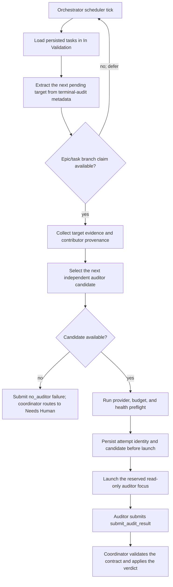

# Independent Auditor Dispatch Lane

**Status:** Design proposal (OOMPAH-475)
**Epic:** OOMPAH-457
**Related:** OOMPAH-464 (Candidate Selector), OOMPAH-465 (Staging), OOMPAH-466 (Result Routing)

This is the dispatch-integration design. The branch already provides the
durable terminal-audit records and metadata store, independent candidate
policy, and reserved read-only auditor contract. The priority scheduler lane
described here is the remaining integration surface; the `OOMPAH_AUDIT_*`
settings below are proposed names until that lane is wired into the
orchestrator and `.env.example`.

## Overview

The independent auditor dispatch lane is a priority queue that reads persisted terminal-status audit requests, gathers target-specific evidence, selects an independent auditor candidate, and starts a reserved auditor focus with retry and recovery semantics.

This document complements the terminal-transition coordinator design (`plans/terminal-transition-coordinator.md`) by describing how audits move from the "pending" state (queued by the coordinator) through dispatched auditor sessions, candidate rotation on failure, rehydration on restart, and final routing to "Needs Human" when all independent candidates are exhausted.

### Design Principles

1. **Priority over ordinary work**: Audit requests in the `In Validation` state are dispatched at a higher priority than ordinary `Open` issues, so audits do not starve behind feature work.

2. **One auditor per epic branch**: Serialize auditor work on the same epic/task branch to prevent race conditions with branch writers (agents that claim the branch for implementation).

3. **Global concurrency limit**: Auditors consume from the normal `OOMPAH_MAX_CONCURRENT_AGENTS` limit and respect all provider health, budget, and rate-limit constraints.

4. **Candidate rotation on failure**: On transient provider/tool failures (rate limit, timeout, tool error), the system rotates to the next independent candidate with normal exponential backoff, up to `OOMPAH_AUDIT_MAX_ATTEMPTS`.

5. **Idempotent dispatch and recovery**: Attempt identity is persisted *before* auditor launch. On restart, pending/running audits are rehydrated with their exact attempt metadata, enabling idempotent retries without duplicate state changes.

6. **Abandoned session detection**: If an auditor session crashes or hangs, the attempt is marked abandoned; the next scheduler tick re-checks it and rotates candidates if the session's TTL has expired.

7. **Exhaustion handling**: When all independent candidates fail, the audit is marked with the existing `no_auditor` failure classification so the coordinator routes it to `Needs Human` with actionable configuration instructions.

## Architecture

### Audit Dispatch Flow



### Data Structures

#### Proposed dispatch attempt fields

The existing `AuditAttempt` is persisted inside each
`TerminalAuditRecord.attempts` list and in the bounded top-level
`attempt_history`. It already carries the stable `attempt_id`, target,
fingerprint, request state, verdict, classification, and timestamps. The
dispatch lane must extend that versioned record (or add a versioned adjacent
dispatch record) with its provider/model, launch timestamp, completion
timestamp, and rotation number. Do not invent a second top-level running-
attempt field: `oompah.terminal_audit` currently has only `pending_chain`,
`attempt_history`, and optional quarantine data.

```python
@dataclass
class AuditAttempt:
    attempt_id: str
    target_state: TargetState
    evidence_fingerprint: EvidenceFingerprint
    request_state: RequestState = RequestState.PENDING
    verdict: Verdict | None = None
    failure_classification: FailureClassification | None = None
    requested_by: ContributorIdentity | None = None
    created_at: str | None = None
    completed_at: str | None = None

# Dispatch-only fields to add through a versioned schema migration:
# provider_id, model, started_at, ended_at, candidate_rotation_count.
```

#### Audit Metadata (Task Storage)

Stored in task metadata under `oompah.terminal_audit`:

```json
{
  "version": 1,
  "pending_chain": [
    {
      "audit_id": "audit-1",
      "target_state": "Done",
      "request_state": "pending",
      "evidence_fingerprint": {
        "version": 1,
        "algorithm": "sha256",
        "digest": "<64 lowercase hex characters>"
      },
      "created_at": "2026-01-01T12:00:00Z",
      "previous_state": "Open",
      "attempts": []
    }
  ],
  "attempt_history": []
}
```

### Candidate Selection Policy

The independent auditor candidate selection process mirrors the seeded auditor role initialization (see `oompah/auditor_candidate_selector.py`) with the additional constraint that candidates must be independent of the task's contributors.

**Selection order:**

1. Load the auditor role from the project's role store (`.oompah/roles.json`).
2. Call `AuditorCandidateSelector.select_candidate(contributors=task_contributors)` to get the next eligible independent candidate.
3. Exclude provider/model pairs already attempted for this audit. If no candidate remains, use the selector's reason (for example, `all_are_contributors`) and mark the audit with `NO_AUDITOR` failure.
4. Apply provider health, budget, and rate-limit preflight checks.
5. Persist the attempt and launch.

**Independence policy:**

- A candidate (provider_id, model) is independent if:
  - Its provider_id is not in the set of contributor providers, OR
  - Its provider_id matches a contributor provider but its model is different from all models used by that provider's contributors
- Candidates from providers with unknown/SDK-managed model identities are treated as dependent if *any* contributor from that provider exists (fail-closed policy).

**Rotation on failure:**

When a candidate fails (provider error, timeout, auditor crash), the system:

1. Marks the attempt `ended_at` and records the failure reason (from provider logs or auditor exit code).
2. Increments `candidate_rotation_count`.
3. On the next scheduler tick, calls `select_candidate` again to get the next independent candidate.
4. If `select_candidate` returns `None`, submit a `NO_AUDITOR` failure.

### Retry and Recovery Semantics

#### On Normal Exit (Auditor Completes)

1. Auditor calls `submit_audit_result` with verdict (PASS, FAIL, NEEDS_HUMAN).
2. TerminalTransitionCoordinator receives the result via `apply_audit_result(attempt_id=...)`.
3. Coordinator validates the attempt_id against the running attempt record.
4. Coordinator marks the audit COMPLETED and applies the verdict:
   - **PASS**: applies the terminal status (Done/Merged/Archived), keeps task in In Validation if later targets are pending
   - **FAIL**: routes to repair state based on failure_classification
   - **NEEDS_HUMAN**: routes the task to `Needs Human` with an actionable comment
5. The attempt record is updated with its verdict, classification, and
   completion timestamp; the coordinator posts the human-readable result
   message as the tracker comment. The auditor worker exits normally.

#### On Transient Failure (Provider/Tool Error)

1. Auditor tool raises exception (rate limit, timeout, connection error, etc.).
2. Orchestrator catches the exception, marks attempt `ended_at`, logs reason.
3. On next scheduler tick, dispatcher detects the ended attempt.
4. Dispatcher checks if retry count < OOMPAH_AUDIT_MAX_ATTEMPTS.
5. Dispatcher calls `select_candidate` to rotate to the next candidate.
6. Dispatcher persists new attempt with incremented `candidate_rotation_count`.
7. Dispatcher launches new auditor session with the new candidate.

#### On Crash/Hang

1. Auditor session crashes (segfault, OOM, process killed, etc.).
2. Orchestrator detects worker exit; if auditor, marks attempt with crash reason.
3. On next scheduler tick, dispatcher rehydrates the task from metadata.
4. Dispatcher checks if running attempt is older than `OOMPAH_AUDIT_ATTEMPT_TTL` (default: 3600 seconds).
5. If TTL expired, dispatcher marks attempt abandoned and rotates candidates.
6. Otherwise, dispatcher assumes the auditor is still running and skips this task.

#### On Graceful Restart

1. Service receives shutdown signal; active workers are drained gracefully.
2. Orchestrator persists all in-flight dispatch state in the in-progress
   `AuditAttempt` record.
3. Service restarts and loads all persisted tasks.
4. Dispatcher scans all tasks in In Validation state.
5. For each task with an in-progress `AuditAttempt`:
   - If `ended_at` is set, process as if the auditor exited (transient failure path above).
   - If `ended_at` is null and `started_at` is recent (< TTL), assume still running and skip.
   - If `ended_at` is null and `started_at` is old (>= TTL), mark abandoned and rotate.

### Backoff and Rate Limiting

Retry backoff follows the normal dispatch retry backoff:

- Reuse the normal scheduler's exponential backoff. Its current initial delay
  is 10 seconds and its ceiling is `OOMPAH_MAX_RETRY_BACKOFF_MS` (default
  300000 ms).

Rate-limit responses (HTTP 429) trigger an immediate candidate rotation (no backoff) to unblock the audit by switching to a different provider.

### Proposed Configuration Variables

New environment variables for independent auditor dispatch:

| Variable | Default | Description |
|----------|---------|-------------|
| `OOMPAH_AUDIT_MAX_ATTEMPTS` | 3 | Maximum number of auditor candidates to attempt per audit before routing to Needs Human |
| `OOMPAH_AUDIT_ATTEMPT_TTL` | 3600 | Seconds; a running attempt older than this is considered abandoned and eligible for retry |
| `OOMPAH_AUDIT_PRIORITY` | 100 | Relative dispatch priority for In Validation tasks (higher = sooner than Open) |
| `OOMPAH_AUDIT_LANE_SCAN_LIMIT` | 32 | Maximum In Validation tasks examined per scheduler tick |

### Concurrency and Serialization

#### Epic-Branch Claim

Auditor tasks and worker tasks contend for an exclusive claim on the
epic/task branch:

```python
_epic_branch_locks: dict[str, asyncio.Lock] = {}

async def claim_branch(epic_id: str, attempt_id: str) -> bool:
    async with _epic_branch_locks.setdefault(epic_id, asyncio.Lock()):
        # Atomically inspect and persist the durable claim for this session.
        # The in-process lock protects this transaction only.
```

- If an auditor holds the lock, incoming worker tasks are blocked and will be retried on the next scheduler tick.
- If a worker holds the lock, incoming audits are blocked and will be retried on the next scheduler tick.
- The in-process lock is held only for the claim transaction. The durable
  claim remains until the auditor or worker exits, so a branch writer cannot
  race an active auditor after launch.

#### Global Concurrency Limit

Auditor agents count against `OOMPAH_MAX_CONCURRENT_AGENTS`:

```python
active_auditors = count_agents(focus="auditor")
active_workers = count_agents(focus!="auditor")
total_active = active_auditors + active_workers
max_concurrent = OOMPAH_MAX_CONCURRENT_AGENTS

can_dispatch = total_active < max_concurrent
```

No special slots are reserved for auditors; they compete fairly with workers for capacity.

## Integration Points

### Orchestrator

The orchestrator's main dispatch loop is extended with an audit lane before the normal work dispatch:

```python
async def _handle_dispatch_needed_locked(self) -> dict[str, float]:
    # ... existing normal dispatch ...
    
    # NEW: Audit dispatch lane (higher priority)
    audit_times = await self._dispatch_audit_lane()
    
    # Existing: Normal work dispatch
    work_times = await self._dispatch_work_lane()
    
    return {**audit_times, **work_times}
```

The audit lane runs the following sequence:

1. Load all tasks in "In Validation" state.
2. For each task, extract the first pending audit from metadata.
3. Attempt to dispatch the audit with `_dispatch_single_audit(task, audit)`.
4. Skip if the task/epic is locked by another worker.
5. Skip if no auditor candidates are available.
6. Return scheduling times for metrics and polling adjustment.

### Terminal Transition Coordinator

The coordinator's `apply_audit_result` method remains unchanged. The dispatch lane simply provides the mechanism to launch auditors; the coordinator orchestrates the terminal status application.

### Candidate Selector

The dispatch lane uses `AuditorCandidateSelector.select_candidate(contributors)` to obtain the next independent candidate in rotation. The selector is stateless and deterministic given the same role and contributor set.

## Monitoring and Observability

### Metrics

**Dispatch metrics:**
- `audit_dispatch_count` (counter) — audits dispatched
- `audit_dispatch_rotation_count` (counter) — times an audit rotated to a new candidate
- `audit_exhaustion_count` (counter) — audits with all candidates exhausted (routed to Needs Human)
- `audit_lane_skip_reasons` (histogram) — why audits were skipped (locked, no_candidates, rate_limited, etc.)
- `audit_attempt_duration_ms` (histogram) — wall-clock time from attempt start to completion or crash

**Queue metrics:**
- `audits_pending_count` (gauge) — tasks in In Validation with pending audits
- `audits_in_progress_count` (gauge) — running auditor agents

### Logging

Dispatch-lane operations are logged at INFO level with task_id, audit_id, attempt_id, provider, and model:

```
[INFO] audit dispatch: starting audit-1 (task OOMPAH-123) on prov-abc/gpt-4, candidate rotation 0
[INFO] audit dispatch: auditor exit (audit-1) — transient failure, rotating to next candidate
[INFO] audit dispatch: rotation failed — no independent candidates remaining; routing to Needs Human
```

### Errors and Alerts

**Actionable alerts:**
- "No independent auditor candidates available" — operator must add providers or adjust whitelist
- "Auditor dispatch queue backed up (>10 pending)" — consider increasing OOMPAH_MAX_CONCURRENT_AGENTS or reducing workload

## Testing Strategy

### Unit Tests

```python
class TestAuditDispatchLane:
    def test_pending_audit_extracted_from_metadata(self):
        # Verify audit metadata parsing
    
    def test_candidate_selector_called_with_contributors(self):
        # Verify independent selection policy
    
    def test_attempt_persisted_before_launch(self):
        # Verify idempotent dispatch recovery
    
    def test_rotation_on_provider_error(self):
        # Simulate 429, verify next candidate selected
    
    def test_exhaustion_routes_to_needs_human(self):
        # Verify no_auditor failure submission
    
    def test_epic_branch_lock_serialization(self):
        # Verify worker/auditor don't race on same branch
    
    def test_concurrent_audit_and_work_dispatch(self):
        # Verify both lanes work without interference
    
    def test_global_concurrency_limit_respected(self):
        # Verify auditors + workers don't exceed limit
```

### Integration Tests

```python
class TestAuditDispatchIntegration:
    def test_priority_over_ordinary_work(self):
        # Queue: 10x Open issues + 1 In Validation audit
        # Verify audit dispatched first
    
    def test_one_agent_per_epic_serialization(self):
        # Start writer on epic; queue audit
        # Verify audit waits for lock
    
    def test_successful_audit_result_flow(self):
        # Dispatch → auditor runs → submits PASS verdict
        # Verify terminal status applied
    
    def test_crash_and_restart_recovery(self):
        # Launch auditor; crash mid-session; restart orchestrator
        # Verify attempt rehydrated, rotation attempted
    
    def test_rate_limit_rotation(self):
        # Provider returns 429; verify immediate candidate switch
    
    def test_timeout_rotation(self):
        # Auditor tool times out; verify rotation on next tick
    
    def test_max_attempts_exhaustion(self):
        # OOMPAH_AUDIT_MAX_ATTEMPTS=2; all fail → Needs Human
```

### Scheduler Focused Tests

```bash
.venv/bin/python -m pytest \
  tests/test_auditor_candidate_selector.py \
  tests/test_auditor_focus.py \
  tests/test_terminal_audit_metadata.py -q
make test
```

## Acceptance Criteria

✓ Every eligible persisted audit in In Validation is eventually dispatched once per attempt  
✓ Audits are retried safely with candidate rotation up to OOMPAH_AUDIT_MAX_ATTEMPTS  
✓ Exhausted audits (no candidates) are routed to Needs Human with actionable configuration instructions  
✓ Auditor work serializes with branch writers (no concurrent mutations)  
✓ Auditor work respects OOMPAH_MAX_CONCURRENT_AGENTS global limit  
✓ Pending/running attempts are rehydrated correctly on restart  
✓ Attempt identity (attempt_id) is persisted before launch for idempotent recovery  
✓ Abandoned auditor sessions (TTL expired) are detected and rotated on next tick  
✓ Changed fingerprint during run is handled safely (no duplicate completion work)  
✓ Stale results (completed audit with new evidence) are rejected by coordinator  
✓ All tests pass; focused scheduler tests run before handoff; full gate passes on review  

## Future Extensions

- **Audit priority levels** — prioritize Done before Merged before Archived
- **Partial evidence refresh** — re-run specific collectors when fingerprint changes
- **Auditor feedback loop** — store auditor performance by provider/model pair for candidate ranking
- **Predictive preflight** — probe provider health during the last work dispatch to warm up candidate list before audit lane
