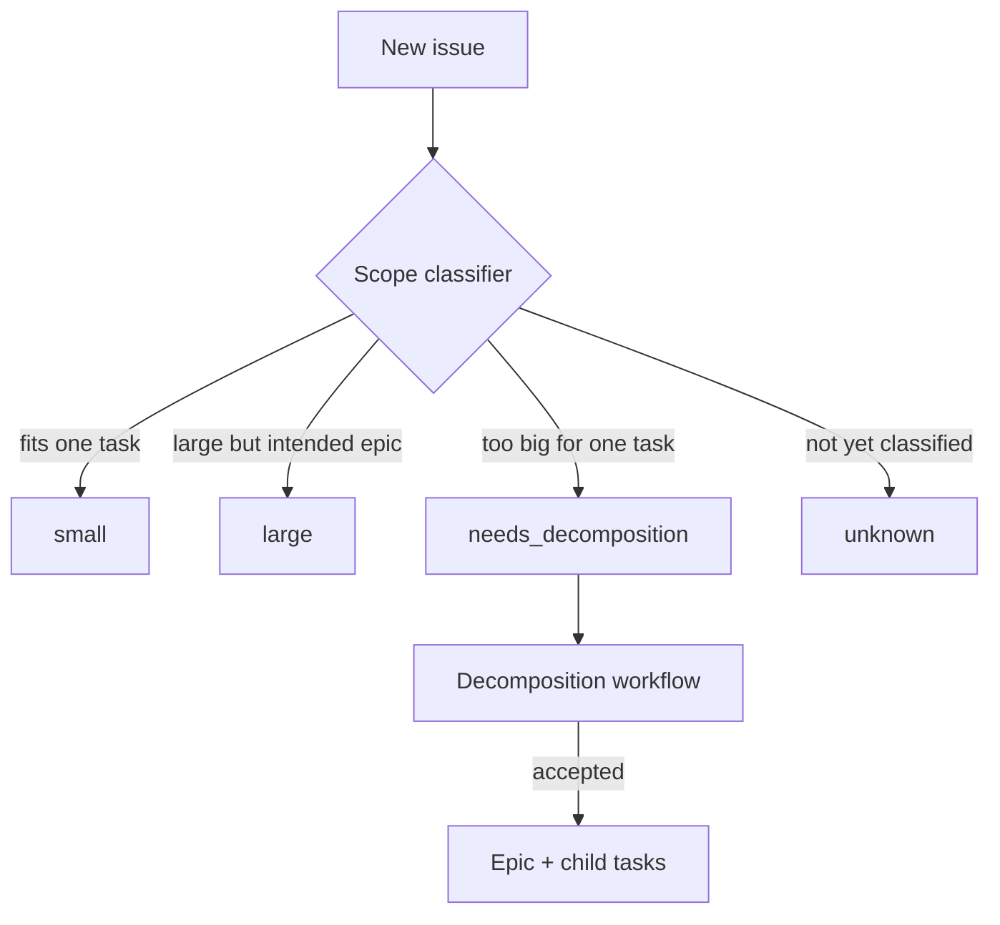
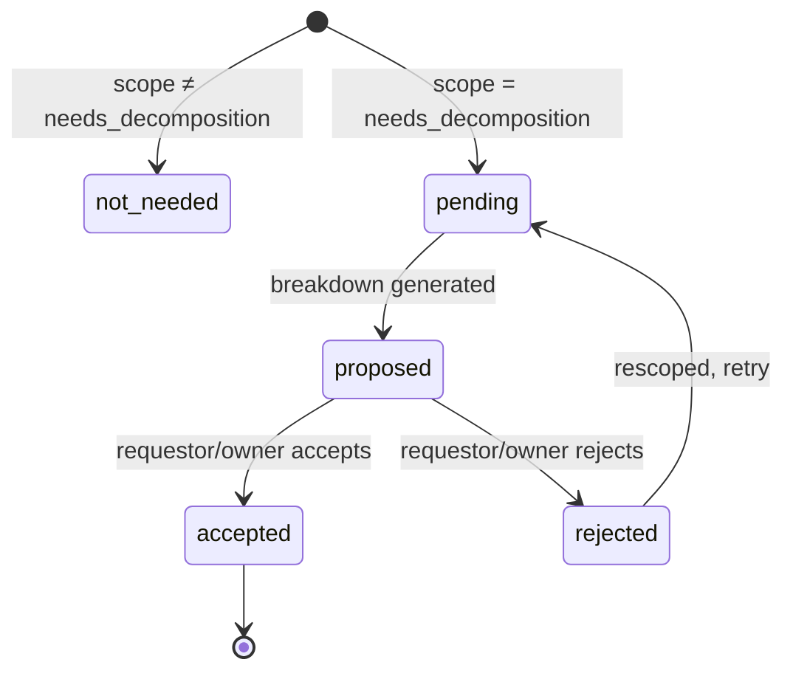

# Intake Readiness Schema and Metadata

**#283** — Design record for `oompah.intake` issue body metadata field.

---

## Overview

When a GitHub issue is created in an oompah-managed project it may start in a
`Proposed` state.  The intake workflow validates the issue, asks the requestor
for missing information, and — once the issue is well-formed and the requestor
has approved — promotes it to `Backlog`.  Project owners may bypass this flow
with an explicit override.

This document defines the machine-readable readiness state persisted in the
hidden `<!-- oompah:metadata … -->` block as `"intake"`.

Typed Python schema lives in `oompah/intake_schema.py`.
Tests are in `tests/test_intake_schema.py`.

---

## Metadata Storage

The intake state is stored as a single JSON object under the `intake` key
inside the existing oompah metadata block:

```
<!-- oompah:metadata
{"project_id": "proj-123", "target_branch": "main", "intake": {
    "missing_fields": [],
    "scope": "small",
    "requestor_approved": true,
    "requestor_approved_at": "2026-06-11T16:00:00Z",
    "requestor_actor": "alice",
    "owner_override": false,
    "owner_override_at": null,
    "owner_actor": null,
    "decomposition_status": "not_needed",
    "proposal_fingerprint": null,
    "last_validator_result": "pass",
    "last_validated_at": "2026-06-11T16:00:00Z"
}}
-->
```

The block is written using the existing
`GitHubIssueTracker.set_metadata_field(identifier, "oompah.intake", …)` API so
that all existing metadata fields (`project_id`, `target_branch`, `work_branch`,
review fields, `backports`, `backport_of`, attachments, etc.) are always
preserved.

---

## Schema Fields

| Field | Type | Default | Description |
|-------|------|---------|-------------|
| `missing_fields` | `list[str]` | `[]` | Required issue fields that are absent (e.g. `["acceptance_criteria", "repro_steps"]`). Empty means all required fields are present. |
| `scope` | string | `"unknown"` | Scope classification: `"small"`, `"large"`, `"needs_decomposition"`, `"unknown"` |
| `requestor_approved` | bool | `false` | `true` once the original issue requestor has approved the proposed scope |
| `requestor_approved_at` | string\|null | `null` | ISO 8601 timestamp of requestor approval |
| `requestor_actor` | string\|null | `null` | GitHub login of the approving requestor |
| `owner_override` | bool | `false` | `true` if a project owner overrode the normal intake flow |
| `owner_override_at` | string\|null | `null` | ISO 8601 timestamp of owner override |
| `owner_actor` | string\|null | `null` | GitHub login of the overriding project owner |
| `decomposition_status` | string | `"not_needed"` | Status of epic/child decomposition: `"not_needed"`, `"pending"`, `"proposed"`, `"accepted"`, `"rejected"` |
| `proposal_fingerprint` | string\|null | `null` | Stable fingerprint of the latest generated epic/child proposal |
| `last_validator_result` | string\|null | `null` | Latest validation run result: `"pass"`, `"fail"`, `"pending"`, or `null` (never validated) |
| `last_validated_at` | string\|null | `null` | ISO 8601 timestamp of the last validation run |

---

## Readiness Contract

An issue is **ready** to be promoted from `Proposed` to `Backlog` when **all**
of the following hold:

1. `missing_fields` is empty (no required information absent).
2. `scope` is NOT `"needs_decomposition"` (issue is appropriately sized).
3. `requestor_approved` is `true` **OR** `owner_override` is `true`.
4. `last_validator_result` is `"pass"` (most recent validator passed).

This is encoded in `IntakeReadiness.is_ready` (a computed property).

---

## Scope Classification



| Scope | `is_ready` blocks? | Description |
|-------|--------------------|-------------|
| `small` | no | Fits one implementation task |
| `large` | no | Large but appropriately scoped (e.g. intended epic) |
| `needs_decomposition` | **yes** | Too large; must be split before promotion |
| `unknown` | no | Not yet classified; validator result is the quality gate |

---

## Decomposition Status

Tracks whether an oversized issue has been split into an epic + child tasks.



| Status | Description |
|--------|-------------|
| `not_needed` | Issue is appropriately sized; no decomposition required |
| `pending` | Needs decomposition; proposal not yet generated |
| `proposed` | Epic/child-task breakdown proposed, awaiting review |
| `accepted` | Breakdown accepted; issue converted to epic |
| `rejected` | Breakdown rejected; issue needs rescoping |

---

## Python API

Module: `oompah.intake_schema`

### Types

```python
class IntakeScopeKind(str, Enum):
    SMALL              = "small"
    LARGE              = "large"
    NEEDS_DECOMPOSITION = "needs_decomposition"
    UNKNOWN            = "unknown"

class DecompositionStatus(str, Enum):
    NOT_NEEDED = "not_needed"
    PENDING    = "pending"
    PROPOSED   = "proposed"
    ACCEPTED   = "accepted"
    REJECTED   = "rejected"

class ValidatorResult(str, Enum):
    PASS    = "pass"
    FAIL    = "fail"
    PENDING = "pending"

@dataclass
class IntakeReadiness:
    missing_fields:         list[str]
    scope:                  IntakeScopeKind
    requestor_approved:     bool
    requestor_approved_at:  str | None
    requestor_actor:        str | None
    owner_override:         bool
    owner_override_at:      str | None
    owner_actor:            str | None
    decomposition_status:   DecompositionStatus
    last_validator_result:  ValidatorResult | None
    last_validated_at:      str | None

    @property
    def is_ready(self) -> bool: ...
    def to_raw(self) -> dict[str, Any]: ...

    @classmethod
    def from_raw(cls, raw: Any) -> "IntakeReadiness": ...
```

### Parsing

```python
from oompah.intake_schema import parse_intake_metadata, intake_to_raw

# Read from tracker metadata (returns safe defaults if missing)
meta = tracker.get_metadata("lesserevil/oompah#42")
readiness = parse_intake_metadata(meta.get("oompah.intake"))

# Check readiness
if readiness.is_ready:
    tracker.update_issue("lesserevil/oompah#42", status="Backlog")
```

### Updating and persisting

```python
from oompah.intake_schema import parse_intake_metadata, intake_to_raw, ValidatorResult
import datetime

meta = tracker.get_metadata("lesserevil/oompah#42")
readiness = parse_intake_metadata(meta.get("oompah.intake"))

# Record validator result
readiness.last_validator_result = ValidatorResult.PASS
readiness.last_validated_at = datetime.datetime.now(datetime.UTC).isoformat()

# Write back — all existing metadata is preserved
tracker.set_metadata_field(
    "lesserevil/oompah#42",
    "oompah.intake",
    intake_to_raw(readiness),
)
```

### Recording requestor approval

```python
readiness.requestor_approved = True
readiness.requestor_approved_at = "2026-06-11T16:00:00Z"
readiness.requestor_actor = "alice"
tracker.set_metadata_field("lesserevil/oompah#42", "oompah.intake", intake_to_raw(readiness))
```

### Recording owner override

```python
readiness.owner_override = True
readiness.owner_override_at = "2026-06-11T18:00:00Z"
readiness.owner_actor = "project-owner"
tracker.set_metadata_field("lesserevil/oompah#42", "oompah.intake", intake_to_raw(readiness))
```

---

## Metadata Preservation

The `oompah.intake` field is a single key within the existing metadata dict.
All other fields are unaffected:

| Preserved field | Example value |
|-----------------|---------------|
| `project_id` | `"proj-14849f1b"` |
| `target_branch` | `"main"` |
| `work_branch` | `"oompah/proj/gh-42"` |
| `review_url` | `"https://github.com/org/repo/pull/99"` |
| `review_number` | `"99"` |
| `backports` | `[{"branch": "release/1.0", "status": "waiting"}]` |
| `backport_of` | `"lesserevil/oompah#100"` |
| `attachments` | `[{…}]` |

---

## Compatibility

- Compatible with both `task` and `epic` issues.
- An epic may have `decomposition_status = "accepted"` to record that it was
  deliberately converted from an oversized issue.
- Forward-compatible: new fields added to the schema degrade gracefully on old
  stored data (missing keys fall back to safe defaults in `from_raw`).
- Backward-compatible: old issues without an `intake` block parse as a fresh
  `IntakeReadiness` with all defaults.

---

## Relationship to other modules

| Module / Issue | Relationship |
|----------------|-------------|
| `oompah/github_tracker.py` | Provides `set_metadata_field` / `get_metadata` used to read/write `oompah.intake` |
| `oompah/intake_schema.py` | Defines the typed schema (this doc) |
| `oompah/epic_proposal.py` | Stores full decomposition proposals under `epic_proposal` metadata and mirrors the fingerprint into `intake.proposal_fingerprint` |
| `tests/test_intake_schema.py` | Unit tests covering all AC criteria |
| #273 Epic: Intake readiness workflow | Parent epic; this is its schema child task |
| #284 Decomposition proposals | Will use `decomposition_status` field |
| #280 Promote approved issues | Will use `is_ready` to gate Proposed → Backlog |
| `oompah/release_pick_schema.py` | Structural model followed by this schema |
