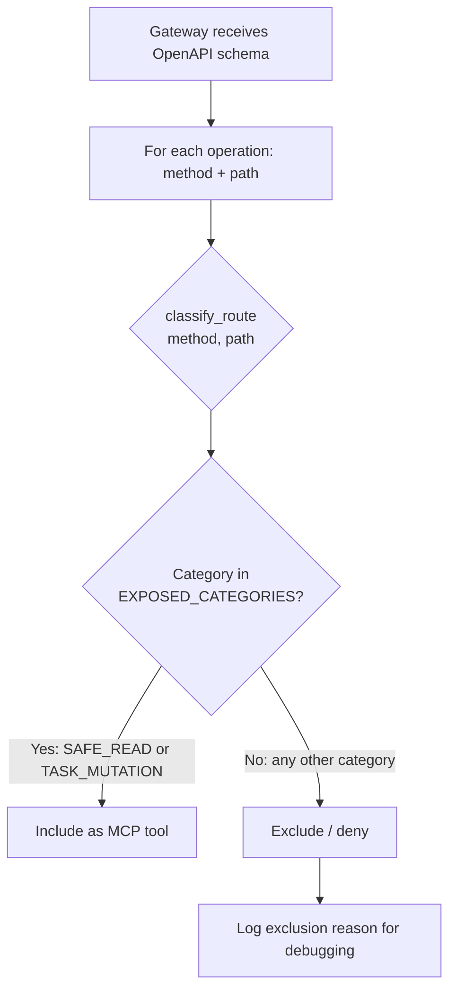

# oompah OpenAPI-to-MCP Exposure Policy

**Status**: Implemented in `oompah/mcp_exposure_policy.py` (OOMPAH-419)
**Gateway implementation**: OOMPAH-420
**Integration tests + docs**: OOMPAH-421

## Overview

The `oompah/mcp_exposure_policy.py` module is the canonical source of truth for
which oompah API routes are exposed as MCP tools.  The embedded gateway
(OOMPAH-420) imports this module and calls `is_route_exposed(method, path)` to
filter the OpenAPI operation list before building the MCP tool catalog.

## Design decisions

### 1. Fail-closed by default

Any route not explicitly classified returns `RouteCategory.UNKNOWN`, which is
denied.  New routes added to `server.py` are **not** automatically exposed as
MCP tools.  A code review (and classification in `mcp_exposure_policy.py`) is
required before any route becomes an MCP tool.

### 2. Only two categories are exposed

| Category | Description | Exposed? |
|---|---|---|
| `SAFE_READ` | Read-only GET endpoints | ✅ Yes |
| `TASK_MUTATION` | Core issue/task CRUD (create, update, comment, label, dep) | ✅ Yes |
| `ADMIN_MUTATION` | Service config mutations (project, profile, role, focus) | ❌ No |
| `CREDENTIAL_BEARING` | Provider API key management | ❌ No |
| `WEBHOOK_INGESTION` | Inbound webhook handlers (GitHub, GitLab) | ❌ No |
| `ORCHESTRATOR_CONTROL` | Lifecycle control (restart, pause, resume, dispatch) | ❌ No |
| `RELEASE_DELIVERY` | Release pipeline mutations | ❌ No |
| `UNKNOWN` | Catch-all for unclassified routes | ❌ No |

### 3. Authentication / token propagation

The embedded MCP gateway communicates with oompah's own API over **loopback
only** (`http://127.0.0.1:<port>`). It does **not**:
- Forward `Authorization` headers from MCP clients to the oompah HTTP API.
- Return credential material from oompah API responses to MCP clients.
- Accept inbound authentication material from MCP clients.

MCP clients connecting to the gateway endpoint (`/api/mcp/v1`) must not be
trusted with oompah's provider API keys or other credentials.

### 4. Service-discovery paths

| Path | Purpose |
|---|---|
| `/api/mcp/v1` | MCP endpoint (streamable HTTP, mounted by OOMPAH-420) |
| `/openapi.json` | FastAPI-generated OpenAPI schema consumed by the gateway |
| `/.well-known/mcp` | Machine-readable MCP discovery metadata |

## Route classification

The rule table in `mcp_exposure_policy._build_rules()` is an ordered list of
`(method, path_template_re, category)` triples.  First match wins.

The key ordering constraint is: **more specific deny rules precede more general
allow rules**.  For example, `POST /api/v1/issues/{identifier}/release-addendums`
(RELEASE_DELIVERY, denied) must appear before `POST /api/v1/issues/{identifier}/labels`
(TASK_MUTATION, allowed) in the rule table to prevent the deny rules from being
shadowed.



## Security properties

1. **No new-route auto-exposure**: Adding a FastAPI route to `server.py` does
   not add an MCP tool. Classification is explicit.

2. **Input validation**: `classify_route` rejects malformed path strings (URL
   encoding `%2F`, query strings `?`, fragments `#`, whitespace) before
   pattern matching.  This prevents adversarial strings from accidentally
   matching the generic `{issue_identifier}` catch-all.

3. **Orchestrator restart is explicitly denied**: `POST /api/v1/orchestrator/restart`
   is listed in `ORCHESTRATOR_CONTROL` with a specific test verifying it cannot
   be exposed.

4. **Webhooks cannot be proxied via MCP**: Both GitHub and GitLab webhook
   handlers rely on HMAC/token signature validation at the HTTP layer.  Proxying
   them via MCP would bypass that validation.  They are classified as
   `WEBHOOK_INGESTION` and denied.

5. **Provider credentials are protected**: All mutations to provider
   configuration (`POST/PATCH/DELETE /api/v1/providers/...`) and credential
   exercise endpoints (`/test`, `/fetch-models`) are `CREDENTIAL_BEARING` and
   denied.

## Gateway integration (OOMPAH-420)

The gateway should:

1. Fetch `GET /openapi.json` to get the current route list.
2. For each `paths[path][method]` entry, call `is_route_exposed(method, path)`.
3. Include only the operations where `is_route_exposed` returns `True`.
4. Mount the resulting MCP server at `MCP_ENDPOINT_PATH` (`/api/mcp/v1`).
5. Serve discovery metadata at `MCP_DISCOVERY_PATH` (`/.well-known/mcp`).

```python
from oompah.mcp_exposure_policy import (
    is_route_exposed,
    MCP_ENDPOINT_PATH,
    MCP_DISCOVERY_PATH,
    OPENAPI_SCHEMA_PATH,
)

# When building MCP tool catalog from the OpenAPI spec:
for path, methods in openapi_schema["paths"].items():
    for method, operation in methods.items():
        if is_route_exposed(method, path):
            register_mcp_tool(method, path, operation)
```

## Testing

Tests are in `tests/test_mcp_exposure_policy.py` (292 test cases, all passing).

Coverage includes:
- All SAFE_READ routes are classified and exposed
- All TASK_MUTATION routes are classified and exposed
- All ORCHESTRATOR_CONTROL routes are denied (including restart)
- All WEBHOOK_INGESTION routes are denied
- All CREDENTIAL_BEARING routes are denied
- All ADMIN_MUTATION routes are denied
- All RELEASE_DELIVERY routes are denied
- Unknown routes fail-closed
- Input validation rejects adversarial path strings
- Method case-insensitivity
- `describe_policy()` returns a JSON-serializable summary
- `iter_exposed_routes()` only yields exposed routes
