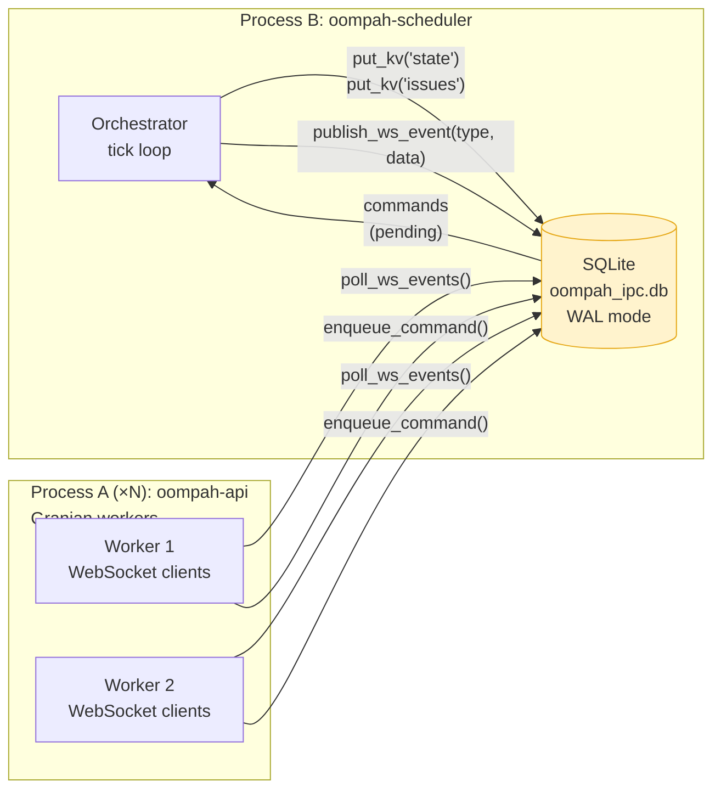

# Spike: Orchestrator Process Split for Granian multi-worker

**Status:** Design recommendation (TASK-473.4)
**Epic:** TASK-473 — Reduce HTTP event-loop contention from orchestrator and blocking work
**Supersedes / extends:** `plans/service-split.md` (TASK-469.5.1)

---

## 1. Problem

oompah's orchestrator and FastAPI web layer run in the **same process on the
same asyncio event loop**.  This coupling has two consequences:

1. **Event-loop contention.** The orchestrator's tick loop (YAML parsing,
   subprocess launches, tracker writes) competes with HTTP request handlers
   for the single event loop.  See Epic TASK-473 for profiling tasks.
2. **Granian `workers=1` constraint.** Granian spawns one worker per
   `workers=N` setting, each with its own process and event loop.  Because
   `_ws_clients`, `_orchestrator`, and the WebSocket broadcast path
   (`_on_orchestrator_change` → `_broadcast`) are all in-process singleton
   state, `workers>1` is currently impossible: each Granian worker would have
   an empty `_ws_clients` set and no orchestrator.

Unlocking `workers>1` requires that the orchestrator run in its own process
and the web layer receive WebSocket push events through an IPC channel.

---

## 2. Prior work — the foundation already exists

**TASK-469.5.1** (status: Needs CI Fix) designed and implemented the
SQLite-backed IPC coordination layer that is the right foundation for this
split.  See `plans/service-split.md` for the full design.  Key artifacts:

| Artifact | Status |
|----------|--------|
| `oompah/ipc.py` — `OrchestratorIPC` class | ✅ Implemented |
| SQLite `kv` table for state/issues snapshots | ✅ Implemented |
| SQLite `commands` table for API→scheduler FIFO | ✅ Implemented |
| Orchestrator publishes state snapshot after every tick | ✅ Implemented |
| API reads state/issues from SQLite in coupled mode | ✅ Implemented |
| `tests/test_ipc.py` — 40 unit + integration tests | ✅ Implemented |
| `plans/service-split.md` — architecture doc | ✅ Written |
| WebSocket broadcasting across process boundary | ❌ Future work only |
| `--api-only` / `--scheduler-only` CLI modes | ❌ Not implemented |

The CI failures in TASK-469.5.1 are unrelated to the design — one known
failure is `asyncio.ensure_future()` usage in `Orchestrator.pause()` that
raises `RuntimeError` in a sync test context.

---

## 3. The remaining gap: WebSocket push across the process boundary

When the orchestrator runs in Process B and Granian workers run in Process A
(one or more), the direct observer callbacks
(`_on_orchestrator_change`, `_on_state_only_change`, `_on_agent_activity`)
no longer work — they are in-process function calls.

Process A needs to know when to call `_broadcast(...)` on its own WebSocket
clients.  This is the central unsolved design problem.

### 3.1 Options evaluated

| Option | Description | Latency | New deps | Complexity |
|--------|-------------|---------|----------|------------|
| **A — SQLite event polling** | Extend IPC with a `ws_events` table; scheduler writes events; API workers poll on a tight loop (~200 ms) | 0–200 ms | None | Low |
| **B — Unix socket push** | Scheduler sends events over a Unix domain socket; each API worker listens | ~0 ms | None | Medium |
| **C — Redis pub/sub** | Scheduler publishes to a Redis channel; API workers subscribe | ~1 ms | Redis | Medium |
| **D — Scheduler → API HTTP POST** | Scheduler POSTs events to an internal API endpoint on state change | ~1 ms | None | Low-medium |

### 3.2 Recommendation: Option A — SQLite event polling

**Rationale:**

- Consistent with the existing IPC layer (zero new dependencies, same SQLite
  file already shared).
- WebSocket updates are informational dashboard refreshes — 200 ms delivery
  latency is imperceptible to users.
- Failure semantics are simple and observable: if the scheduler is behind,
  the API serves the last published snapshot; `ipc.diagnostics()` reports the
  snapshot age in ms.
- No reconnection/listen socket lifecycle to manage on worker restart.
- Multiple Granian workers all poll the same SQLite file independently; each
  broadcasts to its own `_ws_clients` set — this is correct behaviour (each
  Granian worker owns a disjoint set of connected clients).

**Why not the alternatives:**

- Option B (Unix socket) requires each worker to maintain a persistent
  connection to the scheduler and handle reconnect on restart — more moving
  parts without a meaningful latency win for dashboard use.
- Option C (Redis) introduces an operational dependency that the project
  explicitly decided to avoid (see `plans/service-split.md` §2).
- Option D (HTTP POST) adds coupling in the opposite direction: the scheduler
  must know the API's listening address, and adds HTTP overhead per event.

---

## 4. Recommended architecture



### 4.1 Schema additions

Add to `oompah/ipc.py` (`_SCHEMA_SQL`):

```sql
-- WebSocket event relay: scheduler publishes; API workers poll and consume
CREATE TABLE IF NOT EXISTS ws_events (
    id          INTEGER PRIMARY KEY AUTOINCREMENT,
    event_type  TEXT    NOT NULL,          -- 'state' | 'issues' | 'activity'
    payload     TEXT    NOT NULL,          -- JSON
    created_at  REAL    NOT NULL
);
CREATE INDEX IF NOT EXISTS ws_events_created ON ws_events (created_at);
```

Each API worker tracks the last `id` it consumed (in-memory, per-worker).
On every poll tick it reads `ws_events WHERE id > :last_seen` and calls
`_broadcast(...)` for each row.  Old rows are pruned by the scheduler
(rows older than ~5 seconds are irrelevant — any connected client that
missed them will get the current state on the next full poll).

### 4.2 New IPC methods

```python
def publish_ws_event(self, event_type: str, payload: dict) -> int | None:
    """Scheduler side: write a WebSocket event to the relay table."""

def poll_ws_events(self, since_id: int, limit: int = 50) -> list[dict]:
    """API-worker side: return events newer than since_id."""

def cleanup_ws_events(self, max_age_seconds: float = 5.0) -> int:
    """Scheduler side: prune stale relay rows."""
```

### 4.3 Orchestrator changes

In `oompah/orchestrator.py`, update the observer notification path to also
call `ipc.publish_ws_event(...)` when IPC is active.  The existing
`_notify_observers()` already calls `_on_orchestrator_change` synchronously;
in split mode it additionally writes the event to SQLite.

```python
# In _notify_observers (simplified):
if self._ipc:
    self._ipc.publish_ws_event("state", snapshot)
```

### 4.4 API-worker polling loop

Add a background asyncio task (started from the FastAPI `lifespan`) in
`oompah/server.py`:

```python
async def _ws_event_relay_loop(ipc: OrchestratorIPC) -> None:
    """Poll the IPC ws_events table and broadcast to local WS clients."""
    last_id = 0
    while True:
        events = ipc.poll_ws_events(since_id=last_id)
        for evt in events:
            if _ws_clients:
                await _broadcast({"type": evt["event_type"], "data": evt["payload"]})
            last_id = max(last_id, evt["id"])
        await asyncio.sleep(0.2)   # 200 ms poll interval
```

This task is only started when `OOMPAH_IPC_DB_PATH` is set and the server is
running in API-only mode (i.e., no embedded orchestrator).

### 4.5 CLI modes

Add `--api-only` and `--scheduler-only` flags to `oompah/__main__.py`:

| Mode | Flag | Behaviour |
|------|------|-----------|
| Combined (default) | _(none)_ | Existing single-process mode — unchanged |
| Scheduler only | `--scheduler-only` | Start orchestrator, publish to SQLite; no HTTP |
| API only | `--api-only` | Start FastAPI + Granian; read from SQLite; start relay loop |

`--api-only` requires `OOMPAH_IPC_DB_PATH` to be set (fails fast with a
clear error otherwise).

---

## 5. Tradeoffs

| Dimension | Combined mode (today) | Split-process mode |
|-----------|----------------------|--------------------|
| WebSocket push latency | ~0 ms (direct call) | 0–200 ms (polling) |
| State freshness | Real-time | ≤ polling interval stale |
| Granian `workers` | `workers=1` only | `workers=N` unlocked |
| GIL / event-loop contention | Yes | No (separate processes) |
| Deployment | One process, one command | Two processes + shared file |
| Supervisor wiring | Single restart | Separate restart per service |
| Failure isolation | Orchestrator crash = web crash | Each service fails independently |
| Memory | Shared (schemas, config) | Duplicated startup cost (~50 MB) |
| Operational visibility | Single log stream | Two log streams |
| SQLite WAL contention | None (single writer) | One writer (scheduler) + N readers; WAL handles this |
| Testing complexity | Existing test suite | New integration tests needed for split topology |

**Key downside:** 200 ms polling delay for WS push.  This is acceptable for
the oompah dashboard (state change signals task dispatch, completion, etc. —
not a real-time game).  If sub-100 ms becomes a requirement, upgrade path is
to replace SQLite polling with a Unix socket or Redis pub/sub later.

---

## 6. Effort estimate

Estimates are in person-days for a single backend engineer familiar with the
codebase.

| Work item | Days | Notes |
|-----------|------|-------|
| Fix TASK-469.5.1 CI failures | 0.5 | Root cause identified: `asyncio.ensure_future` in `Orchestrator.pause()` needs `try/except RuntimeError` guard |
| Add `ws_events` table + `publish_ws_event` / `poll_ws_events` / `cleanup_ws_events` to `OrchestratorIPC` | 1.0 | Schema + 3 methods + unit tests |
| Wire orchestrator → IPC event publish on state/issues/activity changes | 0.5 | `_notify_observers` + `_state_only_observers` + `_activity_observers` |
| Add `_ws_event_relay_loop` to `server.py` lifespan | 0.5 | Background task + graceful shutdown |
| `--api-only` / `--scheduler-only` CLI modes in `__main__.py` | 1.5 | Argument parsing, mode wiring, startup validation |
| Granian `workers=2` validation under split mode | 1.0 | Verify WS fan-out; command routing from all workers; no duplicate broadcasts |
| Integration / E2E tests for split topology | 2.0 | Subprocess-based test harness; verify WS latency ≤ 500 ms; command round-trip |
| Documentation update (README, service-split.md, ops guide) | 0.5 | |
| **Total** | **7.5** | |

This is above-the-line work only.  It does **not** include:
- The remaining TASK-472 hardening items (clean lifespan abort, multipart
  validation under Granian, etc.)
- A representative load benchmark (TASK-472.8)
- The maintenance subprocess split (TASK-469.5.1 roadmap item #3)

---

## 7. Impact on Granian multi-worker

Once the process split is in place:

1. `oompah --scheduler-only` runs the orchestrator (one process).
2. `oompah --api-only --server granian` runs FastAPI under Granian.
3. Granian's `workers=N` can be set freely — each worker is a stateless HTTP
   process reading from SQLite; `_ws_clients` is per-worker (correct: each
   Granian worker has its own set of connected WebSocket clients).
4. The `+23%` single-worker throughput gain from the Granian benchmark
   (`doc-1`) compounds with the worker count.

**Important caveat:** API-layer user commands (pause, dispatch, restart) go
through the SQLite command FIFO.  The scheduler polls this FIFO at tick
cadence (~every tick interval).  If the tick is long (busy scheduler), command
acknowledgement can lag.  The existing command-status API (`commands` table,
`diagnostics()`) lets operators observe this.

---

## 8. Decision recommendation

**Proceed.** The design is low-risk:

- All state persistence is in SQLite (no new infrastructure).
- Combined mode remains the default and is unchanged.
- The IPC foundation (TASK-469.5.1) is already implemented; this spike adds
  only the WebSocket relay (~7.5 days total).
- The 200 ms polling delay is acceptable for the oompah use case.

**Suggested sequencing:**

1. Merge TASK-469.5.1 after fixing the CI failures (0.5 days).
2. Implement WebSocket relay + CLI modes as a child of TASK-473 (~7 days).
3. Validate Granian `workers=2` as part of TASK-472 hardening.
4. Run the TASK-472.8 go/no-go benchmark under multi-worker split topology.

---

## 9. References

- `plans/service-split.md` — full service-split architecture (TASK-469.5.1)
- `oompah/ipc.py` — `OrchestratorIPC` implementation
- `plans/codex-sdk-pin.md` — Granian HTTP server migration context
- TASK-469.5.1 — SQLite IPC implementation (Needs CI Fix)
- TASK-472 — Granian adoption epic
- TASK-473 — HTTP event-loop contention epic (parent)
