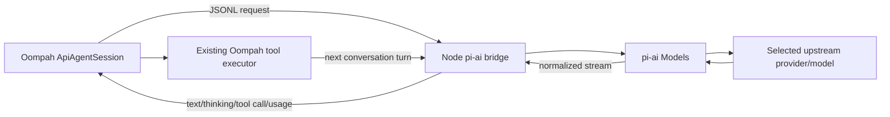

# Pi AI provider integration

## Status

Accepted for implementation as `OOMPAH-1347`.

This design uses Pi's reusable model transport package only. It deliberately
excludes Pi's coding agent, agent loop, CLI/RPC runtime, built-in coding tools,
extensions, skills, prompts, themes, and session UI.

## Goal

Add a provider transport backed by `@earendil-works/pi-ai`, analogous to
Oompah's existing OpenAI-compatible API transport but with Pi's broader
provider/model/auth support.

Oompah remains the agent:

- Oompah owns the turn loop, prompt, task lifecycle, retries, and deadlines.
- Oompah advertises and executes its existing guarded tool catalog.
- Oompah owns workspace confinement, validation leases, exact-head submission,
  audit verdicts, and project mutation policy.
- Pi supplies provider discovery, authentication, request serialization,
  streaming, normalized responses, usage, and cost.



## Recommended architecture

### Transport boundary

Create a small, pinned Node sidecar around `@earendil-works/pi-ai`. The Python
process communicates with it over LF-delimited JSON.

Do not invoke `pi --mode rpc`. That command runs the full coding-agent layer,
including its own agent loop and resource-loading behavior. Do not depend on a
global `pi` binary either. Oompah should execute a repository-owned, versioned
bridge artifact against pinned npm dependencies.

The simplest initial lifecycle is one sidecar process per Oompah worker. The
sidecar may persist for all turns in that worker, avoiding repeated provider
catalog and credential initialization. A shared multi-worker daemon is out of
scope because it adds request multiplexing, tenant isolation, and crash
recovery.

### Division of responsibility

The Node bridge performs only:

1. Construct a Pi `Models` collection.
2. Register built-in and explicitly configured custom providers.
3. Resolve one exact provider/model and its scoped credential.
4. Accept Oompah's conversation and tool schemas.
5. Convert them to Pi's `Context` and `Tool` types.
6. Call `models.streamSimple()`.
7. Return normalized assistant content, tool calls, stop reason, usage, cost,
   and provider errors.

Python continues to perform:

1. Turn counting and stall detection.
2. Context pruning.
3. `_execute_tool()` dispatch.
4. Auditor finalization and `submit_audit_result` enforcement.
5. Read-only and action-policy checks.
6. Validation resource leases and tool-liveness accounting.
7. Task-handoff command interception.
8. Exact task submission and lifecycle transitions.
9. Provider admission, health accounting, retries, and cancellation.

A distinct `PiApiAgentSession` is preferable initially because Pi's normalized
message/event shape is not identical to OpenAI Chat Completions. Shared tool
loop logic should be extracted rather than copied where practical.

## Private JSONL protocol

The bridge protocol should be versioned, bounded, and independent of Pi CLI
RPC.

### Python to Node

- `initialize`: protocol version, exact provider/model, sanitized provider
  configuration, credential-store path, optional reasoning level, and tool
  definitions.
- `complete`: system prompt, complete Oompah-owned conversation, maximum output
  tokens, request timeout, and transport preference.
- `abort`: cancellation for the in-flight provider request.
- `shutdown`: graceful process exit.

### Node to Python

- `ready`: protocol version and resolved model metadata.
- `provider_start`: first actual provider stream event.
- `text_delta`, `thinking_delta`.
- `toolcall_start`, `toolcall_delta`, `toolcall_end`.
- `done`: stop reason and final normalized assistant message.
- `usage`: input, output, cache-read, cache-write, total tokens, and exact cost.
- `error`: normalized, redacted provider/auth/protocol failure.

Every request and response needs an ID. Frames must have a strict maximum size;
malformed or oversized frames fail closed. Stderr is diagnostic only and must
be bounded and redacted before Oompah persists it.

## Tool handling

The bridge receives `ApiAgentSession._tool_definitions` and passes them to Pi
as provider-visible `Tool` schemas. It does not execute those tools. Pi returns
tool calls to Python as assistant output; Oompah calls its existing
`_execute_tool()` and includes results in the next provider request.

This preserves:

- workspace containment and output limits;
- command timeout and process-tree handling;
- read-only duplicate-screening policy;
- auditor tool allowlists;
- `submit_audit_result` as the only authoritative auditor completion;
- task CLI interception and exact-task capability scope;
- project mutation restrictions;
- command-output paging;
- validation resource leases and reuse policy;
- server-mediated epic rebase publication.

## Authentication

The worker must not receive the operator's complete `~/.pi/agent` directory.

Recommended v1 design:

1. Extend the Oompah provider record with Pi transport metadata:
   - `transport: "openai_compatible" | "pi_ai"`;
   - `pi_provider_id`;
   - exact `pi_model_id`, or canonical `provider/model` in the existing model
     field;
   - optional reasoning level and transport preference.
2. Before launch, create a private worker configuration directory.
3. Copy only the selected Pi provider credential into a minimal `auth.json`
   with mode `0600`, or pass an API key through a dedicated scoped environment
   variable.
4. Generate a minimal `models.json` only for custom providers/models.
5. Set `PI_CODING_AGENT_DIR` to the private directory and disable unrelated
   startup traffic with `PI_OFFLINE=1`, `PI_SKIP_VERSION_CHECK=1`, and
   `PI_TELEMETRY=0` after catalog materialization.
6. Remove the private directory when the worker ends.

OAuth refresh is the main open design point. Copying a refresh credential into
a disposable store is safe but does not propagate rotated credentials back to
the operator store. For v1, either support API-key providers plus non-rotating
credentials first, or have a trusted server-side bridge own the Pi credential
store. Never put credentials in argv, logs, JSONL events, task comments, or the
worktree.

## Provider and model configuration

This is a provider transport, not a new Oompah agent mode. Existing profiles
can remain `mode: api`; the provider chooses the existing OpenAI-compatible
transport or `pi_ai`.

Example:

```json
{
  "name": "Pi / Jocasta",
  "mode": "api",
  "transport": "pi_ai",
  "pi_provider_id": "jocasta-4000",
  "models": ["gpt_sol", "claude_only"],
  "default_model": "gpt_sol",
  "billing_model": "per_token"
}
```

Do not overload `backend`, which currently selects an ACP session backend only
when `mode == "acp"`.

Model discovery should call a bounded helper backed by Pi's model collection
and return canonical IDs plus context, output, reasoning, image, and cost
metadata. Discovery must support cached/offline fallback and must not load
project resources.

## Packaging

Add a dedicated bridge directory:

```text
bridge/pi-ai/
  package.json
  package-lock.json
  src/main.ts
  dist/main.js
```

- Pin `@earendil-works/pi-ai` to a tested version (currently `0.84.3`).
- Require Node `>=22.19.0` for this optional transport.
- Build a standalone bridge artifact during setup/release CI.
- Verify lockfile integrity.
- Keep Node/Pi dependencies optional for installations that do not use Pi.
- Fail provider validation clearly when Node or the bridge is absent.

`@earendil-works/pi-agent-core` is not needed because Oompah retains its own
agent/tool loop.

## Runtime behavior

### Provider contact

Oompah grants provider admission immediately before a `complete` request that
can contact the upstream provider. The bridge reports `provider_start` when the
Pi stream starts; only then does Oompah mark transport contacted. Local spawn,
configuration, or model-resolution failures cancel the unused permit.

### Cancellation and deadlines

- Oompah's turn deadline remains authoritative.
- On cancellation, send `abort`, wait briefly, terminate the process group, and
  use bounded kill fallback if necessary.
- Existing `ToolLivenessMonitor` behavior remains unchanged because Python
  continues to execute tools.
- Disable hidden Pi retries initially so Oompah owns retry accounting.

### Usage and cost

Map Pi usage fields as follows:

- `input` -> input tokens;
- `output` -> output tokens;
- preserve `cacheRead` and `cacheWrite` as additional metrics;
- `totalTokens` -> total tokens;
- `cost.total` -> exact provider-reported cost.

For per-token providers, exact Pi cost wins over local fallback rates.
Subscription providers report usage but do not add spend.

### Images

Translate Oompah's existing `RenderedPrompt.parts` into Pi text/image content.
Unsupported images follow Oompah's existing capability policy and never become
unscoped host file paths.

## Security constraints

1. The bridge imports `pi-ai` only; it does not import or launch
   `pi-coding-agent` or `pi-agent-core`.
2. No Pi coding tools, extensions, project settings, skills, packages, session
   files, or context discovery are active.
3. Python remains the only tool executor and repeats all existing policy checks.
4. The bridge receives only the selected provider credential and sanitized
   environment.
5. Operator Basic credentials remain stripped from child environments.
6. Provider/model identity is frozen before first request; configuration change
   supersedes stale attempts.
7. Event/error payloads are redacted and bounded before persistence.
8. The bridge and descendants are terminated on cancellation or service drain.
9. Shared-epic rebase is enabled only after existing isolated credential and
   server-mediated publication suites pass.

## Files and components

### New

- `oompah/pi_ai_transport.py`: async sidecar supervisor, framing, timeout,
  cancellation, normalization, accounting, and cleanup.
- `bridge/pi-ai/package.json` and lock file: pinned Pi dependency and build.
- `bridge/pi-ai/src/main.ts`: minimal `pi-ai` bridge.
- `tests/test_pi_ai_transport.py`: Python protocol/lifecycle tests.
- `bridge/pi-ai/test/`: Node tests using Pi's faux provider.

### Modified

- `oompah/api_agent.py`: factor provider calls behind a transport protocol or
  add `PiApiAgentSession` while reusing tool definitions and `_execute_tool()`.
- `oompah/models.py` and `oompah/providers.py`: persist/validate Pi transport
  and provider/model fields.
- `oompah/orchestrator.py`: select transport and pass scoped auth/model data.
- `oompah/provider_health.py`: bounded Pi provider probe.
- `oompah/client_auth.py`: minimal selected-provider credential bootstrap.
- `oompah/server.py` and `oompah/templates/providers.html`: provider form,
  model discovery, validation, and diagnostics.
- `pyproject.toml`, `Makefile`, and release/install scripts: optional bridge
  setup and Node-version checks.
- `.env.example` and operator docs: bridge path and timeout controls if needed.

No new console translator is needed: console backend switching belongs to ACP
sessions, while this transport emits the same activity vocabulary as
`ApiAgentSession`.

## Test plan

### Node bridge

- deterministic requests using Pi's faux provider;
- text, thinking, tool-call, usage, cost, stop, error, and abort mapping;
- exact model selection and unavailable-model errors;
- malformed and oversized input rejection;
- dependency/import assertion that excludes coding-agent and agent-core;
- no resource discovery or filesystem tools.

### Python transport

- subprocess startup and missing Node/package diagnostics;
- split UTF-8 and strict LF framing;
- bounded stdout/stderr handling;
- provider-contact permit ordering;
- timeout, abort, TERM/KILL, and descendant cleanup;
- secret redaction;
- exact usage/cost propagation;
- persistent sidecar across multiple Oompah tool turns;
- sidecar crash during a tool-result continuation;
- no retry hidden beneath Oompah policy.

### Oompah behavior

Run the same behavioral contract against OpenAI HTTP and Pi transports:

- implementation read/edit/write/run/submit flow;
- task-handoff scope and Basic credential stripping;
- duplicate investigator read-only tool set;
- completion auditor verdict requirement;
- project mutation policy;
- command-output paging;
- validation resource lease and timeout extension;
- exact-head submission and stale-generation rejection;
- provider health and budget accounting;
- service drain/restart cleanup;
- multimodal prompt translation.

## Suggested implementation slices

1. **Transport spike**: Node bridge using `pi-ai` plus faux-provider tests;
   Python client completes a no-tool and one-tool conversation.
2. **Tool-loop integration**: reusable transport interface in
   `ApiAgentSession`; all Oompah tools remain Python-owned.
3. **Auth and catalog**: private selected-provider credentials, model
   discovery, UI, and health checks.
4. **Lifecycle hardening**: cancellation, process tree, contact admission,
   usage/cost, error mapping, and bounded streams.
5. **Capability parity**: investigator, auditor, task handoff, validation
   leases, multimodal input, and isolated epic rebase.

## Estimate

Approximately **1.5–2.5 engineering weeks**:

- transport spike: 1–2 days;
- Python integration and tool-loop reuse: 2–4 days;
- auth/catalog/UI/packaging: 2–4 days;
- security, lifecycle, parity tests, and live canary: 3–5 days.

## Acceptance criteria

- An Oompah provider can select `pi_ai` transport and an exact Pi
  provider/model.
- Oompah remains the sole agent-loop and tool-policy owner.
- No Pi coding-agent or Pi agent-core behavior is loaded.
- Every tool call executes through Oompah's guarded executor.
- Credentials are scoped to one selected provider and never exposed to the
  worktree, argv, logs, or comments.
- Provider admission, timeout, cancellation, usage, cost, and health semantics
  match existing Oompah provider contracts.
- Existing API, Claude, Codex, and OpenCode paths remain unchanged.
- Focused tests and the complete `make test` gate pass.
