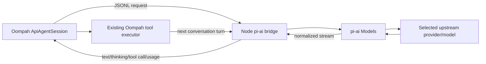

# Pi AI provider integration

## Status

Proposed design. This document scopes using Pi's reusable model/transport
framework inside Oompah. It deliberately excludes Pi's coding agent, CLI/RPC
runtime, built-in coding tools, extensions, skills, prompts, themes, and session
UI.

## Goal

Add a provider implementation backed by `@earendil-works/pi-ai`, analogous to
Oompah's existing OpenAI-compatible API provider path but with Pi's broader
provider/model/auth support.

Oompah remains the agent:

- Oompah owns the turn loop, prompt, task lifecycle, retries, and deadlines.
- Oompah advertises and executes its existing guarded tool catalog.
- Oompah owns workspace confinement, validation leases, exact-head submission,
  audit verdicts, and project mutation policy.
- Pi supplies provider discovery, authentication, request serialization,
  streaming, normalized responses, usage, and cost.

This is materially smaller and safer than adding Pi as another autonomous ACP
backend.



## Recommended architecture

### Transport boundary

Create a small, pinned Node sidecar around `@earendil-works/pi-ai`. The Python
process communicates with it over LF-delimited JSON.

Do not invoke `pi --mode rpc`. That command runs the full coding-agent layer,
including its own agent loop and resource-loading behavior. Do not depend on a
global `pi` binary either. Oompah should execute a repository-owned, versioned
bridge artifact against pinned npm dependencies.

The simplest initial lifecycle is **one sidecar process per Oompah worker**.
The sidecar may persist for all turns in that worker, which avoids rebuilding
Pi's provider catalog and OAuth state for every tool round trip. A shared
multi-worker daemon can be considered later, but would require request
multiplexing, tenant isolation, crash recovery, and per-session cancellation.

### Division of responsibility

The Node bridge should perform only:

1. Construct a Pi `Models` collection.
2. Register built-in and explicitly configured custom providers.
3. Resolve one exact provider/model and its scoped credential.
4. Accept Oompah's OpenAI-style conversation and tool schemas.
5. Convert them to Pi's `Context` and `Tool` types.
6. Call `models.streamSimple()` or `models.completeSimple()`.
7. Return normalized assistant content, tool calls, stop reason, usage, cost,
   and provider errors.

Python should continue to perform:

1. Turn counting and stall detection.
2. Context pruning until a deliberate Pi migration replaces it.
3. `_execute_tool()` dispatch.
4. Auditor finalization and `submit_audit_result` enforcement.
5. Read-only and action-policy checks.
6. Validation resource leases and tool-liveness accounting.
7. Task-handoff command interception.
8. Exact task submission and lifecycle transitions.
9. Provider admission, health accounting, retries, and cancellation.

This approach can be implemented either as a new `PiApiAgentSession` selected by
the provider, or as a transport strategy inside `ApiAgentSession`. A distinct
session class is preferable initially because Pi's normalized message/event
shape is not identical to OpenAI Chat Completions and forcing it through
`_call_api()` would create a misleading abstraction.

## Private JSONL protocol

The bridge protocol should be versioned, bounded, and independent of Pi CLI
RPC.

### Python to Node

- `initialize`
  - protocol version;
  - provider/model identifier;
  - sanitized provider configuration;
  - path to a private credential store;
  - offline/catalog settings;
  - optional reasoning level;
  - exact tool definitions.
- `complete`
  - system prompt;
  - complete Oompah-owned conversation;
  - maximum output tokens;
  - request timeout and transport preference.
- `abort`
  - cancellation for the in-flight provider request.
- `shutdown`
  - graceful process exit.

### Node to Python

- `ready`
  - protocol version and resolved model metadata.
- `text_delta`, `thinking_delta`.
- `toolcall_start`, `toolcall_delta`, `toolcall_end`.
- `done`
  - stop reason and final normalized assistant message.
- `usage`
  - input, output, cache-read, cache-write, total tokens, and exact cost.
- `error`
  - normalized, redacted provider/auth/protocol failure.

Every request and response needs an ID. Frames must have a strict maximum size;
malformed or oversized frames fail closed. Stderr is diagnostic only and must
be bounded and redacted before Oompah persists it.

A non-streaming first spike can return one complete normalized response. The
production version should stream so Oompah keeps activity timestamps current
and can interrupt long provider responses.

## Tool handling

The bridge should receive `ApiAgentSession._tool_definitions` and convert each
OpenAI-style function schema to a Pi `Tool` object. It does **not** execute those
tools. When Pi emits a tool call, the bridge returns it to Python as the
assistant response; Oompah calls its existing `_execute_tool()` and sends the
result in the next `complete` request.

This is the important simplification from the earlier sidecar design: because
Oompah already owns a correct multi-turn tool loop, no bidirectional tool RPC
inside one provider request is needed.

The following remain unchanged:

- path containment and file-size limits;
- command timeout and subprocess-tree handling;
- read-only duplicate screening;
- auditor command allowlists;
- `submit_audit_result` finalization;
- task CLI interception and scoped capability checks;
- project read/update policy;
- oversized command-output paging;
- validation lease and reuse policy;
- server-owned epic rebase publication.

## Authentication

Pi's `ModelRuntime` can resolve provider API keys and OAuth credentials, but the
worker must not receive the operator's complete `~/.pi/agent` directory.

Recommended v1 design:

1. Extend the Oompah provider record with Pi transport metadata:
   - `transport: "openai_compatible" | "pi_ai"` or equivalent;
   - `pi_provider_id`;
   - exact `pi_model_id` (or canonical `provider/model` in the existing model
     field);
   - optional reasoning level and transport preference.
2. Before launch, create a private worker config directory.
3. Copy only the selected Pi provider credential into a minimal `auth.json`
   with mode `0600`, or pass an API key through a dedicated scoped environment
   variable.
4. Generate minimal `models.json` only for custom providers/models.
5. Set `PI_CODING_AGENT_DIR` to the private directory and disable unrelated
   startup network activity with `PI_OFFLINE=1`, `PI_SKIP_VERSION_CHECK=1`, and
   `PI_TELEMETRY=0` after catalog materialization.
6. Remove the private directory when the worker ends.

OAuth refresh is the main open design point. Copying a refresh credential into
a disposable store is safe but does not propagate rotated credentials back to
the operator store. For v1, either:

- support API-key providers plus non-rotating credentials first; or
- have a trusted server-side bridge own the Pi credential store and never place
  OAuth material in task-writable paths.

Do not put API keys or OAuth tokens in argv, logs, JSONL events, task comments,
or the worktree.

## Provider and model configuration

This should be a provider transport, not a new Oompah agent mode. Existing
profiles can remain `mode: api`; the selected provider decides whether requests
use the existing OpenAI-compatible transport or `pi-ai`.

Suggested provider fields:

```json
{
  "name": "Pi / Jocasta",
  "mode": "api",
  "transport": "pi_ai",
  "pi_provider_id": "jocasta-4000",
  "models": ["gpt_sol", "claude_only"],
  "default_model": "gpt_sol",
  "billing_model": "per_token"
}
```

Avoid overloading `backend`, which currently selects an ACP session backend
only when `mode == "acp"`. A separate transport field keeps persisted meaning
clear and avoids routing Pi through `AcpAgentSession` unnecessarily.

Model discovery should call a bounded helper backed by Pi's model collection.
It should return canonical model IDs plus context, output, reasoning, image,
and cost metadata. Oompah can continue storing its normalized subset in the
provider record. Discovery must support cached/offline fallback and must not
load project resources.

## Process and dependency packaging

Oompah is Python and Pi's framework is Node/TypeScript. Add a dedicated bridge
directory, for example:

```text
bridge/pi-ai/
  package.json
  package-lock.json
  src/main.ts
  dist/main.js
```

Recommended release strategy:

- pin `@earendil-works/pi-ai` to a tested version (currently inspected at
  `0.84.3`);
- require Node `>=22.19.0` for this optional provider;
- build a single checked release artifact in setup/release CI;
- verify package-lock integrity;
- keep Pi dependencies optional so normal Oompah installations do not require
  Node;
- fail provider validation clearly when Node or the bridge is absent.

`@earendil-works/pi-agent-core` is not needed for the recommended design because
Oompah retains its own agent/tool loop. It may be evaluated later if Oompah
chooses to replace `ApiAgentSession` wholesale rather than add a transport.

## Runtime behavior

### Provider contact

- Oompah calls its admission callback immediately before writing the `complete`
  request that can cause the bridge to contact the provider.
- The bridge reports `provider_start` when Pi starts the model stream.
- Oompah marks transport contacted only on that event.
- Local spawn, configuration, or model-resolution failures cancel the unused
  permit and do not count as provider health/spend.

### Cancellation and deadlines

- Oompah's turn deadline remains authoritative.
- On cancellation, send `abort`; wait briefly; then terminate the process group;
  finally use bounded kill fallback.
- Since tools continue to execute in Python, existing `ToolLivenessMonitor`
  behavior remains unchanged.
- Disable Pi-level retries initially (`maxRetries: 0`) so retries are not hidden
  from Oompah's provider-health and budget accounting.

### Usage and cost

Map Pi's normalized usage fields:

- `input` -> input tokens;
- `output` -> output tokens;
- `cacheRead` and `cacheWrite` -> preserved additional metrics;
- `totalTokens` -> total tokens;
- `cost.total` -> exact provider-reported cost.

For per-token providers, exact Pi cost should win over Oompah's local fallback
rates. Subscription providers report usage but do not add spend, matching the
existing billing policy.

### Images

Pi models expose text/image input capability. The first version should preserve
Oompah's existing `RenderedPrompt.parts` attachment handling and translate
OpenAI-style text/image blocks into Pi `UserMessage` content. Unsupported images
must fail or be omitted according to the same capability decision used today;
they must never silently become local file paths visible outside the workspace.

## Security constraints

1. The bridge imports `pi-ai` only; it does not import or launch
   `pi-coding-agent`.
2. No Pi coding tools, extensions, project settings, skills, packages, session
   files, or context-file discovery are active.
3. Python remains the only tool executor and repeats all existing policy checks.
4. The bridge receives only the selected provider credential and sanitized
   environment.
5. Operator Basic credentials remain stripped from child environments.
6. Model and provider identity are frozen before the first request; a provider
   configuration change supersedes the stale run.
7. All event/error payloads are redacted and bounded before persistence.
8. The bridge process and descendants are terminated on cancellation or service
   drain.
9. Shared-epic rebase support needs no new native-shell exemption because tools
   remain on the Python side; nevertheless, it must pass the existing isolated
   credential and server-mediated publication suites before being enabled.

## Files and components

### New

- `oompah/pi_ai_transport.py`
  - Async sidecar supervisor, JSONL framing, timeout/cancellation, event
    normalization, usage/cost collection, and process cleanup.
- `bridge/pi-ai/package.json` and lock file
  - Pinned `@earendil-works/pi-ai` dependency and build scripts.
- `bridge/pi-ai/src/main.ts`
  - Minimal model-runtime bridge with no agent or coding-agent imports.
- `tests/test_pi_ai_transport.py`
  - Python-side protocol/lifecycle tests with a fake sidecar.
- `bridge/pi-ai/test/`
  - Node tests using Pi's faux provider.

### Modified

- `oompah/api_agent.py`
  - Factor the provider call behind a transport protocol, or add a sibling
    `PiApiAgentSession` while reusing `_tool_definitions` and `_execute_tool()`.
- `oompah/models.py` and `oompah/providers.py`
  - Persist and validate the Pi transport/provider/model fields.
- `oompah/orchestrator.py`
  - Select the Pi transport, pass scoped model/auth data, preserve provider
    contact and lifecycle accounting.
- `oompah/provider_health.py`
  - Bounded Pi model probe.
- `oompah/client_auth.py`
  - Minimal selected-provider credential bootstrap for the sidecar.
- `oompah/server.py` and `oompah/templates/providers.html`
  - Provider form, model discovery, validation, and operator diagnostics.
- `pyproject.toml`, `Makefile`, and release/install scripts
  - Optional Node bridge setup/build checks.
- `.env.example` and user documentation
  - Bridge path, startup timeout, and credential-root controls if needed.

No new console translator is required if the Pi transport emits the same
`AgentActivity` vocabulary as `ApiAgentSession`; console backend switching is
an ACP-session concern, not a provider-transport concern.

## Test plan

### Node bridge

- deterministic request/response tests with Pi's faux provider;
- text, thinking, tool-call, usage, cost, stop, error, and abort mapping;
- exact model selection and unavailable-model errors;
- malformed and oversized input rejection;
- no imports from `pi-coding-agent` or `pi-agent-core`;
- no resource discovery or filesystem tools.

### Python transport

- subprocess startup and missing Node/package diagnostics;
- split UTF-8 and strict LF framing;
- bounded stdout/stderr handling;
- provider-contact permit ordering;
- timeout, abort, TERM/KILL, and descendant cleanup;
- secret redaction;
- exact usage/cost propagation;
- one persistent sidecar across multiple tool turns;
- sidecar crash during a tool-result continuation;
- no retry hidden beneath Oompah policy.

### Oompah behavior

Run the same behavioral contract against OpenAI HTTP and Pi transports:

- implementation read/edit/write/run/submit flow;
- task-handoff scope and Basic credential stripping;
- duplicate investigator read-only tool set;
- completion auditor verdict requirement;
- project mutation policy;
- command-output paging;
- validation resource lease and timeout extension;
- exact-head submission and stale-generation rejection;
- provider health and budget accounting;
- service drain/restart cleanup;
- multimodal prompt translation.

### Live canary

1. Add a dedicated Pi provider but do not put it in a production role.
2. Run provider health against one known model.
3. Assign one disposable implementation task to a Pi-backed role.
4. Verify tool policy, clean commit, push, exact submit, telemetry, and process
   cleanup.
5. Run one duplicate-screening task.
6. Run one completion audit only after `submit_audit_result` tests pass.
7. Run one shared-epic rebase only after isolation tests pass.
8. Add Pi to normal candidate rotation after all canaries pass.

## Suggested implementation slices

1. **Transport spike** — Node bridge using `pi-ai` plus faux-provider tests;
   Python client can complete a no-tool and one-tool conversation.
2. **Tool-loop integration** — reusable transport interface in
   `ApiAgentSession`; all existing Oompah tools remain Python-owned.
3. **Auth and catalog** — private selected-provider credentials, model
   discovery, UI, and health checks.
4. **Lifecycle hardening** — cancellation, process tree, contact admission,
   usage/cost, error mapping, and bounded streams.
5. **Capability parity** — investigator, auditor, task handoff, validation
   leases, multimodal input, and isolated epic rebase.

## Estimated effort

- Transport spike: 1–2 engineering days.
- Python integration and tool-loop reuse: 2–4 days.
- Auth/catalog/UI/packaging: 2–4 days.
- Security, lifecycle, parity tests, and canary: 3–5 days.

Expected total: approximately **1.5–2.5 engineering weeks**. This is smaller
than integrating the complete Pi coding agent because it avoids duplicate agent
loops, tools, sessions, resource discovery, and permission systems.

## Acceptance criteria

- An Oompah provider can select `pi-ai` transport and an exact Pi provider/model.
- Oompah, not Pi, remains the sole agent-loop and tool-policy owner.
- No `pi-coding-agent` or Pi built-in coding-tool behavior is loaded.
- All tool calls execute through Oompah's existing guarded executor.
- Credentials are scoped to the selected provider and never exposed to the
  worktree, argv, logs, or task comments.
- Provider admission, timeout, cancellation, usage, cost, and health semantics
  match existing Oompah provider contracts.
- Existing API, Claude, Codex, and OpenCode paths remain unchanged.
- Focused tests and the complete `make test` gate pass.
