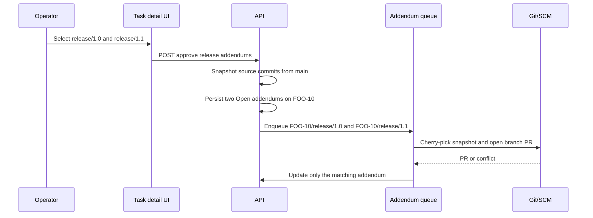

# Queueing Release-Branch Addendums

**Status:** proposed implementation plan
**Scope:** replace release-pick child tasks with first-class release addendums

## 1. Decision

All product work lands on a project's default branch (`main` in the examples)
first.  A later decision to deliver an already-merged task or epic to a release
branch creates a **release addendum** on that original task; it does not create
a task, child task, GitHub issue, or standalone Markdown task.

For example, when `FOO-10` has merged to `main` and an operator selects
`release/1.0` and `release/1.1`, Oompah writes two addendums to `FOO-10` and
immediately puts both into the internal release-addendum queue:



The original task remains `Merged` on `main`; its addendums independently move
through `Open`, `In progress`, `In review`, `Merged`, or a blocked state.  The
release branch is never a second place to author ordinary feature work.

## 2. Goals and non-goals

### Goals

- Let an operator choose one or more existing release branches from a
  multi-select in a merged task or epic.
- Create one independently queueable unit per `(source task or epic, target
  branch)` as soon as selection is approved.
- Keep every queue unit and its history visibly attached to its source task or
  epic.  Do not create a tracker child task.
- Snapshot exactly the commits approved for each addendum, so later changes on
  `main` cannot silently enter an already-approved release delivery.
- Make the task page and a branch page answer which source tasks are pending,
  in progress, blocked, or merged into each release branch.
- Retain idempotency across API retries, orchestrator restarts, and SCM polling.

### Non-goals

- This change does not define support lifetimes, release cadence, or a policy
  for deciding whether a fix belongs in a given release line.
- It does not automatically merge all of `main` into a release branch.
- It does not make release branches valid targets for ordinary feature tasks.
- It does not preserve the current child-backport-task model for new work.

## 3. Existing implementation to replace

The repository already has the beginnings of release picks:

- `oompah.release_pick_schema.BackportEntry` persists `oompah.backports`.
- `release_pick_reconciler` reacts to a `waiting` entry by creating a child
  task, then creates a target worktree and PR.
- the dashboard has an **Add Release Picks** dialog and per-task release-pick
  rows;
- `release_pick_api` and `server.py` expose detail, bulk update, and epic
  matrix endpoints.

That design conflicts with this decision because `task_id` and
`oompah.backport_of` are child-task links, and the reconciler treats the child
task's tracker state as the source of queue state.  Reuse its commit resolution,
cherry-pick, PR creation, and PR-reconciliation logic, but replace the schema,
queue boundary, API, and UI terminology below.  Remove the child-task creation
path once migration is complete.

## 4. Persistent model

Use one canonical source-task metadata field:

```yaml
oompah.release_addendums:
  - id: "FOO-10/release/1.0"
    source_branch: main
    target_branch: release/1.0
    status: open
    commits:
      - 3c8c1d5f6a... # immutable, ordered, full SHA
    queued_at: "2026-07-13T12:00:00Z"
    started_at: null
    completed_at: null
    work_branch: "oompah/release/FOO-10/release-1.0"
    worktree_key: "release-FOO-10-release-1.0"
    pr_url: null
    result_commits: []
    error: null
```

Implement this in a new `oompah.release_addendum_schema` module.  Do not
overload `oompah.backports`: its documented semantics include a child `task_id`
and its status names describe the retired architecture.

### 4.1 Identity and invariants

- `id` is the stable tuple `(source identifier, target branch)` serialized as
  `<source>/<target>`. It is an identifier, not a filesystem path; encode it
  when using it in a URL and use the existing branch-name sanitizer for Git
  names and worktree paths.
- A source task has at most one non-archived addendum for a target branch.
  Repeating the approval request is idempotent and returns the existing row.
- `source_branch` is the project's `default_branch` at creation time; it must
  not be editable by the client.
- `commits` is populated before the addendum becomes `open`.  It is an
  immutable snapshot.  A retry uses the same list.
- `work_branch` is deterministic from source ID and target branch.  It must be
  namespaced under `oompah/release/` so it cannot collide with ordinary task
  branches.
- `result_commits`, `pr_url`, timestamps, and `error` are execution evidence,
  not operator input.
- The source task must be in the canonical `Merged` state and the source merge
  must be discoverable before an addendum can be approved. Return `409` rather
  than queueing a guessed range.

### 4.2 Lifecycle

Use statuses that describe the addendum itself, not a synthetic child task:

```mermaid
stateDiagram-v2
    [*] --> open: release branches approved
    open --> in_progress: queue worker claims addendum
    in_progress --> in_review: cherry-pick pushed and PR opened
    in_progress --> blocked: conflict or execution failure
    in_review --> merged: target PR merged
    in_review --> open: unmerged PR closed; retry requested
    blocked --> open: operator retries after resolution
    open --> archived: operator cancels
    blocked --> archived: operator cancels
    merged --> [*]
    archived --> [*]
```



`open` is the required "ready for work" state. Only `open` is eligible for
claiming. `in_progress` leases must include `claimed_by` and `lease_expires_at`
in metadata (or an equivalent durable queue store); a reconciliation pass moves
an expired lease back to `open`. `blocked`, `merged`, and `archived` are never
auto-dispatched.

## 5. Release-branch catalog

The UI must offer current release branches, not free-form text or merely the
configured glob patterns. Add `ReleaseBranchCatalog` with this contract:

```python
list_candidates(project) -> list[ReleaseBranch]
```

1. Run `git ls-remote --heads origin` using the project's repository checkout;
   parse ref names and cache successful results for 60 seconds per project.
2. On a remote failure, fall back to local `refs/remotes/origin/*` and mark the
   response `stale: true`; do not offer a guessed branch absent from both.
3. Include a branch only when it exists, differs from `project.default_branch`,
   and matches `project.branches`. The configured patterns remain the access
   control boundary; for a typical project `release/*` supplies candidates.
4. Sort reverse-natural by branch name (for example `release/1.11` before
   `release/1.9`), then lexically for non-version names.
5. Return branches already represented by an addendum even if deleted, marked
   `available: false`, so history remains inspectable. They cannot be newly
   selected.
6. Invalidate the cache when a tracked-branch push webhook arrives and after a
   successful release addendum merge.

Expose `GET /api/v1/projects/{project_id}/release-branches`. Its response is
`{project_id, source_branch, branches: [{name, available, stale}], refreshed_at}`.
The endpoint must return `503` on a first-load discovery failure rather than
silently displaying a partial target list.

## 6. Approval API and immediate queueing

Replace the public write path with:

```http
POST /api/v1/issues/{identifier}/release-addendums
{
  "project_id": "foo",
  "target_branches": ["release/1.0", "release/1.1"],
  "idempotency_key": "UUID generated by the UI"
}
```

The endpoint must perform, in order:

1. resolve the task and project and require that the task is `Merged`;
2. deduplicate and validate `target_branches` against the fresh branch catalog;
3. resolve the ordered source commit set from the merged `main` PR using the
   existing SCM resolver; fail the whole request if any selected branch cannot
   be safely queued;
4. under a per-source-task lock, create only missing addendums and persist the
   entire updated metadata value atomically through the tracker;
5. publish one `release_addendum_ready` event for every newly-created row;
6. invalidate task and branch-inspection API caches and return the full source
   task addendum list.

If event publication fails after persistence, leave the row `open` and return
success with `queued: false`; the periodic reconciler described in section 8
must discover and enqueue it. Never roll back durable approval because an
in-memory wake-up failed.

`POST` only adds targets. Cancellation and retry are explicit operations:

- `POST .../{addendum_id}/retry` transitions `blocked` or a closed-unmerged
  `in_review` addendum to `open`, with the original immutable commits.
- `POST .../{addendum_id}/archive` transitions `open` or `blocked` to
  `archived`.

All state-changing endpoints require `project_id`, reject an invalid transition
with `409`, and emit a task comment using author `oompah` that includes the
branch, transition, PR URL where present, and error where applicable.

## 7. Dashboard behaviour

Replace **Release Picks** with **Release addendums** in
`oompah/templates/dashboard.html`.

### Task detail

- Display one row per target branch: branch name, addendum status, queue/lease
  state, PR link, and blocked error. Do not render a child-task link.
- Show **Add release branches** only when the task is `Merged` on the default
  branch. Existing rows remain visible on terminal tasks.
- The dialog fetches the branch-catalog endpoint on open and displays one
  checkbox per available candidate. Existing active addendums are prechecked
  and disabled; terminal/archived rows are shown separately and are not
  silently recreated.
- The submit button says **Queue release merges** and calls the approval API.
  On success, close the dialog and refresh the task panel. It must not require
  a second action to put approved branches on the queue.
- Use an accessible checkbox group (`fieldset`, `legend`, labelled checkboxes),
  a focus trap, Escape-to-close, and visible loading/error states. Disable
  submission while the request is outstanding.

### Epic detail

An epic approval creates a single addendum per selected target on the epic,
not one child task per branch. Its commit snapshot is the ordered, deduplicated
union of all descendant tasks currently `Merged` on `main`, in merge order.
The approval API must return the exact included child IDs and SHAs. Descendants
that merge later are not added automatically; an operator creates a separate
epic addendum or individual task addendum for them.

Replace the current child-by-branch release-pick matrix with an epic addendum
list showing target branch, snapshot size, included-child count, status, and
PR. A link or expandable detail exposes the immutable child/commit snapshot.

### Branch inspection

Add a **Release branches** dashboard view. Selecting `release/1.0` calls
`GET /api/v1/projects/{project_id}/release-branches/{encoded_branch}/addendums`
and shows all source tasks/epics with an addendum for that branch, grouped as
Open, In progress, In review, Blocked, Merged, and Archived. Rows link back to
their original task. This is the authoritative product-level answer to which
features a branch has received or is about to receive.

The response must include direct target-branch changes that cannot be mapped to
an addendum, as an `untracked_commits` warning section. Determine these with a
Git range from the last known addendum result/branch base; do not claim that a
raw commit is a feature. This warning is informational and does not create
tasks.

## 8. Queue and execution

Implement a durable `ReleaseAddendumQueue` adapter rather than converting an
addendum into an `Issue` or a tracker child.

- Its queue item key is `(project_id, source_identifier, target_branch)`.
- It reads `open` addendums from tracker metadata, claims one atomically by
  changing it to `in_progress` with a lease, and runs beside the existing
  dispatch loop. The `release_addendum_ready` event wakes this loop immediately;
  the periodic scan is the recovery mechanism.
- It uses a release-specific worktree rooted at `origin/<target_branch>` and
  the deterministic `work_branch` from the persisted addendum.
- It reuses `resolve_commits_for_entry` only for legacy migration. New work has
  snapshot commits already. Extract the generic cherry-pick/push/open-PR
  operations from `cherry_pick_pr_creator` so they accept an addendum and do
  not read or write child task state.
- On success, persist `in_review`, `pr_url`, and `result_commits`; on conflict
  or execution failure, persist `blocked` and diagnostic detail. Preserve a
  conflict worktree for a human retry. Do not create a child task or alter the
  source task's status.
- PR polling maps a merged PR to `merged`; a closed-unmerged PR returns the
  addendum to `open` only after an explicit retry action. It must not
  automatically open a replacement PR.
- Lease recovery, PR polling, and events must be idempotent. Before opening a
  PR, query by `work_branch`; if one already exists, record it rather than
  opening another.

The queue worker is deliberately mechanical. A conflict is surfaced as a
blocked addendum attached to the source task; it is not disguised as newly
planned product work.

## 9. Migration and compatibility

Release picks already exist, so rollout must preserve data:

1. Add schema parsing and read support for `oompah.release_addendums` while
   leaving existing release-pick reads untouched.
2. Write a one-time idempotent migration command and startup migration:
   transform every `oompah.backports` entry into an addendum on the same source
   task. Map `waiting`/`task_created`/`cherry_picking` to `open`, `pr_open` to
   `in_review`, `conflict`/`needs_human` to `blocked`, and
   `merged`/`archived`/`skipped` to `merged`/`archived`.
3. For old entries with a child task, copy PR URL, commits, target branch, and
   useful timestamps into the addendum. Mark the child task `Archived` with an
   `oompah` comment directing readers to the source task addendum. Do not
   delete task files or rewrite task identifiers.
4. Deploy readers and migration before deleting the old reconciler path. Make
   the migration safe to rerun by matching source + target branch + existing
   PR URL/commit snapshot.
5. Remove `oompah.backport_of`, child creation, the old matrix/apply-all API,
   and child-task UI only after migration metrics show zero unconverted active
   picks. Return `410` with the replacement endpoint in the next release, then
   remove old routes in the following compatibility release.

## 10. Tests and acceptance criteria

Add focused tests alongside the implementation. Existing release-pick tests
should be migrated or replaced rather than merely left passing against dead
code.

### Schema and service tests

- Parse/serialize all addendum fields; reject duplicate target branches,
  missing commit snapshots, invalid statuses, invalid timestamps, and illegal
  transitions.
- Approving `FOO-10` for `release/1.0` and `release/1.1` persists exactly two
  `open` addendums and emits two queue events.
- Repeating the same request is idempotent; a concurrent pair of requests
  cannot create duplicate rows or queue work twice.
- Approval rejects non-merged tasks, the default branch, nonexistent branches,
  stale-only candidates, invalid configured patterns, and unresolved commit
  sets without persisting a partial selection.
- Epic approval snapshots only descendants that are merged at the time of the
  request, in deterministic merge order.

### Catalog and API tests

- Remote branch discovery filters `main`, nonmatching branches, deleted
  branches, and sorts numeric release names naturally.
- Cache fallback exposes `stale: true`; first-load failure returns `503`.
- API response and error contracts cover 200, 400, 404, 409, and 503 cases;
  identifiers and branch names with URL-reserved characters are route-safe.
- Branch inspection groups addendums correctly and includes unavailable
  historical branches plus untracked-commit warnings.

### Queue and Git/SCM tests

- Claim/lease behavior allows one worker only, returns expired leases to open,
  and recovers an `open` addendum after a process restart with no event.
- Cherry-pick uses the persisted commit list and target base, reuses an
  existing work branch/PR, and never creates a tracker task.
- Conflicts yield `blocked`, preserve the worktree, and add the source-task
  comment; retry does not change the commit snapshot.
- Merged and closed PR reconciliation produces the specified state changes and
  is idempotent.

### UI tests

- The dialog consumes catalog candidates as checkboxes, submits all selected
  branches in one request, and shows loading, empty, stale, and failure states.
- The source task detail renders no child-task link and refreshes directly to
  `open` after approval.
- Epic snapshot detail and the release-branch inspection view render data and
  deep-link to the source task.

Run `make test` before each implementation slice is committed and run the
relevant dashboard/browser suite if the project has one.

## 11. Delivery slices

1. **Foundation:** add schema, transition validation, metadata repository,
   source-task locking, and unit tests. No UI switch yet.
2. **Catalog and API:** implement branch discovery, approval/transition APIs,
   events, and API tests.
3. **Queue:** implement claim/lease/recovery and adapt cherry-pick/PR logic;
   verify no child task is created.
4. **UI:** replace task dialog and release rows; add epic snapshot and branch
   inspector.
5. **Migration and removal:** migrate existing entries, archive historical
   child tasks, observe metrics, then retire old release-pick paths.

Each slice must be deployable without data loss. Feature-gate the new UI and
queue until the reader/migration path is live; the flag belongs in `.env`, not
`WORKFLOW.md`.
