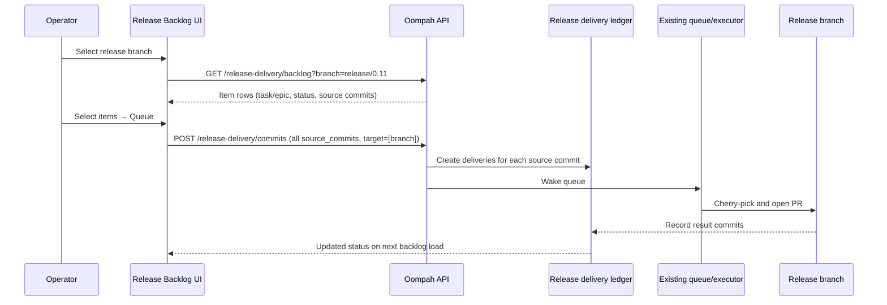

# Item-Centric Release Delivery Backlog

**Status:** Implemented (OOMPAH-236)

**Supersedes:** The commit-centric inventory described in the original version
of this plan (OOMPAH-192 and its sub-tasks). The release delivery overlay now
presents one row per task/epic (not one row per commit), requires branch
selection before loading, and removes cursor-based commit pagination.

The delivery ledger, ancestry checks, executor, and existing queue interfaces
are reused without rewriting delivery execution.

## 1. Decision

Replace the commit-centric release-delivery overlay — which paged through
individual main-branch commits — with an **item-centric release backlog**. An
operator selects exactly one supported release branch, then sees a bounded,
complete list of tasks and epics whose source commits have landed on the
default branch but have not yet been delivered to that release branch.

Each row represents a **task or epic** (not a commit). Selecting one or more
rows queues **all associated source commits** of those items to the selected
release branch through the existing delivery ledger and executor. The overlay
never creates child merge tasks.



## 2. User experience

### 2.1 Branch-first selection

The overlay requires the operator to select exactly one configured supported
release branch before any backlog rows are loaded. A `<select>` dropdown is
pre-populated from the project's `supported_release_branches`. If the project
has exactly one configured branch, it is auto-selected and the backlog loads
immediately.

No multi-branch column model is used in this overlay. The selection model is:

- **Branch selector** (required, first): choose target release branch.
- **Filter** (default: `Needs delivery`): show only items not yet delivered.
- **Search**: text filter over identifier, title, and subject.

### 2.2 Backlog layout

The overlay contains:

1. A project selector and release branch selector (required first).
2. A meta line showing `<source_branch> → <selected_branch>` and the source
   HEAD / refresh time.
3. Filters: `Needs delivery` (default) and `All` (includes delivered history).
4. Text search over identifier, title, and commit subject.
5. A **complete, bounded** item table — no "Load next page" pagination. If an
   implementation limit is reached, an explanatory count is shown; never a
   cursor-based history page.
6. A sticky bulk action bar shown when one or more items are checked: shows
   selected count and a single **Queue selected items** button.
7. A **details drawer** opened by clicking the item's identifier or status
   cell: shows item identifier, title, kind (task/epic), and source commits
   as **subordinate detail** (SHA, subject, author, per-commit status).
8. An **Unassociated commits** section (collapsed, subordinate) shown below
   the primary item table: direct-to-main commits that have no ledger
   `source_identifier` association. Not primary candidates; shown for
   diagnostics only.

### 2.3 Item row fields

| Column | Source |
|--------|--------|
| Select | Checkbox — disabled for delivered/archived items |
| Identifier | `source_identifier` from ledger |
| Title | Resolved from tracker (best-effort; falls back to identifier) |
| Commits | `commit_count` (total source commits for this item) |
| Merged | Most recent `authored_at` across source commits |
| Status | Aggregated delivery status (highest-priority across all commits) |

Status uses the same vocabulary as before: `not_selected`, `open`,
`in_progress`, `in_review`, `blocked`, `delivered`, `archived`. Priority order
(highest first): `blocked > in_progress > in_review > open > delivered >
archived > not_selected`.

### 2.4 Status rules (per item)

An item's status is the highest-ranked status among all its source commits for
the selected branch:

| Condition | Cell state | Evidence shown |
|---|---|---|
| Any commit has a non-archived delivery that is open/in_progress/in_review/blocked | That queue state | delivery_id, PR, error |
| Any commit is in a merged/delivered delivery | Delivered | PR, result SHAs |
| Any commit is reachable by ancestry from the release branch | Delivered (ancestry) | present by ancestry |
| Only archived deliveries | Archived | archived delivery_id |
| None of the above | Not selected | — |

### 2.5 Queueing

- Checking one or more items and clicking **Queue selected items** sends
  **all** `source_commits` from the checked items (in their original order)
  to the existing `POST /release-delivery/commits` endpoint with
  `target_branches: [<selected_branch>]`.
- A confirmation dialog shows item count, commit count, and selected branch.
- Delivered/archived items have their checkbox disabled so they cannot be
  re-queued accidentally.
- If items already have active deliveries (open/in_progress/in_review), their
  identifiers are still cleared from selection on success (they were already
  queued); any truly invalid entries remain selected for retry.
- After success the backlog reloads from scratch.

## 3. Data model

The item-centric backlog is a **read layer** on top of the existing release
delivery ledger (`ReleaseDeliveryStore`) and commit inventory service
(`CommitInventoryService`). No new ledger schema is introduced.

### 3.1 Association source

Item-to-commit associations come exclusively from the delivery ledger's
`source_identifier` field. The backlog service **does not** guess associations
from commit subjects or PR titles. Commits with no ledger entry with a
`source_identifier` appear in the `unassociated_commits` list, not as primary
item rows.

### 3.2 BacklogResult structure

```python
@dataclass
class SourceCommitInfo:
    sha: str
    short_sha: str
    subject: str
    author_name: str
    authored_at: str | None
    delivery_status: DeliveryCell | None   # aggregated status cell

@dataclass
class ItemRow:
    identifier: str
    kind: str            # "task" | "epic"
    title: str | None    # from tracker, may be None
    commit_count: int
    most_recent_commit_at: str | None
    delivery_status: DeliveryCell   # aggregated across all source commits
    source_commits: list[SourceCommitInfo]

@dataclass
class UnassociatedCommitRow:
    sha: str
    short_sha: str
    subject: str
    author_name: str
    authored_at: str | None
    delivery_status: DeliveryCell   # status for selected branch

@dataclass
class BacklogResult:
    project_id: str
    source_branch: str
    source_head: str | None
    selected_branch: str
    branch_available: bool
    items: list[ItemRow]          # primary item rows
    unassociated_commits: list[UnassociatedCommitRow]  # subordinate
    total_commit_count: int       # across all items + unassociated
    stale: bool                   # True if last refresh used cached data
    refreshed_at: str | None
    # NO next_cursor — item-centric backlog is always a complete bounded list
```

## 4. API

### 4.1 Backlog endpoint (new)

```http
GET /api/v1/projects/{project_id}/release-delivery/backlog
  ?branch=release/0.11          (required; must be in supported_release_branches)
  &filter=needs_delivery         (default; or 'all')
  &query=OOMPAH-123             (optional text search)
```

Returns a `BacklogResult` serialized to JSON. No `next_cursor` field.

- `400` if `branch` is missing or not in `supported_release_branches`.
- `400` if `filter` is unknown.
- `404` if project not found.
- `503` if no repo path or inventory error.

### 4.2 Queue endpoint (existing, reused)

```http
POST /api/v1/projects/{project_id}/release-delivery/commits
Idempotency-Key: <UUID>

{
  "source_head": "<SHA>",
  "commits": ["<sha1>", "<sha2>", ...],   // all source_commits from selected items
  "target_branches": ["release/0.11"]      // single branch from selector
}
```

Unchanged from the commit-centric implementation; the item-centric UI simply
sends all source commits for selected items in one request.

## 5. ItemBacklogService

New module: `oompah/release_delivery_backlog.py`

Key function: `ItemBacklogService.get_backlog(selected_branch, filter, query, tracker)`

Algorithm:
1. Acquire a commit snapshot from `CommitInventoryService._acquire_snapshot`.
2. Enumerate all commits from the default branch.
3. Load all deliveries for `selected_branch` from the ledger.
4. Build `association_by_sha` index: `sha → source_identifier` from deliveries.
5. Group commits by identifier into `item_commits_map`.
6. Batch ancestry check for uncovered SHAs.
7. Optionally look up titles from the tracker.
8. Build `ItemRow` objects with aggregated status (highest-ranked across commits).
9. Build `UnassociatedCommitRow` for commits with no identifier.
10. Apply filter (`needs_delivery` vs `all`) and text search.

`MAX_BACKLOG_ITEMS = 500` is the implementation limit; if exceeded, a count
note is added to the result rather than a pagination cursor.

## 6. Dashboard implementation

In `oompah/templates/dashboard.html`:

The Release delivery overlay was refactored from commit-centric (OOMPAH-200)
to item-centric (OOMPAH-236). Key changes:

1. **Branch-first selection**: A `<select id="rdi-branch-select">` is required
   before the backlog loads. Replaced old branch-filter checkboxes entirely.
2. **No pagination**: `_rdiLoadBacklog()` replaces `_rdiLoadPage(cursor)`.
   The new function fetches `/release-delivery/backlog?branch=...` as a
   complete bounded list. No "Load next page" button.
3. **Item rows**: `_rdiRenderItemRow()` replaces `_rdiRenderRow()`. Shows
   identifier, title, commit count, merged date, and aggregated status.
4. **Identifier-based selection**: `_rdiSelectedIdentifiers` (Set) replaces
   `_rdiSelectedSHAs`. `_rdiToggleIdentifier()` replaces `_rdiToggleSHA()`.
5. **Item drawer**: `_rdiOpenItemDrawer()` replaces `_rdiOpenDrawer()`. Opens
   the detail drawer for an item; source commits are shown as sub-detail, not
   top-level rows. Status cell detail (`_rdiRenderCellDetail()`) shows
   delivery_id, PR link, result commits, Delivered by ancestry/cherry-pick.
6. **Unassociated section**: `_rdiRenderUnassocRow()` renders the subordinate
   section for unassociated direct-to-main commits. Clearly separated from
   primary item rows.
7. **Single-branch queue**: `_rdiQueueSelected()` collects all
   `source_commits` from selected items and sends `target_branches:
   [_rdiSelectedBranch]`.
8. **State renamed**: `_rdiCurrentData` (not `_rdiCurrentPageData`),
   `_rdiDrawerItem` (not `_rdiDrawerSHA`), `_rdiSelectedBranch` (not
   `_rdiVisibleBranches`).

## 7. Tests

### Unit tests (`tests/test_release_delivery_backlog.py`)

- `TestRankStatus`: 7 tests for `_rank_status` priority ordering.
- `TestAggregateCellForItem`: 5 tests for commit-status aggregation.
- `TestItemBacklogService`: 21 tests covering all major scenarios:
  - Empty backlog, branch required, single task row, multiple commits grouped,
    unassociated commit routing, `needs_delivery` filter, `all` filter,
    ancestry delivery, ancestry regression (already-present not queueable),
    commit count, metadata (source_head, selected_branch, branch_available,
    stale), text search, epic kind, no next_cursor, most-recent date, and
    active delivery in needs_delivery view.

### API tests (`tests/test_server_release_delivery_backlog.py`)

- Response shape with item rows and no `next_cursor`.
- Branch parameter: missing → 400, invalid → 400, valid → 200.
- Filter parameter: default, all, unknown → 400.
- Error cases: 404, 503 (no repo), 503 (InventoryError).
- Stale and branch_available propagation.
- Unassociated commit row shape.
- Verified `asyncio.to_thread` wrapping.

### Dashboard tests (`tests/test_dashboard_release_delivery_ui.py`)

Fully updated to reflect item-centric UI. Key new tests:
- Branch selector present; no old checkbox branch-filter group.
- No pagination element, no "Load next page".
- New state variables (`_rdiSelectedBranch`, `_rdiSelectedIdentifiers`,
  `_rdiCurrentData`, `_rdiDrawerItem`).
- New functions: `_rdiPopulateBranchSelector`, `_rdiOnBranchChange`,
  `_rdiLoadBacklog`, `_rdiRenderBacklog`, `_rdiRenderItemRow`,
  `_rdiRenderStatusCell`, `_rdiRenderUnassocRow`, `_rdiToggleIdentifier`,
  `_rdiOpenItemDrawer`, `_rdiShowNoBranch`.
- Old functions absent: `_rdiLoadPage`, `_rdiRenderPage`, `_rdiRenderRow`,
  `_rdiRenderCell`, `_rdiToggleSHA`, `_rdiOpenDrawer`, `_rdiBranchFilterChange`,
  `_rdiRenderPagination`, `_rdiFindRow`.
- Queue sends source_commits from items to single target branch.
- Delivered/archived items have checkbox disabled.

## 8. Acceptance criteria

1. An operator selecting `release/0.11` sees a single understandable backlog
   of merged tasks and epics still absent from `release/0.11`.
2. Each row can be queued once and creates the correct existing ledger delivery
   records for its associated commits.
3. No commit-history pagination is visible in the primary Release Delivery
   workflow.
4. Existing delivery states and historical evidence remain inspectable via the
   item details drawer.
5. `make test` passes.

## 9. Operational limits

- `MAX_BACKLOG_ITEMS = 500` items. If exceeded, a count note is shown — not a
  cursor.
- Git operations run in `asyncio.to_thread`; the service is synchronous and
  independently testable.
- The existing per-project/ref-set cache and stale-fallback behavior from
  `CommitInventoryService` are reused.
