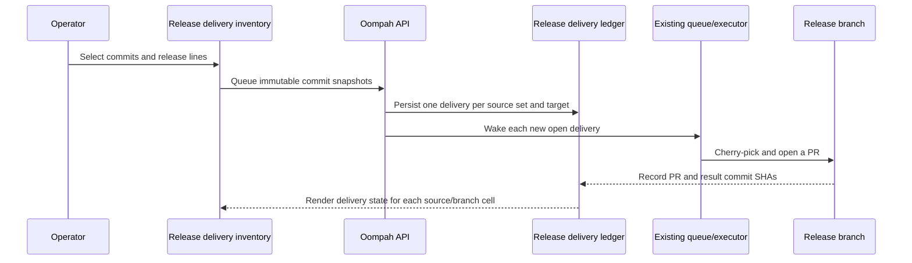

# Commit-Centric Release Delivery Inventory

**Status:** proposed implementation plan

**Supersedes in the UI:** the dashboard **Release branches** inspector. The
existing release-addendum queue, executor, PR lifecycle, and supported-release
line configuration remain the delivery mechanism.

## 1. Decision

Release planning needs a project-wide view of changes that landed on the
default branch, rather than a branch-centric list of addendums that already
exist. Replace the dashboard's **Release branches** button and overlay with
**Release delivery**: a commit inventory for one project and its configured
release lines.

Each inventory row represents an exact, selectable source commit that is
reachable from the project's default branch. Each configured release branch
gets a status cell describing whether that source commit is present there,
queued for delivery, under review, blocked, or has not been selected.

From this screen an operator can select one or more source commits, select one
or more release branches, and queue their delivery immediately. The action
does not create an ordinary task, child task, or GitHub issue.

This extends the existing release-addendum model rather than replacing its
queue semantics. A release delivery is always an immutable source-commit
snapshot applied to exactly one release branch.



## 2. User experience

### 2.1 Entry point and scope

- Rename the dashboard toolbar action from **Release branches** to **Release
  delivery** and replace `openReleaseBranchInspector()` with a new overlay.
- The overlay defaults to the dashboard's current project filter; if no
  project is filtered, require choosing exactly one project before loading
  data. Do not mix commits from multiple repositories in one table.
- Use the project's existing ordered `supported_release_branches` list as the
  only release columns and action targets. A project with no supported release
  lines shows an empty state linking to its project definition.
- The existing task/epic-detail **Add release branches** controls remain.
  They become a convenient filtered way to create the same underlying delivery
  records; they are not removed in this change.

### 2.2 Inventory layout

The overlay contains:

1. A project selector, source-branch label, the source HEAD SHA/refresh time,
   and a **Refresh** control.
2. Filters:
   - `Needs delivery` (default): include rows that have at least one selected
     release line where the commit is not known delivered.
   - `All commits`: include delivered history too.
   - release-line checkboxes used both to limit visible columns and to define
     the default action target set;
   - text search over SHA, subject, author, associated task/epic ID, and PR.
3. A paginated, newest-first table. Fixed columns are selection, short SHA
   (linked to the forge when available), subject, author/date, and source
   association. One column follows for each visible release line.
4. A sticky bulk action bar shown when one or more selectable rows are chosen:
   **Queue selected commits for…** followed by a multi-select of currently
   available supported release lines and a confirm button.
5. A detail drawer on a row showing full SHA, parents, commit body, linked
   task/epic or PR when known, and per-branch evidence (delivery ID, queue
   state, PR URL, result SHA(s), or ancestry evidence).

The table must be keyboard operable. Status cells need text labels and not just
colour: `Not selected`, `Open`, `In progress`, `In review`, `Blocked`,
`Delivered`, `Archived`, and `Unknown`.

### 2.3 Per-release status rules

For a source commit `S` and target branch `R`, calculate a single status with
the following precedence:

| Condition | Cell state | Evidence shown |
|---|---|---|
| A non-archived delivery containing `S` is `open`, `in_progress`, `in_review`, or `blocked` | Corresponding queue state | delivery ID, PR and error when present |
| A merged delivery contains `S` | Delivered | release PR and mapped target/result SHA(s) |
| `S` is reachable from `origin/R` | Delivered | `Present by ancestry` |
| An archived delivery contains `S` | Archived | archived delivery ID |
| None of the above | Not selected | no release evidence |

The first two rules are essential: a cherry-pick creates a different SHA on
`R`, so `git merge-base --is-ancestor S origin/R` alone would incorrectly show
an applied cherry-pick as missing. A merged delivery's immutable
`source_commits` plus `result_commits` mapping is authoritative. Ancestry is a
safe secondary proof for fast-forward, merge, or shared-history delivery.

Do not infer equivalence with patch IDs in v1. It can misidentify a reverted,
modified, or independently authored change. A release-branch direct commit
that cannot be mapped to a tracked delivery is displayed only as a warning in
the branch detail; it must not silently mark a source commit Delivered.

### 2.4 Selecting and queueing changes

- A user may select any non-merge source commit shown in the inventory,
  including a direct-to-main commit that has no task association.
- The action sends the selected full SHAs in table order. The confirmation
  dialog names the commit count, each target branch, and any already-delivered
  or active `(commit, branch)` pairs that will be skipped.
- A merge commit is rendered as an informational grouping/header, not a
  selectable source commit. Its non-merge commits are individually listed.
  This avoids an ambiguous `git cherry-pick -m` mainline choice. A squash merge
  has one parent and is selectable normally.
- Selecting multiple commits creates one ordered delivery bundle per target
  branch. It is an intentionally atomic operator choice: a conflict blocks the
  bundle and retry uses the same ordered snapshot. Selecting one commit creates
  a one-commit bundle.
- The server deduplicates against any active or merged delivery containing the
  same source commit and target branch. It returns a per-pair outcome; it does
  not silently requeue delivered work.
- A user can deliberately queue a follow-up delivery for a commit that was
  previously archived only after selecting it again; archived entries do not
  block a new approval.

## 3. Data model and migration

### 3.1 Project-owned release delivery ledger

The current `oompah.release_addendums` metadata is source-task-owned, so it
cannot represent a direct source commit that has no task. Introduce one
project-owned canonical ledger at:

```text
.oompah/release-deliveries.yml
```

Only the Oompah server may write this file. It is tracked and committed on the
project default branch through the native tracker/git writer, just as task
state is. Add a small ledger store abstraction instead of teaching task YAML
parsing about a non-task file.

Schema version 1:

```yaml
version: 1
deliveries:
  - id: rd_01J...                 # UUID/ULID, immutable
    project_id: proj-123          # defensive ownership check
    source_branch: main
    source_kind: task             # task | epic | commits
    source_identifier: FOO-10     # null for source_kind=commits
    source_commits:               # full ordered SHAs, immutable
      - 3c8c1d5f...
      - a4f0192e...
    target_branch: release/1.1
    status: open                  # existing addendum lifecycle vocabulary
    queued_at: "2026-07-13T12:00:00Z"
    claimed_by: null
    lease_expires_at: null
    started_at: null
    completed_at: null
    work_branch: null
    pr_url: null
    pr_number: null
    result_commits: []            # target SHAs written by the executor
    error: null
    migrated_from: null           # legacy task ID/addendum ID, if applicable
```

`source_commits`, `source_branch`, `target_branch`, `source_kind`, and
`source_identifier` are immutable after creation. The executor may update only
the lifecycle, lease, PR, result-commit, timestamp, and error fields.

Keep `ReleaseAddendum` parsing available during migration, but refactor its
shared lifecycle validation, deterministic work-branch naming, queue item, and
executor evidence-writing code into delivery-neutral helpers. The queue must
consume `delivery_id`, not `(source_identifier, target_branch)`.

### 3.2 Migration and compatibility

1. Add a reader that combines ledger entries with legacy source-owned
   addendums, deduplicating by legacy addendum ID.
2. Write a resumable migration that copies every existing release addendum to
   the ledger with `source_kind` and `source_identifier`, preserving source
   commits, status, PR, result commits, errors, timestamps, and legacy ID.
3. Deploy the dual reader and migration before writing new ledger entries. The
   migration must be idempotent and produce one commit only when it changes the
   ledger.
4. Change task-detail read/write endpoints to use the ledger. Keep their URLs
   and request shapes temporarily, translating task/epic approval into ledger
   deliveries; do not create more task metadata addendums.
5. Once every managed project has been migrated and the compatibility window
   has elapsed, retire writes to `oompah.release_addendums`. Continue reading
   legacy records for one release, then remove their UI rendering and old
   schema code in a separately scheduled cleanup.

Existing task and epic detail views must still show associated deliveries by
querying `source_identifier`; no release history is lost.

## 4. Inventory service and API

### 4.1 Commit inventory service

Add `oompah.release_delivery_inventory.CommitInventoryService`. All Git reads
run in `asyncio.to_thread` from the server route; the service itself is
synchronous and independently testable.

For a project request it must:

1. validate the project, default branch, and selected configured release
   lines;
2. fetch only the source and visible release refs with a bounded timeout;
3. resolve `origin/<default_branch>` and each `origin/<release>` to immutable
   SHA snapshots and return them in the response;
4. enumerate non-merge commits reachable from the source ref in topological,
   newest-first order using `git rev-list --topo-order`; paginate by an opaque
   cursor containing the source HEAD SHA and last returned SHA;
5. reject a stale cursor with `409 source_changed` when the source HEAD has
   changed, so the UI refreshes instead of combining pages from two histories;
6. load ledger deliveries touching the requested commits and target branches;
7. resolve direct ancestry with `git merge-base --is-ancestor` in batched Git
   operations where possible, then apply the status precedence in §2.3;
8. enrich rows with associated task/epic information only when the ledger has
   a `source_identifier`. Do not guess a task from a commit subject in v1.

Use a 60-second per-project/ref-set cache for completed snapshots. Invalidate
it after a default-branch or configured-release-branch push webhook and after
any delivery lifecycle update. A request must say `stale: true` if it falls
back to local tracking refs after a remote fetch failure; never fabricate a
missing branch.

### 4.2 API contracts

```http
GET /api/v1/projects/{project_id}/release-delivery/commits
  ?branches=release/1.1,release/1.0
  &filter=needs_delivery
  &query=FOO-10
  &cursor=<opaque>
  &limit=100
```

Response (abridged):

```json
{
  "project_id": "proj-123",
  "source_branch": "main",
  "source_head": "9d1...",
  "release_branches": [
    {"name": "release/1.1", "head": "4a2...", "available": true}
  ],
  "rows": [{
    "sha": "3c8c...",
    "short_sha": "3c8c1d5",
    "subject": "Add invoice export",
    "author_name": "A. Dev",
    "authored_at": "2026-07-13T12:00:00Z",
    "parents": ["..."],
    "selectable": true,
    "association": {"kind": "task", "identifier": "FOO-10", "title": "..."},
    "release_status": {
      "release/1.1": {"state": "not_selected", "delivery_id": null},
      "release/1.0": {"state": "delivered", "evidence": "delivery", "delivery_id": "rd_...", "pr_url": "...", "result_commits": ["..."]}
    }
  }],
  "next_cursor": "...",
  "stale": false,
  "refreshed_at": "..."
}
```

```http
POST /api/v1/projects/{project_id}/release-delivery/commits
Idempotency-Key: <UUID>

{
  "source_head": "9d1...",
  "commits": ["3c8c...", "a4f0..."],
  "target_branches": ["release/1.1", "release/1.0"]
}
```

The write endpoint must re-resolve the source HEAD and require that every
submitted commit is a non-merge commit reachable from it. If it moved, return
`409 source_changed` with the current HEAD. Validate targets through the
existing release-branch catalog. Under a project-level ledger lock, create one
delivery per target whose selected commits still need delivery, append them
atomically, and wake the existing release queue after persistence.

Return `201` with `created`, `already_active`, `already_delivered`, and
`invalid` arrays keyed by `(commit, target)`. Use the idempotency key to replay
the same response without duplicating records. A mixed selection may succeed
for eligible pairs while reporting skipped pairs; invalid SHAs, unavailable
targets, and source-head mismatch fail the entire request before writing.

Keep and adapt these existing endpoints:

- task/epic approval remains `POST /api/v1/issues/{id}/release-addendums`, but
  it creates ledger deliveries after resolving that item's immutable commit
  snapshot;
- task/epic detail reads its matching ledger deliveries;
- retry/archive APIs operate by ledger `delivery_id` and retain legacy route
  shims during the compatibility window;
- replace `GET /release-branches/{branch}/addendums` with an optional narrow
  `GET /release-delivery/branches/{branch}` drill-down used from status cells.
  The old endpoint returns `410` with the replacement path after one release.

## 5. Executor and reconciliation changes

- Replace queue identity with `delivery_id`; leasing, restart recovery,
  retries, and worktree cleanup use that ID.
- Preserve the exact ordered `source_commits` snapshot in the executor.
  Existing cherry-pick/PR creation remains unchanged apart from ledger reads
  and writes.
- Persist every target SHA produced by the cherry-pick as `result_commits` and
  the PR URL/number before moving the delivery to `in_review`.
- On PR merge, write `merged` and `completed_at`; do not rely only on a task
  status change.
- Reconcile an already-present source commit as `Delivered by ancestry` for
  the inventory without creating a synthetic delivery. Do not mutate the
  ledger merely because Git ancestry proves it is present.
- The existing release queue scan must claim open ledger deliveries on startup
  and after lease expiry. It must never pick a delivery whose target branch is
  no longer configured/available; mark that record `blocked` with a precise
  error instead.

## 6. Dashboard implementation

In `oompah/templates/dashboard.html`:

1. Remove the Release branches overlay, its state/helpers (`_rbi*`), related
   CSS, and its toolbar button.
2. Add the Release delivery overlay with semantic table markup, responsive
   horizontal scrolling for branch columns, accessible filter controls,
   loading/error/empty states, and no inline event-handler construction from
   API strings.
3. Implement a small client state object: project, visible branches, filter,
   query, cursor, source head, selected full SHAs, and request generation.
   Ignore responses from superseded requests.
4. Render status cells from API data. Clicking an active/delivered cell opens
   a delivery detail drawer; clicking a task association opens the existing
   task detail panel.
5. On queue success, clear only successfully-created/previously-delivered
   selections, show the returned outcome summary, invalidate the current
   inventory snapshot, and reload page one.
6. Reuse `esc()` for all API text and build DOM nodes rather than interpolating
   untrusted commit subjects into `onclick` attributes. Preserve keyboard
   Escape, focus trapping, and focus restoration when closing the overlay.
7. Update task and epic detail release rows to read the ledger. Their **Add
   release branches** dialog should show how many source commits will be
   queued and link to Release delivery for the project-wide view.

## 7. Tests and acceptance criteria

### Unit tests

- Ledger parsing/round-tripping, schema-version rejection, immutable-field
  protection, and atomic append/update under a lock.
- Migration of task, epic, merged, blocked, archived, and duplicate legacy
  addendums; rerunning migration makes no further change.
- Commit enumeration: order, pagination, cursor invalidation after source
  head change, merge-commit non-selectability, and squash-commit selection.
- Status precedence: active delivery beats ancestry; merged tracked delivery
  beats ancestry; ancestry-only delivery; archived-only; and no evidence.
- Cherry-pick result-SHA mapping proves delivery even though source SHA is not
  reachable from the release ref.
- Write validation: full SHA, source reachability, non-merge requirement,
  source-head mismatch, unavailable branch, duplicate pairs, idempotency, and
  ordered multi-commit bundles.
- Queue/executor tests updated to use ledger IDs, preserve source order, write
  result SHAs, retry/lease expiry correctly, and never execute an unavailable
  target.

### API tests

- Inventory endpoint response shape, project scoping, branch filtering,
  search, `needs_delivery`, pagination, stale fallback, and Git failure
  responses.
- Commit queue endpoint creates exact per-target snapshots, reports each
  outcome correctly, persists before wake-up, and does not create task files.
- Existing task/epic approval produces ledger entries and task-detail reads
  remain correct after migration.
- Legacy branch-inspection endpoint returns the documented compatibility
  response during the migration window and `410` afterwards.

### Browser/UI tests

- Toolbar opens the replacement overlay and honors the dashboard project
  filter.
- Branch columns, status labels, selection, multi-target confirmation, and
  outcome feedback render safely with special characters in commit subjects.
- Pagination/filter/search work without leaking rows between projects.
- Delivered-by-cherry-pick and delivered-by-ancestry cells explain their
  evidence distinctly.
- Empty/no-configured-branches/error states, keyboard navigation, Escape, and
  focus restoration work.
- Task/epic detail retains its addendum controls and reflects ledger state.

### End-to-end acceptance criteria

1. Given a commit on `main` and two supported release branches, an operator
   sees the commit and `Not selected` in both columns.
2. Selecting that commit and both branches immediately creates two open
   deliveries; one worker may process each independently.
3. After a cherry-pick PR merges into one release branch, that cell reads
   `Delivered` and links its result SHA/PR even though the source SHA is not
   an ancestor of the release branch.
4. A commit delivered by a merge or fast-forward shows `Delivered by ancestry`
   without requiring a synthetic ledger record.
5. Direct commits to `main` can be selected and released without inventing a
   task, while task/epic-associated changes remain visible and linked.
6. A direct, untracked release-branch commit is never claimed as delivery of a
   `main` commit.
7. Existing task/epic release history remains visible after migration and no
   duplicate release PR is created for a source-commit/branch pair.

## 8. Delivery sequence

1. Add ledger schema/store, lifecycle-neutral queue interfaces, and migration
   reader behind a feature flag. No dashboard change yet.
2. Migrate existing addendums and switch executor/reconciler writes to ledger;
   verify all existing PR/retry paths.
3. Add inventory service and read-only API with Git fixtures and performance
   limits.
4. Add commit queue API, idempotency, and executor integration.
5. Ship the Release delivery overlay alongside the legacy inspector for one
   release behind the feature flag; compare counts and delivery states.
6. Make Release delivery the toolbar entry point, remove the old overlay, and
   publish the old endpoint deprecation/`410` response.
7. Update `docs/release-addendums.md`, onboarding, operator runbook, and
   task/epic workflow docs. Rename user-facing wording from "release
   addendum" where it refers to the screen, while retaining it where it names
   the queue record.

## 9. Operational limits and risks

- Large repositories: never load all commit history into the browser. Default
  to 100 rows, cap at 250, paginate, and bound Git subprocess execution.
- Protected release branches: queue work continues to arrive as a PR; this
  feature never pushes source commits directly to a protected branch.
- Force-pushes: source-head cursors prevent mixed-history pages; delivery
  records retain immutable SHAs and become `blocked` with actionable evidence
  if a source object is no longer resolvable.
- Concurrent operators: project-level ledger locking plus idempotency prevent
  duplicate release PRs. The server, not the browser, performs all
  deduplication.
- Token access: the existing Contents, Pull requests, and Webhooks permissions
  remain required for delivery/updates; no new GitHub PAT permission is needed
  solely to read Git history from the local managed checkout.
