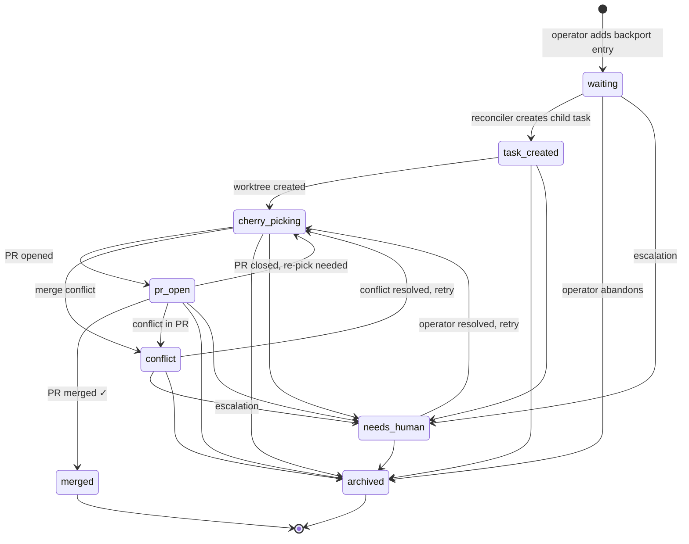

# Release-pick Metadata Schema and Status Lifecycle

**TASK-454.4** — Design record for `oompah.backports` and `oompah.backport_of`
Backlog.md frontmatter fields.

---

## Overview

When a source task (feature, bugfix, etc.) should be cherry-picked to one or
more release branches, an operator or automation adds `oompah.backports`
frontmatter to the source task listing the target branches.  The reconciliation
loop (TASK-455.1) reads this metadata, creates child backport tasks, performs
cherry-picks, opens PRs, and advances the per-branch `status` field as work
progresses.

The child task carries `oompah.backport_of` pointing back to the source task.

Typed Python schema lives in `oompah/release_pick_schema.py`.  Tests are in
`tests/test_release_pick_schema.py`.

---

## Frontmatter Fields

### `oompah.backports` (source task)

Declares which release branches should receive a cherry-pick of the source
task's changes.

**Forms accepted:**

| Form | YAML example | When to use |
|------|-------------|-------------|
| Scalar string | `oompah.backports: "release/1.0"` | Single branch, shorthand |
| List of strings | `oompah.backports: ["release/1.0", "release/2.0"]` | Multiple branches, all initially `waiting` |
| List of objects | see below | Full tracking with status, task_id, pr_url |

Full object form:

```yaml
oompah:
  backports:
    - branch: release/1.0
      status: pr_open
      task_id: TASK-100.1
      pr_url: https://github.com/org/repo/pull/42
    - branch: release/2.0
      status: waiting
```

Object fields:

| Field | Type | Required | Description |
|-------|------|----------|-------------|
| `branch` | string | **yes** | Target branch name (e.g. `release/1.0`) |
| `status` | string | no | Lifecycle status (default: `waiting`) |
| `task_id` | string | no | Identifier of the child backport task |
| `pr_url` | string | no | URL of the cherry-pick PR |

Scalar and list-of-strings forms are equivalent to list-of-objects with
`status: waiting` and no `task_id` / `pr_url`.  All three forms are
normalised by `parse_backports()` and can round-trip through
`backports_to_raw()`.

---

### `oompah.backport_of` (child backport task)

Set on the child task created by the reconciliation loop (TASK-455.3).
Links back to the source task and mirrors the per-branch status.

**Forms accepted:**

| Form | YAML example | When to use |
|------|-------------|-------------|
| Plain string | `oompah.backport_of: TASK-100` | Source ID only, status implied from child task state |
| Mapping | `oompah.backport_of: {source: TASK-100, status: pr_open}` | Explicit status mirroring |

---

## Status Lifecycle

Each `branch` entry in `oompah.backports` (and its mirror in
`oompah.backport_of`) moves through the following states.

### States

| Status | Description |
|--------|-------------|
| `waiting` | Pick requested; no child task exists yet |
| `task_created` | Child backport task created in the tracker |
| `cherry_picking` | Cherry-pick commit being authored in a worktree |
| `pr_open` | PR opened against the target branch; awaiting review/CI |
| `conflict` | Cherry-pick produced merge conflicts; blocked |
| `merged` | PR successfully merged into the target branch |
| `archived` | Pick abandoned (branch retired, duplicate, etc.) |
| `needs_human` | Stuck; manual intervention required |

### State machine



### Terminal states

`merged` and `archived` are terminal — no automation advances a pick beyond
them.  Operator action is required to re-open a merged or archived pick (e.g.
by adding a new `oompah.backports` entry).

### Blocked states

`conflict` and `needs_human` are *blocked* states.  The reconciliation loop
will not automatically advance a pick in a blocked state; it logs a warning and
waits for manual resolution.

### Operator overrides

Any non-terminal state may be force-transitioned to `archived` or
`needs_human` by editing the frontmatter directly.  The `VALID_TRANSITIONS`
map in `release_pick_schema.py` is the machine-readable authority on which
transitions automation may make; manual edits bypass this check.

---

## Python API

Module: `oompah.release_pick_schema`

### Types

```python
class ReleasePick(str, Enum):
    WAITING        = "waiting"
    TASK_CREATED   = "task_created"
    CHERRY_PICKING = "cherry_picking"
    PR_OPEN        = "pr_open"
    CONFLICT       = "conflict"
    MERGED         = "merged"
    ARCHIVED       = "archived"
    NEEDS_HUMAN    = "needs_human"

@dataclass
class BackportEntry:
    branch:   str
    status:   ReleasePick = ReleasePick.WAITING
    task_id:  str | None = None
    pr_url:   str | None = None

@dataclass
class BackportOf:
    source: str
    status: ReleasePick = ReleasePick.WAITING
```

### Parsing

```python
from oompah.release_pick_schema import parse_backports, parse_backport_of

# Read raw metadata from tracker
meta = tracker.get_metadata("TASK-100")

entries = parse_backports(meta.get("oompah.backports"))  # list[BackportEntry]
bof     = parse_backport_of(meta.get("oompah.backport_of"))  # BackportOf | None
```

### Updating and persisting

```python
from oompah.release_pick_schema import backports_to_raw

# Advance one branch to pr_open
for entry in entries:
    if entry.branch == "release/1.0":
        entry.status = ReleasePick.PR_OPEN
        entry.pr_url = "https://github.com/org/repo/pull/42"

tracker.set_metadata_field("TASK-100", "oompah.backports", backports_to_raw(entries))
```

### Validating transitions

```python
from oompah.release_pick_schema import is_valid_transition, VALID_TRANSITIONS

# Check before advancing
if is_valid_transition(entry.status, ReleasePick.PR_OPEN):
    entry.status = ReleasePick.PR_OPEN
```

---

## Relationship to other modules

| Module | Relationship |
|--------|-------------|
| `oompah/tracker.py` | Reads/writes raw frontmatter; `parse_backports` / `backports_to_raw` adapt the raw values |
| `oompah/release_pick_validation.py` (TASK-454.3) | Validates `target_branch` against project patterns; uses `oompah.backport_of` to detect backport issues |
| TASK-455.1 reconciliation loop | Advances statuses by calling `is_valid_transition` and persisting via `tracker.set_metadata_field` |
| TASK-455.3 child task creation | Creates child task, writes `oompah.backport_of` and `oompah.target_branch` |
| TASK-455.6 PR reconciliation | Advances to `merged` / re-opens on PR close |
