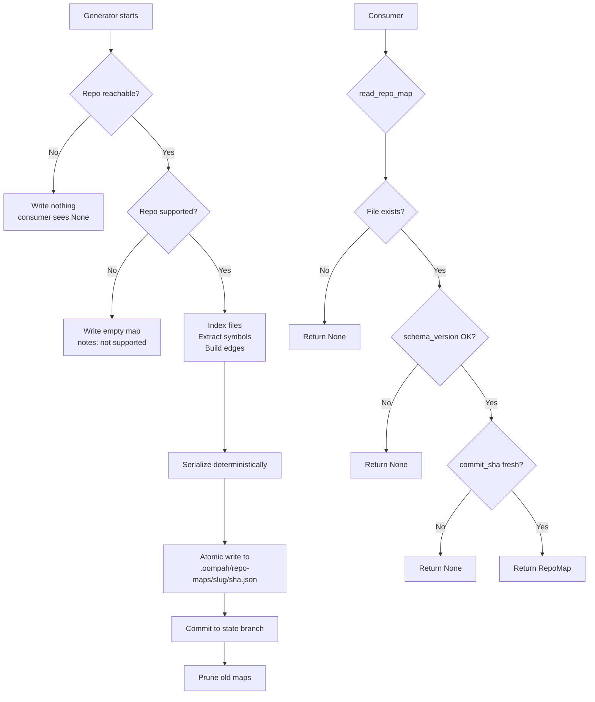

# Repository-Map Artifact: Schema and State-Branch Lifecycle

**Status:** implemented (OOMPAH-294)
**Epic:** OOMPAH-293 (code-analysis pipeline)
**Owner:** Platform

## 1. Purpose and scope

A **repository map** is a versioned, deterministic JSON snapshot of a
repository's code structure at a specific commit.  It captures indexed files,
symbol declarations, and dependency edges so that later tasks can inject
relevant context into agent prompts without re-parsing the repository from
scratch.

**Important safety constraint:** The artifact is **data only**.  It must
never be executed, evaluated, or interpreted as instructions.  Any consumer
that reads the artifact must treat every field as untrusted string data.

This document covers:
- The JSON schema and its versioning policy.
- The state-branch path and namespace.
- The atomic-write procedure.
- The freshness rule and invalidation trigger.
- Retention and pruning policy.
- Behavior when a repository is unavailable or unsupported.

It does NOT cover prompt injection, parsing heuristics, or how the map is
generated — those are specified in later tasks.

---

## 2. JSON schema

### 2.1 Current schema version

```
CURRENT_SCHEMA_VERSION = 1
```

The schema version is an integer stored in every artifact.  Readers must
reject artifacts whose `schema_version` does not equal `CURRENT_SCHEMA_VERSION`
and treat them as unavailable (triggering regeneration).  Version mismatches
are expected after generator upgrades and are not errors.

### 2.2 Top-level object

| Field | Type | Description |
|---|---|---|
| `schema_version` | `int` | Must equal `CURRENT_SCHEMA_VERSION` (currently `1`). |
| `repo_identity` | `str` | Canonical URL or unique opaque identifier for the repository (e.g. `"https://github.com/org/repo"`). Must be non-empty. |
| `commit_sha` | `str` | 40-character lowercase hexadecimal SHA of the analyzed commit. |
| `generator_version` | `str` | Semantic version string of the generator that produced this map (e.g. `"1.0.0"`). |
| `indexed_files` | `list[IndexedFile]` | All files included in the analysis, in deterministic sort order (lexicographic by `path`). |
| `symbol_tags` | `list[SymbolTag]` | Symbol declarations found across the indexed files, in deterministic sort order. |
| `relationship_edges` | `list[RelationshipEdge]` | Directed dependency edges between symbols or files, in deterministic sort order. |
| `generated_at` | `str` | ISO 8601 UTC timestamp of map generation (e.g. `"2026-07-21T15:00:00Z"`). |
| `rendering_metadata` | `RenderingMetadata` | Summary counts and notes about the analysis run. |

### 2.3 `IndexedFile`

Each entry in `indexed_files` describes one file that was included in the
analysis.

| Field | Type | Description |
|---|---|---|
| `path` | `str` | Repository-relative path using forward slashes (e.g. `"oompah/models.py"`). |
| `size_bytes` | `int \| null` | File size in bytes at indexing time.  `null` if unavailable. |
| `content_hash` | `str \| null` | Lowercase hex SHA-256 of the file content.  `null` if not computed. |
| `language` | `str \| null` | Detected language (e.g. `"python"`, `"typescript"`, `"markdown"`).  `null` if undetected. |

### 2.4 `SymbolTag`

Each entry in `symbol_tags` describes a named symbol declaration.

| Field | Type | Description |
|---|---|---|
| `kind` | `str` | Symbol kind — one of `"class"`, `"function"`, `"method"`, `"variable"`, `"module"`, `"constant"`, `"type"`. |
| `name` | `str` | Unqualified symbol name. |
| `file_path` | `str` | Repository-relative path of the file containing this symbol. |
| `line` | `int \| null` | 1-based line number of the declaration.  `null` if unavailable. |
| `namespace` | `str \| null` | Containing namespace, class, or module (e.g. `"MyClass"`).  `null` for module-level symbols. |

### 2.5 `RelationshipEdge`

Each entry in `relationship_edges` describes a directed dependency between
two entities.

| Field | Type | Description |
|---|---|---|
| `kind` | `str` | Edge kind — one of `"imports"`, `"inherits"`, `"calls"`, `"defines"`, `"references"`. |
| `source` | `str` | Fully-qualified name or repo-relative file path of the source entity. |
| `target` | `str` | Fully-qualified name or repo-relative file path of the target entity. |

### 2.6 `RenderingMetadata`

Summary statistics about the analysis run.  These fields are informational
and must not be used as the sole source of truth (consumers should count
the actual list lengths).

| Field | Type | Description |
|---|---|---|
| `total_files` | `int` | Number of entries in `indexed_files`. |
| `total_symbols` | `int` | Number of entries in `symbol_tags`. |
| `total_edges` | `int` | Number of entries in `relationship_edges`. |
| `truncated` | `bool` | `true` if the map was truncated because it exceeded a size limit. |
| `notes` | `list[str]` | Human-readable notes about the analysis run (e.g. `"12 binary files skipped"`). |

---

## 3. State-branch path and namespace

Repository-map artifacts live on the **oompah state branch**
(`oompah/state/<project-id>`, defined in `plans/state-branch-design.md`)
under the `.oompah/` namespace.

### 3.1 Directory structure

```
.oompah/
  repo-maps/
    <repo-slug>/
      <commit-sha>.json
```

Where:
- `<repo-slug>` is a filesystem-safe slug derived from `repo_identity` by
  URL-decoding, lower-casing, replacing non-alphanumeric characters with
  hyphens, and collapsing repeated hyphens.
  Example: `"https://github.com/lesserevil/oompah"` → `"github-com-lesserevil-oompah"`.
- `<commit-sha>` is the 40-character lowercase hexadecimal commit SHA.

**All paths must begin with `.oompah/`.** The `is_within_namespace()` helper
enforces this invariant.

### 3.2 Namespace constraint

No artifact path may escape the `.oompah/repo-maps/` subtree.  The `write_repo_map()`
function raises `ValueError` if the computed canonical path is outside
`.oompah/`.

---

## 4. Atomic-write procedure

Writing a repository map must be atomic from the perspective of any concurrent
reader.  The procedure:

1. Serialize the `RepoMap` to a JSON string (deterministic: keys sorted,
   lists already sorted by the caller, no trailing whitespace).
2. Write the JSON to a temporary file in the same directory as the target
   (same filesystem, same device).
3. `os.replace()` (rename) the temporary file to the canonical path.
   On POSIX systems this is atomic at the filesystem level.
4. Return the canonical path.

The caller is responsible for committing the file to the state branch after
the write.  The atomic write guarantees that any reader that opens the
canonical path sees a complete JSON document.

---

## 5. Freshness rule

A repository map is **fresh** if and only if:

```
repo_map.commit_sha == current_checkout_sha
```

Where `current_checkout_sha` is the HEAD SHA of the managed repository
checkout at the time of the read.

A map with a mismatching SHA is **stale** and must not be returned to callers.
`is_fresh(repo_map, current_sha)` encodes this rule.

`read_repo_map()` enforces the freshness rule by default: it returns `None`
for stale maps.  Callers can opt out by passing `require_fresh=False` to
read the raw artifact regardless of SHA.

---

## 6. Retention and pruning policy

At most `REPO_MAP_MAX_RETAINED = 5` maps are kept per repository slug.

`prune_repo_maps(base_dir, repo_identity, max_retained)`:
1. List all `*.json` files in `.oompah/repo-maps/<repo-slug>/`.
2. Sort by last-modified time, newest first.
3. Remove all files beyond position `max_retained`.
4. Return the list of removed paths.

Pruning is called by the writer after a successful state-branch commit.

---

## 7. Unavailable and unsupported repositories

| Condition | Behavior |
|---|---|
| Map file does not exist | `read_repo_map()` returns `None`. |
| Map file has wrong `schema_version` | `read_repo_map()` returns `None` (treat as unavailable; regenerate). |
| Map file has mismatching `commit_sha` | `read_repo_map()` returns `None` when `require_fresh=True` (default). |
| Repository is explicitly unsupported | Generator writes a map with `indexed_files=[]`, `symbol_tags=[]`, `relationship_edges=[]`, and a `rendering_metadata.notes` entry of `"repository not supported"`. |
| Repository is unreachable/clone fails | Generator does not write a map; consumers see `None` from `read_repo_map()`. |

The distinction between "unavailable" and "unsupported" is surfaced through
`rendering_metadata.notes`.  Consumers must not attempt to infer repository
status from the absence of a map.

---

## 8. Security invariants

- The artifact is parsed as JSON and stored in typed Python dataclasses.
  No field is ever passed to `eval()`, `exec()`, `subprocess`, or any
  template engine.
- `repo_identity`, `commit_sha`, `generator_version`, and all string fields
  in nested objects are treated as untrusted string data.
- The `repo_map_slug()` function sanitizes `repo_identity` before using it
  as a filesystem path component.  It rejects empty strings and strings that
  produce an empty slug.
- `is_within_namespace()` enforces that all read and write paths stay inside
  `.oompah/`.

---

## 9. Implementation files

| File | Role |
|---|---|
| `oompah/repo_map.py` | Typed artifact contract, schema, read/write/prune helpers. |
| `tests/test_repo_map.py` | Unit tests for all schema and lifecycle behavior. |
| `plans/repo-map-artifact.md` | This document. |

---

## 10. Lifecycle diagram


