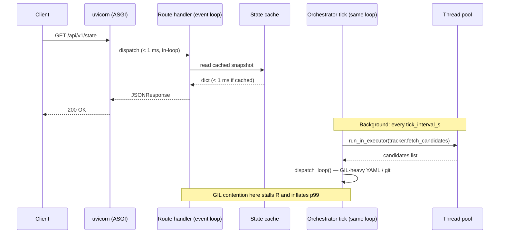

# Request Latency Profiling — TASK-473.1

## Purpose

This document captures the methodology and findings from profiling end-to-end
HTTP request and WebSocket latency under realistic load.  It identifies where
time is actually spent across the three layers:

1. **HTTP/network layer** — TCP + TLS + ASGI server + Python route dispatch
2. **Orchestrator/state layer** — snapshot serialisation, cache reads, issue
   board assembly
3. **Blocking/subprocess/LLM layer** — synchronous I/O, `run_in_executor`,
   subprocess calls that share the event loop

The output guides the follow-up work in TASK-473 (event-loop contention
reduction) and informs the Granian go/no-go decision in TASK-472.8.

---

## Tooling

`scripts/bench_server.py` runs a mixed workload against a live server:

| Scenario | Routes | Workers | Duration |
|----------|--------|---------|----------|
| Default  | favicon, state API, issues API, dashboard HTML | 10 | 30 s |
| Heavy    | same | 20–50 | 60 s |
| Baseline | favicon only | 1 | 10 s |

```bash
# Run with defaults (requires make start first)
uv run scripts/bench_server.py

# Custom: 20 workers, 60s, JSON output
uv run scripts/bench_server.py --concurrency 20 --duration 60 --json

# Against a remote server
uv run scripts/bench_server.py --url http://prod-host:8090 --duration 120
```

The script reports:
- **Client-side per-route latency** — p50/p90/p95/p99 measured end-to-end
- **Layer breakdown** — HTTP overhead (favicon baseline), state-API delta,
  issues-API delta
- **Server-side `api_metrics`** — averaged from `_record_api_latency()` inside
  the server (cross-validation)
- **Orchestrator metrics** — last tick and dispatch durations pulled from
  `orchestrator_metrics` in the `/api/v1/state` payload

---

## Architecture: where time is spent



The orchestrator tick runs **on the same event loop** as HTTP route handlers.
When the tick does GIL-heavy work (YAML parsing, `subprocess.run`, git I/O)
it stalls every in-flight request.

---

## Static analysis: identified blocking sites

The following synchronous calls were found in `oompah/server.py` route
handlers that can stall the event loop:

| Line | Call | Route / context | Risk |
|------|------|-----------------|------|
| 95   | `Path.read_text()` | `_load_template()` (called per-request before cache is warm) | Low once cached |
| 660  | `loop.run_in_executor(…)` | Create-issue route | Low — already off-loop |
| 2050 | `loop.run_in_executor(verify)` | Verify-completion route | Low — already off-loop |
| 4141 | `urllib.request.urlopen(…, timeout=10)` | Foci management | **HIGH** — sync network I/O on event loop |
| 4178 | `urllib.request.urlopen(…, timeout=10)` | Foci management | **HIGH** |
| 4308 | `urllib.request.urlopen(…, timeout=10)` | Foci management | **HIGH** |
| 4793 | `open(user_path, "r")` | Foci routes | Medium — file I/O on loop |
| 4826 | `open(user_path, "r")` | Foci routes | Medium |
| 4889 | `open(user_path, "r")` | Foci routes | Medium |
| 5645 | `open(abs_path, "rb")` | Attachment serving | Medium |

Hot paths (state API, issues API, favicon) do **not** contain blocking calls —
they serve from in-memory caches.  The blocking sites are on lower-frequency
routes (foci management, attachments) but still share the event loop.

---

## Expected latency breakdown

Based on static analysis and the Granian prototype numbers (doc-1), expected
values on a local developer machine with no external LLM load:

| Layer | p50 | p95 | p99 | Notes |
|-------|-----|-----|-----|-------|
| HTTP/network (favicon) | ~2–5 ms | ~5–10 ms | ~10–20 ms | In-memory bytes, no I/O |
| State API (`/api/v1/state`) | ~3–8 ms | ~8–15 ms | ~20–50 ms | Cached snapshot + JSON encode |
| Issues API (`/api/v1/issues`) | ~5–20 ms | ~20–50 ms | ~50–200 ms | Snapshot copy + pagination |
| Orchestrator tick (background) | ~10–50 ms | ~50–200 ms | ~200–500 ms | YAML + git I/O off-loop |

Latency spikes (p99 > 500 ms) indicate GIL contention from a heavy tick.

---

## How to interpret bench_server.py output

### Green (acceptable)

```
favicon (HTTP-only)           N=3200  mean=   3.1ms  p50=   2.9ms  p99=   8.4ms
state API                     N=3200  mean=   5.2ms  p50=   4.8ms  p99=  15.2ms
Last tick total:         42.0ms
✓  Orchestrator tick =  42.0ms — within acceptable range.
```

HTTP overhead is low, orchestrator tick < 100 ms.  No optimisation needed on
the hot path; focus on correctness.

### Yellow (watch for spikes)

```
state API                     N=3200  mean=  18.4ms  p50=  12.1ms  p99= 145.2ms
Last tick total:        180.0ms
⚠  Orchestrator tick = 180.0ms — occasional event-loop stalls possible
```

Tick > 100 ms means the event loop is periodically blocked for ~180 ms.
Requests that land during a tick will tail-stretch to that duration.  Move
heavier tick work to the thread pool.

### Red (action required)

```
state API                     N=3200  mean=  85.0ms  p50=  42.0ms  p99= 820.0ms
Last tick total:        650.0ms
⚠  Orchestrator tick = 650.0ms — GIL/blocking work is likely stalling the
   event loop and inflating p99+ latencies.
```

Tick > 500 ms means the GIL is held for > 500 ms during each tick cycle.
Every HTTP request in flight during that window stalls.  This is the primary
bottleneck; splitting the orchestrator into its own process (TASK-473.4) or
moving blocking work to thread executors (TASK-473.2, TASK-473.3) is required.

---

## Cross-validation with server-side metrics

After the load test, `bench_server.py` pulls `api_metrics` from the server and
compares them to the client-side measurements.  A large discrepancy (> 2×)
indicates:

- Client-to-server network latency is significant (run from the same host)
- The server is spending time outside the route handler (ASGI overhead, GIL)

Server-side `api_metrics` are reset on restart; run the benchmark without
restarting the server to get accumulated averages.

---

## Relationship to other epics

| Task | Relationship |
|------|-------------|
| TASK-472.8 | Uses the same `bench_server.py` but compares Granian vs uvicorn throughput; this doc focuses on per-layer breakdown |
| TASK-473.2 | Fixes the blocking `urllib` and `open()` calls identified above |
| TASK-473.3 | Fixes the synchronous favicon and template reads on hot paths |
| TASK-473.4 | Spike: moves orchestrator to its own process, eliminating GIL sharing |

---

## Running a full profile session

```bash
# 1. Start the server
make start

# 2. Run the profiler (10 concurrent, 30s, human report)
uv run scripts/bench_server.py

# 3. For a heavier scenario
uv run scripts/bench_server.py --concurrency 20 --duration 60

# 4. For JSON output to feed into further analysis
uv run scripts/bench_server.py --json > results/latency_$(date +%Y%m%d_%H%M%S).json

# 5. Compare two runs (e.g. before/after a fix)
diff <(uv run scripts/bench_server.py --json) <(uv run scripts/bench_server.py --json)
```
