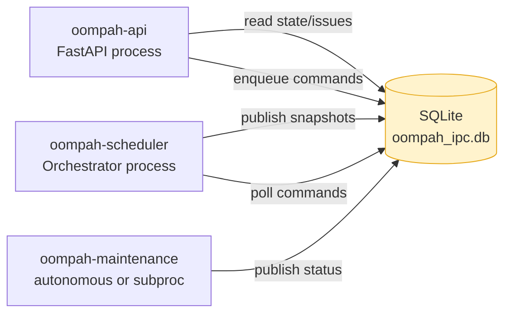
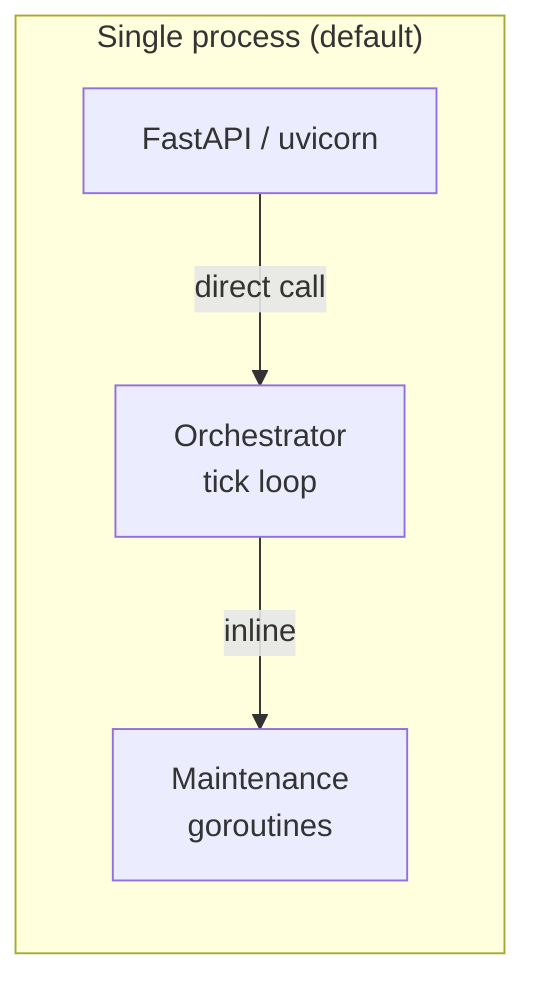
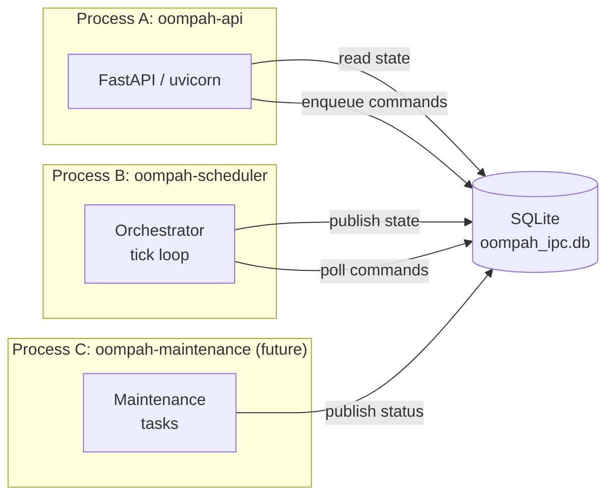

# oompah Service Split: API / Scheduler / Maintenance

**Status:** Implemented (TASK-469.5.1)
**Epic:** TASK-469 — Reduce Oompah service hanginess under load
**Parent:** TASK-469.5 — Split API responsiveness from scheduler and maintenance work

## 1. Problem

After TASK-469.5 delivered the in-process responsiveness isolation (dedicated API
thread pool, issues snapshot cache, tick-pool for YAML-heavy operations), the
underlying Python GIL contention between the API and scheduler threads in the
**same process** remained.

`tracker.py` uses `yaml.safe_load()` to parse YAML front matter in every Backlog
task file. On large projects this is the dominant per-tick cost, and because
`yaml.safe_load` holds the GIL for the duration of each parse:

- All API thread-pool threads stall while the scheduler's tick thread parses YAML.
- The `_api_thread_pool` (max_workers=4) and `_tick_pool` (max_workers=8) share
  the same GIL even though they are separate `ThreadPoolExecutor` instances.

Adding more threads cannot solve GIL contention — the fix is to physically
separate the scheduler and API code into separate OS processes.

### Metrics that indicate this coupling

The `orchestrator_metrics` section of `/api/v1/state` exposes:

| Metric | Meaning |
|--------|---------|
| `orchestrator_metrics.last_tick.total_ms` | Full tick wall time |
| `orchestrator_metrics.tracker_reads.<proj>.duration_ms` | Per-project YAML parse time |
| `api_metrics./api/v1/state.max_ms` | API read P-max latency |
| `api_metrics./api/v1/state.slow_count` | Calls slower than 1 s |

When `tracker_reads.duration_ms` is large AND `api_metrics.slow_count` increases
during the same interval, the API stalls are caused by GIL contention in the
scheduler.

## 2. Solution: SQLite-backed IPC layer

`oompah/ipc.py` implements a durable local coordination layer that decouples
the three logical services without requiring Redis or any external dependency.



### 2.1 Database schema

```sql
-- WAL mode: readers (API) and the writer (scheduler) never block each other.
PRAGMA journal_mode = WAL;

-- Named snapshot slots
CREATE TABLE kv (
    key        TEXT PRIMARY KEY,
    value      TEXT NOT NULL,      -- JSON
    updated_at REAL NOT NULL       -- time.monotonic()
);

-- API → scheduler command FIFO
CREATE TABLE commands (
    id           INTEGER PRIMARY KEY AUTOINCREMENT,
    command      TEXT    NOT NULL,
    payload      TEXT    NOT NULL DEFAULT '{}',
    status       TEXT    NOT NULL DEFAULT 'pending',  -- pending | processing | processed | failed
    created_at   REAL    NOT NULL,
    processed_at REAL
);
CREATE INDEX commands_status_created ON commands (status, created_at);
```

### 2.2 KV keys

| Key | Writer | Reader |
|-----|--------|--------|
| `"state"` | oompah-scheduler (after every `_notify_observers()`) | oompah-api (`/api/v1/state`) |
| `"issues"` | oompah-scheduler (after issues board build) | oompah-api (`/api/v1/issues`) |
| `"maintenance"` | oompah-maintenance | oompah-api (surfaced in state snapshot) |

### 2.3 Commands

| Command | Payload | Handler |
|---------|---------|---------|
| `"pause"` | `{}` | `Orchestrator.pause()` |
| `"unpause"` | `{}` | `Orchestrator.unpause()` |
| `"request_refresh"` | `{}` | `Orchestrator.request_refresh()` |
| `"dispatch_issue"` | `{"identifier": "TASK-NNN"}` | dispatches the named issue |
| `"cleanup_commands"` | `{}` | prunes old processed rows |

New command types are registered in `Orchestrator._IPC_COMMAND_HANDLERS` and
handled by `_ipc_cmd_<type>` methods.

## 3. Configuration

Set `OOMPAH_IPC_DB_PATH` in `.env` (or as an environment variable) to a shared
path accessible by all processes.

```bash
OOMPAH_IPC_DB_PATH=/var/run/oompah/ipc.db
```

When the env var is **unset** (default), oompah runs in single-process combined
mode — fully backward-compatible, no SQLite writes.

## 4. Process topology

### 4.1 Combined mode (default, backward-compatible)

All three services run in a single process.  The IPC layer is inactive (no
SQLite writes).



### 4.2 Coupled mode (OOMPAH_IPC_DB_PATH set, single process)

A single process with IPC active.  The scheduler publishes snapshots after
every tick.  The API reads from SQLite instead of calling
`orchestrator.get_snapshot()` directly.  This is useful for performance
profiling — you can measure how much SQLite reads improve API latency without
the complexity of separate processes.

### 4.3 Split mode (separate processes)



## 5. Staleness and freshness

- The scheduler publishes the state snapshot after **every** `_notify_observers()`
  call — this happens after every tick and after every agent state change.
- The API reads the snapshot on every request; the read is a single-row SQL
  `SELECT` from a WAL-mode database and completes in < 1 ms.
- The `updated_at` monotonic timestamp is included in diagnostics so operators
  can see how stale the snapshot is.

If the scheduler is lagging (stuck in a long tick), the API serves the last
published snapshot.  A 503 is returned only if no snapshot has ever been
published (cold start before the first tick completes).

## 6. Implementation details

| File | Change |
|------|--------|
| `oompah/ipc.py` | New module — `OrchestratorIPC` class, process singleton helpers |
| `oompah/orchestrator.py` | `__init__` accepts optional `ipc`; `_notify_observers` publishes to IPC; `_tick` calls `_process_ipc_commands`; `get_snapshot` includes `ipc` diagnostics |
| `oompah/server.py` | `_ipc` module-level singleton; `api_state` reads from IPC in API-only mode; `api_orchestrator_pause/resume/dispatch` enqueue IPC commands |
| `oompah/config.py` | `ServiceConfig.ipc_db_path` field; loaded from `OOMPAH_IPC_DB_PATH` |
| `tests/test_ipc.py` | 40 unit + integration tests for the IPC layer |

## 7. Roadmap

The IPC layer is the foundation for a full three-process split.  Future work:

1. **`oompah --api-only` mode** — start FastAPI without the orchestrator; read
   all board data from SQLite.
2. **`oompah --scheduler-only` mode** — start orchestrator without FastAPI;
   publish snapshots to SQLite, consume commands.
3. **oompah-maintenance as a subprocess** — move `_auto_archive`, `_cleanup_terminal_worktrees`,
   and `_maybe_heal_repos` to a subprocess launched by the scheduler.
4. **Issues snapshot publishing** — extend the scheduler to call
   `ipc.publish_issues()` after the issues board is rebuilt.
5. **Webhook broadcasting via SQLite** — forward WebSocket events through
   `kv["ws_events"]` so the API process can re-broadcast without a direct
   call to the scheduler.

## 8. References

- `oompah/ipc.py` — implementation
- `tests/test_ipc.py` — test coverage
- `TASK-469.5` — parent: in-process isolation (dedicated pools, issues snapshot)
- `TASK-469.1` — service latency observability (tick phase timings, api_metrics)
- `plans/polling-mechanisms.md` — dispatch loop design
