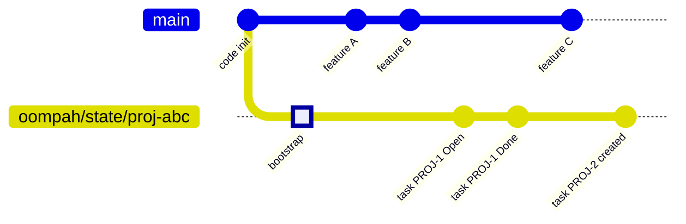

# State-Branch Design: Git-Backed Per-Project Oompah State

**Status:** proposed design — not yet implemented
**Epic:** OOMPAH-253 (Git-backed Oompah state branches)
**Owner:** Platform

## 1. Problem and motivation

The native oompah Markdown tracker (`tracker_kind=oompah_md`) stores canonical
task state under `.oompah/tasks/` on the project's **default branch** (`main`
in most projects). Every task mutation — create, status change, comment,
metadata update, label add — produces a git commit directly on the default
branch and pushes it to `origin`.

This has three compounding costs:

1. **Merge-queue contamination.** Each service-metadata commit on `main` lands
   between the CI-validated SHAs of code commits. GitHub Merge Queue CI runs
   against `gh-readonly-queue/main/pr-N-…` branches that include these
   interleaved oompah commits, raising the probability that an agent's PR CI
   ran against a SHA that is no longer the real landing point.

2. **Write serialization.** `_prepare_default_branch_for_write()` enforces that
   the managed checkout is on the default branch, fetches from origin, and
   fast-forwards before every write. When multiple projects use the same managed
   checkout, or when oompah writes high-frequency updates (telemetry, retry
   counters, timestamps), every write pays an `O(N)` round-trip to the remote
   before the actual payload goes out.

3. **Code review noise.** The PR diff for a code change includes
   `.oompah/tasks/` file changes interleaved with source file changes when
   agent branches diverge from main between task commits. Reviewers must filter
   those out manually.

A **state branch** (`oompah/state/<project-id>`) isolates task-state commits
from code commits entirely. Code `main` stays clean; state changes accumulate
on a branch that is never merged into code branches.

---

## 2. State branch contract

### 2.1 Naming

The canonical state branch name is:

```
oompah/state/<project-id>
```

Examples:

| Project ID | State branch |
|---|---|
| `proj-14849f1b` | `oompah/state/proj-14849f1b` |
| `proj-abc` | `oompah/state/proj-abc` |

The `oompah/` prefix namespaces all service-controlled refs, preventing
collision with user-created branches. The `state/` sub-namespace distinguishes
this family from future `oompah/release/*` service refs.

The branch name is derived deterministically from `Project.id`. It is not
configurable per-project (configuration controls _whether_ a project uses a
state branch, not what that branch is named).

### 2.2 Directory layout

The state branch carries only oompah-managed directories and files. It must not
carry any project source code:

```
.oompah/
  tasks/
    config.yml        # Optional; task_prefix setting
    proposed/
    backlog/
    open/
    in-progress/
    needs-human/
    needs-ci-fix/
    needs-rebase/
    in-review/
    decomposed/
    duplicate-candidate/
    done/
    merged/
    archived/
    external-imports.yml   # GitHub Issue intake index
  release-deliveries.yml   # Release addendum ledger
  providers.json           # (copied from main; not mutated here)
  agent_profiles.json      # (copied from main; not mutated here)
```

**What the state branch must NOT contain:** source code, `WORKFLOW.md`,
`Makefile`, `pyproject.toml`, or any other file whose authoritative home is
the code `main` branch. If a project accidentally commits those on the state
branch, the write guard (§ 2.3) will prevent further contamination; remediation
is a `git checkout oompah/state/<id> -- .oompah/` surgery described in
`docs/state-branch-migration.md`.

### 2.3 Initial commit / bootstrap behavior

When `OompahMarkdownTracker` is instantiated for a project that has
`state_branch_enabled=True` and the branch `oompah/state/<project-id>` does
not yet exist locally or remotely, bootstrap proceeds as follows:

1. **Resolve seed content.** Look for `.oompah/tasks/` under the project's
   default branch checkout. If it exists (existing project), use it as the
   initial tree. If it does not exist (new project), seed from an empty
   `.oompah/tasks/` structure (create the status subdirectories).

2. **Create the orphan branch.** From the managed checkout:
   ```bash
   git checkout --orphan oompah/state/<project-id>
   git reset --hard     # unstage everything (orphan starts clean)
   ```
   An orphan branch has no parent commit, so it shares no history with `main`.
   This is intentional: state commits must never be fast-forwardable into code
   history.

3. **Populate and commit.**
   ```bash
   git add .oompah/
   git commit -m "Bootstrap oompah state branch for <project-id>"
   ```

4. **Push to origin.**
   ```bash
   git push origin oompah/state/<project-id>
   ```

5. **Return to default branch.**
   ```bash
   git checkout <default-branch>
   ```

Bootstrap is idempotent: if the branch exists locally or remotely, steps 2-4
are skipped and the branch is fetched and checked out in place.

### 2.4 Remote tracking

The state branch is tracked at `origin/oompah/state/<project-id>`. All writes
push to this ref. The tracker performs a fetch-and-ff-only sync before every
write (same pattern as the current `_sync_from_remote` logic).

Because the state branch is an orphan, `git pull` with a code branch active
cannot accidentally pull state commits into code history (they have different
root commits and git refuses a merge without `--allow-unrelated-histories`).

### 2.5 Branch protection assumptions

The state branch is **not** a code branch and must not be subject to PR-based
protection rules that would block direct pushes by the service account:

- No `Require a pull request before merging` rule on `oompah/state/*`.
- No `Require status checks to pass` rule on `oompah/state/*`.
- Direct push by the service account's GitHub token is required.

GitHub branch protection patterns match on exact names or glob patterns with
`*` (single-level) or `**` (any depth). The recommended protection setup is:

```
# In GitHub branch protection settings:
# Pattern: oompah/state/*
# Protection: Restrict who can push (allow the oompah bot account only)
# No required CI, no required reviews
```

If a project's branch protection rules are configured with `**/main` or
similarly broad patterns that would match `oompah/state/*`, exclude the
`oompah/state/` prefix explicitly. The operator migration guide
(`docs/state-branch-migration.md`) covers validation steps for this.

### 2.6 Relationship to code main and release branches

The state branch is **orthogonal** to all code branches:

- It has a different root commit (orphan), so git will never auto-merge it.
- It is never included in CI.
- It is never included in a PR.
- It is never included in a release tag.
- Release addendum ledger entries (`release-deliveries.yml`) _reference_ code
  commits by SHA but live on the state branch; the code never contains those
  references.
- `.oompah/tasks/` files that describe release addendums for
  `release/1.0` live on the state branch, not on `release/1.0`. The release
  branch contains only code.



---

## 3. Project configuration fields

### 3.1 New fields on `Project`

Add to `oompah/models.py`:

```python
@dataclass
class Project:
    # ... existing fields ...

    # When True, the tracker writes task state to oompah/state/<id> instead
    # of to the default branch. Default False for backward compatibility.
    state_branch_enabled: bool = False

    # OOMPAH_STATE_BRANCH_CHECKPOINT_DEBOUNCE_MS (§ 5). Default: 5000 ms.
    # Stored per-project so operators can tune high-write projects down.
    state_branch_checkpoint_debounce_ms: int | None = None

    # OOMPAH_STATE_BRANCH_CHECKPOINT_MAX_DELAY_MS (§ 5). Default: 30000 ms.
    state_branch_checkpoint_max_delay_ms: int | None = None
```

`state_branch_enabled` is a backward-compatible opt-in. All existing projects
continue to write to the default branch until explicitly migrated.

### 3.2 `.env` variables for all tunable values

All tunable values for the state branch feature belong in `.env`. Per-project
overrides in the `Project` model (§ 3.1) fall through to these defaults when
the project-level field is `None`.

| Variable | Default | Description |
|---|---|---|
| `OOMPAH_STATE_BRANCH_ENABLED` | `false` | Global default. When `true`, all newly-created projects opt in automatically; existing projects still require per-project migration. |
| `OOMPAH_STATE_BRANCH_CHECKPOINT_DEBOUNCE_MS` | `5000` | Milliseconds to wait for additional writes before flushing a checkpoint commit. |
| `OOMPAH_STATE_BRANCH_CHECKPOINT_MAX_DELAY_MS` | `30000` | Maximum milliseconds a pending write can be held before a forced flush, regardless of incoming writes. |
| `OOMPAH_STATE_BRANCH_PUSH_RETRY_COUNT` | `3` | Number of push retries on rejection before surfacing an error. |
| `OOMPAH_STATE_BRANCH_PUSH_RETRY_BACKOFF_MS` | `1000` | Base backoff milliseconds between push retries (doubles each attempt). |
| `OOMPAH_STATE_BRANCH_SYNC_TIMEOUT_MS` | `30000` | Timeout for a single `git fetch`/`push` round-trip. |

### 3.3 Backward-compatible defaults

When `state_branch_enabled=False` (the default), behavior is identical to
today: all writes go to the default branch via `_prepare_default_branch_for_write`
and `_commit_and_push`. No new code paths are exercised.

When `state_branch_enabled=True`, the tracker:
1. Uses `oompah/state/<project-id>` as the write branch.
2. Applies checkpoint coalescing (§ 5) instead of one commit per mutation.
3. Never writes to the default branch (`.oompah/tasks/` files on default branch
   are the migration snapshot only and should not be touched after cutover).

### 3.4 Project bootstrap templates

The project bootstrap template (`oompah/project_bootstrap/`) must:
- Add `state_branch_enabled` to the project definition YAML.
- Default to `true` for projects bootstrapped after the feature ships
  (opt-in default for new projects, opt-out for existing).
- Document the field in `docs/project-bootstrap.md`.

---

## 4. Durable versus ephemeral task data

All task data written by oompah is classified as **durable** or **ephemeral**.
Durable data is committed to git and pushed to origin. Ephemeral data is
computed at read time, held only in memory, and never committed.

### 4.1 Durable (committed to state branch)

| Field | Reason |
|---|---|
| `status` | The task lifecycle state; required to resume after restart. |
| `title` | Human-authored; must survive a crash. |
| `description` / `## Summary` section | Human-authored; must survive a crash. |
| `## Acceptance Criteria` section | Human-authored; defines done. |
| `## Notes` section | Human-authored; must survive. |
| `priority` | Determines dispatch order after restart. |
| `labels` | Drive routing and focus selection; must survive. |
| `parent` / `children` | Graph structure; must survive. |
| `blocked_by` | Dependency graph; must survive. |
| Human comments (`## Comments` section entries) | Legal and audit trail; must survive. |
| Focus handoff comments | Required for agent context continuity across restarts. |
| `created_at`, `updated_at`, `merged_at`, `closed_at` | Timestamps are durable; used for SLA and audit. |
| `work_branch`, `target_branch` | Required to re-associate a task with its open PR after restart. |
| `review_url`, `review_number` | Required to re-poll PR state after restart. |
| `oompah.release_addendums` | Addendum state: `open`, `in_progress`, etc. are durable lifecycle states. |
| `oompah.external.github` | External intake source record; durable reference. |
| `oompah.attachments` | Durable references to uploaded attachments. |
| `external-imports.yml` | Intake dedup index; durable to prevent re-import after restart. |

### 4.2 Ephemeral (not committed; held in memory or recomputed)

| Field | Reason |
|---|---|
| Agent telemetry (turn count, per-turn token usage, streaming chunks) | High write frequency; not needed after process exit; stored in per-agent JSONL logs instead. |
| Retry counters (in-process escalation counts) | Reset intentionally on service restart per the existing retry-escalation design. |
| In-process read cache (`_read_cache` in `OompahMarkdownTracker`) | Derived from the on-disk state; invalidated on every write. |
| Release branch catalog cache | Fetched from SCM on-demand; stale data clearly marked. |
| Provider health state | Not meaningful across restarts; re-probed on startup. |
| Dispatch loop timing metrics | Retained in the `GET /api/v1/state` snapshot but not persisted; reset on restart. |
| WebSocket subscriber lists | Process-scoped; subscribers reconnect on restart. |
| Budget-window running total | Persisted in a separate `service_state.json` (existing behavior), not in task files. |

### 4.3 Classification rationale: retry counters

The task description asks to classify retry counters explicitly. Retry counters
are ephemeral by design:

- **Escalation counters** (how many times a task was dispatched and failed
  before escalating to a deeper profile) exist only in the orchestrator's
  in-process state dict (`_retry_counts`). A service restart resets them. This
  is intentional: if the service crashed, operator or environment conditions may
  have changed, and starting fresh from the task's last known durable state
  (status = In Progress or Open) is the safe recovery path.
- If a task must not restart at escalation level 0 after a crash, the operator
  can add a label (e.g. `force-profile:deep`) to pin it to the higher-cost
  profile. This is a rare manual override, not an automatic feature.
- The number of dispatch _attempts_ (logged in task comments as "Agent
  dispatched (profile: …)" messages) is durable because it lives in the
  Comments section of the task file.

---

## 5. Checkpoint coalescing policy

Writing one git commit per task mutation was acceptable when writes were
infrequent (one commit per human status change). As oompah runs agents that
post comments and update metadata at high frequency, a synchronous commit+push
per mutation saturates the git remote and introduces unacceptable write latency.

The state branch introduces **checkpoint coalescing**: buffering multiple
in-memory mutations and flushing them as a single atomic git commit after a
configurable debounce interval.

### 5.1 Debounce interval

After any mutation is applied to the in-memory task store, a debounce timer
starts (duration: `OOMPAH_STATE_BRANCH_CHECKPOINT_DEBOUNCE_MS`, default 5 s).
If another mutation arrives before the timer fires, the timer resets. The
accumulated mutations are written atomically when the timer fires.

This coalesces bursts of agent activity (e.g. posting a comment, then
immediately updating metadata, then changing status) into a single commit.

### 5.2 Maximum delay (hard deadline)

To bound data loss in the event of a crash, a **maximum delay timer** runs in
parallel with the debounce timer. Its duration is
`OOMPAH_STATE_BRANCH_CHECKPOINT_MAX_DELAY_MS` (default 30 s). When it fires,
a checkpoint is flushed immediately, regardless of ongoing write activity.

The maximum delay must be ≥ the debounce interval. The service validates this
on startup and logs an error if misconfigured, falling back to `max_delay =
max(max_delay, debounce + 1 s)`.

### 5.3 Mandatory flush events

The following events flush the checkpoint buffer immediately, bypassing both
timers:

| Event | Reason |
|---|---|
| Task status moves to a terminal state (`Done`, `Merged`, `Archived`) | Task is complete; data must be durable before the service dispatches the next task. |
| Task status moves to `In Review` | PR has been opened; PR URL must be committed immediately so the poller can find it. |
| Agent session exits (normal or abnormal) | The session's final comment and status update must be durable. |
| Service receives `SIGTERM` | Graceful shutdown must flush any pending state before exit. |
| `PATCH /api/v1/issues/{id}` from a human operator | Human-initiated changes are higher-priority than agent activity and must not wait in the debounce buffer. |
| `POST /api/v1/issues/{id}/comments` from a human operator | Same rationale as above. |
| `release_addendum` state transition | Addendum lifecycle changes must be immediately durable (idempotent recovery depends on this). |

### 5.4 Single-writer ordering

The state branch has **one writer**: the oompah service process (managed
checkout). In the standard (single-process) deployment, all writes are
serialized by `OompahMarkdownTracker._write_lock` (existing threading.RLock).
The lock is held for the duration of the in-memory mutation and the checkpoint
flush. This guarantees that mutations applied to the in-memory store are
committed to git in the order they were applied.

In the multi-process split (`OOMPAH_IPC_DB_PATH` set; see `plans/service-split.md`),
the scheduler process remains the sole writer and the API process is read-only.
The coalescing buffer and the `_write_lock` live in the scheduler process.

No other process (agent worktree, CLI, GitHub webhook handler) must directly
mutate files on the state branch. Agent worktrees never check out the state
branch; they work on their own feature branches and call back to the oompah
service via `oompah task` CLI commands, which are routed through the single
writer.

### 5.5 Push and retry behavior

After a checkpoint is built and committed locally:

1. **Push attempt.** `git push origin oompah/state/<project-id>` is attempted.
2. **Push rejected (non-fast-forward).** This means another writer has pushed
   (should not happen in single-writer mode, but can happen if the service
   crashed mid-push and restarted). Recovery:
   a. Fetch the remote state branch.
   b. Attempt `git rebase --autostash origin/oompah/state/<project-id>`.
   c. Retry the push.
3. **Repeated failures.** After `OOMPAH_STATE_BRANCH_PUSH_RETRY_COUNT`
   (default 3) failures with exponential backoff starting at
   `OOMPAH_STATE_BRANCH_PUSH_RETRY_BACKOFF_MS` (default 1 s), surface a
   `state_branch_push_failed` alert in `GET /api/v1/state` → `alerts`. Do
   not block task mutations in memory; continue accumulating in the coalescing
   buffer and retry on the next flush cycle.
4. **Persistent push failure.** If the push has not succeeded after 10 minutes
   (configurable via `OOMPAH_STATE_BRANCH_PUSH_TIMEOUT_MS`), promote the alert
   to `level: error` and stop dispatching new tasks for the affected project.
   Existing running agents are not killed.

### 5.6 Crash recovery

When the service starts up and `state_branch_enabled=True` for a project:

1. **Fetch the state branch.** `git fetch origin oompah/state/<project-id>`.
2. **Fast-forward local ref.** If the local ref exists and is behind origin,
   fast-forward. If the local ref is ahead of origin (crash mid-push), push
   the local commits first.
3. **Load task files.** Read `.oompah/tasks/` from the state branch HEAD.
4. **Reconcile in-progress tasks.** For each task in `In Progress` state that
   does not have a running agent (identified by `work_branch` → open PR in SCM
   cache), reopen it to `Open` with a comment: "Reopened after service restart;
   previous agent session did not complete."

There is no separate "recovery log"; the git history of the state branch is the
recovery log. The most recent commit on the state branch is the last durable
checkpoint.

### 5.7 Observability

All checkpoint operations are emitted as structured log lines at `DEBUG` level:

```
DEBUG oompah.state_branch Checkpoint flushed: 3 mutations, 1 commit, push ok (12ms)
DEBUG oompah.state_branch Checkpoint deferred: 2 mutations pending, debounce=5s
DEBUG oompah.state_branch Push retry 2/3 after non-ff rejection
```

The `GET /api/v1/state` response includes a `state_branch` block per project
when `state_branch_enabled=True`:

```json
"state_branch": {
  "proj-14849f1b": {
    "branch": "oompah/state/proj-14849f1b",
    "last_push_at": "2026-07-20T16:00:00Z",
    "pending_mutations": 0,
    "push_failures": 0,
    "alert": null
  }
}
```

---

## 6. Migration and rollback protocol

### 6.1 Pre-migration validation

Before enabling `state_branch_enabled=True` for a project, the following
validations must pass. Run them via `oompah admin validate-state-branch
<project-id>` (CLI command to be implemented alongside the feature):

1. **Default branch is clean and up-to-date.**
   ```bash
   git -C <checkout> status --porcelain   # must be empty
   git -C <checkout> log HEAD..origin/<default-branch>  # must be empty
   ```

2. **No existing state branch.** If `oompah/state/<project-id>` exists, the
   bootstrap step will be skipped and the existing branch used. Validate that
   its content is not stale (last commit within 24 h, or prompt operator to
   re-seed).

3. **Service account can push to the state branch.** Dry-run:
   ```bash
   git push --dry-run origin oompah/state/<project-id>
   ```

4. **Branch protection does not block direct push.** If the dry-run fails with
   a 403, the operator must configure an exception in GitHub branch protection
   settings (see `docs/state-branch-migration.md`).

5. **Fixture review.** The validation command reads the current `.oompah/tasks/`
   directory (on the default branch) and confirms:
   - All task files have valid YAML front matter (no corrupt stubs).
   - No task file is in two status directories simultaneously.
   - The `external-imports.yml` index is parseable.

### 6.2 Migration stages

Migration is split into three stages. Each stage is independently revertible.

#### Stage A: Bootstrap and shadow-write (read from default branch, write to both)

1. Create the state branch as an orphan with seed content from the default
   branch.
2. Set `state_branch_enabled=true` and `state_branch_shadow_write=true`
   (new Project field, default `false`).
3. The tracker writes every mutation to the state branch (primary) and also
   to the default branch (shadow). This allows rollback to the default-branch
   mode with no data loss.
4. Validate that shadow writes are keeping the two branches in sync (the
   validation command compares the file trees and reports diffs).
5. Stage A is safe to run in production for days. Monitor `state_branch` alerts
   in `GET /api/v1/state` before advancing.

#### Stage B: Read from state branch (stop writing to default branch)

1. Clear `state_branch_shadow_write`.
2. The tracker now reads exclusively from the state branch and writes only to
   it.
3. The `.oompah/tasks/` files on the default branch become a snapshot at the
   Stage A cutover time. They are NOT deleted; they serve as a rollback target.
4. Validate that all reads come from the state branch (log `state_branch:
   read_source=state_branch` at startup).
5. Stage B is the steady state for migrated projects.

#### Stage C: Clean up default branch (optional)

After an operator-defined soak window (recommended: 30 days post-Stage B
cutover), the `.oompah/tasks/` files on the default branch may be deleted:

```bash
git -C <checkout> rm -r .oompah/tasks/
git -C <checkout> commit -m "Remove migrated oompah task state from default branch"
git -C <checkout> push origin <default-branch>
```

Stage C is irreversible without restoring from git history. Do not perform
Stage C unless you are confident that rollback to the pre-migration state is not
required.

### 6.3 Rollback protocol

Rollback reverses the migration to restore the previous behavior (reading and
writing task state on the default branch).

#### Rollback from Stage A

1. Set `state_branch_enabled=false` (or delete the project's `state_branch_*`
   fields).
2. Any writes that went to the state branch since Stage A started were also
   shadow-written to the default branch. No data loss.
3. Restart the service.

#### Rollback from Stage B

1. Set `state_branch_enabled=false`.
2. The default branch `.oompah/tasks/` snapshot is at the Stage B cutover
   time. To restore up-to-date state from the state branch:
   ```bash
   git -C <checkout> checkout main
   git -C <checkout> checkout oompah/state/<project-id> -- .oompah/
   git -C <checkout> commit -m "Restore oompah task state from state branch"
   git -C <checkout> push origin main
   ```
3. Restart the service. It will now read from the default branch.

#### Rollback from Stage C

Stage C deleted `.oompah/tasks/` from the default branch. To restore:

```bash
git -C <checkout> checkout main
git -C <checkout> checkout oompah/state/<project-id> -- .oompah/
git -C <checkout> commit -m "Restore oompah task state"
git -C <checkout> push origin main
```

Then clear `state_branch_enabled` and restart. The state branch continues to
exist and can be deleted separately after confirming the rollback is stable.

### 6.4 Idempotency

All migration operations must be idempotent:

- `oompah admin validate-state-branch <project-id>` may be run any number of
  times without side effects.
- `oompah admin migrate-state-branch <project-id> --stage A` may be run
  multiple times; if the state branch already exists and the seed content
  matches, it is a no-op.
- `oompah admin migrate-state-branch <project-id> --stage B` may be run
  multiple times; if shadow writes are already disabled, it is a no-op.
- Shadow-write sync checks are idempotent (read-only).

### 6.5 Failure handling

If any migration stage fails:

1. Log the failure with the specific git command output at `ERROR` level.
2. Surface a `state_branch_migration_failed` alert in `GET /api/v1/state`.
3. Leave the project in the pre-stage state. Never partially apply a stage.
4. The operator should resolve the root cause (network issue, branch protection
   misconfiguration, corrupt task file) and re-run the migration command.

---

## 7. Affected APIs, CLI, project-bootstrap templates, and test layers

### 7.1 API changes

| Endpoint | Change |
|---|---|
| `POST /api/v1/projects` | Accept `state_branch_enabled`, `state_branch_checkpoint_debounce_ms`, `state_branch_checkpoint_max_delay_ms` in request body. |
| `PATCH /api/v1/projects/{id}` | Same new fields in `UPDATABLE_FIELDS`. |
| `GET /api/v1/projects` / `GET /api/v1/projects/{id}` | Include `state_branch_enabled`, `state_branch` (name), `state_branch_checkpoint_*` in response. |
| `GET /api/v1/state` | Include `state_branch` health block per project (§ 5.7). |
| NEW: `POST /api/v1/projects/{id}/state-branch/validate` | Run pre-migration validation (§ 6.1); return pass/fail per check. |
| NEW: `POST /api/v1/projects/{id}/state-branch/migrate` | Advance or rollback a migration stage. Body: `{"stage": "A" \| "B" \| "C" \| "rollback"}`. |

### 7.2 CLI changes

New `oompah admin` subcommands:

```bash
oompah admin validate-state-branch <project-id>
# Runs all pre-migration checks, prints pass/fail table.

oompah admin migrate-state-branch <project-id> [--stage A|B|C] [--rollback]
# Advances or reverses the migration stage for the named project.
# Dry-run by default; --confirm to apply.

oompah admin state-branch-status <project-id>
# Prints branch name, last push time, pending mutations, alert status.
```

The `oompah task` CLI used by agents is unchanged. Agents continue to issue
`oompah task comment`, `oompah task set-status`, etc. — these are routed
through the HTTP API to the single writer regardless of whether the project
uses a state branch.

### 7.3 `OompahMarkdownTracker` changes (implementation guide)

The tracker class gains:

```python
class OompahMarkdownTracker:
    def __init__(
        self,
        *,
        state_branch_enabled: bool = False,
        state_branch_name: str | None = None,
        state_branch_checkpoint_debounce_ms: int = 5000,
        state_branch_checkpoint_max_delay_ms: int = 30000,
        shadow_write: bool = False,
        # ... existing args ...
    ): ...

    def _resolve_write_branch(self) -> str:
        """Return the branch to write task state to."""
        if self.state_branch_enabled:
            return self.state_branch_name
        return self.default_branch or self._infer_default_branch() or "main"

    def _maybe_shadow_write(self) -> None:
        """When shadow_write=True, also commit to the default branch."""
        ...

    def _schedule_checkpoint(self) -> None:
        """Start (or reset) the debounce timer; flush if max delay is reached."""
        ...

    def _flush_checkpoint(self, *, reason: str) -> None:
        """Commit all pending in-memory mutations and push to origin."""
        ...
```

The critical invariant: `_flush_checkpoint` holds `_write_lock` for the entire
duration of the commit+push operation. Callers that need synchronous durability
(mandatory flush events, § 5.3) call `_flush_checkpoint(reason=<event>)`
directly. All other callers call `_schedule_checkpoint()` and return immediately.

### 7.4 `projects.py` changes

`Project.to_dict()` and `Project.from_dict()` must serialize the new fields.
`ProjectStore.UPDATABLE_FIELDS` must include them. The existing
`__post_init__` migration pattern handles projects that do not have these
fields (default `state_branch_enabled=False`).

### 7.5 Project-bootstrap template changes

`oompah/project_bootstrap/` must add a `state_branch_enabled` stanza to the
generated `WORKFLOW.md` or project API payload:

```yaml
tracker:
  kind: oompah_md
  state_branch_enabled: true   # new; default for bootstrapped projects
```

If the operator prefers opt-out, set `OOMPAH_STATE_BRANCH_ENABLED=false`
before bootstrapping.

### 7.6 Documentation changes

| File | Change |
|---|---|
| `docs/native-markdown-tracker.md` | Document `state_branch_enabled` and its effect on write behavior. |
| `docs/operator-runbook.md` | Add state-branch health check to § 4 (Verifying the Service). |
| `docs/project-bootstrap.md` | Document `state_branch_enabled` in the new-project configuration checklist. |
| `docs/state-branch-migration.md` | **New file** — operator guide for migrating existing projects (see that file). |
| `.env.example` | Add `OOMPAH_STATE_BRANCH_*` variables with comments. |
| `plans/state-branch-design.md` | **This file** — internal design. |

### 7.7 Test layers

#### Unit tests (`tests/test_state_branch_*.py`)

Create `tests/test_state_branch_design.py` to validate machine-readable
defaults and configuration schemas:

1. **Default configuration.** `ServiceConfig` and `Project` default
   `state_branch_enabled=False`. Verify that no new environment variable
   or YAML field changes this without an explicit opt-in.

2. **Schema validation.** When `state_branch_enabled=True` is passed in
   `POST /api/v1/projects`, the response includes the computed state branch
   name (`oompah/state/<project-id>`).

3. **Checkpoint interval validation.** If
   `OOMPAH_STATE_BRANCH_CHECKPOINT_DEBOUNCE_MS > OOMPAH_STATE_BRANCH_CHECKPOINT_MAX_DELAY_MS`,
   the service logs an error and corrects the max delay to
   `debounce + 1000 ms`.

4. **Fixture: historical task data on main and active release branches.**
   A pytest fixture creates a bare git repo with:
   - `main`: `.oompah/tasks/in-progress/PROJ-1.md` and
     `.oompah/tasks/done/PROJ-2.md` (historical task data on main).
   - `release/1.0`: cherry-picked code commits plus `.oompah/tasks/`
     files inherited from main before the release branch cut.
   The test verifies that after Stage A migration:
   - The state branch HEAD contains all task files from main.
   - The state branch HEAD does not contain any release-branch-specific
     source files.
   - Writes to the state branch do not appear on `main` or `release/1.0`.

5. **Idempotency.** Running migration Stage A twice on the same repo does not
   create a second orphan branch or duplicate the seed content.

6. **Rollback.** After Stage B cutover, rollback to `state_branch_enabled=False`
   restores reads from the default branch and the task data is consistent.

7. **Mandatory flush events.** Transitioning a task to `Done` triggers an
   immediate checkpoint flush (within 100 ms), not the debounce timer.

#### Integration tests (`tests/test_oompah_md_tracker.py`)

Extend the existing tracker tests with a `state_branch_enabled=True` scenario
using the same in-process git repo fixture already used by that file. At
minimum:

- Write a task mutation, confirm no commit appears on the default branch.
- Confirm a checkpoint commit appears on `oompah/state/<project-id>`.
- Confirm the task is readable by the tracker after checkpoint.

---

## 8. Concurrency and single-writer ordering

The state branch relies on a **single-writer contract**: only the oompah
service process's managed checkout writes to the state branch. This eliminates
the class of merge conflict that the default-branch model was exposed to (two
concurrent writers producing two commits that both pushed to the same branch).

The `_write_lock` threading.RLock already enforces this within a single
process. In the multi-process split mode, the IPC database (`OOMPAH_IPC_DB_PATH`)
serializes writes across processes.

Agent worktrees never interact with the state branch. An agent that attempts to
run `git push origin oompah/state/…` should be treated as a guard violation
(the worktree's git remote should not have permission to push to that ref).
The branch protection rule (§ 2.5) enforces this at the SCM layer.

---

## 9. Open design questions resolved

This section captures decisions that were made during design to ensure no
unresolved choices remain that would block a junior developer.

| Question | Decision |
|---|---|
| **Orphan vs. branch from main** | Orphan branch (§ 2.3). Ensures state commits can never be fast-forwarded into code history. |
| **One branch per project vs. one shared branch** | One branch per project (`oompah/state/<project-id>`). Eliminates cross-project write contention and allows per-project migration pacing. |
| **Synchronous commit vs. coalesced checkpoint** | Coalesced checkpoint (§ 5). Synchronous commits at the rate of agent activity would saturate the remote. Mandatory flush events (§ 5.3) ensure correctness for events that require immediate durability. |
| **Shadow write vs. hard cutover** | Shadow write (Stage A, § 6.2). Eliminates the risk of data loss on rollback during the soak window. |
| **Rollback complexity** | Three distinct stages allow independent rollback at each step (§ 6.3). Stage C (delete from default branch) is the only irreversible step and is explicitly marked as optional. |
| **Who owns validation** | The service owns pre-migration validation (`oompah admin validate-state-branch`). The operator must fix branch protection and corrupt files before proceeding; the service surfaces what is wrong, not a guess at the fix. |
| **Retry counters** | Ephemeral (§ 4.3). Consistent with existing orchestrator behavior; justification is explicit. |
| **Agent telemetry** | Ephemeral (§ 4.2). Per-agent JSONL logs are the telemetry store; they are not git-committed. |
