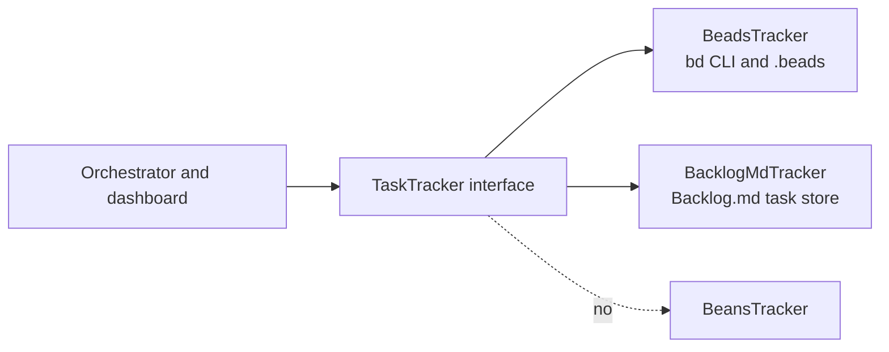

# Task Tracker Backends

> **Status: design update.** Oompah currently supports beads through the
> `bd` CLI. The next task tracker backend is Backlog.md. A `beans`
> backend is explicitly out of scope.

## Decision

Supported tracker backends:

- `beads` - current implementation, backed by `bd`.
- `backlog_md` - planned implementation, backed by a project's Backlog.md
  task store.

Non-goal:

- Do not implement `beans`. Do not add `tracker.kind: beans`, a
  `BeansTracker` class, beans prompt snippets, beans dashboard copy, or
  beans tests. Any references to beans in tracker planning should be
  removed rather than carried forward as a future option.

## Why

Oompah's orchestrator, dashboard, console, completion verifier, attachments,
and watcher code all operate on the same conceptual object: a task with an
identifier, state, priority, labels, comments, dependencies, and completion
operation. Today that object is called a bead in many docs because beads was
the only backend. Backlog.md should be added as a second implementation of
the same task-tracker contract, not as a parallel orchestration path.

## Architecture



The public model stays `Issue` for now to avoid a broad rename. The backend
boundary should carry tracker-neutral names in code and docs wherever new work
is touched: `task`, `issue`, `tracker_item`, `close_issue`, `add_comment`,
`fetch_candidate_issues`.

## Configuration

The workflow front matter continues to select the backend:

```yaml
tracker:
  kind: beads
```

```yaml
tracker:
  kind: backlog_md
```

Tunable values such as command timeouts, default Backlog.md path, and scan
limits belong in `.env` as `OOMPAH_*` variables. Do not add those knobs to
WORKFLOW.md. A project-root `Backlog.md` path should be the default unless
the `.env` override says otherwise.

## Tracker Contract

The shared interface should cover the behavior the orchestrator already uses:

- Fetch candidate tasks by active states.
- Fetch all tasks for dashboard rendering.
- Fetch one task with full details, comments, blockers, and parent/child
  relationships when the backend supports them.
- Create follow-up tasks, add comments, update state, close tasks, and manage
  labels.
- Provide a working-set fingerprint so polling can skip unchanged trackers.
- Expose capabilities for optional features rather than forcing every backend
  to emulate beads exactly.

Backlog.md does not need to implement beads-specific features such as
`bd remember` or Dolt sync. If a shared feature needs a backend capability,
surface that as a capability check and render a tracker-specific prompt.

## State Mapping

The existing `active_states` and `terminal_states` concepts remain the public
contract. Each backend maps them to its native state vocabulary:

| Oompah concept | Beads default | Backlog.md default |
|---|---|---|
| Backlog / triage | `deferred` | `To Do` or Backlog.md's backlog status |
| Ready / active | `open`, `in_progress` | Backlog.md active statuses |
| Done | `closed` | `Done` |

Backlog.md status names should be normalized case-insensitively at the adapter
boundary so the rest of oompah can keep using `Issue.state`.

## Agent Prompt And Tools

The rendered WORKFLOW prompt must become tracker-specific:

- Beads projects keep the current `bd` quick reference and `BEADS_DIR`
  environment routing.
- Backlog.md projects get Backlog.md-specific instructions for reading,
  updating, commenting on, and completing tasks.
- Shared docs should say "close the task" or "move to a terminal state" unless
  they are intentionally documenting the beads adapter.

Do not teach agents `beans` commands or include a beans fallback snippet.

## Feature Notes

- **Console:** The ACP console should expose the same tracker-aware tool
  catalog workers use. It must not assume `bd close`; it should ask the
  selected tracker adapter to render the safe close/update instructions.
- **Completion verifier:** The verifier should inspect terminal state through
  the tracker interface. For Backlog.md, "terminal" means the task has reached
  the configured Done status.
- **Agent watcher:** Misbehavior reports should file tracker issues through
  `tracker.create_issue(...)`. The filed item may be a bead or a Backlog.md
  task.
- **Attachments:** Store `oompah.attachments` in the backend's structured
  metadata when available. Beads uses metadata JSON. Backlog.md should use its
  task metadata/front matter or a documented oompah sidecar, not ad hoc prose
  appended to the task body.
- **Dolt sync watchdog:** This remains beads-only. Backlog.md state lives in
  normal git-tracked files and should use ordinary source sync behavior.

## Files To Touch

| Area | Change |
|---|---|
| `oompah/tracker.py` | Extract a tracker protocol/base class; keep beads as one adapter; add Backlog.md adapter. |
| `oompah/config.py` | Accept `tracker.kind: backlog_md`; reject `beans`. |
| `oompah/orchestrator.py` | Construct the configured adapter; remove new beads-specific assumptions from shared paths. |
| `oompah/api_agent.py`, `oompah/acp_tools.py` | Render and route tracker-specific command guidance. |
| `oompah/templates/*` | Use tracker-neutral labels except in beads-only UI. |
| `WORKFLOW.md` template | Render a tracker-specific quick reference instead of always rendering `bd`. |
| `tests/` | Add adapter-contract tests and Backlog.md fixtures; keep beads regression tests. |

## Tests

- Config accepts `beads` and `backlog_md`; rejects `beans`.
- Beads adapter still emits the same `bd` commands for list, show, comment,
  update, and close.
- Backlog.md adapter parses tasks, maps statuses, creates comments, marks a
  task Done, and reports a working-set fingerprint.
- Orchestrator dispatch uses the configured tracker without checking concrete
  adapter class names.
- Prompt rendering includes `bd` commands only for beads projects and
  Backlog.md commands only for Backlog.md projects.
- Console close/update flows use the tracker-specific close operation.

## Rollout

1. Introduce the tracker interface and keep beads behavior unchanged.
2. Add config validation for `backlog_md` while leaving it behind a clear
   "not implemented" error until the adapter lands.
3. Implement Backlog.md read-only fetch and dashboard rendering.
4. Add mutations: comment, update state, create task, close task.
5. Enable worker dispatch for Backlog.md projects.
6. Remove remaining shared-doc wording that says "bead" when it means
   "task".
