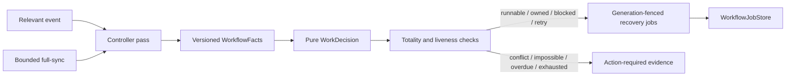

# Universal totality and liveness controller

`oompah.workflow_controller.UniversalTotalityLivenessController` is the
runtime bridge between the pure `WorkDecision` evaluator and the durable
workflow-job scheduler. It evaluates every non-final task in a bounded,
rotating window on event-triggered passes and on the full-sync safety net.

The controller never writes tracker status. Missing queues, leases, review or
audit work, and stale evidence remain recoverable decisions with a named
durable job. Duplicate ownership claims, dependency cycles, missed
reassessment deadlines, and exhausted retry budgets become actionable with
machine-readable prerequisites. Recovery jobs retain the decision reason code
and are deduplicated by the existing schedule cursor and idempotency key.

The orchestrator invokes the controller only in `enforce` mode while domain
cutovers still use their existing status writers. The durable store is
reopened on restart, abandoned ownership is recovered, and the next pass
replays the same decision without creating a second job.
