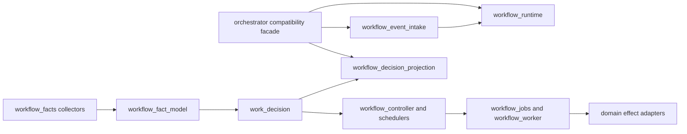

# Workflow module ownership

OOMPAH-798 separates durable workflow policy, coordination, I/O adapters, and
the service compatibility facade. A module listed as an owner is the only
place where the corresponding decision or effect is implemented. The
orchestrator retains public delegates while callers migrate; it does not
reimplement the delegated policy.

| Concern | Owner | Boundary |
| --- | --- | --- |
| Immutable evidence model | `workflow_fact_model.py` | Pure; no tracker, Git, SQLite, subprocess, server, or orchestrator imports |
| Fact collection | `workflow_facts.py` | Tracker and Git I/O; re-exports model names for compatibility |
| Policy evaluation | `work_decision.py` and `workflow_reasons.py` | Pure; consumes immutable evidence only |
| Totality and scheduling | `workflow_controller.py`, `workflow_scheduler.py` | Produces durable jobs; no external effects |
| Durable job execution | `workflow_jobs.py`, `workflow_worker.py` | Owns ledger, leases, revalidation, and effect receipts |
| Domain decisions/effects | implementation, review, integration, and epic workflow modules and adapters | One project/task/generation per adapter call |
| Runtime composition | `workflow_runtime.py` | Binds project collectors, controllers, transition services, and handlers once |
| Event intake | `workflow_event_intake.py` | Thread-safe event admission, coalescing, and bounded full-sync signals |
| Public decision read model | `workflow_decision_projection.py` | Generation fencing, durable availability cut, API projection, and actionable alerts |
| Service compatibility | `orchestrator.py` | Lifecycle composition and backwards-compatible delegates |

Architectural tests build the owned-module import graph, reject cycles and
composition-root imports, ensure pure evaluators cannot reach I/O boundaries,
and cap branch/line complexity at the orchestrator delegates.
