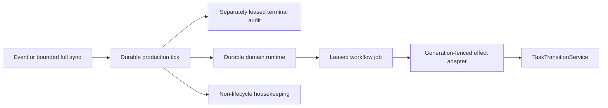

# Durable workflow retirement boundary

OOMPAH-794 retires the process-local lifecycle owners after the durable
workflow rollout. Runtime installation, rather than the configured rollout
mode, is the ownership boundary. An installed runtime always owns the
production tick; `off` and `shadow` are read-only pause/qualification modes and
never reactivate old writers.

## Removed production owners

The runtime-bound tick and startup path no longer invoke:

- candidate dispatch and running-agent reconciliation sweeps;
- standalone/shared integration queue reconcilers;
- project-wide review and YOLO loops;
- epic rollup, stale-epic, rebase-filing, and orphan-reset sweeps;
- generic or status-specific stalled-task watchdog remediation;
- auto-archive and merged-label status writers;
- process-local retry restoration, legacy restart repair, terminal-lifecycle
  futures, or shadow-controller futures.

Terminal audit remains a separate mandatory authority. Startup orphan-process
cleanup and abandoned integration-lease release are migration/containment
operations: they cannot choose a new task state, and the durable runtime makes
the next lifecycle decision.

## Retained effects are not owners

Durable handlers still call narrow orchestrator helpers for external effects
that have not yet moved into smaller service objects. Examples include exact
worker admission/termination, one-task integration and publication, one-review
forge mutations, and one-epic Git operations. They are retained only behind a
leased `WorkflowJobContext`, evidence generation, project binding, and
transition service. No retained helper may scan the corpus, decide eligibility,
arm its own lifecycle future, or retry from a process-local cooldown.

Directly constructed unit fixtures do not install the production runtime and
retain an unbound compatibility harness so these effect helpers can be tested
in isolation. Service bootstrap installs the runtime before `run()`, and the
runtime-bound tick returns before that harness. Architectural tests enforce
the boundary and a branch/line budget for the durable tick.

## Restart and rollback behavior

The workflow ledger recovers abandoned leases and derives current work again
from versioned facts. Existing owner claims are migrated into generation-fenced
implementation jobs during handler construction. Legacy integration leases are
released at startup without changing task status, after which the integration
controller re-evaluates the corresponding task.

Changing all domains from `enforce` to `shadow` stops durable effects but does
not restore the old writer. This is a safe operational pause. Rolling the
binary back to a version with the legacy scheduler requires the persisted-state
and database backup procedure in the operator rollout guide.
