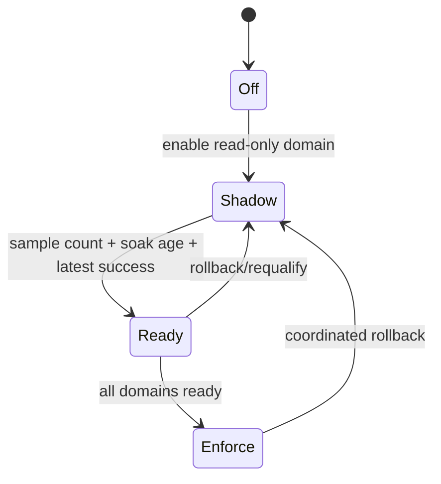

# Durable workflow rollout design

The rollout boundary separates per-domain qualification from process-wide
mutation authority. Four domain controls can independently select `off`,
`shadow`, or `enforce`, but the aggregate runtime is mutation-capable only
when the complete map is `enforce`. This preserves one writer while still
letting operators qualify and diagnose domains in stages.

Terminal audit remains the mandatory separately leased authority implemented
by `TerminalAuditWorkflow`; it is deliberately not hidden behind a rollout
mode.

## Configuration projection

`ServiceConfig.workflow_domain_modes` is a total map over implementation,
review, integration, and epic. `workflow_engine_mode` is now an aggregate
compatibility projection: all off becomes `off`, all enforce becomes
`enforce`, and every mixed map becomes `shadow`. Runtime installation is the
one-way production ownership boundary. The aggregate controls durable
evaluation/effects but cannot reactivate a legacy writer.

The old `OOMPAH_WORKFLOW_ENGINE_MODE` input fills all four entries only when no
domain-specific input is present. It is not part of the supported final
configuration or `.env.example`. This parser-only compatibility path lets an
existing deployment start long enough to migrate its `.env` without changing
authority.

## Persisted qualification schema

`workflow_rollout_domains` is additive to the workflow SQLite database and is
not a new `workflow_jobs_version`. Each row stores its mode start, successful
and failed shadow sweep counts, latest success/failure, bounded error class,
and update time. Adding the table without incrementing the main schema means
the previous binary ignores it during the supported rollback window.

Mode changes for all domains use one `BEGIN IMMEDIATE` transaction under the
same process/file authority lock as job scheduling. The gate evaluates every
promotion before changing any row. A rejected start therefore cannot leave a
partially promoted map. Returning to `off` or `shadow` resets the qualification
window; `enforce` preserves the evidence which authorized it.

Legacy job-spec migrations use the recorded schema version as well as column
presence. SQLite may persist an `ALTER TABLE` before a process dies. On the
next start the old version marker forces the idempotent payload and scheduling
lane rewrites even though those columns now exist.

These are persisted-data migrations, not legacy execution paths. They may
translate or release prior authority but cannot make a fresh lifecycle
decision.

## Runtime publication

In the aggregate shadow state, only domains not set to `off` are evaluated.
Their decisions are projections and cannot materialize worker effects.
Successful and failed bounded sweeps update the persisted qualification rows.
An `enforce` entry in a mixed map means that domain passed its gate; it does not
grant partial mutation authority. The final all-enforce restart validates
complete controller and handler coverage before recovering or claiming jobs.

Configuration reload calls validate both the aggregate mode and exact domain
map before publishing any replacement dependency. A started runtime rejects a
change and requires the normal graceful restart, so old timers and new durable
workers cannot overlap across a synchronous hot reload.

## Canary and retirement contract

The production canary consumes the public state projection rather than
private process objects. Each sample requires current topology, complete
persisted rollout evidence, no latest failed shadow sample, no unresolved
shadow divergence, no expired/exhausted durable ownership, healthy service
state, and no operator-actionable alert. Normal queued/running/retry counts do
not fail the gate.

The aggregate environment toggle is retired from the supported configuration
when domain controls ship. Removal of its parser-only upgrade shim requires a
separate major-version compatibility decision. Domain controls remain because
they are the safe rollback boundary, not temporary feature flags.

The implementation intentionally does not claim that a test fixture is live
production evidence. Unit and production-like state samples prove the gate's
logic; an operator must still run `make workflow-rollout-check` against the
deployed canary for the configured duration before final cutover.
