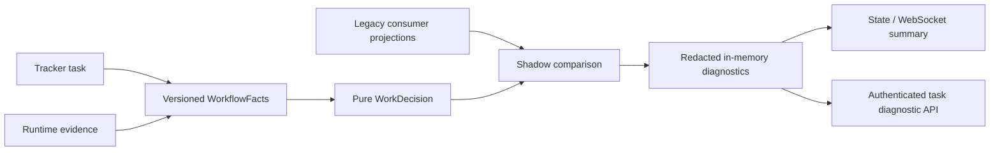

# Workflow shadow evaluation

The unified workflow engine can soak alongside the legacy orchestration paths
before any consumer uses it for mutations. Set `OOMPAH_WORKFLOW_ENGINE_MODE` to
`shadow` to enable a bounded, read-only comparison sweep. The default `off`
mode preserves legacy behavior; `enforce` is reserved for the later durable-job
cutover.

The sweep runs after legacy reconciliation and watchdog work, coalesces while a
previous sweep is active, sorts project/task identities deterministically, and
evaluates at most `OOMPAH_WORKFLOW_SHADOW_SCAN_LIMIT` non-terminal tasks per
pass. It never calls tracker mutation methods. A sweep failure is isolated to
the affected task and logged at debug level; it does not stop dispatch.

Every task diagnostic records the exact facts and decision revisions, snapshot
generation, legacy projections, and field-level mismatches. Repeated instances
of the same semantic mismatch retain one fingerprint and observation count;
alignment clears the active divergence. Older asynchronous generations cannot
replace a newer result. Diagnostic values are recursively bounded and
secret-redacted before storage, and returned values are defensive copies.

The aggregate `workflow_shadow` object is present in the state snapshot and
therefore in state WebSocket messages. It reports task and divergence counts,
resolution/stale-generation counters, and divergence counts by consumer. These
are diagnostics, not operator alerts: normal migration differences do not add
dashboard warning banners.

Operators can inspect one current comparison with:

`GET /api/v1/projects/{project_id}/tasks/{identifier}/workflow-diagnostic`

The endpoint uses the normal API authentication middleware. It returns `404`
until that task has been evaluated and `503` in an API-only process that has no
local scheduler diagnostic registry. The configured per-diagnostic bound is
`OOMPAH_WORKFLOW_DIAGNOSTIC_MAX_BYTES`.

Production should remain in `shadow` until expected legacy differences are
classified, unexplained divergences are zero, and the later enforcement tasks
have replaced mutating legacy consumers with durable jobs.
